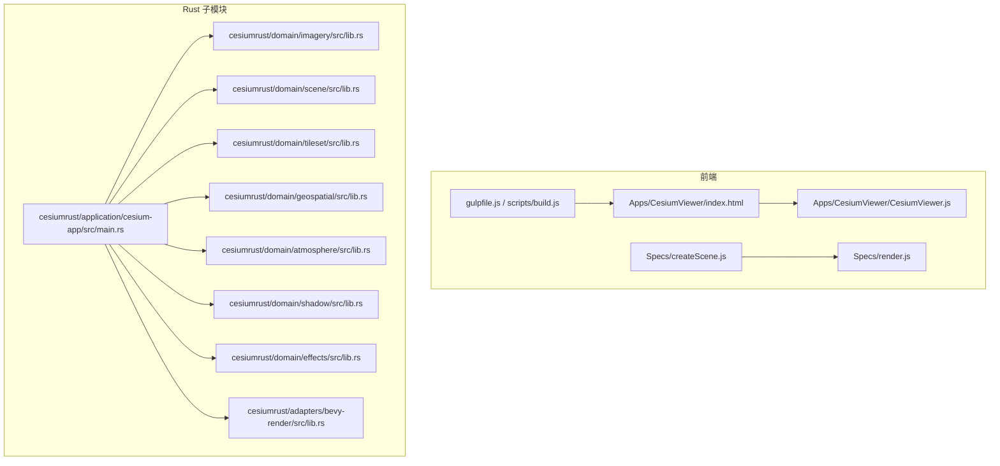
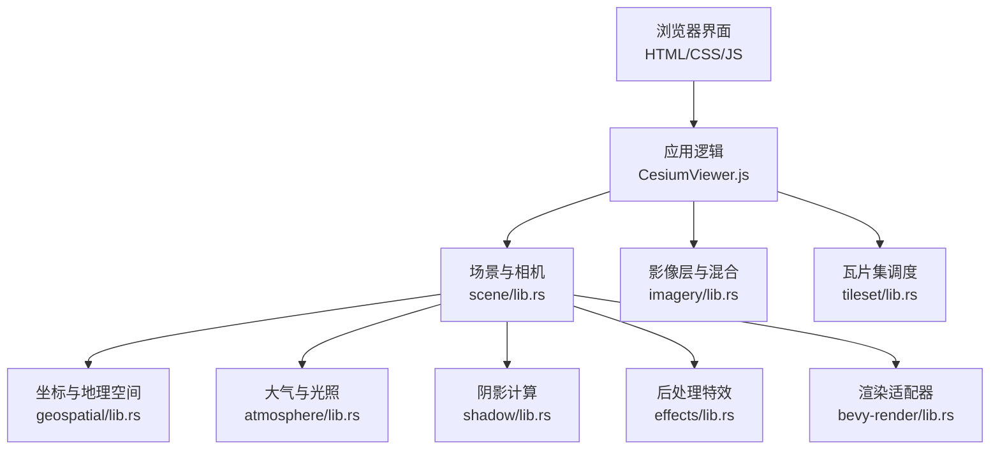
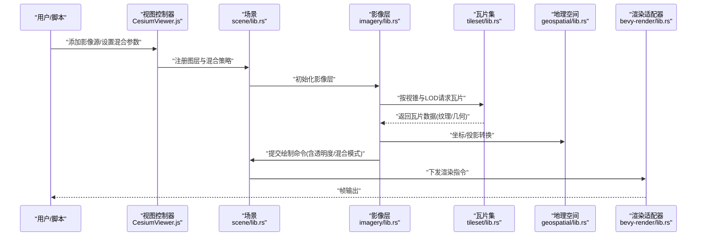
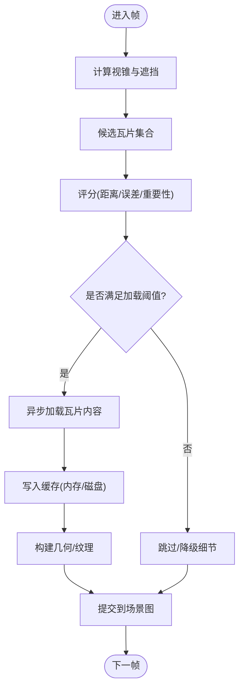
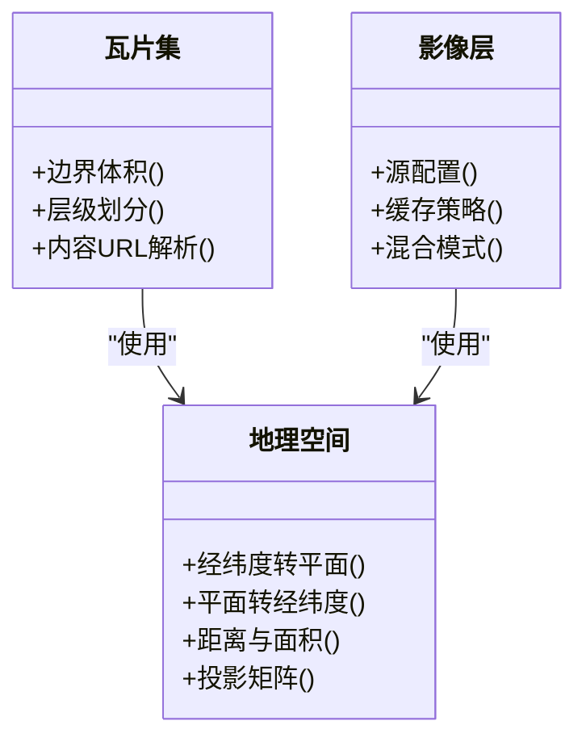
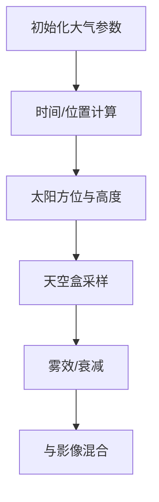
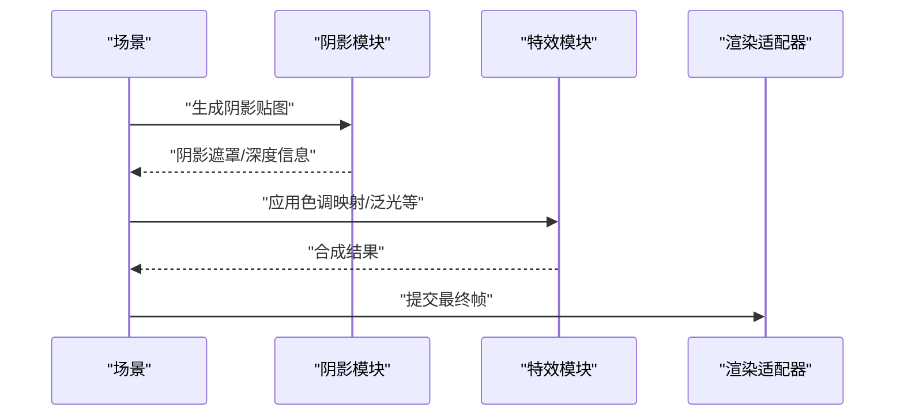
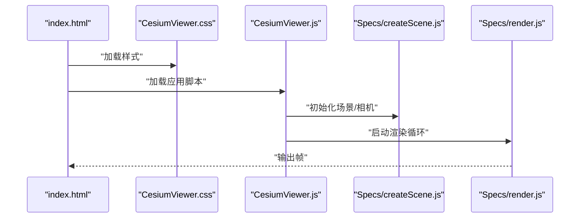
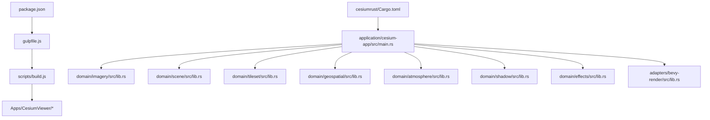

# 影像混合系统

<cite>
**本文引用的文件**   
- [README.md](file://README.md)
- [package.json](file://package.json)
- [server.js](file://server.js)
- [index.html](file://index.html)
- [Apps/CesiumViewer/index.html](file://Apps/CesiumViewer/index.html)
- [Apps/CesiumViewer/CesiumViewer.js](file://Apps/CesiumViewer/CesiumViewer.js)
- [Apps/CesiumViewer/CesiumViewer.css](file://Apps/CesiumViewer/CesiumViewer.css)
- [gulpfile.js](file://gulpfile.js)
- [scripts/build.js](file://scripts/build.js)
- [Source/copyrightHeader.js](file://Source/copyrightHeader.js)
- [cesiumrust/README.md](file://cesiumrust/README.md)
- [cesiumrust/Cargo.toml](file://cesiumrust/Cargo.toml)
- [cesiumrust/application/cesium-app/src/main.rs](file://cesiumrust/application/cesium-app/src/main.rs)
- [cesiumrust/domain/imagery/src/lib.rs](file://cesiumrust/domain/imagery/src/lib.rs)
- [cesiumrust/domain/scene/src/lib.rs](file://cesiumrust/domain/scene/src/lib.rs)
- [cesiumrust/domain/tileset/src/lib.rs](file://cesiumrust/domain/tileset/src/lib.rs)
- [cesiumrust/domain/geospatial/src/lib.rs](file://cesiumrust/domain/geospatial/src/lib.rs)
- [cesiumrust/domain/atmosphere/src/lib.rs](file://cesiumrust/domain/atmosphere/src/lib.rs)
- [cesiumrust/domain/shadow/src/lib.rs](file://cesiumrust/domain/shadow/src/lib.rs)
- [cesiumrust/domain/effects/src/lib.rs](file://cesiumrust/domain/effects/src/lib.rs)
- [cesiumrust/adapters/bevy-render/src/lib.rs](file://cesiumrust/adapters/bevy-render/src/lib.rs)
- [Specs/createScene.js](file://Specs/createScene.js)
- [Specs/createCamera.js](file://Specs/createCamera.js)
- [Specs/render.js](file://Specs/render.js)
</cite>

## 目录
1. [简介](#简介)
2. [项目结构](#项目结构)
3. [核心组件](#核心组件)
4. [架构总览](#架构总览)
5. [详细组件分析](#详细组件分析)
6. [依赖关系分析](#依赖关系分析)
7. [性能考量](#性能考量)
8. [故障排查指南](#故障排查指南)
9. [结论](#结论)
10. [附录](#附录)

## 简介
本仓库为 CesiumJS 工程，包含前端渲染引擎、示例应用与测试套件，同时集成 Rust 子模块 cesiumrust，提供地理空间、影像、地形、瓦片集、大气与阴影等核心领域能力。影像混合系统围绕“多源影像叠加、分层合成、透明度与混合模式控制”展开，贯穿从数据加载、坐标投影、场景组织到渲染管线的全链路。

## 项目结构
- 前端（JavaScript）：以 Apps 为入口，CesiumViewer 为演示应用；Specs 提供测试与工具；Scripts/Gulp 负责构建与打包。
- Rust 子模块（Rust）：domain 层定义领域模型与算法，adapters 对接渲染后端（如 Bevy），application 提供可运行程序。
- 文档与规范：Documentation 提供贡献与开发指南；ThirdParty 管理第三方资源清单。

图表来源
- [Apps/CesiumViewer/index.html](file://Apps/CesiumViewer/index.html)
- [Apps/CesiumViewer/CesiumViewer.js](file://Apps/CesiumViewer/CesiumViewer.js)
- [Specs/createScene.js](file://Specs/createScene.js)
- [Specs/render.js](file://Specs/render.js)
- [gulpfile.js](file://gulpfile.js)
- [scripts/build.js](file://scripts/build.js)
- [cesiumrust/application/cesium-app/src/main.rs](file://cesiumrust/application/cesium-app/src/main.rs)
- [cesiumrust/domain/imagery/src/lib.rs](file://cesiumrust/domain/imagery/src/lib.rs)
- [cesiumrust/domain/scene/src/lib.rs](file://cesiumrust/domain/scene/src/lib.rs)
- [cesiumrust/domain/tileset/src/lib.rs](file://cesiumrust/domain/tileset/src/lib.rs)
- [cesiumrust/domain/geospatial/src/lib.rs](file://cesiumrust/domain/geospatial/src/lib.rs)
- [cesiumrust/domain/atmosphere/src/lib.rs](file://cesiumrust/domain/atmosphere/src/lib.rs)
- [cesiumrust/domain/shadow/src/lib.rs](file://cesiumrust/domain/shadow/src/lib.rs)
- [cesiumrust/domain/effects/src/lib.rs](file://cesiumrust/domain/effects/src/lib.rs)
- [cesiumrust/adapters/bevy-render/src/lib.rs](file://cesiumrust/adapters/bevy-render/src/lib.rs)

章节来源
- [README.md](file://README.md)
- [package.json](file://package.json)
- [server.js](file://server.js)
- [index.html](file://index.html)
- [gulpfile.js](file://gulpfile.js)
- [scripts/build.js](file://scripts/build.js)
- [cesiumrust/README.md](file://cesiumrust/README.md)
- [cesiumrust/Cargo.toml](file://cesiumrust/Cargo.toml)

## 核心组件
- 影像提供者与图层：负责多源影像的加载、切片、缓存与更新，支持不同坐标系与投影。
- 场景与相机：维护场景图、可见性裁剪、LOD 与视锥剔除，驱动相机运动与视角变换。
- 瓦片集与几何体：基于 3DTiles 或自定义瓦片协议进行层次化加载与调度。
- 坐标系统与地理空间：统一 WGS84、WebMercator 等坐标转换与距离/面积计算。
- 大气与光照：实现天空盒、雾效、光照衰减与时间相关的光照参数。
- 阴影与特效：生成并合成阴影贴图，叠加后处理效果（如色调映射、泛光）。
- 渲染适配器：将领域对象转换为具体渲染后端（如 Bevy）的绘制调用。

章节来源
- [cesiumrust/domain/imagery/src/lib.rs](file://cesiumrust/domain/imagery/src/lib.rs)
- [cesiumrust/domain/scene/src/lib.rs](file://cesiumrust/domain/scene/src/lib.rs)
- [cesiumrust/domain/tileset/src/lib.rs](file://cesiumrust/domain/tileset/src/lib.rs)
- [cesiumrust/domain/geospatial/src/lib.rs](file://cesiumrust/domain/geospatial/src/lib.rs)
- [cesiumrust/domain/atmosphere/src/lib.rs](file://cesiumrust/domain/atmosphere/src/lib.rs)
- [cesiumrust/domain/shadow/src/lib.rs](file://cesiumrust/domain/shadow/src/lib.rs)
- [cesiumrust/domain/effects/src/lib.rs](file://cesiumrust/domain/effects/src/lib.rs)
- [cesiumrust/adapters/bevy-render/src/lib.rs](file://cesiumrust/adapters/bevy-render/src/lib.rs)

## 架构总览
整体采用“前端 JS + Rust 领域层 + 渲染适配器”的分层架构。前端负责交互与可视化编排，Rust 领域层承载核心算法与数据结构，渲染适配器桥接至具体图形后端。

图表来源
- [Apps/CesiumViewer/CesiumViewer.js](file://Apps/CesiumViewer/CesiumViewer.js)
- [cesiumrust/domain/scene/src/lib.rs](file://cesiumrust/domain/scene/src/lib.rs)
- [cesiumrust/domain/imagery/src/lib.rs](file://cesiumrust/domain/imagery/src/lib.rs)
- [cesiumrust/domain/tileset/src/lib.rs](file://cesiumrust/domain/tileset/src/lib.rs)
- [cesiumrust/domain/geospatial/src/lib.rs](file://cesiumrust/domain/geospatial/src/lib.rs)
- [cesiumrust/domain/atmosphere/src/lib.rs](file://cesiumrust/domain/atmosphere/src/lib.rs)
- [cesiumrust/domain/shadow/src/lib.rs](file://cesiumrust/domain/shadow/src/lib.rs)
- [cesiumrust/domain/effects/src/lib.rs](file://cesiumrust/domain/effects/src/lib.rs)
- [cesiumrust/adapters/bevy-render/src/lib.rs](file://cesiumrust/adapters/bevy-render/src/lib.rs)

## 详细组件分析

### 影像混合管线
影像混合的核心流程包括：请求与缓存、坐标投影、层级与 LOD、透明度与混合模式、深度与排序、最终合成。

图表来源
- [Apps/CesiumViewer/CesiumViewer.js](file://Apps/CesiumViewer/CesiumViewer.js)
- [cesiumrust/domain/scene/src/lib.rs](file://cesiumrust/domain/scene/src/lib.rs)
- [cesiumrust/domain/imagery/src/lib.rs](file://cesiumrust/domain/imagery/src/lib.rs)
- [cesiumrust/domain/tileset/src/lib.rs](file://cesiumrust/domain/tileset/src/lib.rs)
- [cesiumrust/domain/geospatial/src/lib.rs](file://cesiumrust/domain/geospatial/src/lib.rs)
- [cesiumrust/adapters/bevy-render/src/lib.rs](file://cesiumrust/adapters/bevy-render/src/lib.rs)

章节来源
- [Apps/CesiumViewer/CesiumViewer.js](file://Apps/CesiumViewer/CesiumViewer.js)
- [cesiumrust/domain/imagery/src/lib.rs](file://cesiumrust/domain/imagery/src/lib.rs)
- [cesiumrust/domain/tileset/src/lib.rs](file://cesiumrust/domain/tileset/src/lib.rs)
- [cesiumrust/domain/scene/src/lib.rs](file://cesiumrust/domain/scene/src/lib.rs)
- [cesiumrust/domain/geospatial/src/lib.rs](file://cesiumrust/domain/geospatial/src/lib.rs)
- [cesiumrust/adapters/bevy-render/src/lib.rs](file://cesiumrust/adapters/bevy-render/src/lib.rs)

### 瓦片集与层次化加载
瓦片集根据视距、几何误差与遮挡信息进行动态加载与卸载，确保大规模数据的流畅浏览。

图表来源
- [cesiumrust/domain/tileset/src/lib.rs](file://cesiumrust/domain/tileset/src/lib.rs)
- [cesiumrust/domain/scene/src/lib.rs](file://cesiumrust/domain/scene/src/lib.rs)

章节来源
- [cesiumrust/domain/tileset/src/lib.rs](file://cesiumrust/domain/tileset/src/lib.rs)
- [cesiumrust/domain/scene/src/lib.rs](file://cesiumrust/domain/scene/src/lib.rs)

### 坐标系统与地理空间
统一的坐标与投影转换是影像混合的基础，涉及 WGS84、WebMercator、局部切面等。

图表来源
- [cesiumrust/domain/geospatial/src/lib.rs](file://cesiumrust/domain/geospatial/src/lib.rs)
- [cesiumrust/domain/tileset/src/lib.rs](file://cesiumrust/domain/tileset/src/lib.rs)
- [cesiumrust/domain/imagery/src/lib.rs](file://cesiumrust/domain/imagery/src/lib.rs)

章节来源
- [cesiumrust/domain/geospatial/src/lib.rs](file://cesiumrust/domain/geospatial/src/lib.rs)
- [cesiumrust/domain/tileset/src/lib.rs](file://cesiumrust/domain/tileset/src/lib.rs)
- [cesiumrust/domain/imagery/src/lib.rs](file://cesiumrust/domain/imagery/src/lib.rs)

### 大气与光照
大气散射、天空盒与光照参数影响影像的真实感与对比度，尤其在低太阳高度角时显著。

图表来源
- [cesiumrust/domain/atmosphere/src/lib.rs](file://cesiumrust/domain/atmosphere/src/lib.rs)
- [cesiumrust/domain/scene/src/lib.rs](file://cesiumrust/domain/scene/src/lib.rs)

章节来源
- [cesiumrust/domain/atmosphere/src/lib.rs](file://cesiumrust/domain/atmosphere/src/lib.rs)
- [cesiumrust/domain/scene/src/lib.rs](file://cesiumrust/domain/scene/src/lib.rs)

### 阴影与后处理
阴影贴图与后处理效果在影像之上叠加，增强立体感与视觉一致性。

图表来源
- [cesiumrust/domain/shadow/src/lib.rs](file://cesiumrust/domain/shadow/src/lib.rs)
- [cesiumrust/domain/effects/src/lib.rs](file://cesiumrust/domain/effects/src/lib.rs)
- [cesiumrust/domain/scene/src/lib.rs](file://cesiumrust/domain/scene/src/lib.rs)
- [cesiumrust/adapters/bevy-render/src/lib.rs](file://cesiumrust/adapters/bevy-render/src/lib.rs)

章节来源
- [cesiumrust/domain/shadow/src/lib.rs](file://cesiumrust/domain/shadow/src/lib.rs)
- [cesiumrust/domain/effects/src/lib.rs](file://cesiumrust/domain/effects/src/lib.rs)
- [cesiumrust/domain/scene/src/lib.rs](file://cesiumrust/domain/scene/src/lib.rs)
- [cesiumrust/adapters/bevy-render/src/lib.rs](file://cesiumrust/adapters/bevy-render/src/lib.rs)

### 前端应用与示例
CesiumViewer 作为演示应用，展示如何创建场景、添加影像源、调整混合参数并进行交互。

图表来源
- [Apps/CesiumViewer/index.html](file://Apps/CesiumViewer/index.html)
- [Apps/CesiumViewer/CesiumViewer.css](file://Apps/CesiumViewer/CesiumViewer.css)
- [Apps/CesiumViewer/CesiumViewer.js](file://Apps/CesiumViewer/CesiumViewer.js)
- [Specs/createScene.js](file://Specs/createScene.js)
- [Specs/render.js](file://Specs/render.js)

章节来源
- [Apps/CesiumViewer/index.html](file://Apps/CesiumViewer/index.html)
- [Apps/CesiumViewer/CesiumViewer.css](file://Apps/CesiumViewer/CesiumViewer.css)
- [Apps/CesiumViewer/CesiumViewer.js](file://Apps/CesiumViewer/CesiumViewer.js)
- [Specs/createScene.js](file://Specs/createScene.js)
- [Specs/render.js](file://Specs/render.js)

## 依赖关系分析
- 前端依赖：HTML/CSS/JS 通过构建脚本整合，依赖包管理与本地服务器。
- Rust 依赖：Cargo workspace 组织多个 crate，application 聚合 domain 与 adapters。
- 跨语言协作：前端通过 API 或共享协议与 Rust 进程通信（例如通过 bevy-render 适配器）。

图表来源
- [package.json](file://package.json)
- [gulpfile.js](file://gulpfile.js)
- [scripts/build.js](file://scripts/build.js)
- [cesiumrust/Cargo.toml](file://cesiumrust/Cargo.toml)
- [cesiumrust/application/cesium-app/src/main.rs](file://cesiumrust/application/cesium-app/src/main.rs)
- [cesiumrust/domain/imagery/src/lib.rs](file://cesiumrust/domain/imagery/src/lib.rs)
- [cesiumrust/domain/scene/src/lib.rs](file://cesiumrust/domain/scene/src/lib.rs)
- [cesiumrust/domain/tileset/src/lib.rs](file://cesiumrust/domain/tileset/src/lib.rs)
- [cesiumrust/domain/geospatial/src/lib.rs](file://cesiumrust/domain/geospatial/src/lib.rs)
- [cesiumrust/domain/atmosphere/src/lib.rs](file://cesiumrust/domain/atmosphere/src/lib.rs)
- [cesiumrust/domain/shadow/src/lib.rs](file://cesiumrust/domain/shadow/src/lib.rs)
- [cesiumrust/domain/effects/src/lib.rs](file://cesiumrust/domain/effects/src/lib.rs)
- [cesiumrust/adapters/bevy-render/src/lib.rs](file://cesiumrust/adapters/bevy-render/src/lib.rs)

章节来源
- [package.json](file://package.json)
- [gulpfile.js](file://gulpfile.js)
- [scripts/build.js](file://scripts/build.js)
- [cesiumrust/Cargo.toml](file://cesiumrust/Cargo.toml)
- [cesiumrust/application/cesium-app/src/main.rs](file://cesiumrust/application/cesium-app/src/main.rs)

## 性能考量
- 瓦片调度：依据视锥与几何误差选择合适 LOD，减少无效下载与绘制。
- 纹理与缓存：复用纹理、限制最大显存占用，避免频繁分配与 GC。
- 批处理与合并：对同材质/混合模式的瓦片进行批处理，降低状态切换。
- 并行与异步：并发请求瓦片，利用 Web Worker 或后台线程解码。
- 深度与排序：合理设置深度缓冲与透明排序策略，避免过度重绘。
- 后处理成本：按需启用特效，控制分辨率与通道数量。

[本节为通用指导，不直接分析具体文件]

## 故障排查指南
- 无法加载影像源：检查网络可达性与跨域策略，确认 URL 与认证头正确。
- 瓦片缺失或闪烁：验证瓦片元数据与边界体积，检查缓存命中与重试策略。
- 混合异常或黑屏：核对混合模式与深度测试设置，确认纹理格式与压缩。
- 性能抖动：监控 GPU/CPU 占用，定位热点瓦片与过细 LOD。
- 阴影/特效异常：检查阴影贴图尺寸与采样精度，关闭非必要特效定位问题。

章节来源
- [Specs/createScene.js](file://Specs/createScene.js)
- [Specs/render.js](file://Specs/render.js)

## 结论
影像混合系统通过清晰的分层设计与领域建模，实现了多源影像的高效加载、灵活混合与高质量渲染。前端负责编排与交互，Rust 领域层承载核心算法，渲染适配器对接具体后端，形成可扩展、高性能的解决方案。建议在生产环境中结合业务需求优化瓦片策略、缓存与后处理，以获得最佳用户体验。

## 附录
- 构建与运行：参考根目录构建脚本与服务端配置。
- 示例与测试：查看 Apps 与 Specs 目录下的示例与用例。
- 贡献与规范：参阅 Documentation 中的贡献与编码指南。

章节来源
- [README.md](file://README.md)
- [server.js](file://server.js)
- [index.html](file://index.html)
- [Source/copyrightHeader.js](file://Source/copyrightHeader.js)