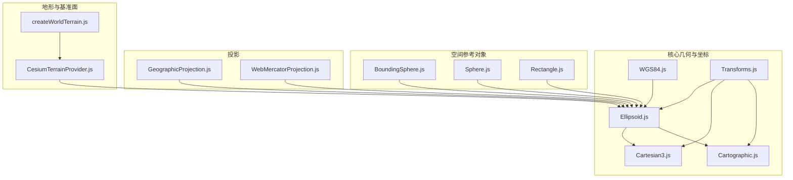
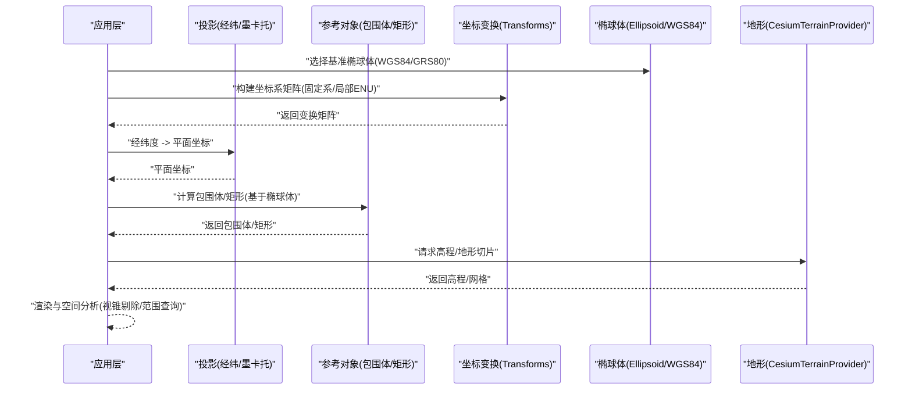
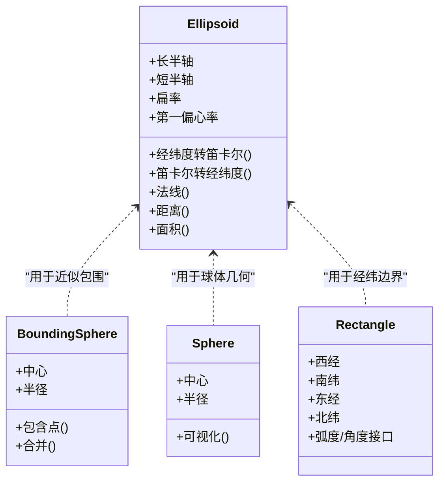
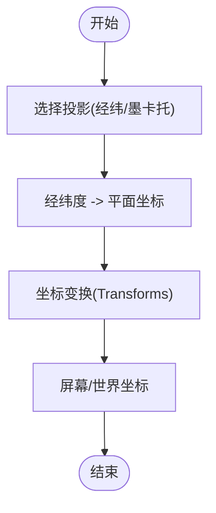
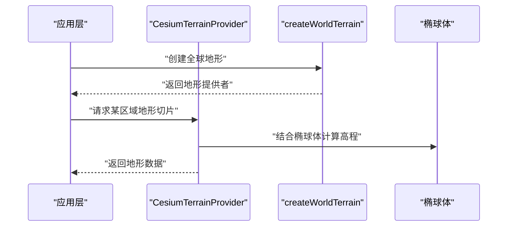
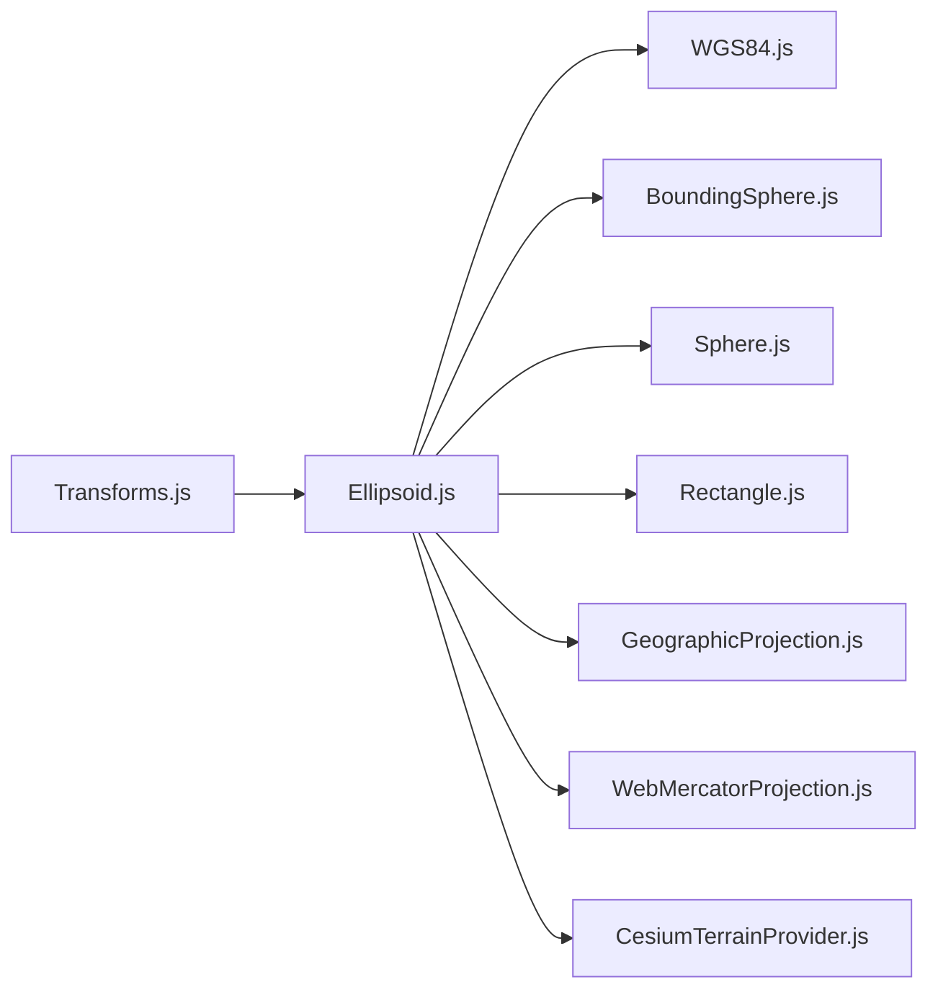

# 地理参考系统

<cite>
**本文引用的文件**   
- [Ellipsoid.js](file://Source/Core/Ellipsoid.js)
- [WGS84.js](file://Source/Core/WGS84.js)
- [BoundingSphere.js](file://Source/Core/BoundingSphere.js)
- [Sphere.js](file://Source/Core/Sphere.js)
- [Rectangle.js](file://Source/Core/Rectangle.js)
- [GeographicProjection.js](file://Source/Core/GeographicProjection.js)
- [WebMercatorProjection.js](file://Source/Core/WebMercatorProjection.js)
- [Cartesian3.js](file://Source/Core/Cartesian3.js)
- [Cartographic.js](file://Source/Core/Cartographic.js)
- [Transforms.js](file://Source/Core/Transforms.js)
- [CesiumTerrainProvider.js](file://Source/Scene/TerrainProviders/CesiumTerrainProvider.js)
- [createWorldTerrain.js](file://Source/Scene/createWorldTerrain.js)
</cite>

## 目录
1. [简介](#简介)
2. [项目结构](#项目结构)
3. [核心组件](#核心组件)
4. [架构总览](#架构总览)
5. [详细组件分析](#详细组件分析)
6. [依赖关系分析](#依赖关系分析)
7. [性能考虑](#性能考虑)
8. [故障排查指南](#故障排查指南)
9. [结论](#结论)
10. [附录](#附录)

## 简介
本技术文档围绕 Cesium 的地理参考系统，系统性阐述地球椭球体模型、空间参考对象（包围体与矩形）、投影与坐标变换机制，以及地理参考框架的建立与维护要点。内容覆盖 WGS84、GRS80 等标准椭球体的数学定义与应用差异；BoundingSphere、Sphere、Rectangle 的计算与使用；控制点与参考站网络在精度与基准面维护中的角色；并提供实践路径以设置地理参考参数、计算地理范围、进行空间分析与坐标框架转换。

## 项目结构
Cesium 的地理参考相关能力主要分布在 Core 与 Scene 模块中：
- 椭球体与坐标体系：Ellipsoid、WGS84、Cartesian3、Cartographic、Transforms
- 空间参考对象：BoundingSphere、Sphere、Rectangle
- 投影与地图投影：GeographicProjection、WebMercatorProjection
- 地形与基准面：CesiumTerrainProvider、createWorldTerrain

图表来源
- [Ellipsoid.js](file://Source/Core/Ellipsoid.js)
- [WGS84.js](file://Source/Core/WGS84.js)
- [Cartesian3.js](file://Source/Core/Cartesian3.js)
- [Cartographic.js](file://Source/Core/Cartographic.js)
- [Transforms.js](file://Source/Core/Transforms.js)
- [BoundingSphere.js](file://Source/Core/BoundingSphere.js)
- [Sphere.js](file://Source/Core/Sphere.js)
- [Rectangle.js](file://Source/Core/Rectangle.js)
- [GeographicProjection.js](file://Source/Core/GeographicProjection.js)
- [WebMercatorProjection.js](file://Source/Core/WebMercatorProjection.js)
- [CesiumTerrainProvider.js](file://Source/Scene/TerrainProviders/CesiumTerrainProvider.js)
- [createWorldTerrain.js](file://Source/Scene/createWorldTerrain.js)

章节来源
- [Ellipsoid.js](file://Source/Core/Ellipsoid.js)
- [WGS84.js](file://Source/Core/WGS84.js)
- [BoundingSphere.js](file://Source/Core/BoundingSphere.js)
- [Sphere.js](file://Source/Core/Sphere.js)
- [Rectangle.js](file://Source/Core/Rectangle.js)
- [GeographicProjection.js](file://Source/Core/GeographicProjection.js)
- [WebMercatorProjection.js](file://Source/Core/WebMercatorProjection.js)
- [CesiumTerrainProvider.js](file://Source/Scene/TerrainProviders/CesiumTerrainProvider.js)
- [createWorldTerrain.js](file://Source/Scene/createWorldTerrain.js)

## 核心组件
本节聚焦地理参考系统的核心构件及其职责边界：
- 椭球体 Ellipsoid：定义长半轴、短半轴、扁率、第一偏心率等几何参数，提供经纬度与三维笛卡尔坐标之间的正逆算、法线、切平面、距离与面积等基础运算。
- 标准椭球体 WGS84：基于 WGS84 定义的常量实例，作为默认地理参考基准面。
- 空间参考对象
  - BoundingSphere：以中心与半径表示的最小包围球，常用于视锥剔除与快速相交测试。
  - Sphere：单位或自定义半径的球体几何，用于可视化与近似体积表达。
  - Rectangle：由经度、纬度边界构成的矩形区域，支持弧度与角度输入输出，广泛用于瓦片索引与可视范围裁剪。
- 投影 GeographicProjection / WebMercatorProjection：将经纬度映射到平面坐标，支撑二维地图显示与交互。
- 坐标与变换 Transforms：实现不同坐标系（如地心固定系、局部东北上）之间的矩阵与向量变换。
- 地形与基准面 CesiumTerrainProvider / createWorldTerrain：加载全球地形数据，结合椭球体与高程基准面提供真实地表高度。

章节来源
- [Ellipsoid.js](file://Source/Core/Ellipsoid.js)
- [WGS84.js](file://Source/Core/WGS84.js)
- [BoundingSphere.js](file://Source/Core/BoundingSphere.js)
- [Sphere.js](file://Source/Core/Sphere.js)
- [Rectangle.js](file://Source/Core/Rectangle.js)
- [GeographicProjection.js](file://Source/Core/GeographicProjection.js)
- [WebMercatorProjection.js](file://Source/Core/WebMercatorProjection.js)
- [Transforms.js](file://Source/Core/Transforms.js)
- [CesiumTerrainProvider.js](file://Source/Scene/TerrainProviders/CesiumTerrainProvider.js)
- [createWorldTerrain.js](file://Source/Scene/createWorldTerrain.js)

## 架构总览
下图展示地理参考系统在渲染管线中的位置与数据流：从椭球体与坐标变换出发，经投影生成屏幕坐标，再结合包围体与矩形进行可见性判断与瓦片调度，最终通过地形提供者获取高程并落位到三维场景。

图表来源
- [Ellipsoid.js](file://Source/Core/Ellipsoid.js)
- [WGS84.js](file://Source/Core/WGS84.js)
- [BoundingSphere.js](file://Source/Core/BoundingSphere.js)
- [Sphere.js](file://Source/Core/Sphere.js)
- [Rectangle.js](file://Source/Core/Rectangle.js)
- [GeographicProjection.js](file://Source/Core/GeographicProjection.js)
- [WebMercatorProjection.js](file://Source/Core/WebMercatorProjection.js)
- [Transforms.js](file://Source/Core/Transforms.js)
- [CesiumTerrainProvider.js](file://Source/Scene/TerrainProviders/CesiumTerrainProvider.js)

## 详细组件分析

### 椭球体与标准基准面
- 数学定义与参数
  - 长半轴 a、短半轴 b、扁率 f、第一偏心率 e^2 等参数共同确定椭球形状。
  - 经纬度到地心直角坐标的正算与逆算涉及法线、曲率半径与高度修正。
- 标准椭球体差异与应用
  - WGS84：全球定位系统常用基准面，适用于卫星导航与全球尺度应用。
  - GRS80：大地测量参考椭球，常与 ITRF 框架配合，用于高精度测绘与地壳形变监测。
  - 两者在 a、f 等参数上的微小差异会引发厘米级至分米级的坐标偏移，需根据业务精度要求选择。
- 典型用法
  - 选择基准椭球体：在初始化时指定 WGS84 或自定义椭球体。
  - 坐标转换：经纬度与三维笛卡尔坐标互转，计算法线与切平面。
  - 距离与面积：在椭球面上计算测地距离与区域面积。

章节来源
- [Ellipsoid.js](file://Source/Core/Ellipsoid.js)
- [WGS84.js](file://Source/Core/WGS84.js)

### 空间参考对象：包围体与矩形
- 包围体 BoundingSphere
  - 用途：快速包围几何体，用于视锥剔除、碰撞检测与 LOD 管理。
  - 计算：基于顶点集合或子图元聚合得到最小包围球；可结合椭球体对大范围区域进行近似。
- 球体 Sphere
  - 用途：可视化球体、近似体积表达与简单遮挡测试。
  - 计算：以中心与半径定义，支持单位球与任意半径。
- 矩形 Rectangle
  - 用途：定义经纬度边界范围，用于瓦片索引、可视范围裁剪与批量数据筛选。
  - 计算：支持弧度与角度输入输出，内部处理边界归一化与跨经度线情况。

图表来源
- [Ellipsoid.js](file://Source/Core/Ellipsoid.js)
- [BoundingSphere.js](file://Source/Core/BoundingSphere.js)
- [Sphere.js](file://Source/Core/Sphere.js)
- [Rectangle.js](file://Source/Core/Rectangle.js)

章节来源
- [BoundingSphere.js](file://Source/Core/BoundingSphere.js)
- [Sphere.js](file://Source/Core/Sphere.js)
- [Rectangle.js](file://Source/Core/Rectangle.js)

### 投影与坐标变换
- 投影
  - GeographicProjection：经纬度直接映射为平面坐标，适合全球视图与教学演示。
  - WebMercatorProjection：世界通用墨卡托投影，便于与在线地图服务对齐。
- 坐标变换
  - Transforms：提供地心固定系与局部东北上（ENU）等坐标系间的矩阵与向量变换，支撑姿态、平移与旋转操作。

图表来源
- [GeographicProjection.js](file://Source/Core/GeographicProjection.js)
- [WebMercatorProjection.js](file://Source/Core/WebMercatorProjection.js)
- [Transforms.js](file://Source/Core/Transforms.js)

章节来源
- [GeographicProjection.js](file://Source/Core/GeographicProjection.js)
- [WebMercatorProjection.js](file://Source/Core/WebMercatorProjection.js)
- [Transforms.js](file://Source/Core/Transforms.js)

### 地形与基准面
- 地形提供者 CesiumTerrainProvider
  - 负责按需加载地形切片，结合椭球体与高程基准面提供真实地表高度。
  - 支持多源地形与增量更新，适配大规模三维场景。
- 创建全球地形 createWorldTerrain
  - 便捷接口，快速启用全球地形服务，便于开发与演示。

图表来源
- [CesiumTerrainProvider.js](file://Source/Scene/TerrainProviders/CesiumTerrainProvider.js)
- [createWorldTerrain.js](file://Source/Scene/createWorldTerrain.js)
- [Ellipsoid.js](file://Source/Core/Ellipsoid.js)

章节来源
- [CesiumTerrainProvider.js](file://Source/Scene/TerrainProviders/CesiumTerrainProvider.js)
- [createWorldTerrain.js](file://Source/Scene/createWorldTerrain.js)

## 依赖关系分析
- 低耦合高内聚
  - 椭球体作为基础几何抽象，被包围体、矩形、投影与地形提供者广泛复用。
  - 坐标变换独立于具体投影，便于扩展新的坐标系。
- 关键依赖链
  - WGS84 继承自 Ellipsoid，提供默认基准面。
  - BoundingSphere、Sphere、Rectangle 依赖椭球体进行经纬与三维坐标互算。
  - 投影依赖椭球体进行经纬到平面的映射。
  - 地形提供者依赖椭球体与外部地形服务。

图表来源
- [Ellipsoid.js](file://Source/Core/Ellipsoid.js)
- [WGS84.js](file://Source/Core/WGS84.js)
- [BoundingSphere.js](file://Source/Core/BoundingSphere.js)
- [Sphere.js](file://Source/Core/Sphere.js)
- [Rectangle.js](file://Source/Core/Rectangle.js)
- [GeographicProjection.js](file://Source/Core/GeographicProjection.js)
- [WebMercatorProjection.js](file://Source/Core/WebMercatorProjection.js)
- [Transforms.js](file://Source/Core/Transforms.js)
- [CesiumTerrainProvider.js](file://Source/Scene/TerrainProviders/CesiumTerrainProvider.js)

章节来源
- [Ellipsoid.js](file://Source/Core/Ellipsoid.js)
- [WGS84.js](file://Source/Core/WGS84.js)
- [BoundingSphere.js](file://Source/Core/BoundingSphere.js)
- [Sphere.js](file://Source/Core/Sphere.js)
- [Rectangle.js](file://Source/Core/Rectangle.js)
- [GeographicProjection.js](file://Source/Core/GeographicProjection.js)
- [WebMercatorProjection.js](file://Source/Core/WebMercatorProjection.js)
- [Transforms.js](file://Source/Core/Transforms.js)
- [CesiumTerrainProvider.js](file://Source/Scene/TerrainProviders/CesiumTerrainProvider.js)

## 性能考虑
- 包围体与矩形
  - 使用 BoundingSphere 进行视锥剔除可减少绘制调用，提升帧率。
  - 合理设置 Rectangle 的边界，避免过大范围导致瓦片加载过多。
- 投影与变换
  - 批量坐标变换尽量复用矩阵与中间变量，减少临时对象分配。
  - 在局部区域优先使用局部坐标系（如 ENU），提高数值稳定性。
- 地形加载
  - 按需加载地形切片，结合视口与缩放级别动态调整细节等级。
  - 缓存热点区域的地形数据，降低重复请求开销。

[本节为通用指导，不直接分析具体文件]

## 故障排查指南
- 坐标不一致
  - 检查是否混用不同基准椭球体（WGS84 vs GRS80），确保全局一致。
  - 确认经纬度单位（弧度/角度）与投影匹配。
- 包围体失效
  - 验证包围体中心与半径是否正确计算，避免退化情形（零半径）。
  - 对于大范围区域，考虑使用多个包围体或改用矩形进行更精确裁剪。
- 地形缺失或错位
  - 检查地形服务可用性与网络状态。
  - 确认高程基准面与椭球体配置一致。

[本节为通用指导，不直接分析具体文件]

## 结论
Cesium 的地理参考系统以椭球体为核心，围绕包围体、矩形与投影构建了完整的空间参考能力。通过选择合适的基准椭球体、规范坐标变换流程、合理使用空间参考对象与地形提供者，可实现高精度、高性能的三维地理可视化与分析。

[本节为总结性内容，不直接分析具体文件]

## 附录
- 实践建议
  - 设置地理参考参数：在初始化阶段明确选择椭球体与投影，统一单位与坐标系。
  - 计算地理范围：利用 Rectangle 定义研究区，结合地形提供者获取高程统计。
  - 空间分析：使用 BoundingSphere 进行快速筛选，再用精确几何进行二次校验。
  - 坐标框架转换：借助 Transforms 在不同坐标系间进行矩阵与向量变换，注意基准面一致性。

[本节为补充说明，不直接分析具体文件]