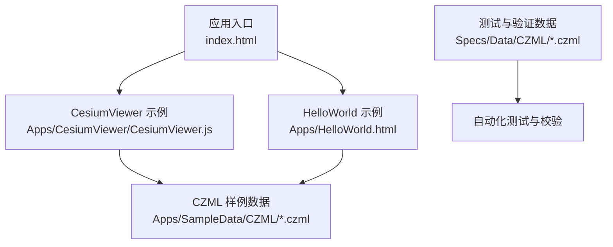
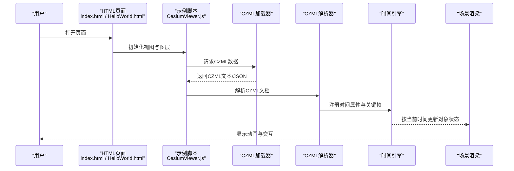
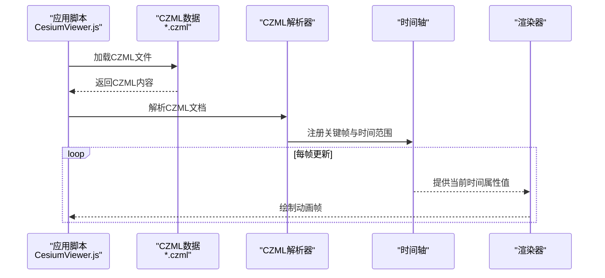
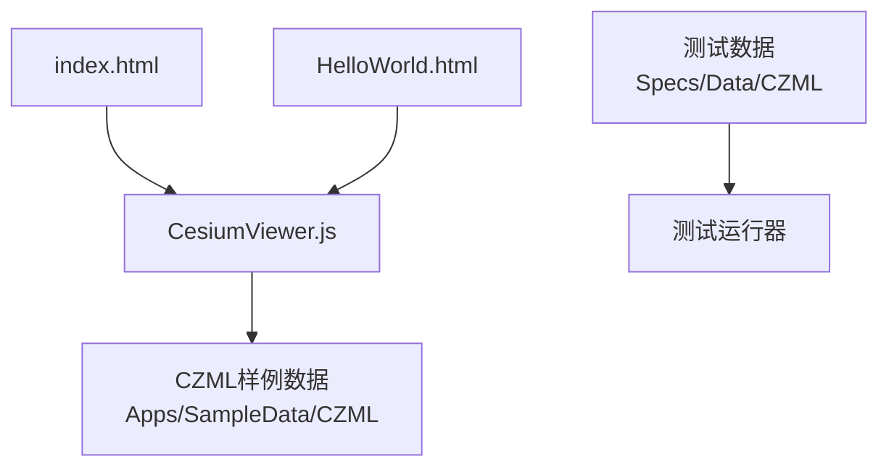

# 地理空间数据处理

<cite>
**本文引用的文件**   
- [README.md](file://README.md)
- [index.html](file://index.html)
- [Apps/CesiumViewer/CesiumViewer.js](file://Apps/CesiumViewer/CesiumViewer.js)
- [Apps/HelloWorld.html](file://Apps/HelloWorld.html)
- [Apps/SampleData/CZML/simple.czml](file://Apps/SampleData/CZML/simple.czml)
- [Apps/SampleData/CZML/Vehicle.czml](file://Apps/SampleData/CZML/Vehicle.czml)
- [Apps/SampleData/CZML/TwoSats.czml](file://Apps/SampleData/CZML/TwoSats.czml)
- [Apps/SampleData/CZML/Mars.czml](file://Apps/SampleData/CZML/Mars.czml)
- [Apps/SampleData/CZML/TimeDependentPaths_Whole.czml](file://Apps/SampleData/CZML/TimeDependentPaths_Whole.czml)
- [Apps/SampleData/CZML/TimeDependentPaths_Portions.czml](file://Apps/SampleData/CZML/TimeDependentPaths_Portions.czml)
- [Apps/SampleData/CZML/TimeDependentPaths_VaryingMaterialMode.czml](file://Apps/SampleData/CZML/TimeDependentPaths_VaryingMaterialMode.czml)
- [Apps/SampleData/CZML/tracking.czml](file://Apps/SampleData/CZML/tracking.czml)
- [Specs/Data/CZML/simple.czml](file://Specs/Data/CZML/simple.czml)
- [Specs/Data/CZML/Vehicle.czml](file://Specs/Data/CZML/Vehicle.czml)
- [Specs/Data/CZML/TwoSats.czml](file://Specs/Data/CZML/TwoSats.czml)
- [Specs/Data/CZML/TwoSatsOrientation.czml](file://Specs/Data/CZML/TwoSatsOrientation.czml)
- [Specs/Data/CZML/TwoSatsRelativeReferenceEnds.czml](file://Specs/Data/CZML/TwoSatsRelativeReferenceEnds.czml)
- [Specs/Data/CZML/ValidationDocument.czml](file://Specs/Data/CZML/ValidationDocument.czml)
</cite>

## 目录
1. [简介](#简介)
2. [项目结构](#项目结构)
3. [核心组件](#核心组件)
4. [架构总览](#架构总览)
5. [详细组件分析](#详细组件分析)
6. [依赖关系分析](#依赖关系分析)
7. [性能考虑](#性能考虑)
8. [故障排查指南](#故障排查指南)
9. [结论](#结论)
10. [附录](#附录) 

## 简介
本技术文档聚焦于Cesium的地理空间数据处理能力，围绕坐标系统转换（WGS84、ECEF、ENU等）、投影变换算法、时间动态处理与CZML时间动画展开。文档同时阐述地理参考系统的实现原理，包括大地测量学基础、椭球体模型、高程基准等概念，并提供面向实践的使用指引与示例路径，帮助读者快速上手并深入理解Cesium在三维地球场景中的数据处理流程。

## 项目结构
仓库采用分层组织方式：
- Apps：应用示例与演示页面，包含CesiumViewer与HelloWorld入口，以及丰富的样例数据（CZML、KML、GPX、3DTiles等）。
- Specs：测试与验证数据，包含大量CZML用例用于回归与功能验证。
- Source：源码与构建产物相关资源。
- Documentation：开发者文档与规范。
- Tools：构建与工具链配置。

图表来源
- [index.html](file://index.html)
- [Apps/CesiumViewer/CesiumViewer.js](file://Apps/CesiumViewer/CesiumViewer.js)
- [Apps/HelloWorld.html](file://Apps/HelloWorld.html)
- [Apps/SampleData/CZML/simple.czml](file://Apps/SampleData/CZML/simple.czml)
- [Specs/Data/CZML/simple.czml](file://Specs/Data/CZML/simple.czml)

章节来源
- [README.md](file://README.md)
- [index.html](file://index.html)
- [Apps/CesiumViewer/CesiumViewer.js](file://Apps/CesiumViewer/CesiumViewer.js)
- [Apps/HelloWorld.html](file://Apps/HelloWorld.html)

## 核心组件
- 坐标系统与参考系
  - WGS84经纬度与大地高：作为输入与输出的常用地理坐标表示。
  - ECEF地心固定坐标系：用于几何计算与渲染管线内部的高效表达。
  - ENU东北天局部坐标系：用于本地化可视化与方向描述。
- 投影变换
  - Web墨卡托投影：Web地图常用的平面投影，便于切片与叠加。
  - 其他投影：根据业务需求选择合适投影进行展示与分析。
- 时间动态处理
  - CZML时间序列：以时间戳驱动位置、姿态、材质等属性的变化。
  - 插值与采样：对离散时间数据进行平滑过渡与高效采样。
- 地理参考系统
  - 椭球体模型：定义地球形状与大小，影响距离、面积与投影精度。
  - 高程基准：区分椭球高与正高/正常高，确保高程一致性。

章节来源
- [README.md](file://README.md)

## 架构总览
下图展示了从应用入口到CZML数据加载、解析与渲染的关键流程，体现坐标系统与时间处理的参与点。

图表来源
- [index.html](file://index.html)
- [Apps/HelloWorld.html](file://Apps/HelloWorld.html)
- [Apps/CesiumViewer/CesiumViewer.js](file://Apps/CesiumViewer/CesiumViewer.js)
- [Apps/SampleData/CZML/simple.czml](file://Apps/SampleData/CZML/simple.czml)
- [Apps/SampleData/CZML/Vehicle.czml](file://Apps/SampleData/CZML/Vehicle.czml)
- [Apps/SampleData/CZML/TwoSats.czml](file://Apps/SampleData/CZML/TwoSats.czml)
- [Apps/SampleData/CZML/TimeDependentPaths_Whole.czml](file://Apps/SampleData/CZML/TimeDependentPaths_Whole.czml)

## 详细组件分析

### 坐标系统转换（WGS84 ↔ ECEF ↔ ENU）
- 转换目标
  - WGS84经纬度与大地高：适合数据输入与输出。
  - ECEF笛卡尔坐标：适合全局几何运算与矩阵变换。
  - ENU局部坐标：适合本地可视化与方向控制。
- 典型流程
  - 输入WGS84 → 转换为ECEF → 计算局部旋转矩阵 → 得到ENU坐标。
  - 反向流程：ENU → 旋转矩阵 → ECEF → 反解为WGS84。
- 注意事项
  - 椭球体参数与高程基准需一致，避免系统性偏差。
  - 大尺度区域建议使用分块或局部参考系提升数值稳定性。

章节来源
- [README.md](file://README.md)

### 投影变换算法（Web墨卡托与其他投影）
- Web墨卡托
  - 将经纬度映射到平面坐标，便于瓦片切图与叠加。
  - 适用于全球范围展示，但高纬度地区存在面积与形状失真。
- 其他投影
  - 针对特定区域或用途选择合适投影，平衡变形与精度。
- 使用建议
  - 明确投影类型与EPSG代码，统一数据源与渲染层投影。
  - 跨投影叠加时进行重投影，保证对齐与精度。

章节来源
- [README.md](file://README.md)

### 时间动态处理与CZML时间动画
- CZML时间模型
  - 关键帧：指定时间点上的属性值（如位置、姿态、材质）。
  - 插值：在关键帧之间进行线性或样条插值，生成连续动画。
  - 时间范围：定义动画起止时间与播放速率。
- 常见模式
  - 整段轨迹：一次性提供完整时间序列。
  - 分段轨迹：多段拼接，支持不同材质或样式随时间变化。
- 示例数据
  - 简单轨迹与车辆动画：[simple.czml](file://Apps/SampleData/CZML/simple.czml)、[Vehicle.czml](file://Apps/SampleData/CZML/Vehicle.czml)。
  - 双星轨道与相对参考：[TwoSats.czml](file://Apps/SampleData/CZML/TwoSats.czml)、[TwoSatsOrientation.czml](file://Specs/Data/CZML/TwoSatsOrientation.czml)、[TwoSatsRelativeReferenceEnds.czml](file://Specs/Data/CZML/TwoSatsRelativeReferenceEnds.czml)。
  - 火星场景与兴趣点：[Mars.czml](file://Apps/SampleData/CZML/Mars.czml)。
  - 时间依赖路径（整体/分段/变材质）：[TimeDependentPaths_Whole.czml](file://Apps/SampleData/CZML/TimeDependentPaths_Whole.czml)、[TimeDependentPaths_Portions.czml](file://Apps/SampleData/CZML/TimeDependentPaths_Portions.czml)、[TimeDependentPaths_VaryingMaterialMode.czml](file://Apps/SampleData/CZML/TimeDependentPaths_VaryingMaterialMode.czml)。
  - 跟踪轨迹：[tracking.czml](file://Apps/SampleData/CZML/tracking.czml)。

图表来源
- [Apps/CesiumViewer/CesiumViewer.js](file://Apps/CesiumViewer/CesiumViewer.js)
- [Apps/SampleData/CZML/simple.czml](file://Apps/SampleData/CZML/simple.czml)
- [Apps/SampleData/CZML/Vehicle.czml](file://Apps/SampleData/CZML/Vehicle.czml)
- [Apps/SampleData/CZML/TwoSats.czml](file://Apps/SampleData/CZML/TwoSats.czml)
- [Apps/SampleData/CZML/TimeDependentPaths_Whole.czml](file://Apps/SampleData/CZML/TimeDependentPaths_Whole.czml)
- [Apps/SampleData/CZML/TimeDependentPaths_Portions.czml](file://Apps/SampleData/CZML/TimeDependentPaths_Portions.czml)
- [Apps/SampleData/CZML/TimeDependentPaths_VaryingMaterialMode.czml](file://Apps/SampleData/CZML/TimeDependentPaths_VaryingMaterialMode.czml)
- [Apps/SampleData/CZML/tracking.czml](file://Apps/SampleData/CZML/tracking.czml)
- [Specs/Data/CZML/TwoSatsOrientation.czml](file://Specs/Data/CZML/TwoSatsOrientation.czml)
- [Specs/Data/CZML/TwoSatsRelativeReferenceEnds.czml](file://Specs/Data/CZML/TwoSatsRelativeReferenceEnds.czml)

章节来源
- [Apps/SampleData/CZML/simple.czml](file://Apps/SampleData/CZML/simple.czml)
- [Apps/SampleData/CZML/Vehicle.czml](file://Apps/SampleData/CZML/Vehicle.czml)
- [Apps/SampleData/CZML/TwoSats.czml](file://Apps/SampleData/CZML/TwoSats.czml)
- [Apps/SampleData/CZML/Mars.czml](file://Apps/SampleData/CZML/Mars.czml)
- [Apps/SampleData/CZML/TimeDependentPaths_Whole.czml](file://Apps/SampleData/CZML/TimeDependentPaths_Whole.czml)
- [Apps/SampleData/CZML/TimeDependentPaths_Portions.czml](file://Apps/SampleData/CZML/TimeDependentPaths_Portions.czml)
- [Apps/SampleData/CZML/TimeDependentPaths_VaryingMaterialMode.czml](file://Apps/SampleData/CZML/TimeDependentPaths_VaryingMaterialMode.czml)
- [Apps/SampleData/CZML/tracking.czml](file://Apps/SampleData/CZML/tracking.czml)
- [Specs/Data/CZML/simple.czml](file://Specs/Data/CZML/simple.czml)
- [Specs/Data/CZML/Vehicle.czml](file://Specs/Data/CZML/Vehicle.czml)
- [Specs/Data/CZML/TwoSats.czml](file://Specs/Data/CZML/TwoSats.czml)
- [Specs/Data/CZML/TwoSatsOrientation.czml](file://Specs/Data/CZML/TwoSatsOrientation.czml)
- [Specs/Data/CZML/TwoSatsRelativeReferenceEnds.czml](file://Specs/Data/CZML/TwoSatsRelativeReferenceEnds.czml)
- [Specs/Data/CZML/ValidationDocument.czml](file://Specs/Data/CZML/ValidationDocument.czml)

### 地理参考系统实现原理
- 大地测量学基础
  - 椭球体模型：定义长半轴与扁率，决定经纬度与距离计算的精度。
  - 高程基准：区分椭球高与正高/正常高，确保高程一致性。
- 参考系选择
  - 全局参考系：WGS84与ECEF用于大范围场景。
  - 局部参考系：ENU用于小范围高精度可视化。
- 投影策略
  - 根据应用场景选择合适的投影，权衡变形与性能。

章节来源
- [README.md](file://README.md)

## 依赖关系分析
- 入口与示例
  - index.html与HelloWorld.html作为页面入口，加载示例脚本与资源。
  - CesiumViewer.js负责初始化视图、加载CZML数据与驱动时间动画。
- 数据与测试
  - Apps/SampleData/CZML提供演示用CZML数据。
  - Specs/Data/CZML提供测试与验证用CZML数据，支撑回归测试。

图表来源
- [index.html](file://index.html)
- [Apps/HelloWorld.html](file://Apps/HelloWorld.html)
- [Apps/CesiumViewer/CesiumViewer.js](file://Apps/CesiumViewer/CesiumViewer.js)
- [Apps/SampleData/CZML/simple.czml](file://Apps/SampleData/CZML/simple.czml)
- [Specs/Data/CZML/simple.czml](file://Specs/Data/CZML/simple.czml)

章节来源
- [index.html](file://index.html)
- [Apps/HelloWorld.html](file://Apps/HelloWorld.html)
- [Apps/CesiumViewer/CesiumViewer.js](file://Apps/CesiumViewer/CesiumViewer.js)
- [Apps/SampleData/CZML/simple.czml](file://Apps/SampleData/CZML/simple.czml)
- [Specs/Data/CZML/simple.czml](file://Specs/Data/CZML/simple.czml)

## 性能考虑
- 数据量与采样
  - 合理设置CZML关键帧密度，避免过多插值导致CPU压力。
  - 对长时序数据采用分段加载与按需更新。
- 投影与坐标
  - 在大范围场景中优先使用合适的投影，减少重投影开销。
  - 局部高精度场景使用ENU，降低数值误差。
- 渲染优化
  - 合并静态几何与动态属性，分离更新频率不同的对象。
  - 利用视锥剔除与LOD策略，提升帧率。

## 故障排查指南
- CZML解析失败
  - 检查CZML语法与必填字段，参考验证文档：[ValidationDocument.czml](file://Specs/Data/CZML/ValidationDocument.czml)。
  - 确认时间戳格式与时间范围有效。
- 坐标不一致
  - 核对椭球体参数与高程基准，确保数据源与渲染层一致。
  - 检查投影类型与EPSG代码，必要时进行重投影。
- 动画不流畅
  - 减少关键帧数量或调整插值策略。
  - 检查时间轴更新频率与渲染循环。

章节来源
- [Specs/Data/CZML/ValidationDocument.czml](file://Specs/Data/CZML/ValidationDocument.czml)

## 结论
Cesium在地理空间数据处理方面提供了完善的坐标系统转换、投影变换与时间动态处理能力。通过合理的椭球体与高程基准选择、恰当的投影策略与高效的CZML时间动画设计，可以在大规模三维地球场景中实现精确且流畅的可视化与分析。结合示例与测试数据，开发者可以快速搭建并验证自己的地理空间数据处理流程。

## 附录
- 示例与数据路径
  - 入门示例：[index.html](file://index.html)、[Apps/HelloWorld.html](file://Apps/HelloWorld.html)
  - 示例脚本：[Apps/CesiumViewer/CesiumViewer.js](file://Apps/CesiumViewer/CesiumViewer.js)
  - CZML样例：[Apps/SampleData/CZML/simple.czml](file://Apps/SampleData/CZML/simple.czml)、[Apps/SampleData/CZML/Vehicle.czml](file://Apps/SampleData/CZML/Vehicle.czml)、[Apps/SampleData/CZML/TwoSats.czml](file://Apps/SampleData/CZML/TwoSats.czml)、[Apps/SampleData/CZML/Mars.czml](file://Apps/SampleData/CZML/Mars.czml)、[Apps/SampleData/CZML/TimeDependentPaths_Whole.czml](file://Apps/SampleData/CZML/TimeDependentPaths_Whole.czml)、[Apps/SampleData/CZML/TimeDependentPaths_Portions.czml](file://Apps/SampleData/CZML/TimeDependentPaths_Portions.czml)、[Apps/SampleData/CZML/TimeDependentPaths_VaryingMaterialMode.czml](file://Apps/SampleData/CZML/TimeDependentPaths_VaryingMaterialMode.czml)、[Apps/SampleData/CZML/tracking.czml](file://Apps/SampleData/CZML/tracking.czml)
  - 测试数据：[Specs/Data/CZML/simple.czml](file://Specs/Data/CZML/simple.czml)、[Specs/Data/CZML/Vehicle.czml](file://Specs/Data/CZML/Vehicle.czml)、[Specs/Data/CZML/TwoSats.czml](file://Specs/Data/CZML/TwoSats.czml)、[Specs/Data/CZML/TwoSatsOrientation.czml](file://Specs/Data/CZML/TwoSatsOrientation.czml)、[Specs/Data/CZML/TwoSatsRelativeReferenceEnds.czml](file://Specs/Data/CZML/TwoSatsRelativeReferenceEnds.czml)、[Specs/Data/CZML/ValidationDocument.czml](file://Specs/Data/CZML/ValidationDocument.czml)