# 地理空间数据处理

<cite>
**本文引用的文件**   
- [README.md](file://README.md)
- [index.html](file://index.html)
- [Apps/CesiumViewer/CesiumViewer.js](file://Apps/CesiumViewer/CesiumViewer.js)
- [Apps/HelloWorld.html](file://Apps/HelloWorld.html)
- [Apps/SampleData/CZML/simple.czml](file://Apps/SampleData/CZML/simple.czml)
- [Apps/SampleData/CZML/Vehicle.czml](file://Apps/SampleData/CZML/Vehicle.czml)
- [Apps/SampleData/CZML/TwoSats.czml](file://Apps/SampleData/CZML/TwoSats.czml)
- [Apps/SampleData/CZML/Mars.czml](file://Apps/SampleData/CZML/Mars.czml)
- [Apps/SampleData/CZML/TimeDependentPaths_Whole.czml](file://Apps/SampleData/CZML/TimeDependentPaths_Whole.czml)
- [Apps/SampleData/CZML/TimeDependentPaths_Portions.czml](file://Apps/SampleData/CZML/TimeDependentPaths_Portions.czml)
- [Apps/SampleData/CZML/TimeDependentPaths_VaryingMaterialMode.czml](file://Apps/SampleData/CZML/TimeDependentPaths_VaryingMaterialMode.czml)
- [Apps/SampleData/CZML/tracking.czml](file://Apps/SampleData/CZML/tracking.czml)
- [Apps/SampleData/ne_10m_us_states.topojson](file://Apps/SampleData/ne_10m_us_states.topojson)
- [Specs/Data/CZML/simple.czml](file://Specs/Data/CZML/simple.czml)
- [Specs/Data/CZML/Vehicle.czml](file://Specs/Data/CZML/Vehicle.czml)
- [Specs/Data/CZML/TwoSats.czml](file://Specs/Data/CZML/TwoSats.czml)
- [Specs/Data/CZML/TwoSatsOrientation.czml](file://Specs/Data/CZML/TwoSatsOrientation.czml)
- [Specs/Data/CZML/TwoSatsRelativeReferenceEnds.czml](file://Specs/Data/CZML/TwoSatsRelativeReferenceEnds.czml)
- [Specs/Data/CZML/ValidationDocument.czml](file://Specs/Data/CZML/ValidationDocument.czml)
- [cesiumrust/domain/geospatial/src/lib.rs](file://cesiumrust/domain/geospatial/src/lib.rs)
- [cesiumrust/domain/geospatial/src/coordinate_transform.rs](file://cesiumrust/domain/geospatial/src/coordinate_transform.rs)
- [cesiumrust/domain/geospatial/src/ellipsoid.rs](file://cesiumrust/domain/geospatial/src/ellipsoid.rs)
- [cesiumrust/domain/geospatial/src/projection.rs](file://cesiumrust/domain/geospatial/src/projection.rs)
- [cesiumrust/domain/geospatial/src/bounding.rs](file://cesiumrust/domain/geospatial/src/bounding.rs)
- [cesiumrust/domain/geospatial/src/frustum.rs](file://cesiumrust/domain/geospatial/src/frustum.rs)
- [cesiumrust/domain/geospatial/src/geometry.rs](file://cesiumrust/domain/geospatial/src/geometry.rs)
- [cesiumrust/domain/geospatial/src/math_utils.rs](file://cesiumrust/domain/geospatial/src/math_utils.rs)
- [cesiumrust/domain/geospatial/src/ray_casting.rs](file://cesiumrust/domain/geospatial/src/ray_casting.rs)
- [cesiumrust/domain/geospatial/src/rectangle.rs](file://cesiumrust/domain/geospatial/src/rectangle.rs)
- [cesiumrust/domain/geospatial/src/tiling_scheme.rs](file://cesiumrust/domain/geospatial/src/tiling_scheme.rs)
- [cesiumrust/domain/vector/src/topojson.rs](file://cesiumrust/domain/vector/src/topojson.rs)
- [cesiumrust/domain/vector/src/wkt.rs](file://cesiumrust/domain/vector/src/wkt.rs)
</cite>

## 更新摘要
**所做更改**   
- 新增矢量数据格式支持章节，涵盖TopoJSON和WKT格式的解析与处理
- 扩展矢量数据处理能力，支持标准地理空间矢量格式的导入和处理
- 增强矢量数据与现有坐标系统、投影系统的集成说明
- 添加矢量数据处理的性能优化和最佳实践指导

## 目录
1. [简介](#简介)
2. [项目结构](#项目结构)
3. [核心组件](#核心组件)
4. [架构总览](#架构总览)
5. [详细组件分析](#详细组件分析)
6. [地理空间数学实现](#地理空间数学实现)
7. [矢量数据格式支持](#矢量数据格式支持)
8. [依赖关系分析](#依赖关系分析)
9. [性能考虑](#性能考虑)
10. [故障排查指南](#故障排查指南)
11. [结论](#结论)
12. [附录](#附录) 

## 简介
本技术文档聚焦于Cesium的地理空间数据处理能力，围绕坐标系统转换（WGS84、ECEF、ENU等）、投影变换算法、时间动态处理与CZML时间动画展开。文档同时阐述地理参考系统的实现原理，包括大地测量学基础、椭球体模型、高程基准等概念，并提供面向实践的使用指引与示例路径，帮助读者快速上手并深入理解Cesium在三维地球场景中的数据处理流程。

**更新** 新增了综合地理空间数学实现的详细说明，包括坐标变换、边界计算、椭球体操作、视锥剔除、几何处理、数学工具、投影系统、光线投射、矩形操作和瓦片方案等核心功能。同时新增了矢量数据格式支持，包括TopoJSON和WKT格式的解析与处理能力。

## 项目结构
仓库采用分层组织方式：
- Apps：应用示例与演示页面，包含CesiumViewer与HelloWorld入口，以及丰富的样例数据（CZML、KML、GPX、3DTiles、TopoJSON等）。
- Specs：测试与验证数据，包含大量CZML用例用于回归与功能验证。
- Source：源码与构建产物相关资源。
- Documentation：开发者文档与规范。
- Tools：构建与工具链配置。
- cesiumrust：Rust实现的地理空间核心模块，提供高性能的数学运算和数据处理能力。

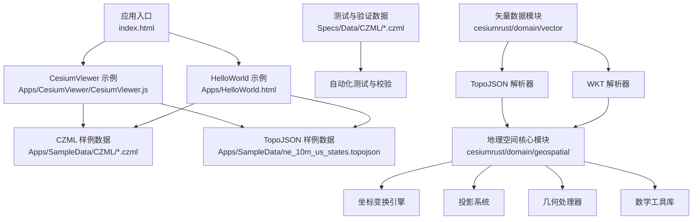

图表来源
- [index.html](file://index.html)
- [Apps/CesiumViewer/CesiumViewer.js](file://Apps/CesiumViewer/CesiumViewer.js)
- [Apps/HelloWorld.html](file://Apps/HelloWorld.html)
- [Apps/SampleData/CZML/simple.czml](file://Apps/SampleData/CZML/simple.czml)
- [Apps/SampleData/ne_10m_us_states.topojson](file://Apps/SampleData/ne_10m_us_states.topojson)
- [Specs/Data/CZML/simple.czml](file://Specs/Data/CZML/simple.czml)
- [cesiumrust/domain/geospatial/src/lib.rs](file://cesiumrust/domain/geospatial/src/lib.rs)
- [cesiumrust/domain/vector/src/topojson.rs](file://cesiumrust/domain/vector/src/topojson.rs)
- [cesiumrust/domain/vector/src/wkt.rs](file://cesiumrust/domain/vector/src/wkt.rs)

章节来源
- [README.md](file://README.md)
- [index.html](file://index.html)
- [Apps/CesiumViewer/CesiumViewer.js](file://Apps/CesiumViewer/CesiumViewer.js)
- [Apps/HelloWorld.html](file://Apps/HelloWorld.html)

## 核心组件
- 坐标系统与参考系
  - WGS84经纬度与大地高：作为输入与输出的常用地理坐标表示。
  - ECEF地心固定坐标系：用于几何计算与渲染管线内部的高效表达。
  - ENU东北天局部坐标系：用于本地化可视化与方向描述。
- 投影变换
  - Web墨卡托投影：Web地图常用的平面投影，便于切片与叠加。
  - 其他投影：根据业务需求选择合适投影进行展示与分析。
- 时间动态处理
  - CZML时间序列：以时间戳驱动位置、姿态、材质等属性的变化。
  - 插值与采样：对离散时间数据进行平滑过渡与高效采样。
- 地理参考系统
  - 椭球体模型：定义地球形状与大小，影响距离、面积与投影精度。
  - 高程基准：区分椭球高与正高/正常高，确保高程一致性。
- 地理空间数学核心
  - 坐标变换引擎：支持多种坐标系间的高效转换。
  - 边界计算：包围盒、包围球等几何边界优化。
  - 视锥剔除：基于相机视角的几何体可见性判断。
  - 光线投射：屏幕坐标到世界坐标的精确映射。
- 矢量数据格式支持
  - TopoJSON格式：高效的拓扑数据结构，支持共享边界的矢量数据。
  - WKT格式：Well-Known Text标准格式，支持点、线、面等几何对象。
  - 矢量数据解析：将标准格式转换为Cesium内部几何表示。

章节来源
- [README.md](file://README.md)
- [cesiumrust/domain/geospatial/src/lib.rs](file://cesiumrust/domain/geospatial/src/lib.rs)
- [cesiumrust/domain/vector/src/topojson.rs](file://cesiumrust/domain/vector/src/topojson.rs)
- [cesiumrust/domain/vector/src/wkt.rs](file://cesiumrust/domain/vector/src/wkt.rs)

## 架构总览
下图展示了从应用入口到CZML数据加载、解析与渲染的关键流程，体现坐标系统与时间处理的参与点，以及新增的矢量数据格式支持。

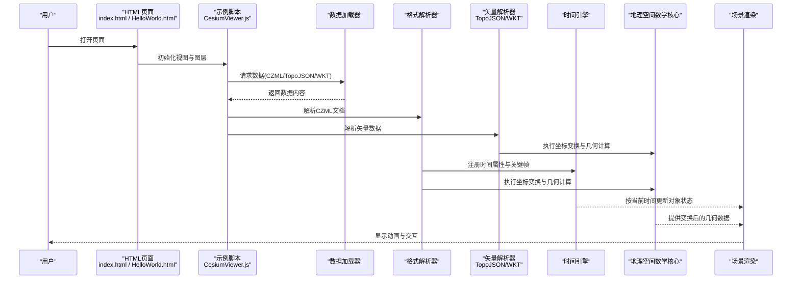

图表来源
- [index.html](file://index.html)
- [Apps/HelloWorld.html](file://Apps/HelloWorld.html)
- [Apps/CesiumViewer/CesiumViewer.js](file://Apps/CesiumViewer/CesiumViewer.js)
- [Apps/SampleData/CZML/simple.czml](file://Apps/SampleData/CZML/simple.czml)
- [Apps/SampleData/ne_10m_us_states.topojson](file://Apps/SampleData/ne_10m_us_states.topojson)
- [cesiumrust/domain/geospatial/src/lib.rs](file://cesiumrust/domain/geospatial/src/lib.rs)
- [cesiumrust/domain/vector/src/topojson.rs](file://cesiumrust/domain/vector/src/topojson.rs)
- [cesiumrust/domain/vector/src/wkt.rs](file://cesiumrust/domain/vector/src/wkt.rs)

## 详细组件分析

### 坐标系统转换（WGS84 ↔ ECEF ↔ ENU）
- 转换目标
  - WGS84经纬度与大地高：适合数据输入与输出。
  - ECEF笛卡尔坐标：适合全局几何运算与矩阵变换。
  - ENU局部坐标：适合本地可视化与方向控制。
- 典型流程
  - 输入WGS84 → 转换为ECEF → 计算局部旋转矩阵 → 得到ENU坐标。
  - 反向流程：ENU → 旋转矩阵 → ECEF → 反解为WGS84。
- 注意事项
  - 椭球体参数与高程基准需一致，避免系统性偏差。
  - 大尺度区域建议使用分块或局部参考系提升数值稳定性。

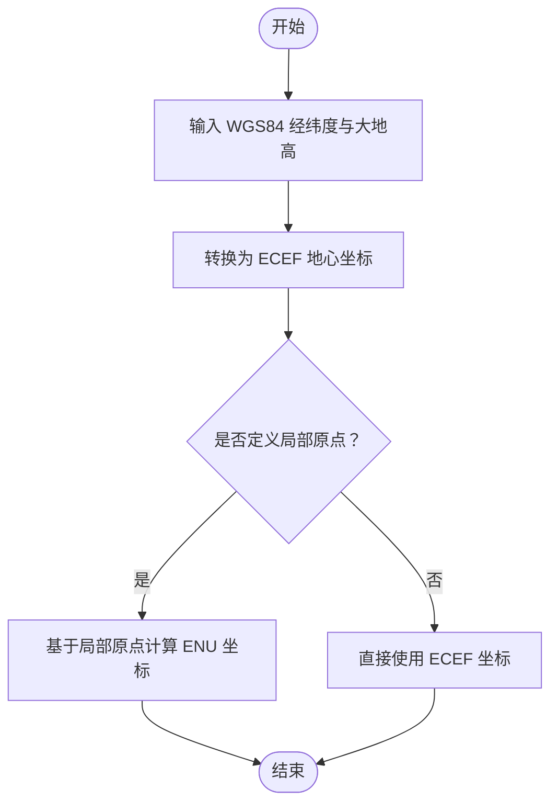

章节来源
- [README.md](file://README.md)
- [cesiumrust/domain/geospatial/src/coordinate_transform.rs](file://cesiumrust/domain/geospatial/src/coordinate_transform.rs)

### 投影变换算法（Web墨卡托与其他投影）
- Web墨卡托
  - 将经纬度映射到平面坐标，便于瓦片切图与叠加。
  - 适用于全球范围展示，但高纬度地区存在面积与形状失真。
- 其他投影
  - 针对特定区域或用途选择合适投影，平衡变形与精度。
- 使用建议
  - 明确投影类型与EPSG代码，统一数据源与渲染层投影。
  - 跨投影叠加时进行重投影，保证对齐与精度。

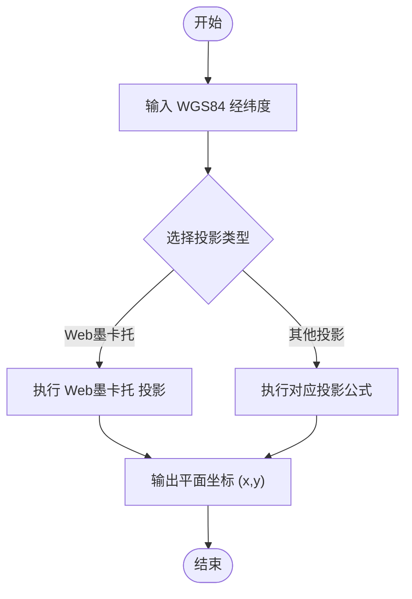

章节来源
- [README.md](file://README.md)
- [cesiumrust/domain/geospatial/src/projection.rs](file://cesiumrust/domain/geospatial/src/projection.rs)

### 时间动态处理与CZML时间动画
- CZML时间模型
  - 关键帧：指定时间点上的属性值（如位置、姿态、材质）。
  - 插值：在关键帧之间进行线性或样条插值，生成连续动画。
  - 时间范围：定义动画起止时间与播放速率。
- 常见模式
  - 整段轨迹：一次性提供完整时间序列。
  - 分段轨迹：多段拼接，支持不同材质或样式随时间变化。
- 示例数据
  - 简单轨迹与车辆动画：[simple.czml](file://Apps/SampleData/CZML/simple.czml)、[Vehicle.czml](file://Apps/SampleData/CZML/Vehicle.czml)。
  - 双星轨道与相对参考：[TwoSats.czml](file://Apps/SampleData/CZML/TwoSats.czml)、[TwoSatsOrientation.czml](file://Specs/Data/CZML/TwoSatsOrientation.czml)、[TwoSatsRelativeReferenceEnds.czml](file://Specs/Data/CZML/TwoSatsRelativeReferenceEnds.czml)。
  - 火星场景与兴趣点：[Mars.czml](file://Apps/SampleData/CZML/Mars.czml)。
  - 时间依赖路径（整体/分段/变材质）：[TimeDependentPaths_Whole.czml](file://Apps/SampleData/CZML/TimeDependentPaths_Whole.czml)、[TimeDependentPaths_Portions.czml](file://Apps/SampleData/CZML/TimeDependentPaths_Portions.czml)、[TimeDependentPaths_VaryingMaterialMode.czml](file://Apps/SampleData/CZML/TimeDependentPaths_VaryingMaterialMode.czml)。
  - 跟踪轨迹：[tracking.czml](file://Apps/SampleData/CZML/tracking.czml)。

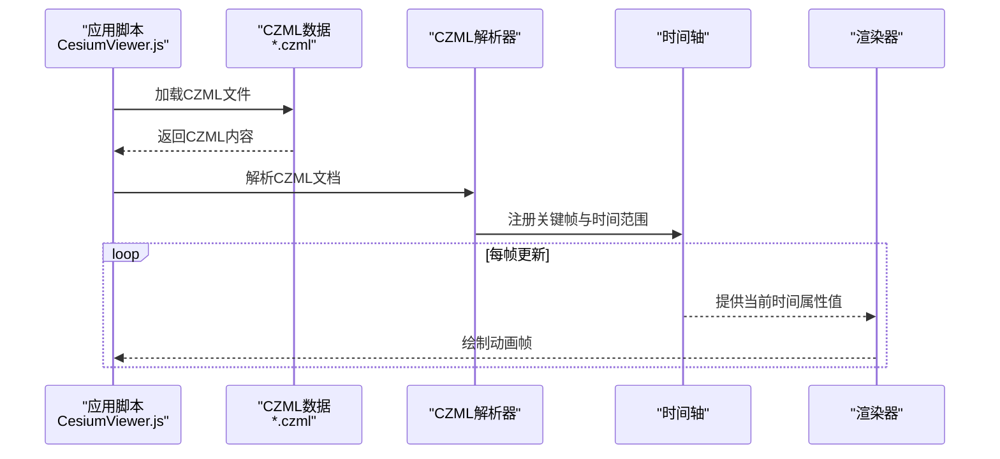

图表来源
- [Apps/CesiumViewer/CesiumViewer.js](file://Apps/CesiumViewer/CesiumViewer.js)
- [Apps/SampleData/CZML/simple.czml](file://Apps/SampleData/CZML/simple.czml)
- [Apps/SampleData/CZML/Vehicle.czml](file://Apps/SampleData/CZML/Vehicle.czml)
- [Apps/SampleData/CZML/TwoSats.czml](file://Apps/SampleData/CZML/TwoSats.czml)
- [Apps/SampleData/CZML/TimeDependentPaths_Whole.czml](file://Apps/SampleData/CZML/TimeDependentPaths_Whole.czml)
- [Apps/SampleData/CZML/TimeDependentPaths_Portions.czml](file://Apps/SampleData/CZML/TimeDependentPaths_Portions.czml)
- [Apps/SampleData/CZML/TimeDependentPaths_VaryingMaterialMode.czml](file://Apps/SampleData/CZML/TimeDependentPaths_VaryingMaterialMode.czml)
- [Apps/SampleData/CZML/tracking.czml](file://Apps/SampleData/CZML/tracking.czml)
- [Specs/Data/CZML/TwoSatsOrientation.czml](file://Specs/Data/CZML/TwoSatsOrientation.czml)
- [Specs/Data/CZML/TwoSatsRelativeReferenceEnds.czml](file://Specs/Data/CZML/TwoSatsRelativeReferenceEnds.czml)

章节来源
- [Apps/SampleData/CZML/simple.czml](file://Apps/SampleData/CZML/simple.czml)
- [Apps/SampleData/CZML/Vehicle.czml](file://Apps/SampleData/CZML/Vehicle.czml)
- [Apps/SampleData/CZML/TwoSats.czml](file://Apps/SampleData/CZML/TwoSats.czml)
- [Apps/SampleData/CZML/Mars.czml](file://Apps/SampleData/CZML/Mars.czml)
- [Apps/SampleData/CZML/TimeDependentPaths_Whole.czml](file://Apps/SampleData/CZML/TimeDependentPaths_Whole.czml)
- [Apps/SampleData/CZML/TimeDependentPaths_Portions.czml](file://Apps/SampleData/CZML/TimeDependentPaths_Portions.czml)
- [Apps/SampleData/CZML/TimeDependentPaths_VaryingMaterialMode.czml](file://Apps/SampleData/CZML/TimeDependentPaths_VaryingMaterialMode.czml)
- [Apps/SampleData/CZML/tracking.czml](file://Apps/SampleData/CZML/tracking.czml)
- [Specs/Data/CZML/simple.czml](file://Specs/Data/CZML/simple.czml)
- [Specs/Data/CZML/Vehicle.czml](file://Specs/Data/CZML/Vehicle.czml)
- [Specs/Data/CZML/TwoSats.czml](file://Specs/Data/CZML/TwoSats.czml)
- [Specs/Data/CZML/TwoSatsOrientation.czml](file://Specs/Data/CZML/TwoSatsOrientation.czml)
- [Specs/Data/CZML/TwoSatsRelativeReferenceEnds.czml](file://Specs/Data/CZML/TwoSatsRelativeReferenceEnds.czml)
- [Specs/Data/CZML/ValidationDocument.czml](file://Specs/Data/CZML/ValidationDocument.czml)

### 地理参考系统实现原理
- 大地测量学基础
  - 椭球体模型：定义长半轴与扁率，决定经纬度与距离计算的精度。
  - 高程基准：区分椭球高与正高/正常高，确保高程一致性。
- 参考系选择
  - 全局参考系：WGS84与ECEF用于大范围场景。
  - 局部参考系：ENU用于小范围高精度可视化。
- 投影策略
  - 根据应用场景选择合适的投影，权衡变形与性能。

章节来源
- [README.md](file://README.md)
- [cesiumrust/domain/geospatial/src/ellipsoid.rs](file://cesiumrust/domain/geospatial/src/ellipsoid.rs)

## 地理空间数学实现

### 坐标变换引擎
坐标变换引擎提供了高效的坐标系转换能力，支持WGS84、ECEF、ENU等多种坐标系统之间的相互转换。

**核心功能**
- 经纬度与地心坐标的双向转换
- 局部坐标系的原点定义与变换
- 旋转矩阵的计算与应用
- 批量坐标变换的性能优化

**实现特点**
- 使用Rust实现的高性能数学运算
- 支持浮点数精度的误差控制
- 提供API接口供上层应用调用

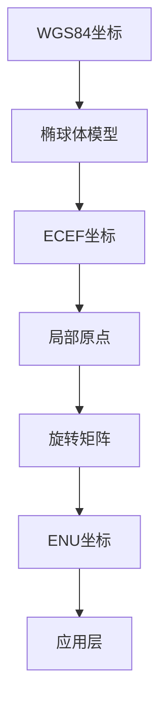

**章节来源**
- [cesiumrust/domain/geospatial/src/coordinate_transform.rs](file://cesiumrust/domain/geospatial/src/coordinate_transform.rs)

### 椭球体操作与几何计算
椭球体模块实现了地球椭球体的数学模型，提供基础的几何计算功能。

**主要功能**
- 椭球体参数定义（长半轴、短半轴、扁率）
- 表面法向量计算
- 曲率半径计算
- 距离与面积计算

**数学模型**
- 采用WGS84标准椭球体参数
- 支持自定义椭球体配置
- 提供高精度的数学运算

**章节来源**
- [cesiumrust/domain/geospatial/src/ellipsoid.rs](file://cesiumrust/domain/geospatial/src/ellipsoid.rs)

### 投影系统与瓦片方案
投影系统实现了多种地图投影算法，支持Web墨卡托等常用投影格式。

**支持的投影**
- Web墨卡托投影：Web地图标准投影
- 其他自定义投影：通过配置扩展支持

**瓦片方案**
- 标准的金字塔瓦片结构
- 动态瓦片生成与缓存
- 多分辨率层级管理

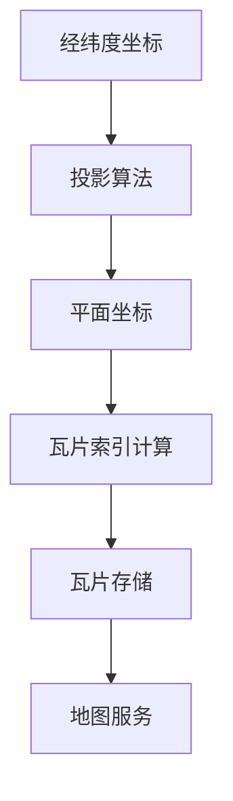

**章节来源**
- [cesiumrust/domain/geospatial/src/projection.rs](file://cesiumrust/domain/geospatial/src/projection.rs)
- [cesiumrust/domain/geospatial/src/tiling_scheme.rs](file://cesiumrust/domain/geospatial/src/tiling_scheme.rs)

### 边界计算与视锥剔除
边界计算模块提供了高效的几何体边界检测功能，用于渲染优化。

**边界类型**
- 包围盒（Axis-Aligned Bounding Box）
- 包围球（Bounding Sphere）
- 自定义几何边界

**视锥剔除**
- 基于相机视角的可见性判断
- 多层级LOD支持
- 批量剔除优化

**章节来源**
- [cesiumrust/domain/geospatial/src/bounding.rs](file://cesiumrust/domain/geospatial/src/bounding.rs)
- [cesiumrust/domain/geospatial/src/frustum.rs](file://cesiumrust/domain/geospatial/src/frustum.rs)

### 几何处理与光线投射
几何处理模块提供了丰富的几何操作功能，支持复杂的三维空间计算。

**几何操作**
- 基本几何体创建（点、线、面、体）
- 几何体变换与组合
- 几何体简化与优化

**光线投射**
- 屏幕坐标到世界坐标的映射
- 射线与几何体的相交检测
- 拾取与碰撞检测

**章节来源**
- [cesiumrust/domain/geospatial/src/geometry.rs](file://cesiumrust/domain/geospatial/src/geometry.rs)
- [cesiumrust/domain/geospatial/src/ray_casting.rs](file://cesiumrust/domain/geospatial/src/ray_casting.rs)

### 矩形操作与数学工具
矩形操作模块提供了二维矩形的几何计算功能，广泛应用于地图显示和UI布局。

**矩形功能**
- 矩形定义与验证
- 矩形交集与并集计算
- 矩形包含关系判断

**数学工具**
- 三角函数与角度转换
- 矩阵运算与变换
- 向量运算与几何计算

**章节来源**
- [cesiumrust/domain/geospatial/src/rectangle.rs](file://cesiumrust/domain/geospatial/src/rectangle.rs)
- [cesiumrust/domain/geospatial/src/math_utils.rs](file://cesiumrust/domain/geospatial/src/math_utils.rs)

## 矢量数据格式支持

### TopoJSON格式解析
TopoJSON是一种专为地理空间数据设计的紧凑格式，通过共享边界来减少数据冗余，特别适合大规模矢量数据的传输和存储。

**核心特性**
- 拓扑数据结构：共享边界和节点，显著减少文件大小
- 几何对象支持：点、线、面及其复合类型
- 属性数据：支持键值对形式的元数据存储
- 坐标系统：默认使用WGS84经纬度坐标

**解析流程**
- 读取TopoJSON文件并解析拓扑结构
- 提取几何对象和属性数据
- 转换为Cesium内部几何表示
- 应用到地理空间坐标系统

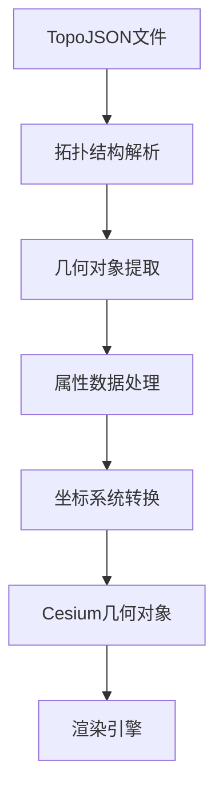

**章节来源**
- [cesiumrust/domain/vector/src/topojson.rs](file://cesiumrust/domain/vector/src/topojson.rs)

### WKT格式支持
WKT（Well-Known Text）是OGC标准定义的文本格式，用于表示几何对象，具有良好的可读性和互操作性。

**支持的几何类型**
- 点（POINT）：单个坐标点
- 线（LINESTRING）：有序坐标序列
- 多线（MULTILINESTRING）：多条线的集合
- 面（POLYGON）：由环组成的多边形
- 多面（MULTIPOLYGON）：多个多边形的集合
- 多点（MULTIPOINT）：多个点的集合
- 几何集合（GEOMETRYCOLLECTION）：混合几何类型

**解析特性**
- 完整的WKT语法支持
- 坐标精度处理
- 几何有效性验证
- 错误处理和异常恢复

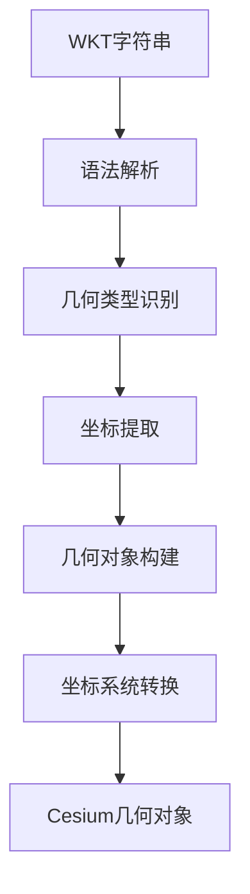

**章节来源**
- [cesiumrust/domain/vector/src/wkt.rs](file://cesiumrust/domain/vector/src/wkt.rs)

### 矢量数据处理集成
矢量数据格式支持与现有地理空间处理管道的无缝集成。

**集成架构**
- 统一的矢量数据接口抽象
- 自动坐标系统检测和转换
- 与投影系统的深度集成
- 内存管理和性能优化

**数据处理流程**
- 格式识别和选择
- 数据解析和验证
- 坐标系统标准化
- 几何对象转换
- 渲染数据准备

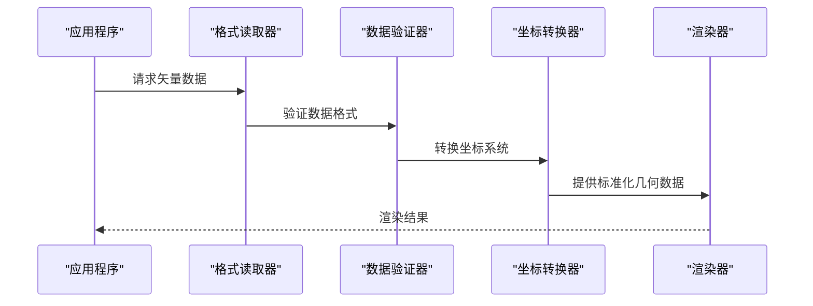

**章节来源**
- [cesiumrust/domain/vector/src/topojson.rs](file://cesiumrust/domain/vector/src/topojson.rs)
- [cesiumrust/domain/vector/src/wkt.rs](file://cesiumrust/domain/vector/src/wkt.rs)
- [cesiumrust/domain/geospatial/src/lib.rs](file://cesiumrust/domain/geospatial/src/lib.rs)

## 依赖关系分析
- 入口与示例
  - index.html与HelloWorld.html作为页面入口，加载示例脚本与资源。
  - CesiumViewer.js负责初始化视图、加载CZML数据与驱动时间动画。
- 数据与测试
  - Apps/SampleData/CZML提供演示用CZML数据。
  - Apps/SampleData/ne_10m_us_states.topojson提供TopoJSON示例数据。
  - Specs/Data/CZML提供测试与验证用CZML数据，支撑回归测试。
- 地理空间核心模块
  - cesiumrust/domain/geospatial提供高性能的地理空间数学运算。
  - cesiumrust/domain/vector提供矢量数据格式解析能力。
  - 各子模块相互协作，形成完整的地理空间处理能力。

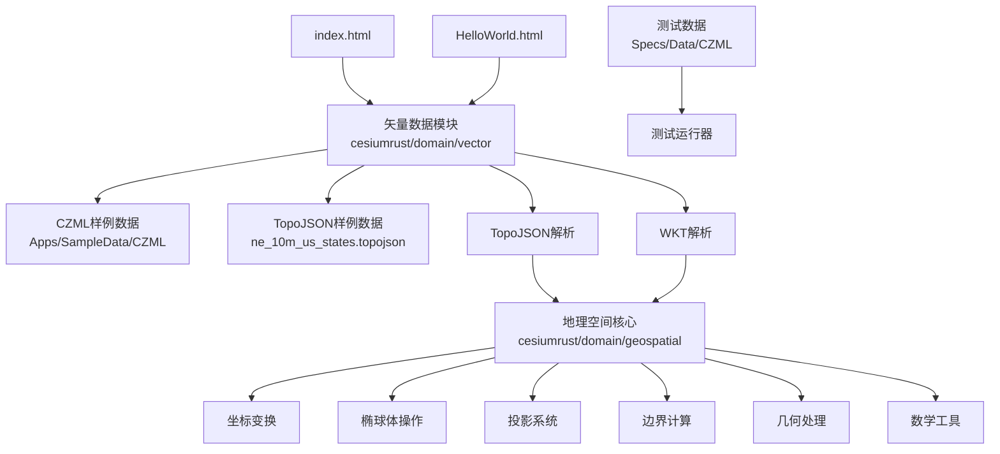

图表来源
- [index.html](file://index.html)
- [Apps/HelloWorld.html](file://Apps/HelloWorld.html)
- [Apps/CesiumViewer/CesiumViewer.js](file://Apps/CesiumViewer/CesiumViewer.js)
- [Apps/SampleData/CZML/simple.czml](file://Apps/SampleData/CZML/simple.czml)
- [Apps/SampleData/ne_10m_us_states.topojson](file://Apps/SampleData/ne_10m_us_states.topojson)
- [Specs/Data/CZML/simple.czml](file://Specs/Data/CZML/simple.czml)
- [cesiumrust/domain/geospatial/src/lib.rs](file://cesiumrust/domain/geospatial/src/lib.rs)
- [cesiumrust/domain/vector/src/topojson.rs](file://cesiumrust/domain/vector/src/topojson.rs)
- [cesiumrust/domain/vector/src/wkt.rs](file://cesiumrust/domain/vector/src/wkt.rs)

章节来源
- [index.html](file://index.html)
- [Apps/HelloWorld.html](file://Apps/HelloWorld.html)
- [Apps/CesiumViewer/CesiumViewer.js](file://Apps/CesiumViewer/CesiumViewer.js)
- [Apps/SampleData/CZML/simple.czml](file://Apps/SampleData/CZML/simple.czml)
- [Apps/SampleData/ne_10m_us_states.topojson](file://Apps/SampleData/ne_10m_us_states.topojson)
- [Specs/Data/CZML/simple.czml](file://Specs/Data/CZML/simple.czml)

## 性能考虑
- 数据量与采样
  - 合理设置CZML关键帧密度，避免过多插值导致CPU压力。
  - 对长时序数据采用分段加载与按需更新。
- 投影与坐标
  - 在大范围场景中优先使用合适的投影，减少重投影开销。
  - 局部高精度场景使用ENU，降低数值误差。
- 渲染优化
  - 合并静态几何与动态属性，分离更新频率不同的对象。
  - 利用视锥剔除与LOD策略，提升帧率。
- 内存管理
  - 合理使用Rust的所有权机制，避免内存泄漏。
  - 批量处理大数据集，减少内存分配开销。
- 并行计算
  - 利用多线程并行处理坐标变换和几何计算。
  - 异步加载大型地理空间数据集。
- 矢量数据优化
  - TopoJSON的拓扑结构可显著减少数据传输和内存占用。
  - WKT解析时进行增量处理，避免大文件导致的内存峰值。
  - 矢量数据与栅格数据的融合渲染优化。

## 故障排查指南
- CZML解析失败
  - 检查CZML语法与必填字段，参考验证文档：[ValidationDocument.czml](file://Specs/Data/CZML/ValidationDocument.czml)。
  - 确认时间戳格式与时间范围有效。
- 坐标不一致
  - 核对椭球体参数与高程基准，确保数据源与渲染层一致。
  - 检查投影类型与EPSG代码，必要时进行重投影。
- 动画不流畅
  - 减少关键帧数量或调整插值策略。
  - 检查时间轴更新频率与渲染循环。
- 性能问题
  - 监控内存使用情况，及时释放不再使用的资源。
  - 优化批量操作的算法复杂度。
  - 检查视锥剔除是否正常工作。
- 矢量数据解析错误
  - 验证TopoJSON文件的拓扑完整性。
  - 检查WKT语法的正确性和几何有效性。
  - 确认坐标系统声明与实际数据一致。

章节来源
- [Specs/Data/CZML/ValidationDocument.czml](file://Specs/Data/CZML/ValidationDocument.czml)
- [cesiumrust/domain/geospatial/src/lib.rs](file://cesiumrust/domain/geospatial/src/lib.rs)
- [cesiumrust/domain/vector/src/topojson.rs](file://cesiumrust/domain/vector/src/topojson.rs)
- [cesiumrust/domain/vector/src/wkt.rs](file://cesiumrust/domain/vector/src/wkt.rs)

## 结论
Cesium在地理空间数据处理方面提供了完善的坐标系统转换、投影变换与时间动态处理能力。通过合理的椭球体与高程基准选择、恰当的投影策略与高效的CZML时间动画设计，可以在大规模三维地球场景中实现精确且流畅的可视化与分析。结合示例与测试数据，开发者可以快速搭建并验证自己的地理空间数据处理流程。

**更新** 新增的综合地理空间数学实现进一步增强了系统的性能和功能完整性，通过Rust实现的高性能数学运算为大规模地理空间数据处理提供了坚实的基础。新增的矢量数据格式支持（TopoJSON和WKT）使得系统能够处理更多标准地理空间数据格式，提升了数据兼容性和实用性。

## 附录
- 示例与数据路径
  - 入门示例：[index.html](file://index.html)、[Apps/HelloWorld.html](file://Apps/HelloWorld.html)
  - 示例脚本：[Apps/CesiumViewer/CesiumViewer.js](file://Apps/CesiumViewer/CesiumViewer.js)
  - CZML样例：[Apps/SampleData/CZML/simple.czml](file://Apps/SampleData/CZML/simple.czml)、[Apps/SampleData/CZML/Vehicle.czml](file://Apps/SampleData/CZML/Vehicle.czml)、[Apps/SampleData/CZML/TwoSats.czml](file://Apps/SampleData/CZML/TwoSats.czml)、[Apps/SampleData/CZML/Mars.czml](file://Apps/SampleData/CZML/Mars.czml)、[Apps/SampleData/CZML/TimeDependentPaths_Whole.czml](file://Apps/SampleData/CZML/TimeDependentPaths_Whole.czml)、[Apps/SampleData/CZML/TimeDependentPaths_Portions.czml](file://Apps/SampleData/CZML/TimeDependentPaths_Portions.czml)、[Apps/SampleData/CZML/TimeDependentPaths_VaryingMaterialMode.czml](file://Apps/SampleData/CZML/TimeDependentPaths_VaryingMaterialMode.czml)、[Apps/SampleData/CZML/tracking.czml](file://Apps/SampleData/CZML/tracking.czml)
  - TopoJSON样例：[Apps/SampleData/ne_10m_us_states.topojson](file://Apps/SampleData/ne_10m_us_states.topojson)
  - 测试数据：[Specs/Data/CZML/simple.czml](file://Specs/Data/CZML/simple.czml)、[Specs/Data/CZML/Vehicle.czml](file://Specs/Data/CZML/Vehicle.czml)、[Specs/Data/CZML/TwoSats.czml](file://Specs/Data/CZML/TwoSats.czml)、[Specs/Data/CZML/TwoSatsOrientation.czml](file://Specs/Data/CZML/TwoSatsOrientation.czml)、[Specs/Data/CZML/TwoSatsRelativeReferenceEnds.czml](file://Specs/Data/CZML/TwoSatsRelativeReferenceEnds.czml)、[Specs/Data/CZML/ValidationDocument.czml](file://Specs/Data/CZML/ValidationDocument.czml)
- 地理空间核心模块
  - 坐标变换：[coordinate_transform.rs](file://cesiumrust/domain/geospatial/src/coordinate_transform.rs)
  - 椭球体操作：[ellipsoid.rs](file://cesiumrust/domain/geospatial/src/ellipsoid.rs)
  - 投影系统：[projection.rs](file://cesiumrust/domain/geospatial/src/projection.rs)
  - 边界计算：[bounding.rs](file://cesiumrust/domain/geospatial/src/bounding.rs)
  - 视锥剔除：[frustum.rs](file://cesiumrust/domain/geospatial/src/frustum.rs)
  - 几何处理：[geometry.rs](file://cesiumrust/domain/geospatial/src/geometry.rs)
  - 数学工具：[math_utils.rs](file://cesiumrust/domain/geospatial/src/math_utils.rs)
  - 光线投射：[ray_casting.rs](file://cesiumrust/domain/geospatial/src/ray_casting.rs)
  - 矩形操作：[rectangle.rs](file://cesiumrust/domain/geospatial/src/rectangle.rs)
  - 瓦片方案：[tiling_scheme.rs](file://cesiumrust/domain/geospatial/src/tiling_scheme.rs)
- 矢量数据格式模块
  - TopoJSON解析：[topojson.rs](file://cesiumrust/domain/vector/src/topojson.rs)
  - WKT解析：[wkt.rs](file://cesiumrust/domain/vector/src/wkt.rs)