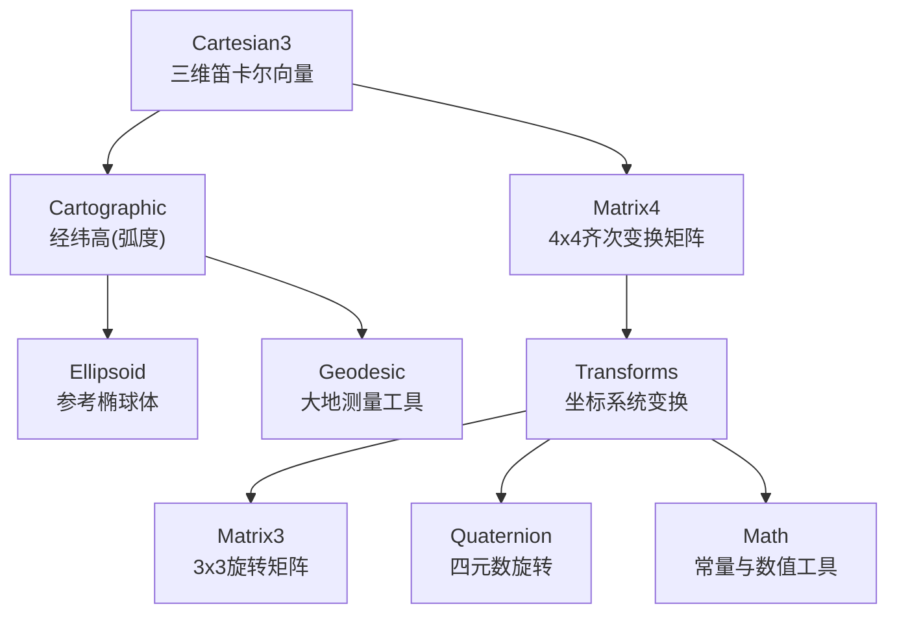
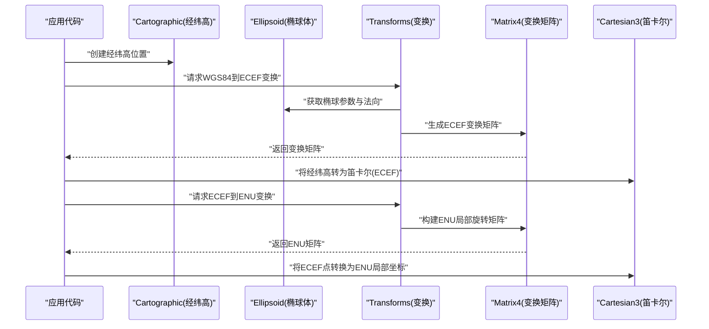
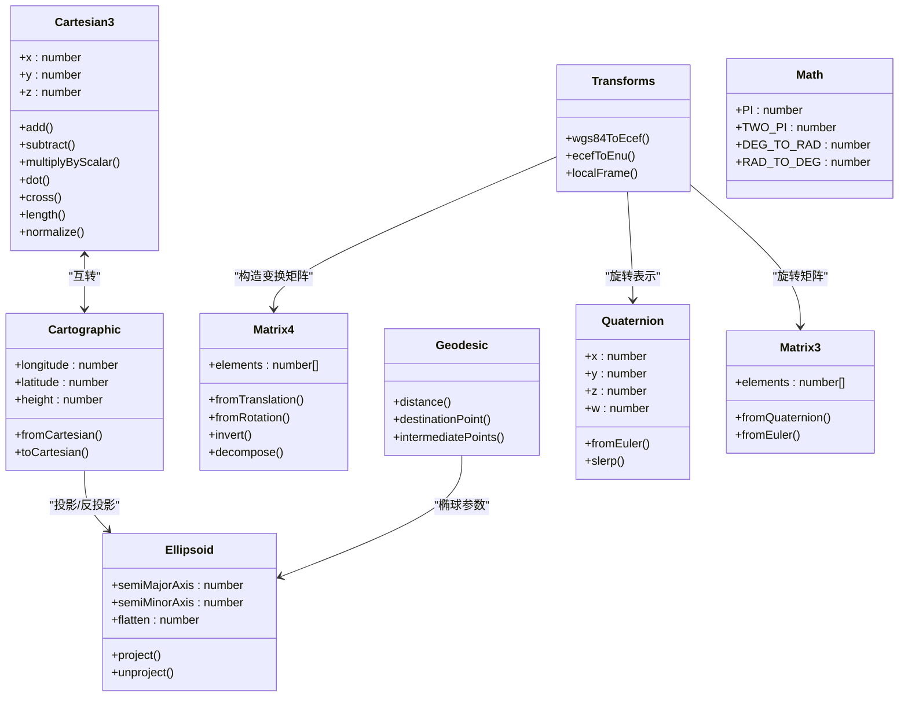

# 坐标系统转换

<cite>
**本文引用的文件**   
- [Cartesian3.js](file://Source/Core/Cartesian3.js)
- [Cartographic.js](file://Source/Core/Cartographic.js)
- [Matrix4.js](file://Source/Core/Matrix4.js)
- [Transforms.js](file://Source/Core/Transforms.js)
- [Ellipsoid.js](file://Source/Core/Ellipsoid.js)
- [Geodesic.js](file://Source/Core/Geodesic.js)
- [Quaternion.js](file://Source/Core/Quaternion.js)
- [Matrix3.js](file://Source/Core/Matrix3.js)
- [Math.js](file://Source/Core/Math.js)
</cite>

## 目录
1. [简介](#简介)
2. [项目结构](#项目结构)
3. [核心组件](#核心组件)
4. [架构总览](#架构总览)
5. [详细组件分析](#详细组件分析)
6. [依赖关系分析](#依赖关系分析)
7. [性能考虑](#性能考虑)
8. [故障排查指南](#故障排查指南)
9. [结论](#结论)
10. [附录：常用转换流程与示例路径](#附录常用转换流程与示例路径)

## 简介
本技术文档聚焦Cesium的坐标系统转换能力，围绕WGS84地理坐标系、ECEF地心固定坐标系、ENU东北天局部坐标系等核心坐标系统的数学原理与实现进行系统化阐述。重点解析Cartesian3、Cartographic、Matrix4等关键数据结构的语义与用法，并给出不同坐标系统之间精确转换的实践方法，包括经纬度与三维笛卡尔坐标互转、局部坐标系变换等常见场景。同时讨论浮点精度与误差控制策略，帮助读者在工程实践中获得稳定可靠的坐标计算结果。

## 项目结构
Cesium的核心几何与坐标变换逻辑集中在Core模块中。与坐标系统相关的关键文件包括：
- Cartesian3：三维笛卡尔向量与点
- Cartographic：经纬高（弧度制）表示
- Matrix4：4x4齐次变换矩阵
- Transforms：各类坐标系统之间的变换矩阵与函数
- Ellipsoid：参考椭球体定义与投影/反投影
- Geodesic：大地测量学工具（测地线、距离、方位角）
- Quaternion：四元数旋转表示
- Matrix3：3x3旋转/缩放矩阵
- Math：角度/弧度常量与数值处理工具

**图示来源** 
- [Cartesian3.js](file://Source/Core/Cartesian3.js)
- [Cartographic.js](file://Source/Core/Cartographic.js)
- [Matrix4.js](file://Source/Core/Matrix4.js)
- [Transforms.js](file://Source/Core/Transforms.js)
- [Ellipsoid.js](file://Source/Core/Ellipsoid.js)
- [Geodesic.js](file://Source/Core/Geodesic.js)
- [Quaternion.js](file://Source/Core/Quaternion.js)
- [Matrix3.js](file://Source/Core/Matrix3.js)
- [Math.js](file://Source/Core/Math.js)

**章节来源**
- [Cartesian3.js](file://Source/Core/Cartesian3.js)
- [Cartographic.js](file://Source/Core/Cartographic.js)
- [Matrix4.js](file://Source/Core/Matrix4.js)
- [Transforms.js](file://Source/Core/Transforms.js)
- [Ellipsoid.js](file://Source/Core/Ellipsoid.js)
- [Geodesic.js](file://Source/Core/Geodesic.js)
- [Quaternion.js](file://Source/Core/Quaternion.js)
- [Matrix3.js](file://Source/Core/Matrix3.js)
- [Math.js](file://Source/Core/Math.js)

## 核心组件
- Cartesian3：表示三维空间中的点或向量，提供加减乘除、点积、叉积、归一化、插值等运算，是坐标计算的原子类型。
- Cartographic：以经度、纬度、高度（弧度制）描述位置，支持从笛卡尔坐标反投影到椭球面，以及高度修正。
- Matrix4：4x4齐次变换矩阵，用于组合平移、旋转、缩放与投影变换，是全局与局部坐标变换的载体。
- Transforms：封装了WGS84、ECEF、ENU、NED、本地切平面等坐标系的变换矩阵与便捷函数，如从经纬高到ECEF、从ECEF到ENU、构建局部旋转矩阵等。
- Ellipsoid：定义地球参考椭球体参数（长半轴、短半轴、扁率），提供椭球表面法向、曲率半径、投影/反投影等基础几何能力。
- Geodesic：基于椭球体的大地测量计算，包括两点间最短距离、初始/终止方位角、沿测地线的点序列等。
- Quaternion：单位四元数，表达旋转，避免万向节锁，常用于姿态与方向计算。
- Matrix3：3x3旋转/缩放矩阵，常作为Quaternion与欧拉角之间的中间表示。
- Math：提供PI、TWO_PI、DEG_TO_RAD、RAD_TO_DEG等常量与数值处理工具。

**章节来源**
- [Cartesian3.js](file://Source/Core/Cartesian3.js)
- [Cartographic.js](file://Source/Core/Cartographic.js)
- [Matrix4.js](file://Source/Core/Matrix4.js)
- [Transforms.js](file://Source/Core/Transforms.js)
- [Ellipsoid.js](file://Source/Core/Ellipsoid.js)
- [Geodesic.js](file://Source/Core/Geodesic.js)
- [Quaternion.js](file://Source/Core/Quaternion.js)
- [Matrix3.js](file://Source/Core/Matrix3.js)
- [Math.js](file://Source/Core/Math.js)

## 架构总览
坐标系统转换的整体流程由“数据模型 + 变换矩阵 + 椭球几何”三层构成：
- 数据模型层：Cartesian3与Cartographic分别承载笛卡尔与经纬高两种表示。
- 变换矩阵层：Matrix4与Matrix3/Quaternion组合出各种坐标系间的旋转与平移。
- 椭球几何层：Ellipsoid提供椭球表面的法向、曲率半径与投影/反投影；Geodesic提供大地测量学计算。

**图示来源** 
- [Cartographic.js](file://Source/Core/Cartographic.js)
- [Ellipsoid.js](file://Source/Core/Ellipsoid.js)
- [Transforms.js](file://Source/Core/Transforms.js)
- [Matrix4.js](file://Source/Core/Matrix4.js)
- [Cartesian3.js](file://Source/Core/Cartesian3.js)

## 详细组件分析

### Cartesian3：三维笛卡尔向量与点
- 语义：表示(x, y, z)三维空间中的点或向量，所有运算遵循线性代数规则。
- 典型操作：加减、标量乘除、点积、叉积、长度、归一化、插值、投影。
- 复杂度：基本运算为O(1)，适合高频调用。
- 使用建议：
  - 尽量复用对象以减少分配开销。
  - 注意归一化前的长度检查，避免除以零。
  - 对大尺度坐标（ECEF）进行差值时，先做相对位移再归一化可减少舍入误差。

**章节来源**
- [Cartesian3.js](file://Source/Core/Cartesian3.js)

### Cartographic：经纬高（弧度制）
- 语义：经度λ、纬度φ、高度h（相对于椭球面）。
- 典型操作：从Cartesian3反投影到椭球面、高度修正、范围裁剪。
- 复杂度：反投影涉及迭代或闭式解，通常为O(1)。
- 使用建议：
  - 输入经度需规范化到[-π, π]，纬度限制在[-π/2, π/2]。
  - 高度为正表示椭球外，负表示椭球内。
  - 大范围插值建议使用测地线插值而非直接线性插值。

**章节来源**
- [Cartographic.js](file://Source/Core/Cartographic.js)

### Matrix4：4x4齐次变换矩阵
- 语义：用于表示平移、旋转、缩放的复合变换，支持左乘右乘约定。
- 典型操作：构造单位矩阵、平移、旋转（欧拉角/四元数）、缩放、求逆、分解。
- 复杂度：矩阵乘法为常数时间，但数值稳定性需注意。
- 使用建议：
  - 组合多个变换时，按顺序累积矩阵，减少重复计算。
  - 对旋转部分进行正交化，避免漂移。
  - 求逆时使用稳定的算法，必要时进行条件数检查。

**章节来源**
- [Matrix4.js](file://Source/Core/Matrix4.js)

### Transforms：坐标系统变换
- 功能：提供WGS84→ECEF、ECEF→ENU/NED、构建局部切平面旋转矩阵、世界到局部变换等。
- 关键点：
  - WGS84到ECEF：基于椭球参数与法向，将经纬高映射到地心固定坐标系。
  - ECEF到ENU：以观测点为原点，构建东北天局部基，通过旋转矩阵完成变换。
  - 局部坐标系：可自定义原点和朝向，适用于区域级高精度计算。
- 复杂度：矩阵构造与乘法为O(1)，批量变换时可缓存矩阵。

**章节来源**
- [Transforms.js](file://Source/Core/Transforms.js)

### Ellipsoid：参考椭球体
- 语义：定义地球参考椭球体（长半轴a、短半轴b、扁率f），提供法向、曲率半径、投影/反投影。
- 典型操作：从Cartesian3投影到椭球面、从椭球面反投影到Cartesian3、计算主曲率半径。
- 复杂度：投影/反投影为O(1)，迭代收敛速度快。
- 使用建议：
  - 选择合适椭球体（WGS84、GRS80等）以保证一致性。
  - 对接近极点的位置，注意数值稳定性。

**章节来源**
- [Ellipsoid.js](file://Source/Core/Ellipsoid.js)

### Geodesic：大地测量工具
- 功能：计算两点间测地线距离、初始/终止方位角、沿测地线的点序列。
- 适用场景：航线规划、距离估算、路径插值。
- 复杂度：O(1)单次计算，路径采样为O(n)。

**章节来源**
- [Geodesic.js](file://Source/Core/Geodesic.js)

### Quaternion与Matrix3：旋转表示
- Quaternion：单位四元数，避免万向节锁，适合插值与连续旋转。
- Matrix3：3x3旋转/缩放矩阵，常用于与欧拉角互转。
- 使用建议：
  - 频繁插值优先使用四元数球面线性插值（SLERP）。
  - 从欧拉角到四元数时注意旋转顺序与符号约定。

**章节来源**
- [Quaternion.js](file://Source/Core/Quaternion.js)
- [Matrix3.js](file://Source/Core/Matrix3.js)

### Math：常量与数值工具
- 提供PI、TWO_PI、DEG_TO_RAD、RAD_TO_DEG等常量与数值处理工具。
- 使用建议：统一使用库内常量，避免硬编码导致不一致。

**章节来源**
- [Math.js](file://Source/Core/Math.js)

## 依赖关系分析
坐标系统转换的依赖关系如下：
- Cartesian3与Cartographic相互依赖，通过Ellipsoid进行投影/反投影。
- Transforms依赖Matrix4、Matrix3、Quaternion进行旋转与平移组合。
- Geodesic依赖Ellipsoid进行大地测量计算。
- Math为各模块提供通用常量与数值工具。

**图示来源** 
- [Cartesian3.js](file://Source/Core/Cartesian3.js)
- [Cartographic.js](file://Source/Core/Cartographic.js)
- [Matrix4.js](file://Source/Core/Matrix4.js)
- [Transforms.js](file://Source/Core/Transforms.js)
- [Ellipsoid.js](file://Source/Core/Ellipsoid.js)
- [Geodesic.js](file://Source/Core/Geodesic.js)
- [Quaternion.js](file://Source/Core/Quaternion.js)
- [Matrix3.js](file://Source/Core/Matrix3.js)
- [Math.js](file://Source/Core/Math.js)

**章节来源**
- [Cartesian3.js](file://Source/Core/Cartesian3.js)
- [Cartographic.js](file://Source/Core/Cartographic.js)
- [Matrix4.js](file://Source/Core/Matrix4.js)
- [Transforms.js](file://Source/Core/Transforms.js)
- [Ellipsoid.js](file://Source/Core/Ellipsoid.js)
- [Geodesic.js](file://Source/Core/Geodesic.js)
- [Quaternion.js](file://Source/Core/Quaternion.js)
- [Matrix3.js](file://Source/Core/Matrix3.js)
- [Math.js](file://Source/Core/Math.js)

## 性能考虑
- 对象复用：Cartesian3、Cartographic、Matrix4等对象应尽可能复用，避免频繁分配与垃圾回收。
- 批量变换：对大量点进行同一坐标系变换时，预计算并缓存变换矩阵，减少重复计算。
- 数值稳定性：
  - 对接近极点的经纬度，使用更稳定的算法或增加容差。
  - 矩阵求逆前检查条件数，必要时进行正则化。
- 插值策略：大范围插值优先使用测地线插值，避免直线插值导致的偏差。
- 内存布局：使用TypedArray存储大规模坐标数据，提升访问效率与内存占用。

[本节为通用指导，不直接分析具体文件]

## 故障排查指南
- 经纬度范围错误：确保经度在[-π, π]，纬度在[-π/2, π/2]，否则反投影可能失败或产生异常结果。
- 高度符号混淆：高度为正表示椭球外，负表示椭球内，确认输入符合预期。
- 矩阵奇异：当旋转矩阵非正交或缩放为零时，求逆会失败，需进行正交化或检查缩放因子。
- 浮点误差累积：多次变换后可能出现微小偏差，可通过定期重正交化或引入容差阈值缓解。
- 局部坐标系原点选择：ENU/NED的原点选择不当会导致局部坐标过大，影响数值稳定性。

**章节来源**
- [Cartographic.js](file://Source/Core/Cartographic.js)
- [Matrix4.js](file://Source/Core/Matrix4.js)
- [Transforms.js](file://Source/Core/Transforms.js)
- [Ellipsoid.js](file://Source/Core/Ellipsoid.js)

## 结论
Cesium的坐标系统转换以Cartesian3与Cartographic为核心数据模型，结合Matrix4与Quaternion等变换工具，以及Ellipsoid与Geodesic提供的椭球几何与大地测量能力，实现了从WGS84到ECEF再到ENU等多坐标系的精确转换。在实际工程中，应重视对象复用、批量变换、数值稳定性与插值策略，以获得高效且可靠的结果。

[本节为总结性内容，不直接分析具体文件]

## 附录：常用转换流程与示例路径
- 经纬高到ECEF：
  - 步骤：创建Cartographic → 调用Transfoms.wgs84ToEcef → 得到Cartesian3
  - 参考路径：[Cartographic.js](file://Source/Core/Cartographic.js)、[Transforms.js](file://Source/Core/Transforms.js)、[Ellipsoid.js](file://Source/Core/Ellipsoid.js)
- ECEF到ENU：
  - 步骤：确定ENU原点Cartesian3 → 调用Transfoms.ecefToEnu → 得到ENU局部坐标
  - 参考路径：[Transforms.js](file://Source/Core/Transforms.js)、[Matrix4.js](file://Source/Core/Matrix4.js)
- 局部坐标系变换：
  - 步骤：构建局部旋转矩阵（Quaternion或Matrix3）→ 组合平移与缩放（Matrix4）→ 应用到Cartesian3
  - 参考路径：[Quaternion.js](file://Source/Core/Quaternion.js)、[Matrix3.js](file://Source/Core/Matrix3.js)、[Matrix4.js](file://Source/Core/Matrix4.js)
- 测地线插值：
  - 步骤：使用Geodesic.distance与destinationPoint进行路径采样 → 转换为Cartesian3或Cartographic
  - 参考路径：[Geodesic.js](file://Source/Core/Geodesic.js)、[Ellipsoid.js](file://Source/Core/Ellipsoid.js)

[本节为实践指引，不直接分析具体文件]