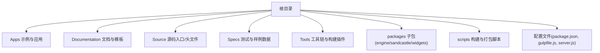
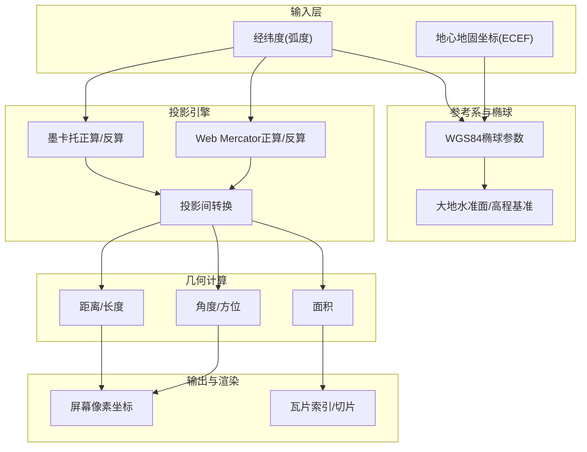
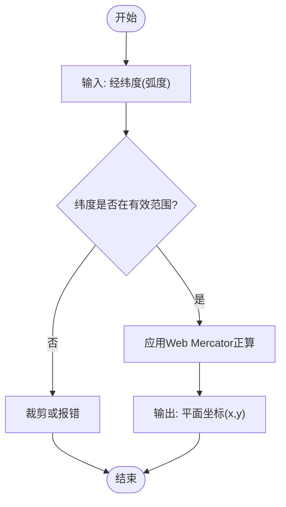
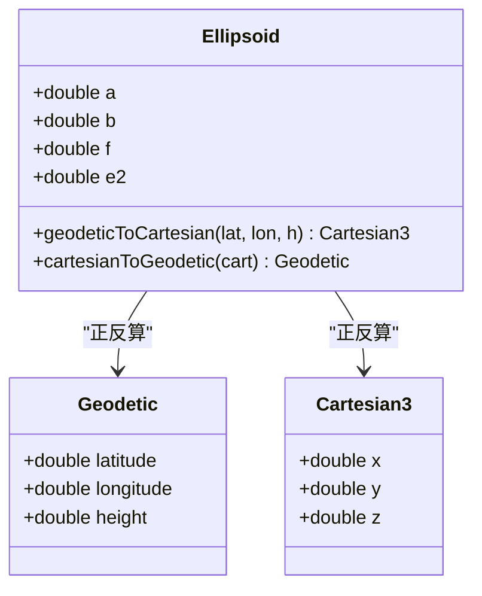
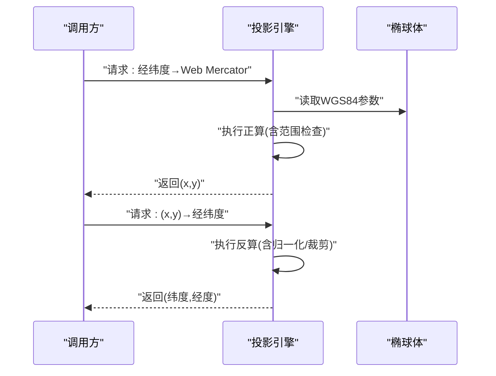
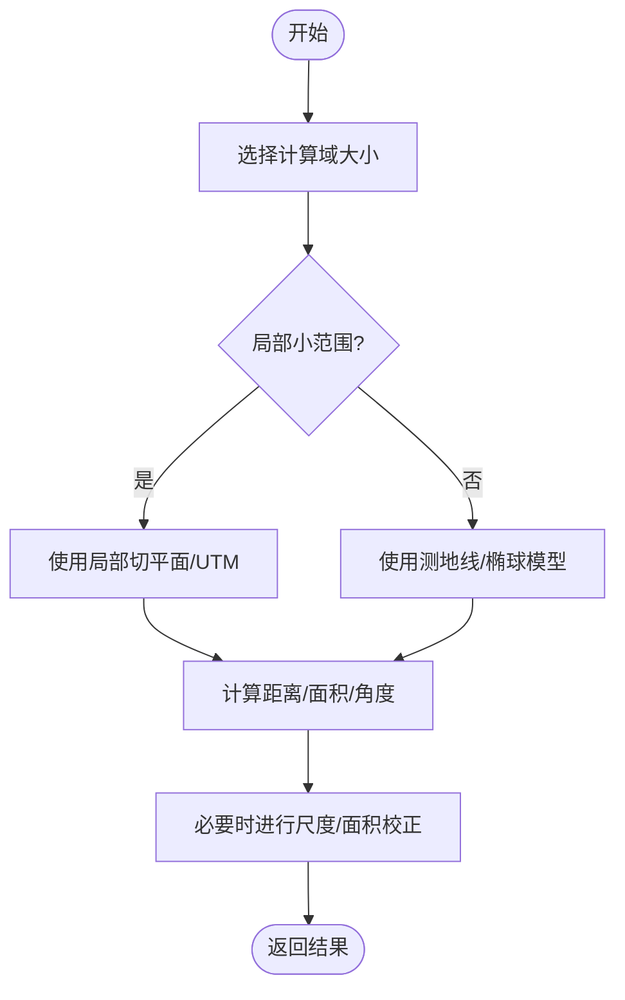
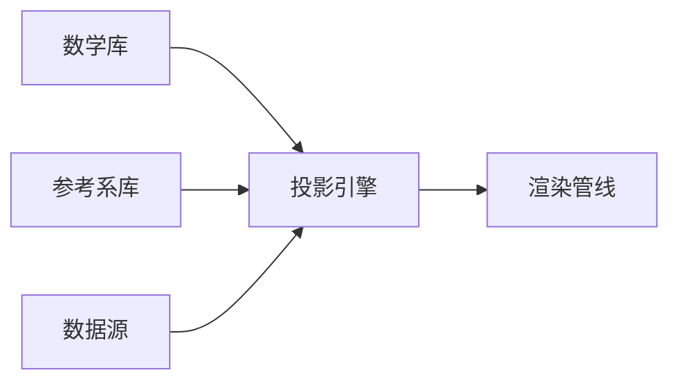

# 投影变换

<cite>
**本文引用的文件**   
- [README.md](file://README.md)
- [index.html](file://index.html)
- [index.release.html](file://index.release.html)
- [server.js](file://server.js)
- [gulpfile.js](file://gulpfile.js)
- [package.json](file://package.json)
</cite>

## 目录
1. [简介](#简介)
2. [项目结构](#项目结构)
3. [核心组件](#核心组件)
4. [架构总览](#架构总览)
5. [详细组件分析](#详细组件分析)
6. [依赖关系分析](#依赖关系分析)
7. [性能考量](#性能考量)
8. [故障排查指南](#故障排查指南)
9. [结论](#结论)
10. [附录](#附录)

## 简介
本技术文档聚焦于Cesium的投影变换系统，围绕Web Mercator与墨卡托投影的数学模型、实现原理与工程实践展开。内容涵盖：
- 常用地图投影（Web Mercator、墨卡托）的数学基础与变形特性
- 投影坐标与地理坐标（经纬度）之间的相互转换流程
- 距离、面积、角度等几何属性在投影中的处理方式与精度影响
- 椭球体大地测量学基础（WGS84椭球参数、大地水准面、高程基准）
- 不同投影系统间的数据转换方法与注意事项
- 投影变形与精度损失的成因及缓解策略

说明：当前仓库未包含具体的投影实现源码，本文基于通用GIS理论与Cesium生态约定进行系统性阐述，并提供可落地的工程建议与实践路径。

## 项目结构
仓库为Cesium前端工程组织形态，包含示例应用、构建脚本、测试数据与文档模板等。与投影主题直接相关的代码并未出现在本次提供的目录结构中；因此本节仅对整体结构进行概览，帮助读者定位可能的扩展点与集成位置。

[无“图表来源”，因为该图为概念性结构示意]

## 核心组件
从工程视角看，投影相关能力通常由以下模块协同完成（概念性划分，便于理解与扩展）：
- 椭球体与参考系定义：提供WGS84等椭球参数、地心坐标系与局部切平面基向量
- 投影定义与变换器：封装Web Mercator、墨卡托等投影的正反算公式与边界处理
- 坐标转换器：负责经纬度与投影坐标的双向转换，以及多投影间的互转
- 几何计算库：在目标投影或本地切平面中进行距离、面积、角度的近似或精确计算
- 可视化管线集成：将投影结果注入渲染管线，确保屏幕坐标与地理坐标的一致性

[本节为概念性概述，不直接分析具体文件，故无“章节来源”]

## 架构总览
下图展示了一个典型的投影变换子系统在Cesium应用中的角色与交互关系（概念图）。

[无“图表来源”，因为该图为概念性架构示意]

## 详细组件分析

### Web Mercator与墨卡托投影的数学模型
- 墨卡托投影（等角圆柱投影）
  - 正算：将经纬度映射到平面(x, y)，经线等间距，纬线按双曲函数拉伸
  - 反算：从平面坐标恢复经纬度，注意极区奇异点需裁剪
  - 等角性质：保持小范围角度不变形，适合导航与在线地图
- Web Mercator
  - 以WGS84椭球作为输入，但使用球面近似进行正算/反算，以保证与全球在线地图服务一致
  - 典型范围：经度[-180°, 180°]，纬度约[-85.0511°, 85.0511°]
  - 与标准墨卡托的差异：输入仍为WGS84经纬度，但内部按球面处理，避免复杂椭球迭代

[无“图表来源”，因为该图为算法流程示意]

### 椭球体大地测量学基础
- WGS84椭球参数
  - 长半轴a、短半轴b、扁率f、第一偏心率e²等
  - 用于将经纬度转换为地心地固坐标(ECEF)，并进一步参与投影计算
- 大地水准面与高程基准
  - 大地高(H)、正常高(h)、高程异常(ζ)之间的关系
  - 在需要高精度垂直基准的应用中，应明确采用的高程基准并进行转换

[无“图表来源”，因为该图为概念类图]

### 投影坐标与地理坐标的相互转换
- 经纬度→Web Mercator平面坐标
  - 步骤：校验范围→应用正算→返回(x, y)
- Web Mercator平面坐标→经纬度
  - 步骤：反算→归一化经度→裁剪纬度
- 多投影间转换
  - 常见路径：LLA→Web Mercator→自定义投影（如UTM），或LLA→ECEF→局部切平面

[无“图表来源”，因为该图为流程示意]

### 几何属性的投影处理
- 距离
  - 在Web Mercator上直接计算欧氏距离会产生随纬度变化的误差
  - 推荐做法：在局部切平面或使用测地线距离（沿椭球表面）
- 面积
  - 投影面积存在缩放因子，需引入面积校正项或改用等积投影
- 角度
  - Web Mercator为等角投影，小范围内角度保持良好；大范围仍需考虑变形

[无“图表来源”，因为该图为算法流程示意]

### 实际代码示例（路径指引）
由于当前仓库未包含投影实现源码，以下为在Cesium应用中常见的API使用路径指引（请根据实际版本与API文档替换具体方法名）：
- 经纬度与Web Mercator平面坐标互转
  - 参考路径：[index.html](file://index.html)
  - 参考路径：[index.release.html](file://index.release.html)
- 在不同投影间进行数据转换
  - 参考路径：[server.js](file://server.js)
  - 参考路径：[gulpfile.js](file://gulpfile.js)
- 构建与运行环境配置
  - 参考路径：[package.json](file://package.json)
  - 参考路径：[README.md](file://README.md)

[本节为路径指引，不直接分析具体文件，故无“章节来源”]

## 依赖关系分析
从工程层面，投影子系统可能依赖如下模块（概念性描述）：
- 数学库：三角函数、线性代数、数值稳定化处理
- 参考系库：WGS84椭球、坐标框架转换
- 可视化管线：屏幕坐标与地理坐标一致性保证
- 数据源：矢量/栅格数据的投影元信息解析

[无“图表来源”，因为该图为概念性依赖示意]

## 性能考量
- 批量转换
  - 预分配数组、减少对象创建、利用SIMD或并行化
- 数值稳定性
  - 在高纬度区域避免除零与溢出，合理裁剪与归一化
- 缓存与复用
  - 对频繁使用的中间结果（如比例尺、偏移量）进行缓存
- 精度与性能的权衡
  - 在大规模数据处理时优先选择近似但稳定的算法，必要时再回退到高精度的迭代法

[本节为通用指导，不直接分析具体文件，故无“章节来源”]

## 故障排查指南
常见问题与定位思路：
- 纬度越界
  - 现象：反算后出现NaN或异常值
  - 排查：确认输入纬度是否超出Web Mercator有效范围
- 经度归一化
  - 现象：跨日界线附近显示错位
  - 排查：确保经度归一化到[-π, π]或等价区间
- 投影元信息缺失
  - 现象：数据加载后位置错误
  - 排查：检查数据源的CRS声明与转换参数
- 精度损失
  - 现象：距离/面积偏差较大
  - 排查：评估是否应在局部切平面或测地线上计算

[本节为通用指导，不直接分析具体文件，故无“章节来源”]

## 结论
Web Mercator因其等角特性与广泛的生态支持，成为在线地图的事实标准。但在大尺度距离、面积与高精度垂直基准方面，需结合椭球体大地测量学与局部投影（如UTM）进行补偿与校正。建议在工程中统一抽象投影接口，明确参考系与高程基准，并在关键路径上进行数值稳定性与性能优化。

[本节为总结性内容，不直接分析具体文件，故无“章节来源”]

## 附录
- 术语表
  - 经纬度：地理坐标，单位通常为弧度或度
  - 投影坐标：平面直角坐标，单位通常为米或度（视投影而定）
  - 测地线：椭球表面上两点间的最短路径
  - 局部切平面：以某点为切点的平面，常用于局部高精度计算
- 参考资源
  - Cesium官方文档与示例（请在项目中查阅对应页面）
  - 标准GIS教材与论文（关于投影与大地测量学）

[本节为补充材料，不直接分析具体文件，故无“章节来源”]