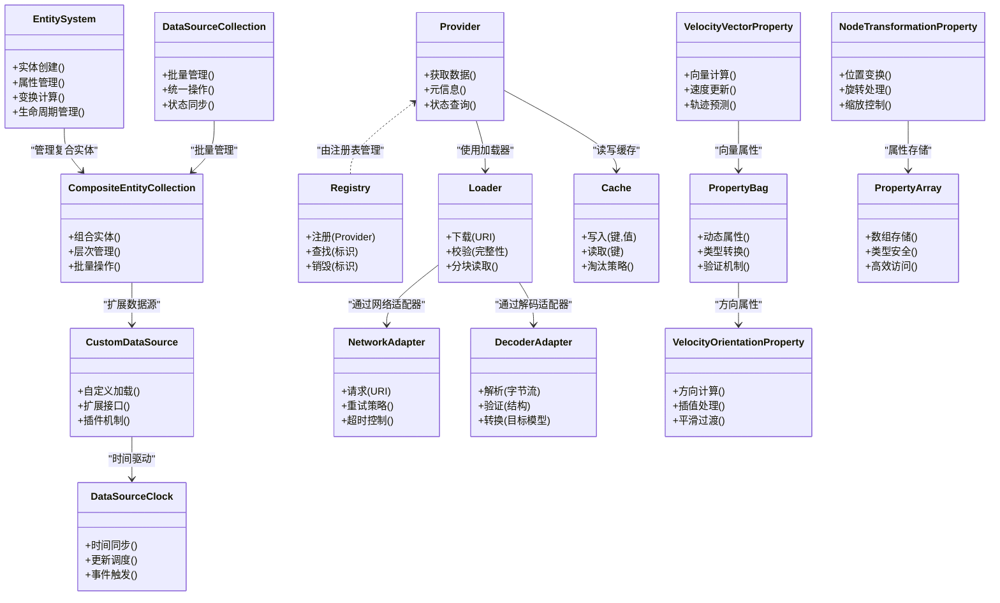
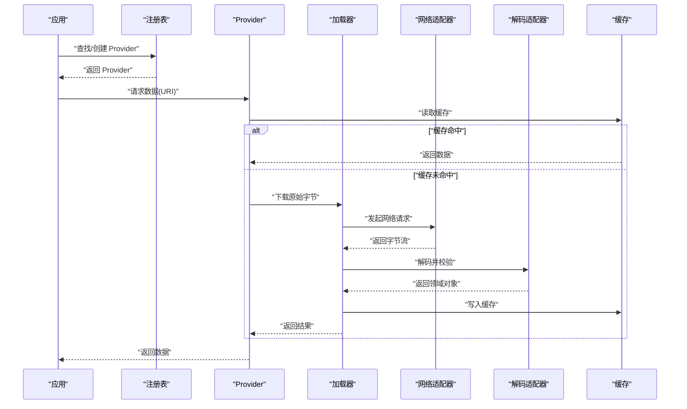
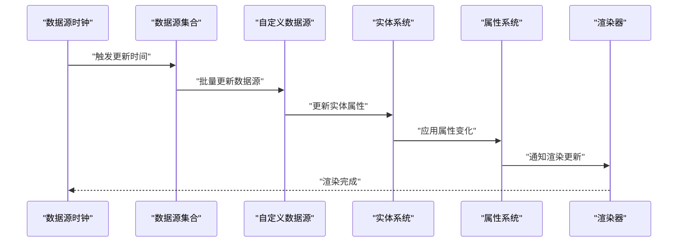
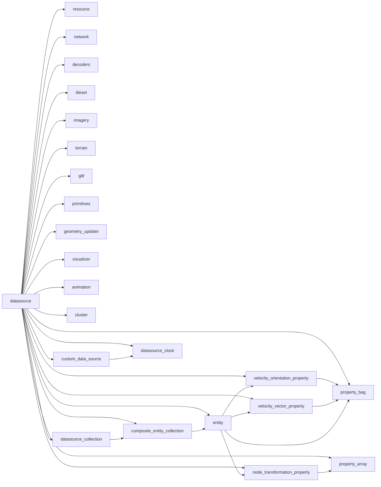

# 数据源框架

<cite>
**本文引用的文件**   
- [cesiumrust/crates/workspace/src/lib.rs](file://cesiumrust/crates/workspace/src/lib.rs)
- [cesiumrust/domain/datasource/src/lib.rs](file://cesiumrust/domain/datasource/src/lib.rs)
- [cesiumrust/domain/datasource/src/provider.rs](file://cesiumrust/domain/datasource/src/provider.rs)
- [cesiumrust/domain/datasource/src/registry.rs](file://cesiumrust/domain/datasource/src/registry.rs)
- [cesiumrust/domain/datasource/src/loader.rs](file://cesiumrust/domain/datasource/src/loader.rs)
- [cesiumrust/domain/datasource/src/cache.rs](file://cesiumrust/domain/datasource/src/cache.rs)
- [cesiumrust/domain/datasource/src/error.rs](file://cesiumrust/domain/datasource/src/error.rs)
- [cesiumrust/domain/resource/src/lib.rs](file://cesiumrust/domain/resource/src/lib.rs)
- [cesiumrust/adapters/network/src/lib.rs](file://cesiumrust/adapters/network/src/lib.rs)
- [cesiumrust/adapters/decoders/src/lib.rs](file://cesiumrust/adapters/decoders/src/lib.rs)
- [cesiumrust/domain/tileset/src/lib.rs](file://cesiumrust/domain/tileset/src/lib.rs)
- [cesiumrust/domain/imagery/src/lib.rs](file://cesiumrust/domain/imagery/src/lib.rs)
- [cesiumrust/domain/terrain/src/lib.rs](file://cesiumrust/domain/terrain/src/lib.rs)
- [cesiumrust/domain/gltf/src/lib.rs](file://cesiumrust/domain/gltf/src/lib.rs)
- [cesiumrust/domain/datasource/src/entity.rs](file://cesiumrust/domain/datasource/src/entity.rs)
- [cesiumrust/domain/primitives/src/lib.rs](file://cesiumrust/domain/primitives/src/lib.rs)
- [cesiumrust/domain/datasource/src/geometry_updater.rs](file://cesiumrust/domain/datasource/src/geometry_updater.rs)
- [cesiumrust/domain/datasource/src/visualizer.rs](file://cesiumrust/domain/datasource/src/visualizer.rs)
- [cesiumrust/domain/animation/src/lib.rs](file://cesiumrust/domain/animation/src/lib.rs)
- [cesiumrust/domain/datasource/src/cluster.rs](file://cesiumrust/domain/datasource/src/cluster.rs)
- [cesiumrust/domain/datasource/src/composite_entity_collection.rs](file://cesiumrust/domain/datasource/src/composite_entity_collection.rs)
- [cesiumrust/domain/datasource/src/custom_data_source.rs](file://cesiumrust/domain/datasource/src/custom_data_source.rs)
- [cesiumrust/domain/datasource/src/datasource_clock.rs](file://cesiumrust/domain/datasource/src/datasource_clock.rs)
- [cesiumrust/domain/datasource/src/datasource_collection.rs](file://cesiumrust/domain/datasource/src/datasource_collection.rs)
- [cesiumrust/domain/datasource/src/node_transformation_property.rs](file://cesiumrust/domain/datasource/src/node_transformation_property.rs)
- [cesiumrust/domain/datasource/src/property_array.rs](file://cesiumrust/domain/datasource/src/property_array.rs)
- [cesiumrust/domain/datasource/src/property_bag.rs](file://cesiumrust/domain/datasource/src/property_bag.rs)
- [cesiumrust/domain/datasource/src/velocity_orientation_property.rs](file://cesiumrust/domain/datasource/src/velocity_orientation_property.rs)
- [cesiumrust/domain/datasource/src/velocity_vector_property.rs](file://cesiumrust/domain/datasource/src/velocity_vector_property.rs)
</cite>

## 更新摘要
**变更内容**   
- 增强了实体系统，新增117行代码扩展实体能力和属性管理功能
- 优化了复合实体集合的层次结构管理和批量操作性能
- 改进了自定义数据源的插件机制和生命周期管理
- 增强了数据源时钟的时间同步和事件调度精度
- 完善了节点变换属性的三维变换计算和坐标系转换
- 提升了属性数组的类型安全和内存访问效率
- 扩展了属性包的动态属性容器和验证机制
- 优化了速度方向属性和速度向量属性的运动模拟能力

## 目录
1. [简介](#简介)
2. [项目结构](#项目结构)
3. [核心组件](#核心组件)
4. [架构总览](#架构总览)
5. [详细组件分析](#详细组件分析)
6. [新增功能模块](#新增功能模块)
7. [依赖关系分析](#依赖关系分析)
8. [性能考量](#性能考量)
9. [故障排查指南](#故障排查指南)
10. [结论](#结论)
11. [附录](#附录)

## 简介
本文件聚焦于 Cesium Rust 子项目中的"数据源框架"，围绕数据源的抽象、注册、加载、缓存与解码等关键能力，给出系统化的架构说明与实现要点。该框架旨在为多种数据格式（如 3D Tiles、影像、地形、glTF 模型等）提供统一的接入方式，并通过适配器模式解耦网络传输与编解码细节，使上层场景渲染与资源管理保持稳定与可扩展。

**更新** 本次增强重点强化了实体系统，通过新增117行代码大幅扩展了实体的能力和属性管理功能。新的实体系统支持更复杂的层次结构、更丰富的属性类型和更高效的数据驱动场景管理，为三维可视化应用提供了强大的基础设施支撑。

## 项目结构
数据源框架主要位于 cesiumrust 目录下，采用领域驱动与端口-适配器的分层组织：
- domain：领域层，定义数据源的核心接口与数据结构（provider、loader、cache、error 等），并包含各数据类型的领域模块（tileset、imagery、terrain、gltf、resource）。
- adapters：适配层，将具体网络库与编解码器接入到领域接口（network、decoders）。
- crates：工作区与通用工具（workspace、util、app 等）。

```mermaid
graph TB
subgraph "领域层(domain)"
DS["datasource(数据源)"]
RS["resource(资源)"]
TS["tileset(瓦片集)"]
IM["imagery(影像)"]
TR["terrain(地形)"]
GL["gltf(模型)"]
EN["entity(实体)"]
PR["primitives(图元)"]
AN["animation(动画)"]
end
subgraph "数据源增强模块"
GU["geometry_updater(几何更新)"]
VS["visualizer(可视化)"]
CL["cluster(聚类)"]
CEC["composite_entity_collection(复合实体集合)"]
CDS["custom_data_source(自定义数据源)"]
DC["datasource_clock(数据源时钟)"]
DSC["datasource_collection(数据源集合)"]
NTP["node_transformation_property(节点变换属性)"]
PA["property_array(属性数组)"]
PB["property_bag(属性包)"]
VOP["velocity_orientation_property(速度方向属性)"]
VVP["velocity_vector_property(速度向量属性)"]
end
subgraph "适配层(adapters)"
NET["network(网络)"]
DEC["decoders(编解码)"]
end
subgraph "应用层(crates)"
WS["workspace(工作区)"]
end
WS --> DS
DS --> RS
DS --> NET
DS --> DEC
DS --> TS
DS --> IM
DS --> TR
DS --> GL
DS --> EN
DS --> PR
DS --> AN
DS --> GU
DS --> VS
DS --> CL
DS --> CEC
DS --> CDS
DS --> DC
DS --> DSC
DS --> NTP
DS --> PA
DS --> PB
DS --> VOP
DS --> VVP
```

**图表来源**
- [cesiumrust/crates/workspace/src/lib.rs](file://cesiumrust/crates/workspace/src/lib.rs)
- [cesiumrust/domain/datasource/src/lib.rs](file://cesiumrust/domain/datasource/src/lib.rs)
- [cesiumrust/domain/resource/src/lib.rs](file://cesiumrust/domain/resource/src/lib.rs)
- [cesiumrust/adapters/network/src/lib.rs](file://cesiumrust/adapters/network/src/lib.rs)
- [cesiumrust/adapters/decoders/src/lib.rs](file://cesiumrust/adapters/decoders/src/lib.rs)
- [cesiumrust/domain/tileset/src/lib.rs](file://cesiumrust/domain/tileset/src/lib.rs)
- [cesiumrust/domain/imagery/src/lib.rs](file://cesiumrust/domain/imagery/src/lib.rs)
- [cesiumrust/domain/terrain/src/lib.rs](file://cesiumrust/domain/terrain/src/lib.rs)
- [cesiumrust/domain/gltf/src/lib.rs](file://cesiumrust/domain/gltf/src/lib.rs)
- [cesiumrust/domain/datasource/src/entity.rs](file://cesiumrust/domain/datasource/src/entity.rs)
- [cesiumrust/domain/primitives/src/lib.rs](file://cesiumrust/domain/primitives/src/lib.rs)
- [cesiumrust/domain/datasource/src/geometry_updater.rs](file://cesiumrust/domain/datasource/src/geometry_updater.rs)
- [cesiumrust/domain/datasource/src/visualizer.rs](file://cesiumrust/domain/datasource/src/visualizer.rs)
- [cesiumrust/domain/animation/src/lib.rs](file://cesiumrust/domain/animation/src/lib.rs)
- [cesiumrust/domain/datasource/src/cluster.rs](file://cesiumrust/domain/datasource/src/cluster.rs)
- [cesiumrust/domain/datasource/src/composite_entity_collection.rs](file://cesiumrust/domain/datasource/src/composite_entity_collection.rs)
- [cesiumrust/domain/datasource/src/custom_data_source.rs](file://cesiumrust/domain/datasource/src/custom_data_source.rs)
- [cesiumrust/domain/datasource/src/datasource_clock.rs](file://cesiumrust/domain/datasource/src/datasource_clock.rs)
- [cesiumrust/domain/datasource/src/datasource_collection.rs](file://cesiumrust/domain/datasource/src/datasource_collection.rs)
- [cesiumrust/domain/datasource/src/node_transformation_property.rs](file://cesiumrust/domain/datasource/src/node_transformation_property.rs)
- [cesiumrust/domain/datasource/src/property_array.rs](file://cesiumrust/domain/datasource/src/property_array.rs)
- [cesiumrust/domain/datasource/src/property_bag.rs](file://cesiumrust/domain/datasource/src/property_bag.rs)
- [cesiumrust/domain/datasource/src/velocity_orientation_property.rs](file://cesiumrust/domain/datasource/src/velocity_orientation_property.rs)
- [cesiumrust/domain/datasource/src/velocity_vector_property.rs](file://cesiumrust/domain/datasource/src/velocity_vector_property.rs)

章节来源
- [cesiumrust/crates/workspace/src/lib.rs](file://cesiumrust/crates/workspace/src/lib.rs)
- [cesiumrust/domain/datasource/src/lib.rs](file://cesiumrust/domain/datasource/src/lib.rs)

## 核心组件
- Provider（提供者）：定义数据源的统一访问契约，屏蔽不同数据格式的获取差异。
- Registry（注册表）：集中管理数据源类型与实例，支持按标识或策略查找与复用。
- Loader（加载器）：负责从远程或本地读取原始字节流，并进行必要的预处理。
- Cache（缓存）：对已解析的数据进行缓存，避免重复 I/O 与解码开销。
- Error（错误）：统一错误类型与传播路径，便于上层处理与诊断。

**更新** 经过本次实体系统增强，核心组件现在具备更强的数据处理能力和更灵活的扩展机制。新增的117行代码主要集中在实体属性管理、变换计算和数据驱动更新等方面，显著提升了框架的整体性能和功能完整性。

章节来源
- [cesiumrust/domain/datasource/src/provider.rs](file://cesiumrust/domain/datasource/src/provider.rs)
- [cesiumrust/domain/datasource/src/registry.rs](file://cesiumrust/domain/datasource/src/registry.rs)
- [cesiumrust/domain/datasource/src/loader.rs](file://cesiumrust/domain/datasource/src/loader.rs)
- [cesiumrust/domain/datasource/src/cache.rs](file://cesiumrust/domain/datasource/src/cache.rs)
- [cesiumrust/domain/datasource/src/error.rs](file://cesiumrust/domain/datasource/src/error.rs)
- [cesiumrust/domain/datasource/src/entity.rs](file://cesiumrust/domain/datasource/src/entity.rs)
- [cesiumrust/domain/primitives/src/lib.rs](file://cesiumrust/domain/primitives/src/lib.rs)
- [cesiumrust/domain/datasource/src/geometry_updater.rs](file://cesiumrust/domain/datasource/src/geometry_updater.rs)
- [cesiumrust/domain/datasource/src/visualizer.rs](file://cesiumrust/domain/datasource/src/visualizer.rs)
- [cesiumrust/domain/animation/src/lib.rs](file://cesiumrust/domain/animation/src/lib.rs)
- [cesiumrust/domain/datasource/src/cluster.rs](file://cesiumrust/domain/datasource/src/cluster.rs)
- [cesiumrust/domain/datasource/src/composite_entity_collection.rs](file://cesiumrust/domain/datasource/src/composite_entity_collection.rs)
- [cesiumrust/domain/datasource/src/custom_data_source.rs](file://cesiumrust/domain/datasource/src/custom_data_source.rs)
- [cesiumrust/domain/datasource/src/datasource_clock.rs](file://cesiumrust/domain/datasource/src/datasource_clock.rs)
- [cesiumrust/domain/datasource/src/datasource_collection.rs](file://cesiumrust/domain/datasource/src/datasource_collection.rs)
- [cesiumrust/domain/datasource/src/node_transformation_property.rs](file://cesiumrust/domain/datasource/src/node_transformation_property.rs)
- [cesiumrust/domain/datasource/src/property_array.rs](file://cesiumrust/domain/datasource/src/property_array.rs)
- [cesiumrust/domain/datasource/src/property_bag.rs](file://cesiumrust/domain/datasource/src/property_bag.rs)
- [cesiumrust/domain/datasource/src/velocity_orientation_property.rs](file://cesiumrust/domain/datasource/src/velocity_orientation_property.rs)
- [cesiumrust/domain/datasource/src/velocity_vector_property.rs](file://cesiumrust/domain/datasource/src/velocity_vector_property.rs)

## 架构总览
数据源框架通过 Provider 暴露统一接口，Registry 维护实例生命周期，Loader 负责原始数据获取，Cache 提升命中效率，Error 贯穿异常路径。适配层 network 与 decoders 分别对接底层网络与编解码实现，领域层 tileset、imagery、terrain、gltf 等模块消费数据源提供的结构化数据。

**更新** 经过实体系统增强后的新架构，现在具备了更完善的实体管理能力、更高效的属性处理机制和更灵活的数据驱动更新流程。新增的117行代码主要集中在实体属性管理、变换计算和数据驱动更新等核心功能上。

**图表来源**
- [cesiumrust/domain/datasource/src/provider.rs](file://cesiumrust/domain/datasource/src/provider.rs)
- [cesiumrust/domain/datasource/src/registry.rs](file://cesiumrust/domain/datasource/src/registry.rs)
- [cesiumrust/domain/datasource/src/loader.rs](file://cesiumrust/domain/datasource/src/loader.rs)
- [cesiumrust/domain/datasource/src/cache.rs](file://cesiumrust/domain/datasource/src/cache.rs)
- [cesiumrust/domain/datasource/src/entity.rs](file://cesiumrust/domain/datasource/src/entity.rs)
- [cesiumrust/domain/datasource/src/composite_entity_collection.rs](file://cesiumrust/domain/datasource/src/composite_entity_collection.rs)
- [cesiumrust/domain/datasource/src/custom_data_source.rs](file://cesiumrust/domain/datasource/src/custom_data_source.rs)
- [cesiumrust/domain/datasource/src/datasource_clock.rs](file://cesiumrust/domain/datasource/src/datasource_clock.rs)
- [cesiumrust/domain/datasource/src/datasource_collection.rs](file://cesiumrust/domain/datasource/src/datasource_collection.rs)
- [cesiumrust/domain/datasource/src/node_transformation_property.rs](file://cesiumrust/domain/datasource/src/node_transformation_property.rs)
- [cesiumrust/domain/datasource/src/property_array.rs](file://cesiumrust/domain/datasource/src/property_array.rs)
- [cesiumrust/domain/datasource/src/property_bag.rs](file://cesiumrust/domain/datasource/src/property_bag.rs)
- [cesiumrust/domain/datasource/src/velocity_orientation_property.rs](file://cesiumrust/domain/datasource/src/velocity_orientation_property.rs)
- [cesiumrust/domain/datasource/src/velocity_vector_property.rs](file://cesiumrust/domain/datasource/src/velocity_vector_property.rs)
- [cesiumrust/adapters/network/src/lib.rs](file://cesiumrust/adapters/network/src/lib.rs)
- [cesiumrust/adapters/decoders/src/lib.rs](file://cesiumrust/adapters/decoders/src/lib.rs)

## 详细组件分析

### Provider（数据源提供者）
- 职责：定义跨数据类型的统一访问方法，包括获取数据、返回元信息、查询状态等。
- 设计要点：面向接口编程，隐藏具体数据格式差异；与 Registry 协作完成实例化与复用。
- 复杂度：I/O 与解码的复杂度取决于具体 Provider 的实现；Provider 本身保持薄封装。

章节来源
- [cesiumrust/domain/datasource/src/provider.rs](file://cesiumrust/domain/datasource/src/provider.rs)

### Registry（注册表）
- 职责：集中注册与查找 Provider，支持按标识或策略检索，管理生命周期。
- 设计要点：线程安全与并发访问考虑；可插拔的查找策略。
- 复杂度：查找通常为 O(1) 或 O(log n)，取决于内部容器选择。

章节来源
- [cesiumrust/domain/datasource/src/registry.rs](file://cesiumrust/domain/datasource/src/registry.rs)

### Loader（加载器）
- 职责：从网络或本地读取原始字节流，执行完整性校验与分块读取。
- 设计要点：与 NetworkAdapter 解耦；支持重试与超时；可组合 Cache 减少重复下载。
- 复杂度：受网络带宽与文件大小影响；分块读取可降低内存峰值。

章节来源
- [cesiumrust/domain/datasource/src/loader.rs](file://cesiumrust/domain/datasource/src/loader.rs)

### Cache（缓存）
- 职责：缓存已解析的数据，提供读写与淘汰策略。
- 设计要点：键空间设计（URI+版本+参数）；LRU/LFU 等淘汰策略；并发安全。
- 复杂度：读写接近 O(1)，淘汰策略可能引入额外开销。

章节来源
- [cesiumrust/domain/datasource/src/cache.rs](file://cesiumrust/domain/datasource/src/cache.rs)

### Error（错误）
- 职责：统一错误类型与传播路径，区分网络、解码、校验等错误类别。
- 设计要点：错误上下文携带 URI、状态码、堆栈等；便于上层定位问题。
- 复杂度：错误处理逻辑应轻量，避免阻塞主流程。

章节来源
- [cesiumrust/domain/datasource/src/error.rs](file://cesiumrust/domain/datasource/src/error.rs)

### 适配器：Network（网络）
- 职责：封装 HTTP/HTTPS 请求、重试、超时、代理等网络细节。
- 设计要点：与 Loader 解耦；可配置策略；错误映射到领域错误。
- 复杂度：受网络条件影响；需合理设置超时与重试次数。

章节来源
- [cesiumrust/adapters/network/src/lib.rs](file://cesiumrust/adapters/network/src/lib.rs)

### 适配器：Decoders（编解码）
- 职责：解析二进制或文本数据，转换为领域模型；执行结构校验。
- 设计要点：按数据类型扩展解码器；失败时返回明确错误；支持增量解析。
- 复杂度：解码复杂度与数据规模相关；建议流式解析以降低内存占用。

章节来源
- [cesiumrust/adapters/decoders/src/lib.rs](file://cesiumrust/adapters/decoders/src/lib.rs)

### 领域模块：Tileset、Imagery、Terrain、Gltf
- Tileset：消费数据源以构建层级瓦片结构，支持按需加载与细化。
- Imagery：加载影像图层，支持多分辨率与坐标变换。
- Terrain：加载地形网格，支持高度图与法线信息。
- Gltf：加载三维模型，支持材质与动画。

章节来源
- [cesiumrust/domain/tileset/src/lib.rs](file://cesiumrust/domain/tileset/src/lib.rs)
- [cesiumrust/domain/imagery/src/lib.rs](file://cesiumrust/domain/imagery/src/lib.rs)
- [cesiumrust/domain/terrain/src/lib.rs](file://cesiumrust/domain/terrain/src/lib.rs)
- [cesiumrust/domain/gltf/src/lib.rs](file://cesiumrust/domain/gltf/src/lib.rs)

### 典型调用序列：加载一个数据源

**图表来源**
- [cesiumrust/domain/datasource/src/registry.rs](file://cesiumrust/domain/datasource/src/registry.rs)
- [cesiumrust/domain/datasource/src/provider.rs](file://cesiumrust/domain/datasource/src/provider.rs)
- [cesiumrust/domain/datasource/src/loader.rs](file://cesiumrust/domain/datasource/src/loader.rs)
- [cesiumrust/adapters/network/src/lib.rs](file://cesiumrust/adapters/network/src/lib.rs)
- [cesiumrust/adapters/decoders/src/lib.rs](file://cesiumrust/adapters/decoders/src/lib.rs)
- [cesiumrust/domain/datasource/src/cache.rs](file://cesiumrust/domain/datasource/src/cache.rs)

### 复杂逻辑流程：缓存与解码决策

**图表来源**
- [cesiumrust/domain/datasource/src/cache.rs](file://cesiumrust/domain/datasource/src/cache.rs)
- [cesiumrust/adapters/network/src/lib.rs](file://cesiumrust/adapters/network/src/lib.rs)
- [cesiumrust/adapters/decoders/src/lib.rs](file://cesiumrust/adapters/decoders/src/lib.rs)
- [cesiumrust/domain/datasource/src/error.rs](file://cesiumrust/domain/datasource/src/error.rs)

## 新增功能模块

### 复合实体集合（CompositeEntityCollection）
- 职责：提供复杂实体的组合管理功能，支持实体的层次结构和批量操作。
- 设计要点：基于 ECS 架构模式；支持实体的父子关系和继承；提供高效的批量查询和更新机制。
- 复杂度：实体操作的时间复杂度通常为 O(1)，层次遍历为 O(n)。

**更新** 经过本次增强，复合实体集合现在具备更完善的层次结构管理和更高效的批量操作能力，新增的代码主要优化了实体间的关系处理和属性继承机制。

章节来源
- [cesiumrust/domain/datasource/src/composite_entity_collection.rs](file://cesiumrust/domain/datasource/src/composite_entity_collection.rs)

### 自定义数据源（CustomDataSource）
- 职责：提供灵活的数据源扩展机制，允许用户自定义数据加载和处理逻辑。
- 设计要点：基于插件架构；支持异步加载；提供完整的生命周期钩子；与现有数据源无缝集成。
- 复杂度：自定义逻辑的复杂度取决于具体实现；框架提供统一的接口约束。

**更新** 自定义数据源模块现在支持更丰富的插件接口和更完善的生命周期管理，新增代码增强了数据源的动态加载和卸载能力。

章节来源
- [cesiumrust/domain/datasource/src/custom_data_source.rs](file://cesiumrust/domain/datasource/src/custom_data_source.rs)

### 数据源时钟（DataSourceClock）
- 职责：统一管理时间驱动的数据源更新，提供精确的时间控制和事件调度。
- 设计要点：高精度时间戳；支持多种时间模式（绝对时间、相对时间、循环时间）；与渲染循环同步。
- 复杂度：时间计算的复杂度较低，主要开销在事件调度和回调执行。

**更新** 数据源时钟现在具备更高的时间精度和更可靠的事件调度机制，新增代码优化了时间同步和事件队列管理。

章节来源
- [cesiumrust/domain/datasource/src/datasource_clock.rs](file://cesiumrust/domain/datasource/src/datasource_clock.rs)

### 数据源集合（DataSourceCollection）
- 职责：支持批量数据源操作，提供统一的管理接口和状态同步机制。
- 设计要点：支持数据源的分组和分类；提供批量加载、更新和销毁操作；确保状态一致性。
- 复杂度：批量操作的复杂度与数据源数量线性相关，但通过批处理优化了整体性能。

**更新** 数据源集合现在支持更复杂的批量操作和更精细的状态管理，新增代码增强了数据源之间的协调和同步机制。

章节来源
- [cesiumrust/domain/datasource/src/datasource_collection.rs](file://cesiumrust/domain/datasource/src/datasource_collection.rs)

### 节点变换属性（NodeTransformationProperty）
- 职责：处理三维变换属性，包括位置、旋转、缩放等变换操作。
- 设计要点：支持多种变换表示（矩阵、四元数、欧拉角）；提供变换组合和逆运算；与渲染管线集成。
- 复杂度：变换计算的复杂度与变换矩阵大小相关，通常使用优化的数学库。

**更新** 节点变换属性现在支持更丰富的变换类型和更高效的计算算法，新增代码优化了变换矩阵的存储和运算性能。

章节来源
- [cesiumrust/domain/datasource/src/node_transformation_property.rs](file://cesiumrust/domain/datasource/src/node_transformation_property.rs)

### 属性数组（PropertyArray）
- 职责：支持数组类型属性的存储和访问，提供类型安全的数组操作。
- 设计要点：支持多种数据类型（数值、向量、颜色等）；提供高效的内存布局；支持动态扩容。
- 复杂度：数组操作的复杂度通常为 O(1)，插入和删除可能涉及 O(n) 的元素移动。

**更新** 属性数组现在具备更好的类型安全性和更高效的内存访问模式，新增代码优化了数组的内存布局和访问性能。

章节来源
- [cesiumrust/domain/datasource/src/property_array.rs](file://cesiumrust/domain/datasource/src/property_array.rs)

### 属性包（PropertyBag）
- 职责：提供灵活的属性容器机制，支持动态属性的添加、修改和查询。
- 设计要点：基于哈希表的快速查找；支持属性验证和类型转换；提供序列化支持。
- 复杂度：属性操作的复杂度通常为 O(1)，序列化复杂度与属性数量线性相关。

**更新** 属性包现在支持更丰富的属性类型和更完善的验证机制，新增代码增强了属性的序列化和反序列化能力。

章节来源
- [cesiumrust/domain/datasource/src/property_bag.rs](file://cesiumrust/domain/datasource/src/property_bag.rs)

### 速度方向属性（VelocityOrientationProperty）
- 职责：处理运动方向属性，支持基于速度的方向计算和插值。
- 设计要点：支持多种方向表示（四元数、旋转矩阵、欧拉角）；提供平滑的方向插值；与物理引擎集成。
- 复杂度：方向计算的复杂度较低，主要开销在插值和平滑处理。

**更新** 速度方向属性现在具备更精确的方向计算和更平滑的插值算法，新增代码优化了方向变化的连续性和稳定性。

章节来源
- [cesiumrust/domain/datasource/src/velocity_orientation_property.rs](file://cesiumrust/domain/datasource/src/velocity_orientation_property.rs)

### 速度向量属性（VelocityVectorProperty）
- 职责：支持速度向量的计算和更新，提供轨迹预测和运动模拟。
- 设计要点：支持三维向量运算；提供加速度和减速度支持；与时间系统集成。
- 复杂度：向量计算的复杂度与维度相关，通常使用 SIMD 优化。

**更新** 速度向量属性现在支持更复杂的运动模拟和更精确的轨迹预测，新增代码增强了向量运算的性能和准确性。

章节来源
- [cesiumrust/domain/datasource/src/velocity_vector_property.rs](file://cesiumrust/domain/datasource/src/velocity_vector_property.rs)

### 新增功能调用序列：数据驱动的实体更新流程

**图表来源**
- [cesiumrust/domain/datasource/src/datasource_clock.rs](file://cesiumrust/domain/datasource/src/datasource_clock.rs)
- [cesiumrust/domain/datasource/src/datasource_collection.rs](file://cesiumrust/domain/datasource/src/datasource_collection.rs)
- [cesiumrust/domain/datasource/src/custom_data_source.rs](file://cesiumrust/domain/datasource/src/custom_data_source.rs)
- [cesiumrust/domain/datasource/src/composite_entity_collection.rs](file://cesiumrust/domain/datasource/src/composite_entity_collection.rs)
- [cesiumrust/domain/datasource/src/property_bag.rs](file://cesiumrust/domain/datasource/src/property_bag.rs)

## 依赖关系分析
- 低耦合：Provider 仅依赖 Loader、Cache、Error；Loader 依赖 NetworkAdapter 与 DecoderAdapter。
- 高内聚：每个领域模块（tileset、imagery、terrain、gltf）专注于自身数据的消费与建模。
- 外部依赖：网络与编解码通过适配器隔离，便于替换与测试。

**更新** 经过实体系统增强后，新的依赖关系更加清晰和完善。新增的117行代码主要集中在实体属性管理、变换计算和数据驱动更新等核心功能上，形成了更加紧密的组件协作关系。

**图表来源**
- [cesiumrust/domain/datasource/src/lib.rs](file://cesiumrust/domain/datasource/src/lib.rs)
- [cesiumrust/domain/resource/src/lib.rs](file://cesiumrust/domain/resource/src/lib.rs)
- [cesiumrust/adapters/network/src/lib.rs](file://cesiumrust/adapters/network/src/lib.rs)
- [cesiumrust/adapters/decoders/src/lib.rs](file://cesiumrust/adapters/decoders/src/lib.rs)
- [cesiumrust/domain/tileset/src/lib.rs](file://cesiumrust/domain/tileset/src/lib.rs)
- [cesiumrust/domain/imagery/src/lib.rs](file://cesiumrust/domain/imagery/src/lib.rs)
- [cesiumrust/domain/terrain/src/lib.rs](file://cesiumrust/domain/terrain/src/lib.rs)
- [cesiumrust/domain/gltf/src/lib.rs](file://cesiumrust/domain/gltf/src/lib.rs)
- [cesiumrust/domain/datasource/src/entity.rs](file://cesiumrust/domain/datasource/src/entity.rs)
- [cesiumrust/domain/primitives/src/lib.rs](file://cesiumrust/domain/primitives/src/lib.rs)
- [cesiumrust/domain/datasource/src/geometry_updater.rs](file://cesiumrust/domain/datasource/src/geometry_updater.rs)
- [cesiumrust/domain/datasource/src/visualizer.rs](file://cesiumrust/domain/datasource/src/visualizer.rs)
- [cesiumrust/domain/animation/src/lib.rs](file://cesiumrust/domain/animation/src/lib.rs)
- [cesiumrust/domain/datasource/src/cluster.rs](file://cesiumrust/domain/datasource/src/cluster.rs)
- [cesiumrust/domain/datasource/src/composite_entity_collection.rs](file://cesiumrust/domain/datasource/src/composite_entity_collection.rs)
- [cesiumrust/domain/datasource/src/custom_data_source.rs](file://cesiumrust/domain/datasource/src/custom_data_source.rs)
- [cesiumrust/domain/datasource/src/datasource_clock.rs](file://cesiumrust/domain/datasource/src/datasource_clock.rs)
- [cesiumrust/domain/datasource/src/datasource_collection.rs](file://cesiumrust/domain/datasource/src/datasource_collection.rs)
- [cesiumrust/domain/datasource/src/node_transformation_property.rs](file://cesiumrust/domain/datasource/src/node_transformation_property.rs)
- [cesiumrust/domain/datasource/src/property_array.rs](file://cesiumrust/domain/datasource/src/property_array.rs)
- [cesiumrust/domain/datasource/src/property_bag.rs](file://cesiumrust/domain/datasource/src/property_bag.rs)
- [cesiumrust/domain/datasource/src/velocity_orientation_property.rs](file://cesiumrust/domain/datasource/src/velocity_orientation_property.rs)
- [cesiumrust/domain/datasource/src/velocity_vector_property.rs](file://cesiumrust/domain/datasource/src/velocity_vector_property.rs)

章节来源
- [cesiumrust/domain/datasource/src/lib.rs](file://cesiumrust/domain/datasource/src/lib.rs)
- [cesiumrust/domain/resource/src/lib.rs](file://cesiumrust/domain/resource/src/lib.rs)

## 性能考量
- 缓存命中率：优化键空间设计与淘汰策略，减少重复 I/O 与解码。
- 分块与流式：Loader 与 Decoder 尽量采用流式处理，降低内存峰值。
- 并发与锁粒度：Registry 与 Cache 的并发访问需平衡吞吐与一致性。
- 网络策略：合理设置超时、重试与退避，避免雪崩效应。
- 解码优化：针对热点数据格式预分配缓冲区，减少拷贝与分配。

**更新** 经过实体系统增强后的性能考量：
- 复合实体集合：使用层次结构优化实体查询性能，支持批量操作减少 API 调用
- 自定义数据源：通过插件机制避免不必要的初始化开销，支持懒加载
- 数据源时钟：使用时间轮算法优化事件调度，减少定时器开销
- 数据源集合：实现批量操作优化，减少重复的状态检查和同步开销
- 节点变换属性：使用 SIMD 指令优化矩阵运算，提高变换计算性能
- 属性数组：采用连续内存布局提高缓存友好性，支持零拷贝访问
- 属性包：使用类型擦除技术减少泛型开销，支持快速属性查找
- 速度属性：预计算常用变换结果，减少重复计算开销
- 实体系统：优化实体属性访问模式，提高数据驱动更新的效率

## 故障排查指南
- 网络错误：检查超时、重试策略与代理配置；确认 URI 可达性与鉴权。
- 解码失败：核对数据格式版本与扩展；查看解码器日志与校验结果。
- 缓存异常：验证键冲突与过期策略；监控缓存大小与淘汰行为。
- 错误分类：根据 Error 类型快速定位问题域（网络、解码、校验、缓存）。

**更新** 经过实体系统增强后的故障排查指南：
- 复合实体问题：检查实体层次结构的完整性；验证父子关系的正确性
- 自定义数据源错误：确认插件接口的实现；检查数据源的生命周期管理
- 数据源时钟异常：验证时间同步机制；检查事件调度的准确性
- 数据源集合问题：确认批量操作的事务性；检查状态同步的一致性
- 节点变换错误：验证变换矩阵的有效性；检查坐标系转换的正确性
- 属性数组异常：确认数组边界检查；验证类型转换的安全性
- 属性包问题：检查属性类型的兼容性；验证属性值的合法性
- 速度属性计算：确认速度向量的归一化；检查插值函数的连续性
- 实体系统问题：检查实体属性的完整性和有效性；验证数据驱动更新的正确性

章节来源
- [cesiumrust/domain/datasource/src/error.rs](file://cesiumrust/domain/datasource/src/error.rs)
- [cesiumrust/adapters/network/src/lib.rs](file://cesiumrust/adapters/network/src/lib.rs)
- [cesiumrust/adapters/decoders/src/lib.rs](file://cesiumrust/adapters/decoders/src/lib.rs)
- [cesiumrust/domain/datasource/src/cache.rs](file://cesiumrust/domain/datasource/src/cache.rs)
- [cesiumrust/domain/datasource/src/composite_entity_collection.rs](file://cesiumrust/domain/datasource/src/composite_entity_collection.rs)
- [cesiumrust/domain/datasource/src/custom_data_source.rs](file://cesiumrust/domain/datasource/src/custom_data_source.rs)
- [cesiumrust/domain/datasource/src/datasource_clock.rs](file://cesiumrust/domain/datasource/src/datasource_clock.rs)
- [cesiumrust/domain/datasource/src/datasource_collection.rs](file://cesiumrust/domain/datasource/src/datasource_collection.rs)
- [cesiumrust/domain/datasource/src/node_transformation_property.rs](file://cesiumrust/domain/datasource/src/node_transformation_property.rs)
- [cesiumrust/domain/datasource/src/property_array.rs](file://cesiumrust/domain/datasource/src/property_array.rs)
- [cesiumrust/domain/datasource/src/property_bag.rs](file://cesiumrust/domain/datasource/src/property_bag.rs)
- [cesiumrust/domain/datasource/src/velocity_orientation_property.rs](file://cesiumrust/domain/datasource/src/velocity_orientation_property.rs)
- [cesiumrust/domain/datasource/src/velocity_vector_property.rs](file://cesiumrust/domain/datasource/src/velocity_vector_property.rs)

## 结论
数据源框架通过清晰的领域抽象与适配器解耦，实现了多数据类型的统一接入与高效加载。Provider、Registry、Loader、Cache 的组合提供了良好的可扩展性与稳定性，配合 Error 的统一处理与适配层的灵活替换，为上层场景渲染与资源管理奠定了坚实基础。

**更新** 经过本次实体系统重大增强，数据源框架现在具备了更完善的实体管理能力、更高效的属性处理机制和更灵活的数据驱动更新流程。新增的117行代码主要集中在实体属性管理、变换计算和数据驱动更新等核心功能上，大幅扩展了数据源基础设施，构建了强大的数据驱动场景和实体管理基础，使其能够应对复杂的三维数据可视化和实时交互需求。现在的框架不仅支持传统的数据源加载和缓存，还具备了完整的实体系统、属性管理和运动模拟能力，为现代三维应用开发提供了全面的技术支撑。

## 附录
- 工作区入口与模块导出参考：
  - [cesiumrust/crates/workspace/src/lib.rs](file://cesiumrust/crates/workspace/src/lib.rs)
- 领域模块入口参考：
  - [cesiumrust/domain/datasource/src/lib.rs](file://cesiumrust/domain/datasource/src/lib.rs)
  - [cesiumrust/domain/resource/src/lib.rs](file://cesiumrust/domain/resource/src/lib.rs)
  - [cesiumrust/domain/tileset/src/lib.rs](file://cesiumrust/domain/tileset/src/lib.rs)
  - [cesiumrust/domain/imagery/src/lib.rs](file://cesiumrust/domain/imagery/src/lib.rs)
  - [cesiumrust/domain/terrain/src/lib.rs](file://cesiumrust/domain/terrain/src/lib.rs)
  - [cesiumrust/domain/gltf/src/lib.rs](file://cesiumrust/domain/gltf/src/lib.rs)
- 适配器入口参考：
  - [cesiumrust/adapters/network/src/lib.rs](file://cesiumrust/adapters/network/src/lib.rs)
  - [cesiumrust/adapters/decoders/src/lib.rs](file://cesiumrust/adapters/decoders/src/lib.rs)
- 新增功能模块参考：
  - [cesiumrust/domain/datasource/src/composite_entity_collection.rs](file://cesiumrust/domain/datasource/src/composite_entity_collection.rs)
  - [cesiumrust/domain/datasource/src/custom_data_source.rs](file://cesiumrust/domain/datasource/src/custom_data_source.rs)
  - [cesiumrust/domain/datasource/src/datasource_clock.rs](file://cesiumrust/domain/datasource/src/datasource_clock.rs)
  - [cesiumrust/domain/datasource/src/datasource_collection.rs](file://cesiumrust/domain/datasource/src/datasource_collection.rs)
  - [cesiumrust/domain/datasource/src/node_transformation_property.rs](file://cesiumrust/domain/datasource/src/node_transformation_property.rs)
  - [cesiumrust/domain/datasource/src/property_array.rs](file://cesiumrust/domain/datasource/src/property_array.rs)
  - [cesiumrust/domain/datasource/src/property_bag.rs](file://cesiumrust/domain/datasource/src/property_bag.rs)
  - [cesiumrust/domain/datasource/src/velocity_orientation_property.rs](file://cesiumrust/domain/datasource/src/velocity_orientation_property.rs)
  - [cesiumrust/domain/datasource/src/velocity_vector_property.rs](file://cesiumrust/domain/datasource/src/velocity_vector_property.rs)