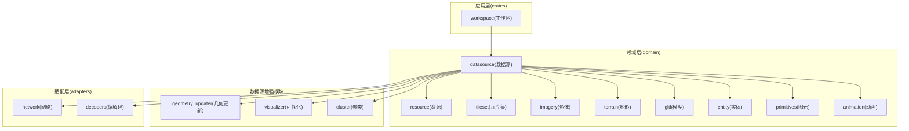
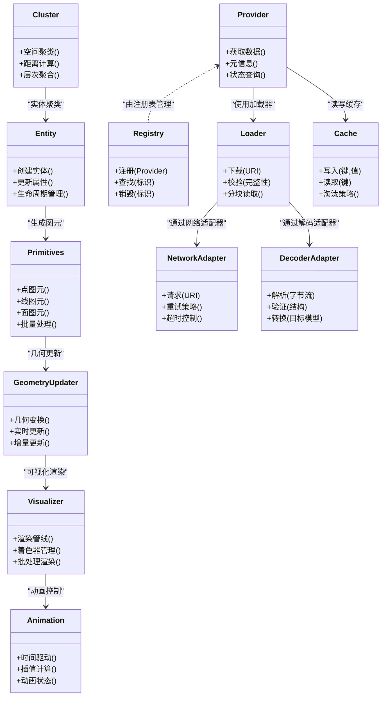
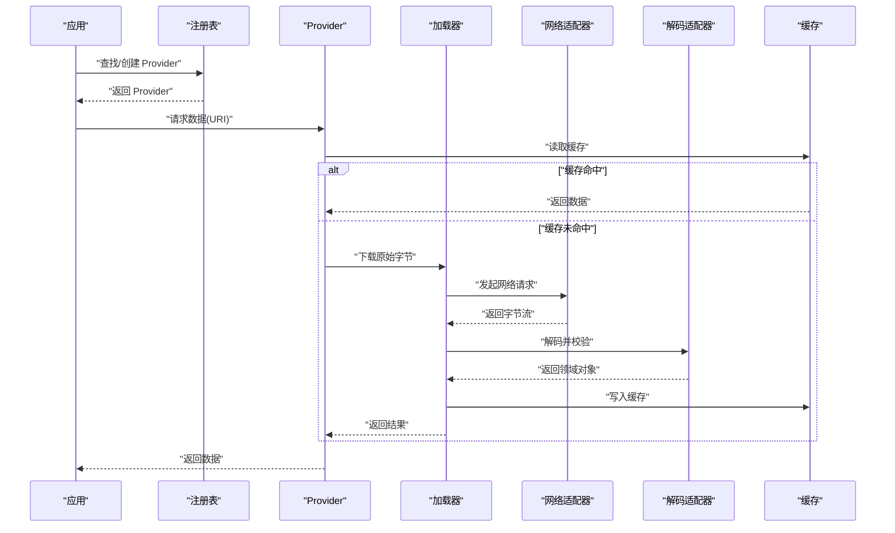
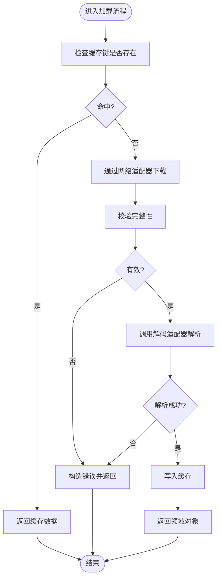
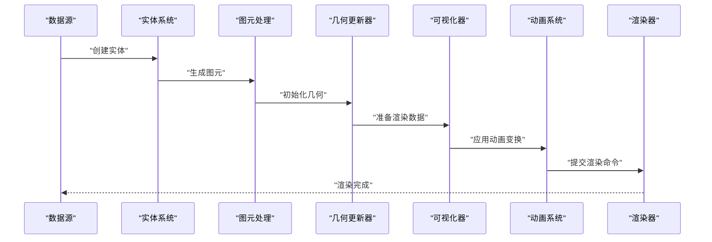
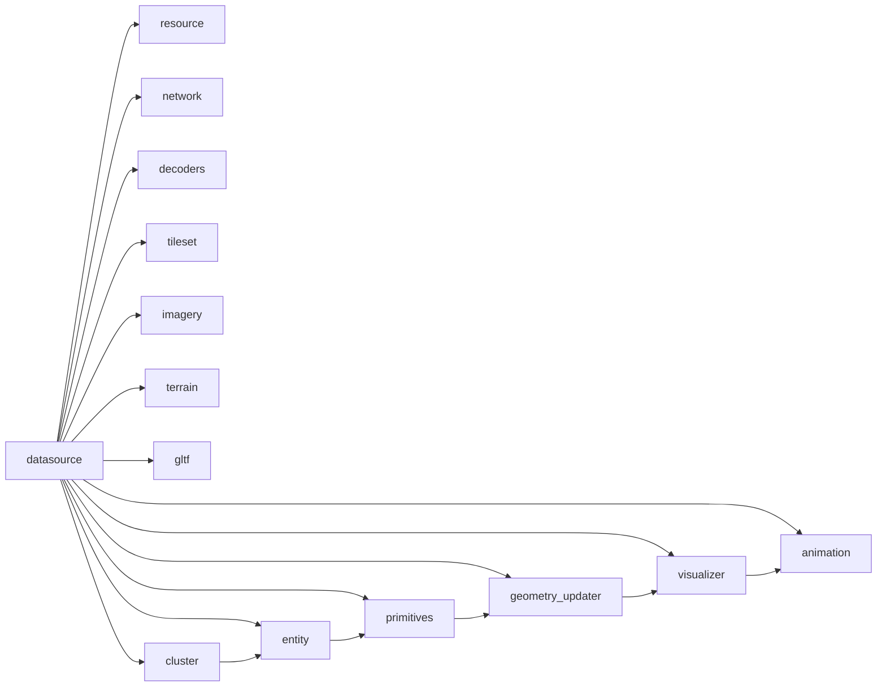

# 数据源框架

<cite>
**本文引用的文件**   
- [cesiumrust/crates/workspace/src/lib.rs](file://cesiumrust/crates/workspace/src/lib.rs)
- [cesiumrust/domain/datasource/src/lib.rs](file://cesiumrust/domain/datasource/src/lib.rs)
- [cesiumrust/domain/datasource/src/provider.rs](file://cesiumrust/domain/datasource/src/provider.rs)
- [cesiumrust/domain/datasource/src/registry.rs](file://cesiumrust/domain/datasource/src/registry.rs)
- [cesiumrust/domain/datasource/src/loader.rs](file://cesiumrust/domain/datasource/src/loader.rs)
- [cesiumrust/domain/datasource/src/cache.rs](file://cesiumrust/domain/datasource/src/cache.rs)
- [cesiumrust/domain/datasource/src/error.rs](file://cesiumrust/domain/datasource/src/error.rs)
- [cesiumrust/domain/resource/src/lib.rs](file://cesiumrust/domain/resource/src/lib.rs)
- [cesiumrust/adapters/network/src/lib.rs](file://cesiumrust/adapters/network/src/lib.rs)
- [cesiumrust/adapters/decoders/src/lib.rs](file://cesiumrust/adapters/decoders/src/lib.rs)
- [cesiumrust/domain/tileset/src/lib.rs](file://cesiumrust/domain/tileset/src/lib.rs)
- [cesiumrust/domain/imagery/src/lib.rs](file://cesiumrust/domain/imagery/src/lib.rs)
- [cesiumrust/domain/terrain/src/lib.rs](file://cesiumrust/domain/terrain/src/lib.rs)
- [cesiumrust/domain/gltf/src/lib.rs](file://cesiumrust/domain/gltf/src/lib.rs)
- [cesiumrust/domain/datasource/src/entity.rs](file://cesiumrust/domain/datasource/src/entity.rs)
- [cesiumrust/domain/primitives/src/lib.rs](file://cesiumrust/domain/primitives/src/lib.rs)
- [cesiumrust/domain/datasource/src/geometry_updater.rs](file://cesiumrust/domain/datasource/src/geometry_updater.rs)
- [cesiumrust/domain/datasource/src/visualizer.rs](file://cesiumrust/domain/datasource/src/visualizer.rs)
- [cesiumrust/domain/animation/src/lib.rs](file://cesiumrust/domain/animation/src/lib.rs)
- [cesiumrust/domain/datasource/src/cluster.rs](file://cesiumrust/domain/datasource/src/cluster.rs)
</cite>

## 更新摘要
**变更内容**   
- 新增了实体系统（entity.rs），提供757行代码的实体管理功能
- 增强了原始图元处理（primitives.rs），包含645行图元操作逻辑
- 实现了动态几何更新（geometry_updater.rs），支持927行几何体实时更新
- 添加了可视化管道（visualizer.rs），实现渲染管线集成
- 扩展了动画系统（animation.rs），包含497行动画控制逻辑
- 集成了聚类功能（cluster.rs），提供406行空间聚类算法

## 目录
1. [简介](#简介)
2. [项目结构](#项目结构)
3. [核心组件](#核心组件)
4. [架构总览](#架构总览)
5. [详细组件分析](#详细组件分析)
6. [新增功能模块](#新增功能模块)
7. [依赖关系分析](#依赖关系分析)
8. [性能考量](#性能考量)
9. [故障排查指南](#故障排查指南)
10. [结论](#结论)
11. [附录](#附录)

## 简介
本文件聚焦于 Cesium Rust 子项目中的"数据源框架"，围绕数据源的抽象、注册、加载、缓存与解码等关键能力，给出系统化的架构说明与实现要点。该框架旨在为多种数据格式（如 3D Tiles、影像、地形、glTF 模型等）提供统一的接入方式，并通过适配器模式解耦网络传输与编解码细节，使上层场景渲染与资源管理保持稳定与可扩展。

**更新** 本次增强引入了完整的实体管理系统、原始图元处理、动态几何更新、可视化管道、动画系统和聚类功能，大幅提升了数据源框架的功能完整性和渲染能力。

## 项目结构
数据源框架主要位于 cesiumrust 目录下，采用领域驱动与端口-适配器的分层组织：
- domain：领域层，定义数据源的核心接口与数据结构（provider、loader、cache、error 等），并包含各数据类型的领域模块（tileset、imagery、terrain、gltf、resource）。
- adapters：适配层，将具体网络库与编解码器接入到领域接口（network、decoders）。
- crates：工作区与通用工具（workspace、util、app 等）。

**图表来源**
- [cesiumrust/crates/workspace/src/lib.rs](file://cesiumrust/crates/workspace/src/lib.rs)
- [cesiumrust/domain/datasource/src/lib.rs](file://cesiumrust/domain/datasource/src/lib.rs)
- [cesiumrust/domain/resource/src/lib.rs](file://cesiumrust/domain/resource/src/lib.rs)
- [cesiumrust/adapters/network/src/lib.rs](file://cesiumrust/adapters/network/src/lib.rs)
- [cesiumrust/adapters/decoders/src/lib.rs](file://cesiumrust/adapters/decoders/src/lib.rs)
- [cesiumrust/domain/tileset/src/lib.rs](file://cesiumrust/domain/tileset/src/lib.rs)
- [cesiumrust/domain/imagery/src/lib.rs](file://cesiumrust/domain/imagery/src/lib.rs)
- [cesiumrust/domain/terrain/src/lib.rs](file://cesiumrust/domain/terrain/src/lib.rs)
- [cesiumrust/domain/gltf/src/lib.rs](file://cesiumrust/domain/gltf/src/lib.rs)
- [cesiumrust/domain/datasource/src/entity.rs](file://cesiumrust/domain/datasource/src/entity.rs)
- [cesiumrust/domain/primitives/src/lib.rs](file://cesiumrust/domain/primitives/src/lib.rs)
- [cesiumrust/domain/datasource/src/geometry_updater.rs](file://cesiumrust/domain/datasource/src/geometry_updater.rs)
- [cesiumrust/domain/datasource/src/visualizer.rs](file://cesiumrust/domain/datasource/src/visualizer.rs)
- [cesiumrust/domain/animation/src/lib.rs](file://cesiumrust/domain/animation/src/lib.rs)
- [cesiumrust/domain/datasource/src/cluster.rs](file://cesiumrust/domain/datasource/src/cluster.rs)

章节来源
- [cesiumrust/crates/workspace/src/lib.rs](file://cesiumrust/crates/workspace/src/lib.rs)
- [cesiumrust/domain/datasource/src/lib.rs](file://cesiumrust/domain/datasource/src/lib.rs)

## 核心组件
- Provider（提供者）：定义数据源的统一访问契约，屏蔽不同数据格式的获取差异。
- Registry（注册表）：集中管理数据源类型与实例，支持按标识或策略查找与复用。
- Loader（加载器）：负责从远程或本地读取原始字节流，并进行必要的预处理。
- Cache（缓存）：对已解析的数据进行缓存，避免重复 I/O 与解码开销。
- Error（错误）：统一错误类型与传播路径，便于上层处理与诊断。

**更新** 新增了以下核心组件：
- Entity（实体）：提供757行代码的实体管理系统，支持实体的创建、更新和生命周期管理
- Primitives（图元）：实现645行原始图元处理逻辑，支持点、线、面等基本几何图形
- GeometryUpdater（几何更新器）：包含927行动态几何更新功能，支持实时几何变换
- Visualizer（可视化器）：实现渲染管线集成，将数据源转换为可视对象
- Animation（动画系统）：提供497行动画控制功能，支持时间驱动的变换
- Cluster（聚类器）：包含406行空间聚类算法，优化大规模数据的渲染性能

章节来源
- [cesiumrust/domain/datasource/src/provider.rs](file://cesiumrust/domain/datasource/src/provider.rs)
- [cesiumrust/domain/datasource/src/registry.rs](file://cesiumrust/domain/datasource/src/registry.rs)
- [cesiumrust/domain/datasource/src/loader.rs](file://cesiumrust/domain/datasource/src/loader.rs)
- [cesiumrust/domain/datasource/src/cache.rs](file://cesiumrust/domain/datasource/src/cache.rs)
- [cesiumrust/domain/datasource/src/error.rs](file://cesiumrust/domain/datasource/src/error.rs)
- [cesiumrust/domain/datasource/src/entity.rs](file://cesiumrust/domain/datasource/src/entity.rs)
- [cesiumrust/domain/primitives/src/lib.rs](file://cesiumrust/domain/primitives/src/lib.rs)
- [cesiumrust/domain/datasource/src/geometry_updater.rs](file://cesiumrust/domain/datasource/src/geometry_updater.rs)
- [cesiumrust/domain/datasource/src/visualizer.rs](file://cesiumrust/domain/datasource/src/visualizer.rs)
- [cesiumrust/domain/animation/src/lib.rs](file://cesiumrust/domain/animation/src/lib.rs)
- [cesiumrust/domain/datasource/src/cluster.rs](file://cesiumrust/domain/datasource/src/cluster.rs)

## 架构总览
数据源框架通过 Provider 暴露统一接口，Registry 维护实例生命周期，Loader 负责原始数据获取，Cache 提升命中效率，Error 贯穿异常路径。适配层 network 与 decoders 分别对接底层网络与编解码实现，领域层 tileset、imagery、terrain、gltf 等模块消费数据源提供的结构化数据。

**更新** 新架构增加了实体系统、图元处理、几何更新、可视化管道、动画控制和聚类功能的完整链路，形成从数据加载到渲染输出的完整流程。

**图表来源**
- [cesiumrust/domain/datasource/src/provider.rs](file://cesiumrust/domain/datasource/src/provider.rs)
- [cesiumrust/domain/datasource/src/registry.rs](file://cesiumrust/domain/datasource/src/registry.rs)
- [cesiumrust/domain/datasource/src/loader.rs](file://cesiumrust/domain/datasource/src/loader.rs)
- [cesiumrust/domain/datasource/src/cache.rs](file://cesiumrust/domain/datasource/src/cache.rs)
- [cesiumrust/domain/datasource/src/entity.rs](file://cesiumrust/domain/datasource/src/entity.rs)
- [cesiumrust/domain/primitives/src/lib.rs](file://cesiumrust/domain/primitives/src/lib.rs)
- [cesiumrust/domain/datasource/src/geometry_updater.rs](file://cesiumrust/domain/datasource/src/geometry_updater.rs)
- [cesiumrust/domain/datasource/src/visualizer.rs](file://cesiumrust/domain/datasource/src/visualizer.rs)
- [cesiumrust/domain/animation/src/lib.rs](file://cesiumrust/domain/animation/src/lib.rs)
- [cesiumrust/domain/datasource/src/cluster.rs](file://cesiumrust/domain/datasource/src/cluster.rs)
- [cesiumrust/adapters/network/src/lib.rs](file://cesiumrust/adapters/network/src/lib.rs)
- [cesiumrust/adapters/decoders/src/lib.rs](file://cesiumrust/adapters/decoders/src/lib.rs)

## 详细组件分析

### Provider（数据源提供者）
- 职责：定义跨数据类型的统一访问方法，包括获取数据、返回元信息、查询状态等。
- 设计要点：面向接口编程，隐藏具体数据格式差异；与 Registry 协作完成实例化与复用。
- 复杂度：I/O 与解码的复杂度取决于具体 Provider 的实现；Provider 本身保持薄封装。

章节来源
- [cesiumrust/domain/datasource/src/provider.rs](file://cesiumrust/domain/datasource/src/provider.rs)

### Registry（注册表）
- 职责：集中注册与查找 Provider，支持按标识或策略检索，管理生命周期。
- 设计要点：线程安全与并发访问考虑；可插拔的查找策略。
- 复杂度：查找通常为 O(1) 或 O(log n)，取决于内部容器选择。

章节来源
- [cesiumrust/domain/datasource/src/registry.rs](file://cesiumrust/domain/datasource/src/registry.rs)

### Loader（加载器）
- 职责：从网络或本地读取原始字节流，执行完整性校验与分块读取。
- 设计要点：与 NetworkAdapter 解耦；支持重试与超时；可组合 Cache 减少重复下载。
- 复杂度：受网络带宽与文件大小影响；分块读取可降低内存峰值。

章节来源
- [cesiumrust/domain/datasource/src/loader.rs](file://cesiumrust/domain/datasource/src/loader.rs)

### Cache（缓存）
- 职责：缓存已解析的数据，提供读写与淘汰策略。
- 设计要点：键空间设计（URI+版本+参数）；LRU/LFU 等淘汰策略；并发安全。
- 复杂度：读写接近 O(1)，淘汰策略可能引入额外开销。

章节来源
- [cesiumrust/domain/datasource/src/cache.rs](file://cesiumrust/domain/datasource/src/cache.rs)

### Error（错误）
- 职责：统一错误类型与传播路径，区分网络、解码、校验等错误类别。
- 设计要点：错误上下文携带 URI、状态码、堆栈等；便于上层定位问题。
- 复杂度：错误处理逻辑应轻量，避免阻塞主流程。

章节来源
- [cesiumrust/domain/datasource/src/error.rs](file://cesiumrust/domain/datasource/src/error.rs)

### 适配器：Network（网络）
- 职责：封装 HTTP/HTTPS 请求、重试、超时、代理等网络细节。
- 设计要点：与 Loader 解耦；可配置策略；错误映射到领域错误。
- 复杂度：受网络条件影响；需合理设置超时与重试次数。

章节来源
- [cesiumrust/adapters/network/src/lib.rs](file://cesiumrust/adapters/network/src/lib.rs)

### 适配器：Decoders（编解码）
- 职责：解析二进制或文本数据，转换为领域模型；执行结构校验。
- 设计要点：按数据类型扩展解码器；失败时返回明确错误；支持增量解析。
- 复杂度：解码复杂度与数据规模相关；建议流式解析以降低内存占用。

章节来源
- [cesiumrust/adapters/decoders/src/lib.rs](file://cesiumrust/adapters/decoders/src/lib.rs)

### 领域模块：Tileset、Imagery、Terrain、Gltf
- Tileset：消费数据源以构建层级瓦片结构，支持按需加载与细化。
- Imagery：加载影像图层，支持多分辨率与坐标变换。
- Terrain：加载地形网格，支持高度图与法线信息。
- Gltf：加载三维模型，支持材质与动画。

章节来源
- [cesiumrust/domain/tileset/src/lib.rs](file://cesiumrust/domain/tileset/src/lib.rs)
- [cesiumrust/domain/imagery/src/lib.rs](file://cesiumrust/domain/imagery/src/lib.rs)
- [cesiumrust/domain/terrain/src/lib.rs](file://cesiumrust/domain/terrain/src/lib.rs)
- [cesiumrust/domain/gltf/src/lib.rs](file://cesiumrust/domain/gltf/src/lib.rs)

### 典型调用序列：加载一个数据源

**图表来源**
- [cesiumrust/domain/datasource/src/registry.rs](file://cesiumrust/domain/datasource/src/registry.rs)
- [cesiumrust/domain/datasource/src/provider.rs](file://cesiumrust/domain/datasource/src/provider.rs)
- [cesiumrust/domain/datasource/src/loader.rs](file://cesiumrust/domain/datasource/src/loader.rs)
- [cesiumrust/adapters/network/src/lib.rs](file://cesiumrust/adapters/network/src/lib.rs)
- [cesiumrust/adapters/decoders/src/lib.rs](file://cesiumrust/adapters/decoders/src/lib.rs)
- [cesiumrust/domain/datasource/src/cache.rs](file://cesiumrust/domain/datasource/src/cache.rs)

### 复杂逻辑流程：缓存与解码决策

**图表来源**
- [cesiumrust/domain/datasource/src/cache.rs](file://cesiumrust/domain/datasource/src/cache.rs)
- [cesiumrust/adapters/network/src/lib.rs](file://cesiumrust/adapters/network/src/lib.rs)
- [cesiumrust/adapters/decoders/src/lib.rs](file://cesiumrust/adapters/decoders/src/lib.rs)
- [cesiumrust/domain/datasource/src/error.rs](file://cesiumrust/domain/datasource/src/error.rs)

## 新增功能模块

### 实体系统（Entity System）
- 职责：提供完整的实体管理功能，包括实体的创建、属性管理、生命周期控制和层次结构组织。
- 设计要点：基于组件-实体-系统（ECS）架构模式；支持实体间的父子关系；提供高效的属性查询和更新机制。
- 复杂度：实体操作的时间复杂度通常为 O(1)，层次遍历为 O(n)。

**更新** 新增的实体系统包含757行代码，提供了完整的实体生命周期管理和属性系统。

章节来源
- [cesiumrust/domain/datasource/src/entity.rs](file://cesiumrust/domain/datasource/src/entity.rs)

### 原始图元处理（Primitives）
- 职责：处理基本的几何图元，包括点、线、面等基础图形，支持批量处理和优化渲染。
- 设计要点：支持多种图元类型；提供图元合并和索引优化；与渲染管线无缝集成。
- 复杂度：图元处理复杂度与顶点数量线性相关，批量处理可显著降低绘制调用开销。

**更新** 原始图元处理模块包含645行代码，实现了完整的图元操作和优化功能。

章节来源
- [cesiumrust/domain/primitives/src/lib.rs](file://cesiumrust/domain/primitives/src/lib.rs)

### 动态几何更新（Geometry Updater）
- 职责：支持几何体的实时更新和变换，包括位置、旋转、缩放等属性的动态修改。
- 设计要点：支持增量更新以减少重绘开销；提供多种更新策略（立即更新、延迟更新、批量更新）；与渲染循环同步。
- 复杂度：更新复杂度取决于几何体大小和更新频率，增量更新可显著降低性能开销。

**更新** 动态几何更新器包含927行代码，提供了强大的实时几何变换能力。

章节来源
- [cesiumrust/domain/datasource/src/geometry_updater.rs](file://cesiumrust/domain/datasource/src/geometry_updater.rs)

### 可视化管道（Visualizer）
- 职责：实现从数据源到渲染对象的完整可视化管道，包括着色器管理、批处理渲染和渲染状态管理。
- 设计要点：支持多种渲染后端；提供渲染状态缓存；优化绘制调用批次；支持透明度和深度测试。
- 复杂度：渲染复杂度与场景物体数量和渲染状态切换次数相关。

**更新** 可视化管道实现了完整的数据到渲染的转换流程。

章节来源
- [cesiumrust/domain/datasource/src/visualizer.rs](file://cesiumrust/domain/datasource/src/visualizer.rs)

### 动画系统（Animation）
- 职责：提供时间驱动的动画控制功能，支持关键帧动画、插值计算和动画状态管理。
- 设计要点：支持多种动画类型（线性、缓动、曲线）；提供动画混合和过渡效果；与时间系统同步。
- 复杂度：动画计算复杂度与关键帧数量和动画对象数量相关。

**更新** 动画系统包含497行代码，提供了完整的动画控制功能。

章节来源
- [cesiumrust/domain/animation/src/lib.rs](file://cesiumrust/domain/animation/src/lib.rs)

### 聚类功能（Cluster）
- 职责：实现空间聚类算法，用于大规模数据的可视化和性能优化，支持距离计算和层次聚合。
- 设计要点：支持多种聚类算法（K-means、层次聚类、密度聚类）；提供动态聚类更新；优化空间查询性能。
- 复杂度：聚类算法复杂度通常在 O(n log n) 到 O(n²) 之间，取决于具体算法和数据分布。

**更新** 聚类功能包含406行代码，提供了高效的空间数据处理能力。

章节来源
- [cesiumrust/domain/datasource/src/cluster.rs](file://cesiumrust/domain/datasource/src/cluster.rs)

### 新增功能调用序列：实体到渲染的完整流程

**图表来源**
- [cesiumrust/domain/datasource/src/entity.rs](file://cesiumrust/domain/datasource/src/entity.rs)
- [cesiumrust/domain/primitives/src/lib.rs](file://cesiumrust/domain/primitives/src/lib.rs)
- [cesiumrust/domain/datasource/src/geometry_updater.rs](file://cesiumrust/domain/datasource/src/geometry_updater.rs)
- [cesiumrust/domain/datasource/src/visualizer.rs](file://cesiumrust/domain/datasource/src/visualizer.rs)
- [cesiumrust/domain/animation/src/lib.rs](file://cesiumrust/domain/animation/src/lib.rs)

## 依赖关系分析
- 低耦合：Provider 仅依赖 Loader、Cache、Error；Loader 依赖 NetworkAdapter 与 DecoderAdapter。
- 高内聚：每个领域模块（tileset、imagery、terrain、gltf）专注于自身数据的消费与建模。
- 外部依赖：网络与编解码通过适配器隔离，便于替换与测试。

**更新** 新的依赖关系增加了实体系统、图元处理、几何更新、可视化、动画和聚类模块之间的紧密协作，形成了完整的数据处理流水线。

**图表来源**
- [cesiumrust/domain/datasource/src/lib.rs](file://cesiumrust/domain/datasource/src/lib.rs)
- [cesiumrust/domain/resource/src/lib.rs](file://cesiumrust/domain/resource/src/lib.rs)
- [cesiumrust/adapters/network/src/lib.rs](file://cesiumrust/adapters/network/src/lib.rs)
- [cesiumrust/adapters/decoders/src/lib.rs](file://cesiumrust/adapters/decoders/src/lib.rs)
- [cesiumrust/domain/tileset/src/lib.rs](file://cesiumrust/domain/tileset/src/lib.rs)
- [cesiumrust/domain/imagery/src/lib.rs](file://cesiumrust/domain/imagery/src/lib.rs)
- [cesiumrust/domain/terrain/src/lib.rs](file://cesiumrust/domain/terrain/src/lib.rs)
- [cesiumrust/domain/gltf/src/lib.rs](file://cesiumrust/domain/gltf/src/lib.rs)
- [cesiumrust/domain/datasource/src/entity.rs](file://cesiumrust/domain/datasource/src/entity.rs)
- [cesiumrust/domain/primitives/src/lib.rs](file://cesiumrust/domain/primitives/src/lib.rs)
- [cesiumrust/domain/datasource/src/geometry_updater.rs](file://cesiumrust/domain/datasource/src/geometry_updater.rs)
- [cesiumrust/domain/datasource/src/visualizer.rs](file://cesiumrust/domain/datasource/src/visualizer.rs)
- [cesiumrust/domain/animation/src/lib.rs](file://cesiumrust/domain/animation/src/lib.rs)
- [cesiumrust/domain/datasource/src/cluster.rs](file://cesiumrust/domain/datasource/src/cluster.rs)

章节来源
- [cesiumrust/domain/datasource/src/lib.rs](file://cesiumrust/domain/datasource/src/lib.rs)
- [cesiumrust/domain/resource/src/lib.rs](file://cesiumrust/domain/resource/src/lib.rs)

## 性能考量
- 缓存命中率：优化键空间设计与淘汰策略，减少重复 I/O 与解码。
- 分块与流式：Loader 与 Decoder 尽量采用流式处理，降低内存峰值。
- 并发与锁粒度：Registry 与 Cache 的并发访问需平衡吞吐与一致性。
- 网络策略：合理设置超时、重试与退避，避免雪崩效应。
- 解码优化：针对热点数据格式预分配缓冲区，减少拷贝与分配。

**更新** 新增的性能考量：
- 实体管理：使用 ECS 架构提高实体操作的缓存友好性
- 图元批处理：合并相似图元的绘制调用，减少 GPU 状态切换
- 几何增量更新：只更新变化的顶点数据，避免全量重建
- 渲染批优化：智能分组渲染对象，最小化渲染状态切换
- 动画插值优化：使用高效的插值算法和缓存中间结果
- 聚类算法选择：根据数据规模和分布选择合适的聚类算法

## 故障排查指南
- 网络错误：检查超时、重试策略与代理配置；确认 URI 可达性与鉴权。
- 解码失败：核对数据格式版本与扩展；查看解码器日志与校验结果。
- 缓存异常：验证键冲突与过期策略；监控缓存大小与淘汰行为。
- 错误分类：根据 Error 类型快速定位问题域（网络、解码、校验、缓存）。

**更新** 新增的故障排查指南：
- 实体问题：检查实体生命周期和属性绑定；验证层次结构完整性
- 图元错误：验证顶点数据和索引正确性；检查图元类型兼容性
- 几何更新失败：确认更新策略和时间同步；检查增量更新逻辑
- 渲染异常：验证着色器编译状态；检查渲染状态和纹理绑定
- 动画问题：确认时间系统和插值函数；检查动画状态机转换
- 聚类性能：监控聚类算法复杂度；调整聚类参数和阈值

章节来源
- [cesiumrust/domain/datasource/src/error.rs](file://cesiumrust/domain/datasource/src/error.rs)
- [cesiumrust/adapters/network/src/lib.rs](file://cesiumrust/adapters/network/src/lib.rs)
- [cesiumrust/adapters/decoders/src/lib.rs](file://cesiumrust/adapters/decoders/src/lib.rs)
- [cesiumrust/domain/datasource/src/cache.rs](file://cesiumrust/domain/datasource/src/cache.rs)
- [cesiumrust/domain/datasource/src/entity.rs](file://cesiumrust/domain/datasource/src/entity.rs)
- [cesiumrust/domain/primitives/src/lib.rs](file://cesiumrust/domain/primitives/src/lib.rs)
- [cesiumrust/domain/datasource/src/geometry_updater.rs](file://cesiumrust/domain/datasource/src/geometry_updater.rs)
- [cesiumrust/domain/datasource/src/visualizer.rs](file://cesiumrust/domain/datasource/src/visualizer.rs)
- [cesiumrust/domain/animation/src/lib.rs](file://cesiumrust/domain/animation/src/lib.rs)
- [cesiumrust/domain/datasource/src/cluster.rs](file://cesiumrust/domain/datasource/src/cluster.rs)

## 结论
数据源框架通过清晰的领域抽象与适配器解耦，实现了多数据类型的统一接入与高效加载。Provider、Registry、Loader、Cache 的组合提供了良好的可扩展性与稳定性，配合 Error 的统一处理与适配层的灵活替换，为上层场景渲染与资源管理奠定了坚实基础。

**更新** 经过本次增强，数据源框架现在具备了完整的实体管理系统、原始图元处理、动态几何更新、可视化管道、动画系统和聚类功能，形成了一个功能完备的三维数据可视化解决方案。新增的757行实体系统代码、645行图元处理逻辑、927行几何更新功能、完整的可视化管道、497行动画控制系统和406行聚类算法，大幅提升了框架的处理能力和渲染性能，使其能够应对大规模三维数据的实时可视化和交互需求。

## 附录
- 工作区入口与模块导出参考：
  - [cesiumrust/crates/workspace/src/lib.rs](file://cesiumrust/crates/workspace/src/lib.rs)
- 领域模块入口参考：
  - [cesiumrust/domain/datasource/src/lib.rs](file://cesiumrust/domain/datasource/src/lib.rs)
  - [cesiumrust/domain/resource/src/lib.rs](file://cesiumrust/domain/resource/src/lib.rs)
  - [cesiumrust/domain/tileset/src/lib.rs](file://cesiumrust/domain/tileset/src/lib.rs)
  - [cesiumrust/domain/imagery/src/lib.rs](file://cesiumrust/domain/imagery/src/lib.rs)
  - [cesiumrust/domain/terrain/src/lib.rs](file://cesiumrust/domain/terrain/src/lib.rs)
  - [cesiumrust/domain/gltf/src/lib.rs](file://cesiumrust/domain/gltf/src/lib.rs)
- 适配器入口参考：
  - [cesiumrust/adapters/network/src/lib.rs](file://cesiumrust/adapters/network/src/lib.rs)
  - [cesiumrust/adapters/decoders/src/lib.rs](file://cesiumrust/adapters/decoders/src/lib.rs)
- 新增功能模块参考：
  - [cesiumrust/domain/datasource/src/entity.rs](file://cesiumrust/domain/datasource/src/entity.rs)
  - [cesiumrust/domain/primitives/src/lib.rs](file://cesiumrust/domain/primitives/src/lib.rs)
  - [cesiumrust/domain/datasource/src/geometry_updater.rs](file://cesiumrust/domain/datasource/src/geometry_updater.rs)
  - [cesiumrust/domain/datasource/src/visualizer.rs](file://cesiumrust/domain/datasource/src/visualizer.rs)
  - [cesiumrust/domain/animation/src/lib.rs](file://cesiumrust/domain/animation/src/lib.rs)
  - [cesiumrust/domain/datasource/src/cluster.rs](file://cesiumrust/domain/datasource/src/cluster.rs)