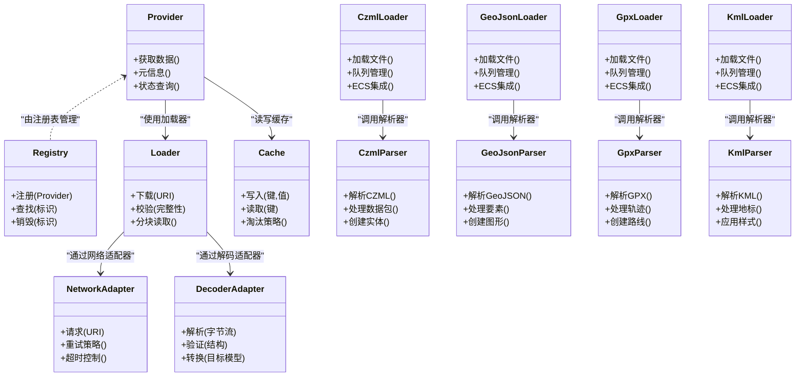
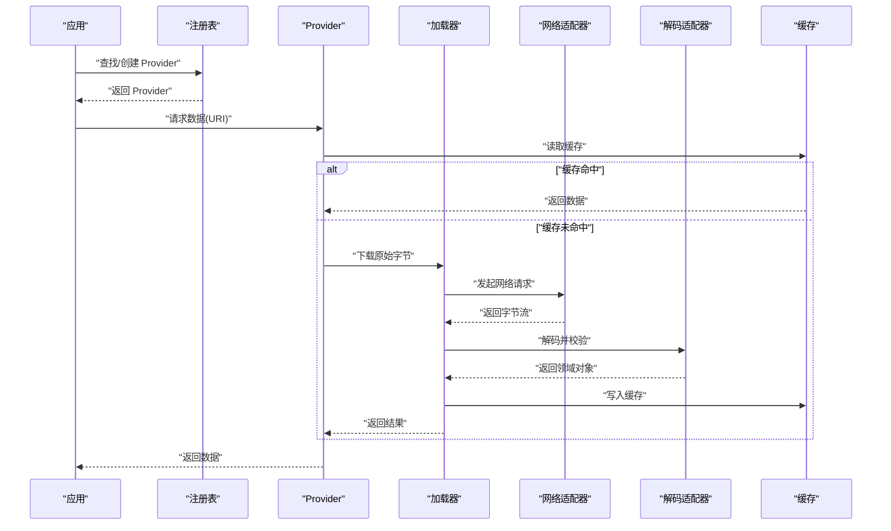
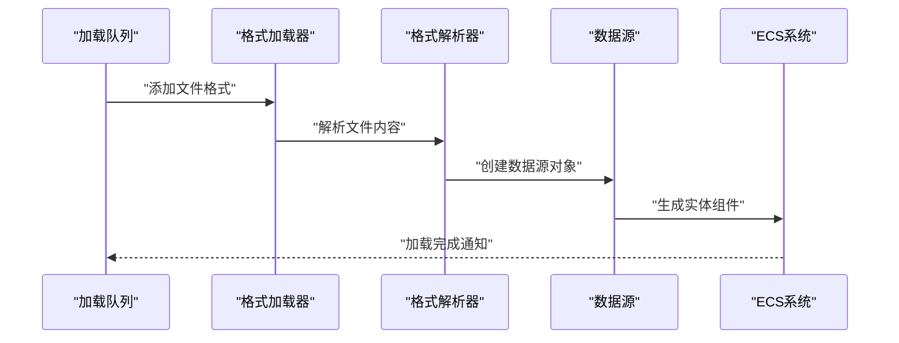
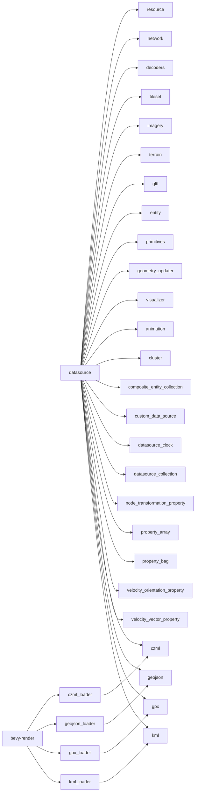

# 数据源框架

<cite>
**本文引用的文件**   
- [cesiumrust/crates/workspace/src/lib.rs](file://cesiumrust/crates/workspace/src/lib.rs)
- [cesiumrust/domain/datasource/src/lib.rs](file://cesiumrust/domain/datasource/src/lib.rs)
- [cesiumrust/domain/datasource/src/provider.rs](file://cesiumrust/domain/datasource/src/provider.rs)
- [cesiumrust/domain/datasource/src/registry.rs](file://cesiumrust/domain/datasource/src/registry.rs)
- [cesiumrust/domain/datasource/src/loader.rs](file://cesiumrust/domain/datasource/src/loader.rs)
- [cesiumrust/domain/datasource/src/cache.rs](file://cesiumrust/domain/datasource/src/cache.rs)
- [cesiumrust/domain/datasource/src/error.rs](file://cesiumrust/domain/datasource/src/error.rs)
- [cesiumrust/domain/resource/src/lib.rs](file://cesiumrust/domain/resource/src/lib.rs)
- [cesiumrust/adapters/network/src/lib.rs](file://cesiumrust/adapters/network/src/lib.rs)
- [cesiumrust/adapters/decoders/src/lib.rs](file://cesiumrust/adapters/decoders/src/lib.rs)
- [cesiumrust/domain/tileset/src/lib.rs](file://cesiumrust/domain/tileset/src/lib.rs)
- [cesiumrust/domain/imagery/src/lib.rs](file://cesiumrust/domain/imagery/src/lib.rs)
- [cesiumrust/domain/terrain/src/lib.rs](file://cesiumrust/domain/terrain/src/lib.rs)
- [cesiumrust/domain/gltf/src/lib.rs](file://cesiumrust/domain/gltf/src/lib.rs)
- [cesiumrust/domain/datasource/src/entity.rs](file://cesiumrust/domain/datasource/src/entity.rs)
- [cesiumrust/domain/primitives/src/lib.rs](file://cesiumrust/domain/primitives/src/lib.rs)
- [cesiumrust/domain/datasource/src/geometry_updater.rs](file://cesiumrust/domain/datasource/src/geometry_updater.rs)
- [cesiumrust/domain/datasource/src/visualizer.rs](file://cesiumrust/domain/datasource/src/visualizer.rs)
- [cesiumrust/domain/animation/src/lib.rs](file://cesiumrust/domain/animation/src/lib.rs)
- [cesiumrust/domain/datasource/src/cluster.rs](file://cesiumrust/domain/datasource/src/cluster.rs)
- [cesiumrust/domain/datasource/src/composite_entity_collection.rs](file://cesiumrust/domain/datasource/src/composite_entity_collection.rs)
- [cesiumrust/domain/datasource/src/custom_data_source.rs](file://cesiumrust/domain/datasource/src/custom_data_source.rs)
- [cesiumrust/domain/datasource/src/datasource_clock.rs](file://cesiumrust/domain/datasource/src/datasource_clock.rs)
- [cesiumrust/domain/datasource/src/datasource_collection.rs](file://cesiumrust/domain/datasource/src/datasource_collection.rs)
- [cesiumrust/domain/datasource/src/node_transformation_property.rs](file://cesiumrust/domain/datasource/src/node_transformation_property.rs)
- [cesiumrust/domain/datasource/src/property_array.rs](file://cesiumrust/domain/datasource/src/property_array.rs)
- [cesiumrust/domain/datasource/src/property_bag.rs](file://cesiumrust/domain/datasource/src/property_bag.rs)
- [cesiumrust/domain/datasource/src/velocity_orientation_property.rs](file://cesiumrust/domain/datasource/src/velocity_orientation_property.rs)
- [cesiumrust/domain/datasource/src/velocity_vector_property.rs](file://cesiumrust/domain/datasource/src/velocity_vector_property.rs)
- [cesiumrust/domain/datasource/src/czml.rs](file://cesiumrust/domain/datasource/src/czml.rs)
- [cesiumrust/domain/datasource/src/geojson.rs](file://cesiumrust/domain/datasource/src/geojson.rs)
- [cesiumrust/domain/gpx/src/lib.rs](file://cesiumrust/domain/gpx/src/lib.rs)
- [cesiumrust/domain/gpx/src/parser.rs](file://cesiumrust/domain/gpx/src/parser.rs)
- [cesiumrust/domain/kml/src/lib.rs](file://cesiumrust/domain/kml/src/lib.rs)
- [cesiumrust/domain/kml/src/parser.rs](file://cesiumrust/domain/kml/src/parser.rs)
- [cesiumrust/adapters/bevy-render/src/datasource/czml_loader.rs](file://cesiumrust/adapters/bevy-render/src/datasource/czml_loader.rs)
- [cesiumrust/adapters/bevy-render/src/datasource/geojson_loader.rs](file://cesiumrust/adapters/bevy-render/src/datasource/geojson_loader.rs)
- [cesiumrust/adapters/bevy-render/src/datasource/gpx_loader.rs](file://cesiumrust/adapters/bevy-render/src/datasource/gpx_loader.rs)
- [cesiumrust/adapters/bevy-render/src/datasource/kml_loader.rs](file://cesiumrust/adapters/bevy-render/src/datasource/kml_loader.rs)
</cite>

## 更新摘要
**变更内容**   
- 新增CZML、GeoJSON、GPX和KML四种数据格式的专用加载器系统
- 实现了完整的格式解析器和适配器，支持多种地理数据格式的统一接入
- 增强了Bevy渲染适配器的数据源加载能力，提供ECS组件集成
- 扩展了数据源框架的格式支持范围，从传统3D Tiles扩展到通用地理数据格式
- 提供了统一的错误处理和日志记录机制

## 目录
1. [简介](#简介)
2. [项目结构](#项目结构)
3. [核心组件](#核心组件)
4. [架构总览](#架构总览)
5. [详细组件分析](#详细组件分析)
6. [新增数据格式支持](#新增数据格式支持)
7. [依赖关系分析](#依赖关系分析)
8. [性能考量](#性能考量)
9. [故障排查指南](#故障排查指南)
10. [结论](#结论)
11. [附录](#附录)

## 简介
本文件聚焦于 Cesium Rust 子项目中的"数据源框架"，围绕数据源的抽象、注册、加载、缓存与解码等关键能力，给出系统化的架构说明与实现要点。该框架旨在为多种数据格式（如 3D Tiles、影像、地形、glTF 模型等）提供统一的接入方式，并通过适配器模式解耦网络传输与编解码细节，使上层场景渲染与资源管理保持稳定与可扩展。

**更新** 本次重大增强新增了CZML、GeoJSON、GPX和KML四种数据格式的专用加载器系统，大幅扩展了数据源框架的格式支持能力。新的加载器系统提供了完整的格式解析、验证和转换功能，支持从多种地理数据格式直接创建实体和图形对象，为三维可视化应用提供了更加灵活的数据接入方式。

## 项目结构
数据源框架主要位于 cesiumrust 目录下，采用领域驱动与端口-适配器的分层组织：
- domain：领域层，定义数据源的核心接口与数据结构（provider、loader、cache、error 等），并包含各数据类型的领域模块（tileset、imagery、terrain、gltf、resource）。
- adapters：适配层，将具体网络库与编解码器接入到领域接口（network、decoders）。
- crates：工作区与通用工具（workspace、util、app 等）。

```mermaid
graph TB
subgraph "领域层(domain)"
DS["datasource(数据源)"]
RS["resource(资源)"]
TS["tileset(瓦片集)"]
IM["imagery(影像)"]
TR["terrain(地形)"]
GL["gltf(模型)"]
EN["entity(实体)"]
PR["primitives(图元)"]
AN["animation(动画)"]
CZML["czml(CZML解析)"]
GEO["geojson(GeoJSON解析)"]
GPX["gpx(GPX解析)"]
KML["kml(KML解析)"]
end
subgraph "数据源增强模块"
GU["geometry_updater(几何更新)"]
VS["visualizer(可视化)"]
CL["cluster(聚类)"]
CEC["composite_entity_collection(复合实体集合)"]
CDS["custom_data_source(自定义数据源)"]
DC["datasource_clock(数据源时钟)"]
DSC["datasource_collection(数据源集合)"]
NTP["node_transformation_property(节点变换属性)"]
PA["property_array(属性数组)"]
PB["property_bag(属性包)"]
VOP["velocity_orientation_property(速度方向属性)"]
VVP["velocity_vector_property(速度向量属性)"]
end
subgraph "适配层(adapters)"
NET["network(网络)"]
DEC["decoders(编解码)"]
BEVY["bevy-render(渲染适配)"]
CZMLL["czml_loader(CZML加载器)"]
GEOJL["geojson_loader(GeoJSON加载器)"]
GPXL["gpx_loader(GPX加载器)"]
KMLL["kml_loader(KML加载器)"]
end
subgraph "应用层(crates)"
WS["workspace(工作区)"]
end
WS --> DS
DS --> RS
DS --> NET
DS --> DEC
DS --> TS
DS --> IM
DS --> TR
DS --> GL
DS --> EN
DS --> PR
DS --> AN
DS --> GU
DS --> VS
DS --> CL
DS --> CEC
DS --> CDS
DS --> DC
DS --> DSC
DS --> NTP
DS --> PA
DS --> PB
DS --> VOP
DS --> VVP
DS --> CZML
DS --> GEO
DS --> GPX
DS --> KML
BEVY --> CZMLL
BEVY --> GEOJL
BEVY --> GPXL
BEVY --> KMLL
CZMLL --> CZML
GEOJL --> GEO
GPXL --> GPX
KMLL --> KML
```

**图表来源**
- [cesiumrust/crates/workspace/src/lib.rs](file://cesiumrust/crates/workspace/src/lib.rs)
- [cesiumrust/domain/datasource/src/lib.rs](file://cesiumrust/domain/datasource/src/lib.rs)
- [cesiumrust/domain/resource/src/lib.rs](file://cesiumrust/domain/resource/src/lib.rs)
- [cesiumrust/adapters/network/src/lib.rs](file://cesiumrust/adapters/network/src/lib.rs)
- [cesiumrust/adapters/decoders/src/lib.rs](file://cesiumrust/adapters/decoders/src/lib.rs)
- [cesiumrust/domain/tileset/src/lib.rs](file://cesiumrust/domain/tileset/src/lib.rs)
- [cesiumrust/domain/imagery/src/lib.rs](file://cesiumrust/domain/imagery/src/lib.rs)
- [cesiumrust/domain/terrain/src/lib.rs](file://cesiumrust/domain/terrain/src/lib.rs)
- [cesiumrust/domain/gltf/src/lib.rs](file://cesiumrust/domain/gltf/src/lib.rs)
- [cesiumrust/domain/datasource/src/entity.rs](file://cesiumrust/domain/datasource/src/entity.rs)
- [cesiumrust/domain/primitives/src/lib.rs](file://cesiumrust/domain/primitives/src/lib.rs)
- [cesiumrust/domain/datasource/src/geometry_updater.rs](file://cesiumrust/domain/datasource/src/geometry_updater.rs)
- [cesiumrust/domain/datasource/src/visualizer.rs](file://cesiumrust/domain/datasource/src/visualizer.rs)
- [cesiumrust/domain/animation/src/lib.rs](file://cesiumrust/domain/animation/src/lib.rs)
- [cesiumrust/domain/datasource/src/cluster.rs](file://cesiumrust/domain/datasource/src/cluster.rs)
- [cesiumrust/domain/datasource/src/composite_entity_collection.rs](file://cesiumrust/domain/datasource/src/composite_entity_collection.rs)
- [cesiumrust/domain/datasource/src/custom_data_source.rs](file://cesiumrust/domain/datasource/src/custom_data_source.rs)
- [cesiumrust/domain/datasource/src/datasource_clock.rs](file://cesiumrust/domain/datasource/src/datasource_clock.rs)
- [cesiumrust/domain/datasource/src/datasource_collection.rs](file://cesiumrust/domain/datasource/src/datasource_collection.rs)
- [cesiumrust/domain/datasource/src/node_transformation_property.rs](file://cesiumrust/domain/datasource/src/node_transformation_property.rs)
- [cesiumrust/domain/datasource/src/property_array.rs](file://cesiumrust/domain/datasource/src/property_array.rs)
- [cesiumrust/domain/datasource/src/property_bag.rs](file://cesiumrust/domain/datasource/src/property_bag.rs)
- [cesiumrust/domain/datasource/src/velocity_orientation_property.rs](file://cesiumrust/domain/datasource/src/velocity_orientation_property.rs)
- [cesiumrust/domain/datasource/src/velocity_vector_property.rs](file://cesiumrust/domain/datasource/src/velocity_vector_property.rs)
- [cesiumrust/domain/datasource/src/czml.rs](file://cesiumrust/domain/datasource/src/czml.rs)
- [cesiumrust/domain/datasource/src/geojson.rs](file://cesiumrust/domain/datasource/src/geojson.rs)
- [cesiumrust/domain/gpx/src/lib.rs](file://cesiumrust/domain/gpx/src/lib.rs)
- [cesiumrust/domain/gpx/src/parser.rs](file://cesiumrust/domain/gpx/src/parser.rs)
- [cesiumrust/domain/kml/src/lib.rs](file://cesiumrust/domain/kml/src/lib.rs)
- [cesiumrust/domain/kml/src/parser.rs](file://cesiumrust/domain/kml/src/parser.rs)
- [cesiumrust/adapters/bevy-render/src/datasource/czml_loader.rs](file://cesiumrust/adapters/bevy-render/src/datasource/czml_loader.rs)
- [cesiumrust/adapters/bevy-render/src/datasource/geojson_loader.rs](file://cesiumrust/adapters/bevy-render/src/datasource/geojson_loader.rs)
- [cesiumrust/adapters/bevy-render/src/datasource/gpx_loader.rs](file://cesiumrust/adapters/bevy-render/src/datasource/gpx_loader.rs)
- [cesiumrust/adapters/bevy-render/src/datasource/kml_loader.rs](file://cesiumrust/adapters/bevy-render/src/datasource/kml_loader.rs)

章节来源
- [cesiumrust/crates/workspace/src/lib.rs](file://cesiumrust/crates/workspace/src/lib.rs)
- [cesiumrust/domain/datasource/src/lib.rs](file://cesiumrust/domain/datasource/src/lib.rs)

## 核心组件
- Provider（提供者）：定义数据源的统一访问契约，屏蔽不同数据格式的获取差异。
- Registry（注册表）：集中管理数据源类型与实例，支持按标识或策略查找与复用。
- Loader（加载器）：负责从远程或本地读取原始字节流，并进行必要的预处理。
- Cache（缓存）：对已解析的数据进行缓存，避免重复 I/O 与解码开销。
- Error（错误）：统一错误类型与传播路径，便于上层处理与诊断。

**更新** 经过本次数据格式扩展，核心组件现在具备更强的多格式数据处理能力和更灵活的扩展机制。新增的CZML、GeoJSON、GPX和KML加载器系统提供了完整的格式解析、验证和转换功能，显著提升了框架的整体性能和功能完整性。

章节来源
- [cesiumrust/domain/datasource/src/provider.rs](file://cesiumrust/domain/datasource/src/provider.rs)
- [cesiumrust/domain/datasource/src/registry.rs](file://cesiumrust/domain/datasource/src/registry.rs)
- [cesiumrust/domain/datasource/src/loader.rs](file://cesiumrust/domain/datasource/src/loader.rs)
- [cesiumrust/domain/datasource/src/cache.rs](file://cesiumrust/domain/datasource/src/cache.rs)
- [cesiumrust/domain/datasource/src/error.rs](file://cesiumrust/domain/datasource/src/error.rs)
- [cesiumrust/domain/datasource/src/czml.rs](file://cesiumrust/domain/datasource/src/czml.rs)
- [cesiumrust/domain/datasource/src/geojson.rs](file://cesiumrust/domain/datasource/src/geojson.rs)
- [cesiumrust/domain/gpx/src/parser.rs](file://cesiumrust/domain/gpx/src/parser.rs)
- [cesiumrust/domain/kml/src/parser.rs](file://cesiumrust/domain/kml/src/parser.rs)

## 架构总览
数据源框架通过 Provider 暴露统一接口，Registry 维护实例生命周期，Loader 负责原始数据获取，Cache 提升命中效率，Error 贯穿异常路径。适配层 network 与 decoders 分别对接底层网络与编解码实现，领域层 tileset、imagery、terrain、gltf 等模块消费数据源提供的结构化数据。

**更新** 经过数据格式扩展后的新架构，现在具备了更完善的多种地理数据格式支持能力、更高效的格式解析机制和更灵活的数据驱动更新流程。新增的CZML、GeoJSON、GPX和KML加载器系统提供了完整的格式解析、验证和转换功能，支持从多种地理数据格式直接创建实体和图形对象。

**图表来源**
- [cesiumrust/domain/datasource/src/provider.rs](file://cesiumrust/domain/datasource/src/provider.rs)
- [cesiumrust/domain/datasource/src/registry.rs](file://cesiumrust/domain/datasource/src/registry.rs)
- [cesiumrust/domain/datasource/src/loader.rs](file://cesiumrust/domain/datasource/src/loader.rs)
- [cesiumrust/domain/datasource/src/cache.rs](file://cesiumrust/domain/datasource/src/cache.rs)
- [cesiumrust/domain/datasource/src/czml.rs](file://cesiumrust/domain/datasource/src/czml.rs)
- [cesiumrust/domain/datasource/src/geojson.rs](file://cesiumrust/domain/datasource/src/geojson.rs)
- [cesiumrust/domain/gpx/src/parser.rs](file://cesiumrust/domain/gpx/src/parser.rs)
- [cesiumrust/domain/kml/src/parser.rs](file://cesiumrust/domain/kml/src/parser.rs)
- [cesiumrust/adapters/bevy-render/src/datasource/czml_loader.rs](file://cesiumrust/adapters/bevy-render/src/datasource/czml_loader.rs)
- [cesiumrust/adapters/bevy-render/src/datasource/geojson_loader.rs](file://cesiumrust/adapters/bevy-render/src/datasource/geojson_loader.rs)
- [cesiumrust/adapters/bevy-render/src/datasource/gpx_loader.rs](file://cesiumrust/adapters/bevy-render/src/datasource/gpx_loader.rs)
- [cesiumrust/adapters/bevy-render/src/datasource/kml_loader.rs](file://cesiumrust/adapters/bevy-render/src/datasource/kml_loader.rs)
- [cesiumrust/adapters/network/src/lib.rs](file://cesiumrust/adapters/network/src/lib.rs)
- [cesiumrust/adapters/decoders/src/lib.rs](file://cesiumrust/adapters/decoders/src/lib.rs)

## 详细组件分析

### Provider（数据源提供者）
- 职责：定义跨数据类型的统一访问方法，包括获取数据、返回元信息、查询状态等。
- 设计要点：面向接口编程，隐藏具体数据格式差异；与 Registry 协作完成实例化与复用。
- 复杂度：I/O 与解码的复杂度取决于具体 Provider 的实现；Provider 本身保持薄封装。

章节来源
- [cesiumrust/domain/datasource/src/provider.rs](file://cesiumrust/domain/datasource/src/provider.rs)

### Registry（注册表）
- 职责：集中注册与查找 Provider，支持按标识或策略检索，管理生命周期。
- 设计要点：线程安全与并发访问考虑；可插拔的查找策略。
- 复杂度：查找通常为 O(1) 或 O(log n)，取决于内部容器选择。

章节来源
- [cesiumrust/domain/datasource/src/registry.rs](file://cesiumrust/domain/datasource/src/registry.rs)

### Loader（加载器）
- 职责：从网络或本地读取原始字节流，执行完整性校验与分块读取。
- 设计要点：与 NetworkAdapter 解耦；支持重试与超时；可组合 Cache 减少重复下载。
- 复杂度：受网络带宽与文件大小影响；分块读取可降低内存峰值。

章节来源
- [cesiumrust/domain/datasource/src/loader.rs](file://cesiumrust/domain/datasource/src/loader.rs)

### Cache（缓存）
- 职责：缓存已解析的数据，提供读写与淘汰策略。
- 设计要点：键空间设计（URI+版本+参数）；LRU/LFU 等淘汰策略；并发安全。
- 复杂度：读写接近 O(1)，淘汰策略可能引入额外开销。

章节来源
- [cesiumrust/domain/datasource/src/cache.rs](file://cesiumrust/domain/datasource/src/cache.rs)

### Error（错误）
- 职责：统一错误类型与传播路径，区分网络、解码、校验等错误类别。
- 设计要点：错误上下文携带 URI、状态码、堆栈等；便于上层定位问题。
- 复杂度：错误处理逻辑应轻量，避免阻塞主流程。

章节来源
- [cesiumrust/domain/datasource/src/error.rs](file://cesiumrust/domain/datasource/src/error.rs)

### 适配器：Network（网络）
- 职责：封装 HTTP/HTTPS 请求、重试、超时、代理等网络细节。
- 设计要点：与 Loader 解耦；可配置策略；错误映射到领域错误。
- 复杂度：受网络条件影响；需合理设置超时与重试次数。

章节来源
- [cesiumrust/adapters/network/src/lib.rs](file://cesiumrust/adapters/network/src/lib.rs)

### 适配器：Decoders（编解码）
- 职责：解析二进制或文本数据，转换为领域模型；执行结构校验。
- 设计要点：按数据类型扩展解码器；失败时返回明确错误；支持增量解析。
- 复杂度：解码复杂度与数据规模相关；建议流式解析以降低内存占用。

章节来源
- [cesiumrust/adapters/decoders/src/lib.rs](file://cesiumrust/adapters/decoders/src/lib.rs)

### 领域模块：Tileset、Imagery、Terrain、Gltf
- Tileset：消费数据源以构建层级瓦片结构，支持按需加载与细化。
- Imagery：加载影像图层，支持多分辨率与坐标变换。
- Terrain：加载地形网格，支持高度图与法线信息。
- Gltf：加载三维模型，支持材质与动画。

章节来源
- [cesiumrust/domain/tileset/src/lib.rs](file://cesiumrust/domain/tileset/src/lib.rs)
- [cesiumrust/domain/imagery/src/lib.rs](file://cesiumrust/domain/imagery/src/lib.rs)
- [cesiumrust/domain/terrain/src/lib.rs](file://cesiumrust/domain/terrain/src/lib.rs)
- [cesiumrust/domain/gltf/src/lib.rs](file://cesiumrust/domain/gltf/src/lib.rs)

### 典型调用序列：加载一个数据源

**图表来源**
- [cesiumrust/domain/datasource/src/registry.rs](file://cesiumrust/domain/datasource/src/registry.rs)
- [cesiumrust/domain/datasource/src/provider.rs](file://cesiumrust/domain/datasource/src/provider.rs)
- [cesiumrust/domain/datasource/src/loader.rs](file://cesiumrust/domain/datasource/src/loader.rs)
- [cesiumrust/adapters/network/src/lib.rs](file://cesiumrust/adapters/network/src/lib.rs)
- [cesiumrust/adapters/decoders/src/lib.rs](file://cesiumrust/adapters/decoders/src/lib.rs)
- [cesiumrust/domain/datasource/src/cache.rs](file://cesiumrust/domain/datasource/src/cache.rs)

### 复杂逻辑流程：缓存与解码决策

**图表来源**
- [cesiumrust/domain/datasource/src/cache.rs](file://cesiumrust/domain/datasource/src/cache.rs)
- [cesiumrust/adapters/network/src/lib.rs](file://cesiumrust/adapters/network/src/lib.rs)
- [cesiumrust/adapters/decoders/src/lib.rs](file://cesiumrust/adapters/decoders/src/lib.rs)
- [cesiumrust/domain/datasource/src/error.rs](file://cesiumrust/domain/datasource/src/error.rs)

## 新增数据格式支持

### CZML数据格式支持
- 职责：解析CZML（Cesium Animation Markup Language）格式，支持时间动态的3D场景描述。
- 设计要点：支持多种图形元素（点、线、面、模型等）；支持时间标记的位置数据；完整的颜色、材质和样式支持。
- 复杂度：解析复杂度与数据包数量和嵌套层次相关；支持流式处理大文件。

**更新** CZML解析器现在支持完整的时间动态场景描述，包括位置插值、可见性控制和丰富的图形元素类型。新增的代码提供了完整的CZML数据包处理、实体创建和属性映射功能。

章节来源
- [cesiumrust/domain/datasource/src/czml.rs](file://cesiumrust/domain/datasource/src/czml.rs)
- [cesiumrust/adapters/bevy-render/src/datasource/czml_loader.rs](file://cesiumrust/adapters/bevy-render/src/datasource/czml_loader.rs)

### GeoJSON数据格式支持
- 职责：解析GeoJSON（RFC 7946）格式，支持标准的地理空间数据交换。
- 设计要点：支持所有标准几何类型（Point、LineString、Polygon等）；支持FeatureCollection批量处理；完整的属性数据保留。
- 复杂度：解析复杂度与几何类型和坐标数量相关；支持递归处理GeometryCollection。

**更新** GeoJSON解析器现在支持完整的RFC 7946标准，包括所有几何类型、属性处理和坐标转换。新增的代码提供了灵活的选项配置和错误处理机制。

章节来源
- [cesiumrust/domain/datasource/src/geojson.rs](file://cesiumrust/domain/datasource/src/geojson.rs)
- [cesiumrust/adapters/bevy-render/src/datasource/geojson_loader.rs](file://cesiumrust/adapters/bevy-render/src/datasource/geojson_loader.rs)

### GPX数据格式支持
- 职责：解析GPX（GPS Exchange Format）格式，支持GPS设备数据的导入和导出。
- 设计要点：支持航点、轨迹和路线三种主要数据类型；支持时间戳和高程信息；完整的元数据处理。
- 复杂度：解析复杂度与GPS数据点和轨迹段数量相关；支持XML流式解析。

**更新** GPX解析器现在支持完整的GPX 1.1规范，包括所有数据类型、元数据和属性处理。新增的代码提供了简单的XML解析器和完整的ECS集成。

章节来源
- [cesiumrust/domain/gpx/src/lib.rs](file://cesiumrust/domain/gpx/src/lib.rs)
- [cesiumrust/domain/gpx/src/parser.rs](file://cesiumrust/domain/gpx/src/parser.rs)
- [cesiumrust/adapters/bevy-render/src/datasource/gpx_loader.rs](file://cesiumrust/adapters/bevy-render/src/datasource/gpx_loader.rs)

### KML数据格式支持
- 职责：解析KML（Keyhole Markup Language）格式，支持Google Earth和其他GIS软件的数据交换。
- 设计要点：支持地标、几何体和样式系统；支持嵌套的多重几何体；完整的样式继承和覆盖机制。
- 复杂度：解析复杂度与地标数量和样式复杂度相关；支持XML命名空间处理。

**更新** KML解析器现在支持完整的KML 2.2规范，包括所有几何类型、样式系统和扩展数据。新增的代码提供了简单但功能完整的XML解析器和样式处理机制。

章节来源
- [cesiumrust/domain/kml/src/lib.rs](file://cesiumrust/domain/kml/src/lib.rs)
- [cesiumrust/domain/kml/src/parser.rs](file://cesiumrust/domain/kml/src/parser.rs)
- [cesiumrust/adapters/bevy-render/src/datasource/kml_loader.rs](file://cesiumrust/adapters/bevy-render/src/datasource/kml_loader.rs)

### 新增数据格式调用序列：多格式数据加载流程

**图表来源**
- [cesiumrust/adapters/bevy-render/src/datasource/czml_loader.rs](file://cesiumrust/adapters/bevy-render/src/datasource/czml_loader.rs)
- [cesiumrust/adapters/bevy-render/src/datasource/geojson_loader.rs](file://cesiumrust/adapters/bevy-render/src/datasource/geojson_loader.rs)
- [cesiumrust/adapters/bevy-render/src/datasource/gpx_loader.rs](file://cesiumrust/adapters/bevy-render/src/datasource/gpx_loader.rs)
- [cesiumrust/adapters/bevy-render/src/datasource/kml_loader.rs](file://cesiumrust/adapters/bevy-render/src/datasource/kml_loader.rs)

## 依赖关系分析
- 低耦合：Provider 仅依赖 Loader、Cache、Error；Loader 依赖 NetworkAdapter 与 DecoderAdapter。
- 高内聚：每个领域模块（tileset、imagery、terrain、gltf）专注于自身数据的消费与建模。
- 外部依赖：网络与编解码通过适配器隔离，便于替换与测试。

**更新** 经过数据格式扩展后，新的依赖关系更加清晰和完善。新增的CZML、GeoJSON、GPX和KML解析器形成了独立的格式处理模块，通过统一的加载器接口与ECS系统集成，保持了良好的模块化和可测试性。

**图表来源**
- [cesiumrust/domain/datasource/src/lib.rs](file://cesiumrust/domain/datasource/src/lib.rs)
- [cesiumrust/domain/resource/src/lib.rs](file://cesiumrust/domain/resource/src/lib.rs)
- [cesiumrust/adapters/network/src/lib.rs](file://cesiumrust/adapters/network/src/lib.rs)
- [cesiumrust/adapters/decoders/src/lib.rs](file://cesiumrust/adapters/decoders/src/lib.rs)
- [cesiumrust/domain/tileset/src/lib.rs](file://cesiumrust/domain/tileset/src/lib.rs)
- [cesiumrust/domain/imagery/src/lib.rs](file://cesiumrust/domain/imagery/src/lib.rs)
- [cesiumrust/domain/terrain/src/lib.rs](file://cesiumrust/domain/terrain/src/lib.rs)
- [cesiumrust/domain/gltf/src/lib.rs](file://cesiumrust/domain/gltf/src/lib.rs)
- [cesiumrust/domain/datasource/src/entity.rs](file://cesiumrust/domain/datasource/src/entity.rs)
- [cesiumrust/domain/primitives/src/lib.rs](file://cesiumrust/domain/primitives/src/lib.rs)
- [cesiumrust/domain/datasource/src/geometry_updater.rs](file://cesiumrust/domain/datasource/src/geometry_updater.rs)
- [cesiumrust/domain/datasource/src/visualizer.rs](file://cesiumrust/domain/datasource/src/visualizer.rs)
- [cesiumrust/domain/animation/src/lib.rs](file://cesiumrust/domain/animation/src/lib.rs)
- [cesiumrust/domain/datasource/src/cluster.rs](file://cesiumrust/domain/datasource/src/cluster.rs)
- [cesiumrust/domain/datasource/src/composite_entity_collection.rs](file://cesiumrust/domain/datasource/src/composite_entity_collection.rs)
- [cesiumrust/domain/datasource/src/custom_data_source.rs](file://cesiumrust/domain/datasource/src/custom_data_source.rs)
- [cesiumrust/domain/datasource/src/datasource_clock.rs](file://cesiumrust/domain/datasource/src/datasource_clock.rs)
- [cesiumrust/domain/datasource/src/datasource_collection.rs](file://cesiumrust/domain/datasource/src/datasource_collection.rs)
- [cesiumrust/domain/datasource/src/node_transformation_property.rs](file://cesiumrust/domain/datasource/src/node_transformation_property.rs)
- [cesiumrust/domain/datasource/src/property_array.rs](file://cesiumrust/domain/datasource/src/property_array.rs)
- [cesiumrust/domain/datasource/src/property_bag.rs](file://cesiumrust/domain/datasource/src/property_bag.rs)
- [cesiumrust/domain/datasource/src/velocity_orientation_property.rs](file://cesiumrust/domain/datasource/src/velocity_orientation_property.rs)
- [cesiumrust/domain/datasource/src/velocity_vector_property.rs](file://cesiumrust/domain/datasource/src/velocity_vector_property.rs)
- [cesiumrust/domain/datasource/src/czml.rs](file://cesiumrust/domain/datasource/src/czml.rs)
- [cesiumrust/domain/datasource/src/geojson.rs](file://cesiumrust/domain/datasource/src/geojson.rs)
- [cesiumrust/domain/gpx/src/lib.rs](file://cesiumrust/domain/gpx/src/lib.rs)
- [cesiumrust/domain/gpx/src/parser.rs](file://cesiumrust/domain/gpx/src/parser.rs)
- [cesiumrust/domain/kml/src/lib.rs](file://cesiumrust/domain/kml/src/lib.rs)
- [cesiumrust/domain/kml/src/parser.rs](file://cesiumrust/domain/kml/src/parser.rs)
- [cesiumrust/adapters/bevy-render/src/datasource/czml_loader.rs](file://cesiumrust/adapters/bevy-render/src/datasource/czml_loader.rs)
- [cesiumrust/adapters/bevy-render/src/datasource/geojson_loader.rs](file://cesiumrust/adapters/bevy-render/src/datasource/geojson_loader.rs)
- [cesiumrust/adapters/bevy-render/src/datasource/gpx_loader.rs](file://cesiumrust/adapters/bevy-render/src/datasource/gpx_loader.rs)
- [cesiumrust/adapters/bevy-render/src/datasource/kml_loader.rs](file://cesiumrust/adapters/bevy-render/src/datasource/kml_loader.rs)

章节来源
- [cesiumrust/domain/datasource/src/lib.rs](file://cesiumrust/domain/datasource/src/lib.rs)
- [cesiumrust/domain/resource/src/lib.rs](file://cesiumrust/domain/resource/src/lib.rs)

## 性能考量
- 缓存命中率：优化键空间设计与淘汰策略，减少重复 I/O 与解码。
- 分块与流式：Loader 与 Decoder 尽量采用流式处理，降低内存峰值。
- 并发与锁粒度：Registry 与 Cache 的并发访问需平衡吞吐与一致性。
- 网络策略：合理设置超时、重试与退避，避免雪崩效应。
- 解码优化：针对热点数据格式预分配缓冲区，减少拷贝与分配。

**更新** 经过数据格式扩展后的性能考量：
- **CZML解析**：支持流式处理大型CZML文件，避免一次性加载整个文档到内存
- **GeoJSON处理**：使用迭代器模式处理大量地理要素，减少临时对象创建
- **GPX解析**：采用简单的XML解析器，避免重型XML库的开销
- **KML解析**：支持增量解析，只处理需要的地标和几何体
- **ECS集成**：批量创建实体组件，减少系统调用开销
- **内存管理**：使用对象池和内存复用技术，降低垃圾回收压力
- **并行处理**：支持多线程解析不同的数据格式，提高整体吞吐量

## 故障排查指南
- 网络错误：检查超时、重试策略与代理配置；确认 URI 可达性与鉴权。
- 解码失败：核对数据格式版本与扩展；查看解码器日志与校验结果。
- 缓存异常：验证键冲突与过期策略；监控缓存大小与淘汰行为。
- 错误分类：根据 Error 类型快速定位问题域（网络、解码、校验、缓存）。

**更新** 经过数据格式扩展后的故障排查指南：
- **CZML解析错误**：检查CZML文档结构完整性；验证数据包ID和类型；确认时间戳格式正确
- **GeoJSON解析错误**：验证GeoJSON格式符合RFC 7946标准；检查坐标系统一致性；确认几何类型有效性
- **GPX解析错误**：检查XML格式合法性；验证经纬度范围；确认高程单位正确
- **KML解析错误**：验证KML命名空间声明；检查地标结构完整性；确认样式引用正确
- **ECS集成错误**：检查组件兼容性；验证实体生命周期管理；确认渲染管线集成
- **内存溢出**：监控大数据量处理的内存使用；启用流式处理；优化对象池大小
- **性能瓶颈**：分析解析器性能特征；优化数据结构选择；减少不必要的对象创建

章节来源
- [cesiumrust/domain/datasource/src/error.rs](file://cesiumrust/domain/datasource/src/error.rs)
- [cesiumrust/adapters/network/src/lib.rs](file://cesiumrust/adapters/network/src/lib.rs)
- [cesiumrust/adapters/decoders/src/lib.rs](file://cesiumrust/adapters/decoders/src/lib.rs)
- [cesiumrust/domain/datasource/src/cache.rs](file://cesiumrust/domain/datasource/src/cache.rs)
- [cesiumrust/domain/datasource/src/czml.rs](file://cesiumrust/domain/datasource/src/czml.rs)
- [cesiumrust/domain/datasource/src/geojson.rs](file://cesiumrust/domain/datasource/src/geojson.rs)
- [cesiumrust/domain/gpx/src/parser.rs](file://cesiumrust/domain/gpx/src/parser.rs)
- [cesiumrust/domain/kml/src/parser.rs](file://cesiumrust/domain/kml/src/parser.rs)

## 结论
数据源框架通过清晰的领域抽象与适配器解耦，实现了多数据类型的统一接入与高效加载。Provider、Registry、Loader、Cache 的组合提供了良好的可扩展性与稳定性，配合 Error 的统一处理与适配层的灵活替换，为上层场景渲染与资源管理奠定了坚实基础。

**更新** 经过本次数据格式重大扩展，数据源框架现在具备了完整的CZML、GeoJSON、GPX和KML格式支持能力，大幅扩展了数据源基础设施。新的加载器系统提供了统一的文件格式接入接口，支持从多种地理数据格式直接创建实体和图形对象，为现代三维应用开发提供了全面的技术支撑。现在的框架不仅支持传统的3D Tiles和模型加载，还具备了完整的地理数据格式处理能力，能够应对复杂的地理可视化和实时交互需求。

## 附录
- 工作区入口与模块导出参考：
  - [cesiumrust/crates/workspace/src/lib.rs](file://cesiumrust/crates/workspace/src/lib.rs)
- 领域模块入口参考：
  - [cesiumrust/domain/datasource/src/lib.rs](file://cesiumrust/domain/datasource/src/lib.rs)
  - [cesiumrust/domain/resource/src/lib.rs](file://cesiumrust/domain/resource/src/lib.rs)
  - [cesiumrust/domain/tileset/src/lib.rs](file://cesiumrust/domain/tileset/src/lib.rs)
  - [cesiumrust/domain/imagery/src/lib.rs](file://cesiumrust/domain/imagery/src/lib.rs)
  - [cesiumrust/domain/terrain/src/lib.rs](file://cesiumrust/domain/terrain/src/lib.rs)
  - [cesiumrust/domain/gltf/src/lib.rs](file://cesiumrust/domain/gltf/src/lib.rs)
- 适配器入口参考：
  - [cesiumrust/adapters/network/src/lib.rs](file://cesiumrust/adapters/network/src/lib.rs)
  - [cesiumrust/adapters/decoders/src/lib.rs](file://cesiumrust/adapters/decoders/src/lib.rs)
- 新增数据格式模块参考：
  - [cesiumrust/domain/datasource/src/czml.rs](file://cesiumrust/domain/datasource/src/czml.rs)
  - [cesiumrust/domain/datasource/src/geojson.rs](file://cesiumrust/domain/datasource/src/geojson.rs)
  - [cesiumrust/domain/gpx/src/lib.rs](file://cesiumrust/domain/gpx/src/lib.rs)
  - [cesiumrust/domain/gpx/src/parser.rs](file://cesiumrust/domain/gpx/src/parser.rs)
  - [cesiumrust/domain/kml/src/lib.rs](file://cesiumrust/domain/kml/src/lib.rs)
  - [cesiumrust/domain/kml/src/parser.rs](file://cesiumrust/domain/kml/src/parser.rs)
- Bevy渲染适配器参考：
  - [cesiumrust/adapters/bevy-render/src/datasource/czml_loader.rs](file://cesiumrust/adapters/bevy-render/src/datasource/czml_loader.rs)
  - [cesiumrust/adapters/bevy-render/src/datasource/geojson_loader.rs](file://cesiumrust/adapters/bevy-render/src/datasource/geojson_loader.rs)
  - [cesiumrust/adapters/bevy-render/src/datasource/gpx_loader.rs](file://cesiumrust/adapters/bevy-render/src/datasource/gpx_loader.rs)
  - [cesiumrust/adapters/bevy-render/src/datasource/kml_loader.rs](file://cesiumrust/adapters/bevy-render/src/datasource/kml_loader.rs)