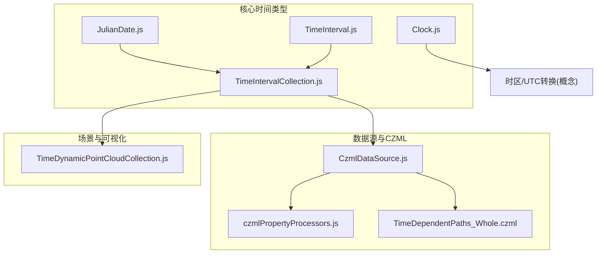
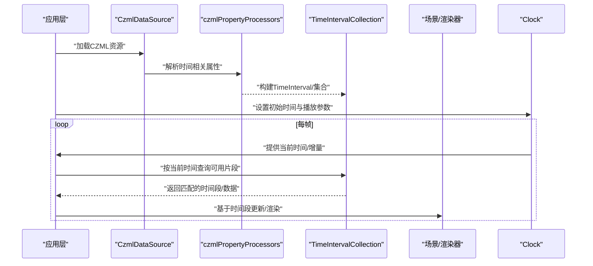
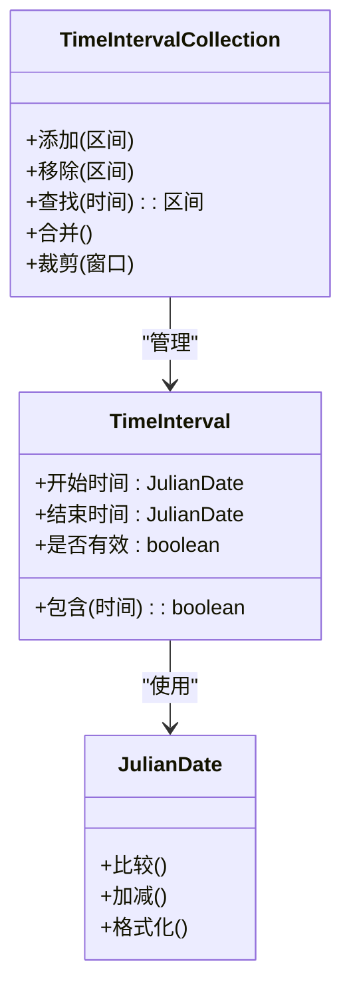
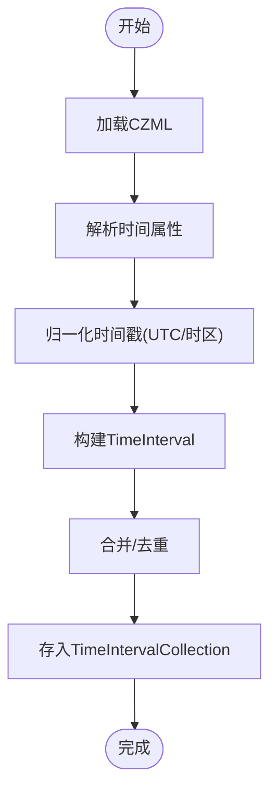
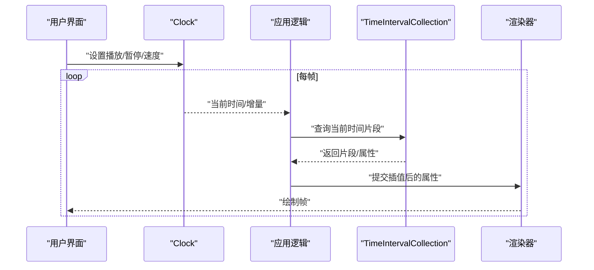
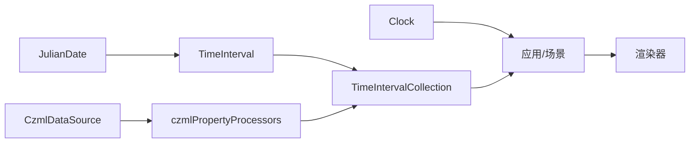

# 时间动态处理

<cite>
**本文引用的文件**   
- [JulianDate.js](file://Source/Core/JulianDate.js)
- [TimeInterval.js](file://Source/Core/TimeInterval.js)
- [TimeIntervalCollection.js](file://Source/Core/TimeIntervalCollection.js)
- [CzmlDataSource.js](file://Source/DataSources/CzmlDataSource.js)
- [czmlPropertyProcessors.js](file://Source/DataSources/CzmlDataSource/czmlPropertyProcessors.js)
- [Clock.js](file://Source/Core/Clock.js)
- [TimeDynamicPointCloudCollection.js](file://Source/Scene/TimeDynamicPointCloudCollection.js)
- [TimeDependentPaths_Whole.czml](file://Apps/SampleData/TimeDependentPaths_Whole.czml)
</cite>

## 目录
1. [简介](#简介)
2. [项目结构](#项目结构)
3. [核心组件](#核心组件)
4. [架构总览](#架构总览)
5. [详细组件分析](#详细组件分析)
6. [依赖关系分析](#依赖关系分析)
7. [性能考虑](#性能考虑)
8. [故障排查指南](#故障排查指南)
9. [结论](#结论)
10. [附录](#附录)

## 简介
本技术文档聚焦于 Cesium 的时间动态处理系统，围绕以下目标展开：
- 深入解析 JulianDate 儒略日系统的实现原理与时间表示方法
- 详细说明 TimeInterval 与 TimeIntervalCollection 的数据结构设计及使用模式
- 阐述时间序列数据的存储、查询、插值等核心算法思路
- 提供丰富的代码示例路径，展示如何创建时间范围、处理时间动画、基于时间的数据过滤与渲染
- 说明 CZML 格式中时间相关属性的解析与处理机制
- 讨论时区处理、时间同步、性能优化等关键技术问题

## 项目结构
与时间动态处理相关的核心源码位于 Source/Core 与 Source/DataSources 等目录，示例数据位于 Apps/SampleData。下图给出与本主题直接相关的文件组织概览。

图表来源
- [JulianDate.js](file://Source/Core/JulianDate.js)
- [TimeInterval.js](file://Source/Core/TimeInterval.js)
- [TimeIntervalCollection.js](file://Source/Core/TimeIntervalCollection.js)
- [Clock.js](file://Source/Core/Clock.js)
- [CzmlDataSource.js](file://Source/DataSources/CzmlDataSource.js)
- [czmlPropertyProcessors.js](file://Source/DataSources/CzmlDataSource/czmlPropertyProcessors.js)
- [TimeDependentPaths_Whole.czml](file://Apps/SampleData/TimeDependentPaths_Whole.czml)
- [TimeDynamicPointCloudCollection.js](file://Source/Scene/TimeDynamicPointCloudCollection.js)

章节来源
- [JulianDate.js](file://Source/Core/JulianDate.js)
- [TimeInterval.js](file://Source/Core/TimeInterval.js)
- [TimeIntervalCollection.js](file://Source/Core/TimeIntervalCollection.js)
- [Clock.js](file://Source/Core/Clock.js)
- [CzmlDataSource.js](file://Source/DataSources/CzmlDataSource.js)
- [czmlPropertyProcessors.js](file://Source/DataSources/CzmlDataSource/czmlPropertyProcessors.js)
- [TimeDependentPaths_Whole.czml](file://Apps/SampleData/TimeDependentPaths_Whole.czml)
- [TimeDynamicPointCloudCollection.js](file://Source/Scene/TimeDynamicPointCloudCollection.js)

## 核心组件
本节概述时间动态处理的关键构件及其职责：
- JulianDate：统一的时间基准，内部以双精度秒数表示自儒略纪元以来的时间，支持高精度比较、算术运算与时区/日历转换
- TimeInterval：表示一个闭区间或半开区间的时间段，包含起止时间与可选的“是否有效”标志
- TimeIntervalCollection：管理多个 TimeInterval 的集合，提供高效的插入、合并、查找与按时间切片访问能力
- Clock：驱动仿真时钟，控制当前时间推进、播放速率、循环策略等，为上层动画与渲染提供时间步长
- CzmlDataSource 与 czmlPropertyProcessors：负责加载并解析 CZML 中的时间属性（如 clock、position 的时间戳数组），将其转换为内部时间数据结构
- TimeDynamicPointCloudCollection：面向点云的时序数据容器，结合时间范围进行可视化的按需加载与剔除

章节来源
- [JulianDate.js](file://Source/Core/JulianDate.js)
- [TimeInterval.js](file://Source/Core/TimeInterval.js)
- [TimeIntervalCollection.js](file://Source/Core/TimeIntervalCollection.js)
- [Clock.js](file://Source/Core/Clock.js)
- [CzmlDataSource.js](file://Source/DataSources/CzmlDataSource.js)
- [czmlPropertyProcessors.js](file://Source/DataSources/CzmlDataSource/czmlPropertyProcessors.js)
- [TimeDynamicPointCloudCollection.js](file://Source/Scene/TimeDynamicPointCloudCollection.js)

## 架构总览
下图展示了从 CZML 到渲染管线的时间数据处理流程，以及各组件之间的交互关系。

图表来源
- [CzmlDataSource.js](file://Source/DataSources/CzmlDataSource.js)
- [czmlPropertyProcessors.js](file://Source/DataSources/CzmlDataSource/czmlPropertyProcessors.js)
- [TimeIntervalCollection.js](file://Source/Core/TimeIntervalCollection.js)
- [Clock.js](file://Source/Core/Clock.js)

## 详细组件分析

### JulianDate 儒略日系统
- 设计要点
  - 使用双精度秒数作为内部时间单位，保证长时间跨度的数值稳定性
  - 提供与标准库 Date 的互操作接口，便于与浏览器生态集成
  - 支持高精度比较与算术运算，避免浮点误差累积
- 复杂度与特性
  - 比较与基本运算为 O(1)
  - 日期/时间格式化与转换可能涉及额外计算，但通常开销可控
- 典型用法
  - 创建时间点、计算时间差、判断先后顺序、在时间轴上进行步进

章节来源
- [JulianDate.js](file://Source/Core/JulianDate.js)

### TimeInterval 与 TimeIntervalCollection
- 数据结构
  - TimeInterval：包含开始时间、结束时间、有效性标记；可嵌套或组合形成更复杂的时段语义
  - TimeIntervalCollection：维护有序的时间段集合，支持快速查找、合并重叠区间、按时间切片访问
- 核心算法思路
  - 插入与合并：对新增区间进行排序与合并，减少冗余
  - 查找：二分查找定位包含给定时间的区间
  - 裁剪：根据外部时间窗口裁剪集合，降低内存占用
- 复杂度
  - 插入/合并：均摊 O(log n) 到 O(n)，取决于实现细节
  - 查找：O(log n)
- 使用模式
  - 将 CZML 解析出的时间戳序列转换为一系列 TimeInterval
  - 在动画循环中，依据当前时间查询对应片段，驱动属性插值与渲染

图表来源
- [JulianDate.js](file://Source/Core/JulianDate.js)
- [TimeInterval.js](file://Source/Core/TimeInterval.js)
- [TimeIntervalCollection.js](file://Source/Core/TimeIntervalCollection.js)

章节来源
- [TimeInterval.js](file://Source/Core/TimeInterval.js)
- [TimeIntervalCollection.js](file://Source/Core/TimeIntervalCollection.js)

### CZML 时间属性解析与处理
- 解析流程
  - CzmlDataSource 读取 CZML 文本/JSON
  - czmlPropertyProcessors 识别时间相关字段（例如 clock、position 的时间戳数组）
  - 将时间戳序列转换为内部时间结构（JulianDate 与 TimeInterval）
  - 填充至 TimeIntervalCollection，供上层查询
- 关键注意事项
  - 时间戳需归一化为 UTC 或明确时区偏移
  - 重复或无序时间戳需要预处理（去重、排序）
  - 大数组建议分块解析，避免主线程阻塞

图表来源
- [CzmlDataSource.js](file://Source/DataSources/CzmlDataSource.js)
- [czmlPropertyProcessors.js](file://Source/DataSources/CzmlDataSource/czmlPropertyProcessors.js)

章节来源
- [CzmlDataSource.js](file://Source/DataSources/CzmlDataSource.js)
- [czmlPropertyProcessors.js](file://Source/DataSources/CzmlDataSource/czmlPropertyProcessors.js)

### 时间动画与渲染联动
- 驱动方式
  - Clock 提供当前时间与增量，应用层据此更新模型状态
  - 通过 TimeIntervalCollection 查询当前时间对应的数据片段
  - 将插值结果传递给渲染管线（位置、颜色、可见性等）
- 示例参考
  - 路径动画：参考示例 CZML 文件中的时间依赖路径定义
  - 点云时序：参考 TimeDynamicPointCloudCollection 的使用模式

图表来源
- [Clock.js](file://Source/Core/Clock.js)
- [TimeIntervalCollection.js](file://Source/Core/TimeIntervalCollection.js)
- [TimeDynamicPointCloudCollection.js](file://Source/Scene/TimeDynamicPointCloudCollection.js)

章节来源
- [Clock.js](file://Source/Core/Clock.js)
- [TimeDynamicPointCloudCollection.js](file://Source/Scene/TimeDynamicPointCloudCollection.js)

### 代码示例路径（不含具体代码内容）
- 创建时间范围与时间点
  - 参考：[JulianDate.js](file://Source/Core/JulianDate.js)
- 构建与管理时间区间集合
  - 参考：[TimeInterval.js](file://Source/Core/TimeInterval.js)、[TimeIntervalCollection.js](file://Source/Core/TimeIntervalCollection.js)
- 解析 CZML 时间属性
  - 参考：[CzmlDataSource.js](file://Source/DataSources/CzmlDataSource.js)、[czmlPropertyProcessors.js](file://Source/DataSources/CzmlDataSource/czmlPropertyProcessors.js)
- 示例数据
  - 参考：[TimeDependentPaths_Whole.czml](file://Apps/SampleData/TimeDependentPaths_Whole.czml)
- 时序点云可视化
  - 参考：[TimeDynamicPointCloudCollection.js](file://Source/Scene/TimeDynamicPointCloudCollection.js)

## 依赖关系分析
- 组件耦合
  - TimeIntervalCollection 强依赖 TimeInterval 与 JulianDate
  - CzmlDataSource 依赖 czmlPropertyProcessors 进行时间属性解析
  - 渲染层依赖 Clock 提供的当前时间，并通过 TimeIntervalCollection 获取数据片段
- 外部依赖与集成点
  - 浏览器 Date API 用于与外部时间系统集成
  - CZML 规范定义了时间字段的语义，解析器需严格遵循

图表来源
- [JulianDate.js](file://Source/Core/JulianDate.js)
- [TimeInterval.js](file://Source/Core/TimeInterval.js)
- [TimeIntervalCollection.js](file://Source/Core/TimeIntervalCollection.js)
- [CzmlDataSource.js](file://Source/DataSources/CzmlDataSource.js)
- [czmlPropertyProcessors.js](file://Source/DataSources/CzmlDataSource/czmlPropertyProcessors.js)
- [Clock.js](file://Source/Core/Clock.js)

章节来源
- [JulianDate.js](file://Source/Core/JulianDate.js)
- [TimeInterval.js](file://Source/Core/TimeInterval.js)
- [TimeIntervalCollection.js](file://Source/Core/TimeIntervalCollection.js)
- [CzmlDataSource.js](file://Source/DataSources/CzmlDataSource.js)
- [czmlPropertyProcessors.js](file://Source/DataSources/CzmlDataSource/czmlPropertyProcessors.js)
- [Clock.js](file://Source/Core/Clock.js)

## 性能考虑
- 时间戳预处理
  - 对 CZML 中的时间戳进行去重与排序，避免运行时重复计算
- 区间合并与裁剪
  - 在加载阶段合并重叠区间，并按视口时间窗口裁剪，降低内存与查询成本
- 批量更新与插值
  - 将多对象在同一时间片内的更新合并，减少 GPU 提交次数
- 异步与分块
  - 大文件 CZML 采用流式/分块解析，避免主线程卡顿
- 缓存策略
  - 缓存最近时间片的查询结果，提高回放与快进时的命中率

## 故障排查指南
- 时间不一致
  - 检查 CZML 中时间戳是否已归一化为 UTC，必要时进行时区偏移校正
- 区间未命中
  - 确认 TimeIntervalCollection 的查找边界条件（开/闭区间）是否与业务一致
- 动画跳变
  - 检查插值函数与时间步长，确保相邻时间片之间属性连续
- 性能抖动
  - 观察是否存在大量区间合并/重建，考虑在加载阶段预计算
- 解析错误
  - 校验 CZML 时间字段是否符合规范，关注缺失或非法时间戳

章节来源
- [CzmlDataSource.js](file://Source/DataSources/CzmlDataSource.js)
- [czmlPropertyProcessors.js](file://Source/DataSources/CzmlDataSource/czmlPropertyProcessors.js)
- [TimeIntervalCollection.js](file://Source/Core/TimeIntervalCollection.js)

## 结论
Cesium 的时间动态处理体系以 JulianDate 为基础，结合 TimeInterval 与 TimeIntervalCollection 提供了高效、可扩展的时间序列管理能力。通过 CzmlDataSource 与 czmlPropertyProcessors 的协同，CZML 中的时间属性被可靠地转换为内部结构，并在 Clock 的驱动下参与渲染管线。合理的预处理、区间管理与插值策略是保障性能与稳定性的关键。

## 附录
- 术语
  - 儒略日：一种连续计数的时间表示法，适合长时间跨度计算
  - 时间区间：具有起止时间的时间段，可用于描述数据可用性
  - 时间切片：在某一时刻或短时间窗口内可用的数据片段
- 最佳实践
  - 始终在加载阶段完成时间戳规范化与区间合并
  - 使用统一的 UTC 时间基准，避免时区漂移
  - 为大体积时序数据建立索引与缓存，提升查询效率