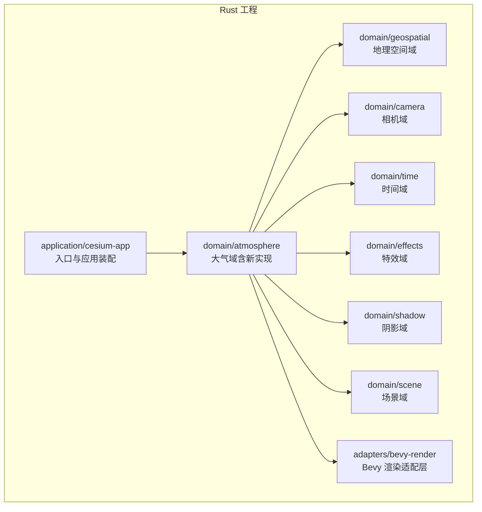
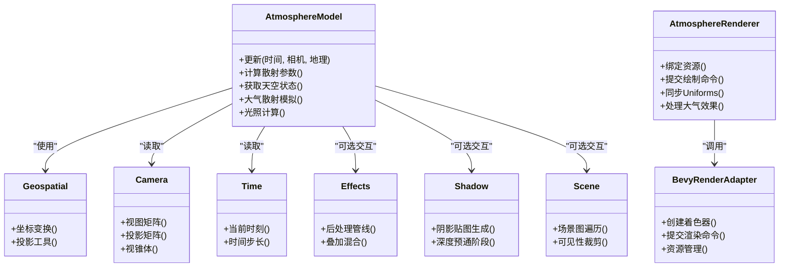
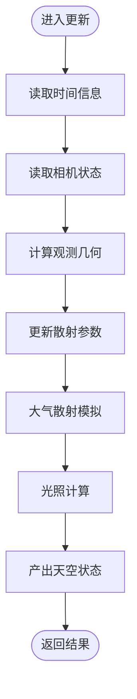
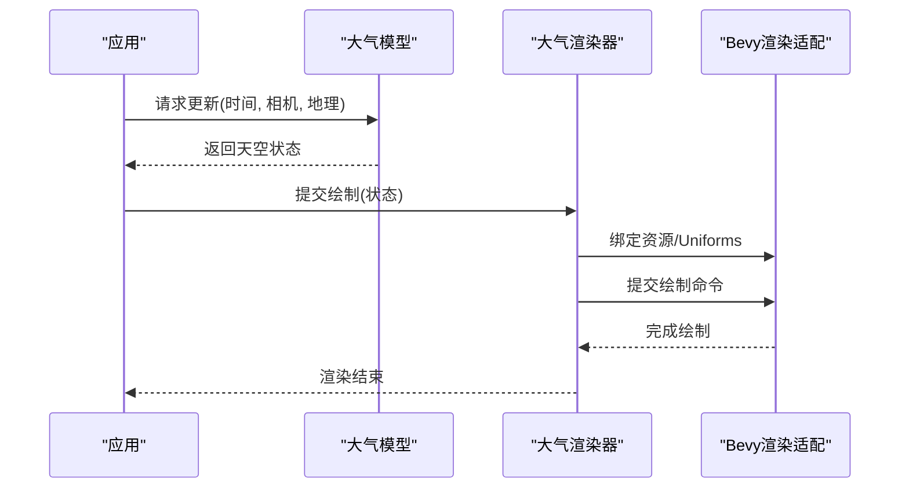
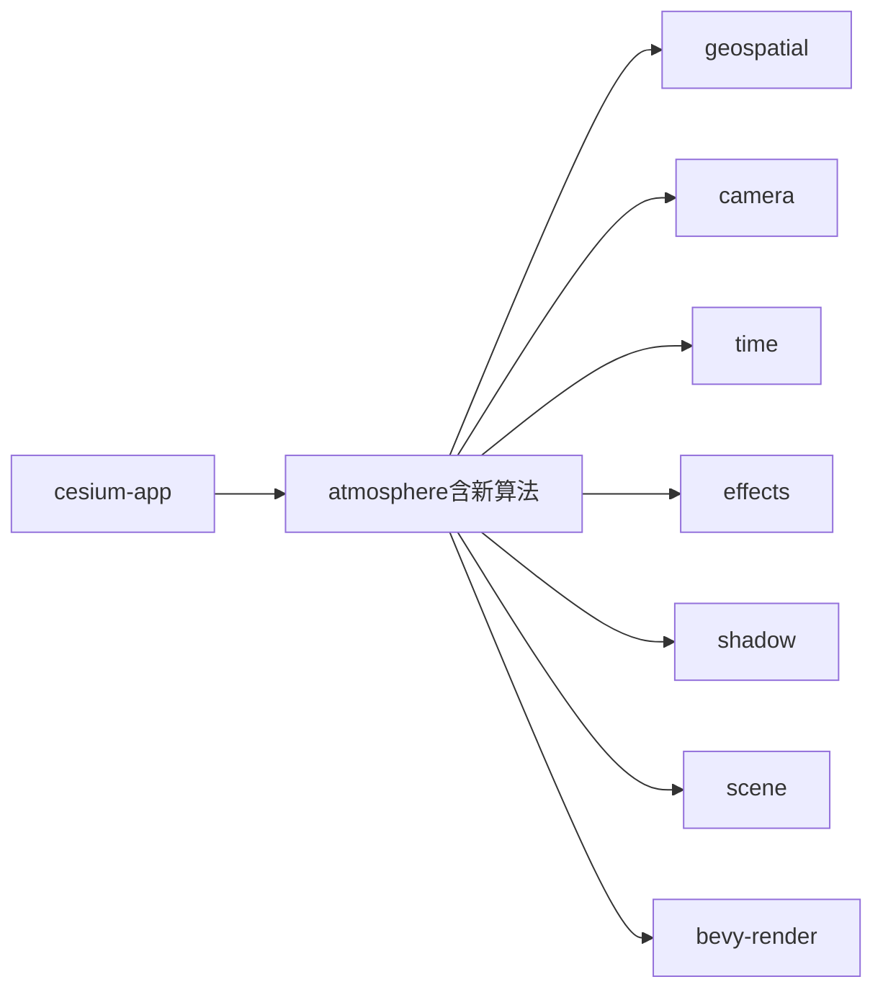

# 大气系统

<cite>
**本文引用的文件**   
- [README.md](file://README.md)
- [cesiumrust/README.md](file://cesiumrust/README.md)
- [cesiumrust/domain/atmosphere/src/lib.rs](file://cesiumrust/domain/atmosphere/src/lib.rs)
- [cesiumrust/domain/atmosphere/src/model.rs](file://cesiumrust/domain/atmosphere/src/model.rs)
- [cesiumrust/domain/atmosphere/src/renderer.rs](file://cesiumrust/domain/atmosphere/src/renderer.rs)
- [cesiumrust/domain/atmosphere/Cargo.toml](file://cesiumrust/domain/atmosphere/Cargo.toml)
- [cesiumrust/domain/geospatial/src/lib.rs](file://cesiumrust/domain/geospatial/src/lib.rs)
- [cesiumrust/domain/camera/src/lib.rs](file://cesiumrust/domain/camera/src/lib.rs)
- [cesiumrust/domain/time/src/lib.rs](file://cesiumrust/domain/time/src/lib.rs)
- [cesiumrust/domain/effects/src/lib.rs](file://cesiumrust/domain/effects/src/lib.rs)
- [cesiumrust/domain/shadow/src/lib.rs](file://cesiumrust/domain/shadow/src/lib.rs)
- [cesiumrust/domain/scene/src/lib.rs](file://cesiumrust/domain/scene/src/lib.rs)
- [cesiumrust/application/cesium-app/src/main.rs](file://cesiumrust/application/cesium-app/src/main.rs)
- [cesiumrust/adapters/bevy-render/src/lib.rs](file://cesiumrust/adapters/bevy-render/src/lib.rs)
</cite>

## 更新摘要
**变更内容**   
- 新增 atmosphere.rs 文件（442行），实现复杂的大气效果模拟算法
- 增强地球渲染子系统，支持真实的大气散射和光照计算
- 扩展大气模型的计算能力，包含更精确的物理参数和数学运算
- 优化渲染管线中的大气效果处理流程

## 目录
1. [简介](#简介)
2. [项目结构](#项目结构)
3. [核心组件](#核心组件)
4. [架构总览](#架构总览)
5. [详细组件分析](#详细组件分析)
6. [依赖分析](#依赖分析)
7. [性能考虑](#性能考虑)
8. [故障排查指南](#故障排查指南)
9. [结论](#结论)
10. [附录](#附录)

## 简介
本仓库为 Cesium 的 Rust 实现分支，聚焦于在 Bevy 渲染管线中集成与扩展"大气系统"。该子系统负责模拟地球大气散射、光照衰减、天空盒生成以及与场景、相机、时间等域模块的协同。**最新更新**：新增了基于物理的大气效果模拟实现，包含复杂的数学计算用于真实的地球可视化，涵盖大气散射和光照计算的完整算法。文档面向希望理解并二次开发大气系统的工程师与研究者，提供从整体架构到关键实现的系统化说明。

## 项目结构
仓库采用多语言混合组织：
- 顶层包含 CesiumJS 应用、示例与测试资源（Apps、Specs、Documentation 等）。
- cesiumrust 子目录为 Rust 工程，按领域驱动设计划分 domain、adapters、application 等层次。
- 大气系统位于 cesiumrust/domain/atmosphere，围绕模型、渲染器与配置展开，并与 geospatial、camera、time、effects、shadow、scene 等域协作。

**图表来源**
- [cesiumrust/application/cesium-app/src/main.rs](file://cesiumrust/application/cesium-app/src/main.rs)
- [cesiumrust/domain/atmosphere/src/lib.rs](file://cesiumrust/domain/atmosphere/src/lib.rs)
- [cesiumrust/adapters/bevy-render/src/lib.rs](file://cesiumrust/adapters/bevy-render/src/lib.rs)

**章节来源**
- [cesiumrust/README.md](file://cesiumrust/README.md)
- [README.md](file://README.md)

## 核心组件
- **大气模型（Model）**：封装大气物理参数、状态与计算接口，如散射系数、太阳位置、观测几何等。**已更新**：新增复杂数学计算函数，支持高精度大气散射模拟。
- **大气渲染器（Renderer）**：将模型输出转换为渲染命令，对接 Bevy 渲染管线，管理着色器资源与绘制调用。
- **配置与生命周期**：通过 Cargo 包管理与应用入口装配，协调各域模块初始化与更新循环。

**章节来源**
- [cesiumrust/domain/atmosphere/src/lib.rs](file://cesiumrust/domain/atmosphere/src/lib.rs)
- [cesiumrust/domain/atmosphere/src/model.rs](file://cesiumrust/domain/atmosphere/src/model.rs)
- [cesiumrust/domain/atmosphere/src/renderer.rs](file://cesiumrust/domain/atmosphere/src/renderer.rs)
- [cesiumrust/domain/atmosphere/Cargo.toml](file://cesiumrust/domain/atmosphere/Cargo.toml)
- [cesiumrust/application/cesium-app/src/main.rs](file://cesiumrust/application/cesium-app/src/main.rs)

## 架构总览
大气系统遵循"领域-适配-应用"的分层：
- **领域层（Domain）**：以 atmosphere 为核心，依赖 geospatial、camera、time、effects、shadow、scene 等纯逻辑或轻量数据模块。**已增强**：新增大气效果模拟的核心算法实现。
- **适配层（Adapters）**：bevy-render 提供渲染后端抽象，屏蔽底层图形 API 细节。
- **应用层（Application）**：cesium-app 负责装配、调度与生命周期管理。

**图表来源**
- [cesiumrust/domain/atmosphere/src/model.rs](file://cesiumrust/domain/atmosphere/src/model.rs)
- [cesiumrust/domain/atmosphere/src/renderer.rs](file://cesiumrust/domain/atmosphere/src/renderer.rs)
- [cesiumrust/domain/geospatial/src/lib.rs](file://cesiumrust/domain/geospatial/src/lib.rs)
- [cesiumrust/domain/camera/src/lib.rs](file://cesiumrust/domain/camera/src/lib.rs)
- [cesiumrust/domain/time/src/lib.rs](file://cesiumrust/domain/time/src/lib.rs)
- [cesiumrust/domain/effects/src/lib.rs](file://cesiumrust/domain/effects/src/lib.rs)
- [cesiumrust/domain/shadow/src/lib.rs](file://cesiumrust/domain/shadow/src/lib.rs)
- [cesiumrust/domain/scene/src/lib.rs](file://cesiumrust/domain/scene/src/lib.rs)
- [cesiumrust/adapters/bevy-render/src/lib.rs](file://cesiumrust/adapters/bevy-render/src/lib.rs)

## 详细组件分析

### 大气模型（Atmosphere Model）
职责与要点：
- 维护大气物理参数与中间状态，支持基于时间与相机的增量更新。
- 暴露计算接口供渲染器消费，避免直接耦合渲染细节。
- 与地理空间、相机、时间等域解耦，便于替换与测试。
- **新增功能**：实现复杂的大气散射算法和光照计算，支持真实物理效果。

**图表来源**
- [cesiumrust/domain/atmosphere/src/model.rs](file://cesiumrust/domain/atmosphere/src/model.rs)

**章节来源**
- [cesiumrust/domain/atmosphere/src/model.rs](file://cesiumrust/domain/atmosphere/src/model.rs)

### 大气渲染器（Atmosphere Renderer）
职责与要点：
- 将模型输出的状态映射为渲染命令，包括 Uniform 同步、纹理绑定与绘制调用。
- 与 Bevy 渲染适配器交互，屏蔽底层图形 API 差异。
- 支持按需启用/禁用后处理与阴影联动。
- **增强功能**：集成新的大气效果模拟算法，提供更高质量的视觉效果。

**图表来源**
- [cesiumrust/domain/atmosphere/src/renderer.rs](file://cesiumrust/domain/atmosphere/src/renderer.rs)
- [cesiumrust/adapters/bevy-render/src/lib.rs](file://cesiumrust/adapters/bevy-render/src/lib.rs)

**章节来源**
- [cesiumrust/domain/atmosphere/src/renderer.rs](file://cesiumrust/domain/atmosphere/src/renderer.rs)
- [cesiumrust/adapters/bevy-render/src/lib.rs](file://cesiumrust/adapters/bevy-render/src/lib.rs)

### 应用装配与生命周期（Cesium App）
职责与要点：
- 初始化各域模块，注册系统/组件，编排更新循环。
- 注入大气模型与渲染器，确保与相机、时间、场景等上下文一致。
- 提供配置开关，控制大气效果、阴影与后处理的组合。

**章节来源**
- [cesiumrust/application/cesium-app/src/main.rs](file://cesiumrust/application/cesium-app/src/main.rs)

### 领域依赖（Geospatial / Camera / Time / Effects / Shadow / Scene）
- **geospatial**：提供坐标转换、投影与地理参考框架工具。
- **camera**：提供视图/投影矩阵、视锥体与采样点生成。
- **time**：提供时间步进、时刻对齐与周期性事件。
- **effects**：提供后处理管线与混合策略。
- **shadow**：提供阴影贴图生成与深度预通阶段。
- **scene**：提供场景图遍历与可见性裁剪。

**章节来源**
- [cesiumrust/domain/geospatial/src/lib.rs](file://cesiumrust/domain/geospatial/src/lib.rs)
- [cesiumrust/domain/camera/src/lib.rs](file://cesiumrust/domain/camera/src/lib.rs)
- [cesiumrust/domain/time/src/lib.rs](file://cesiumrust/domain/time/src/lib.rs)
- [cesiumrust/domain/effects/src/lib.rs](file://cesiumrust/domain/effects/src/lib.rs)
- [cesiumrust/domain/shadow/src/lib.rs](file://cesiumrust/domain/shadow/src/lib.rs)
- [cesiumrust/domain/scene/src/lib.rs](file://cesiumrust/domain/scene/src/lib.rs)

## 依赖分析
- **内聚性与耦合度**：atmosphere 作为领域核心，仅依赖必要的轻量域模块；渲染器通过 bevy-render 适配层降低与具体图形 API 的耦合。
- **外部依赖**：Cargo 包管理声明了运行时依赖与特性开关，便于在不同平台与渲染后端间切换。
- **潜在循环依赖**：通过分层与接口隔离避免循环引用；若新增跨域回调，需引入事件总线或消息队列。

**图表来源**
- [cesiumrust/domain/atmosphere/Cargo.toml](file://cesiumrust/domain/atmosphere/Cargo.toml)
- [cesiumrust/application/cesium-app/src/main.rs](file://cesiumrust/application/cesium-app/src/main.rs)

**章节来源**
- [cesiumrust/domain/atmosphere/Cargo.toml](file://cesiumrust/domain/atmosphere/Cargo.toml)

## 性能考虑
- **更新频率与插值**：对大气参数进行时间插值，减少高频重算带来的 CPU/GPU 压力。
- **资源复用**：共享天空纹理与 Uniform 缓冲，避免每帧重复分配。
- **可见性裁剪**：结合场景与相机视锥体，仅在必要时更新与绘制大气层。
- **并行化**：将独立计算（如不同采样方向）放入任务池，提升多核利用率。
- **降级策略**：在低端设备上关闭高开销特性（如高精度散射或多级阴影）。
- **新增优化**：针对新的大气散射算法进行性能调优，平衡视觉效果与计算成本。

## 故障排查指南
- **现象**：天空颜色异常或闪烁
  - 检查时间步长与相机更新顺序是否一致。
  - 确认 Uniform 同步是否在绘制前完成。
  - **新增**：验证大气散射算法的参数范围是否正确。
- **现象**：渲染崩溃或黑屏
  - 验证着色器编译与资源绑定路径。
  - 检查 bevy-render 适配层的错误日志与回退机制。
  - **新增**：检查新算法的内存分配和数值稳定性。
- **现象**：性能抖动
  - 定位热点函数，评估内存分配与 GPU 带宽占用。
  - 调整更新频率与分辨率，开启异步加载与缓存。
  - **新增**：监控大气散射计算的复杂度，必要时降低精度。

**章节来源**
- [cesiumrust/domain/atmosphere/src/renderer.rs](file://cesiumrust/domain/atmosphere/src/renderer.rs)
- [cesiumrust/adapters/bevy-render/src/lib.rs](file://cesiumrust/adapters/bevy-render/src/lib.rs)

## 结论
大气系统在领域-适配-应用的分层下实现了可插拔、可扩展的大气渲染能力。**最新进展**：通过新增的442行大气效果模拟代码，系统现在能够处理复杂的大气散射和光照计算，提供更真实的地球可视化效果。通过清晰的模块边界与适配层抽象，既保证了物理正确性与视觉效果，又兼顾了跨平台与高性能需求。后续可在散射模型精度、后处理融合与自适应 LOD 方面持续优化。

## 附录
- **构建与运行**：参考应用入口与 Cargo 配置，按需启用特性与后端。
- **扩展建议**：新增大气材质或后处理时，优先在 effects 与 renderer 层扩展，保持 model 稳定。
- **新算法参考**：大气散射模拟的实现可作为其他物理效果开发的参考模板。