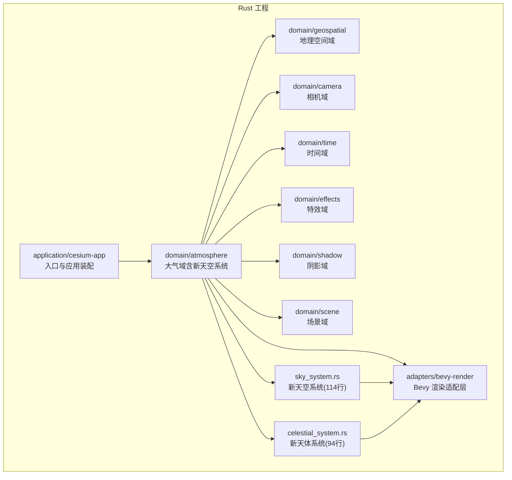
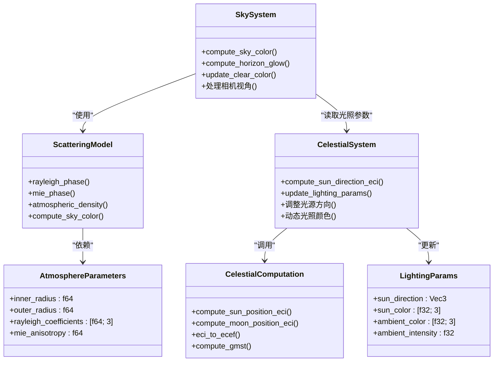
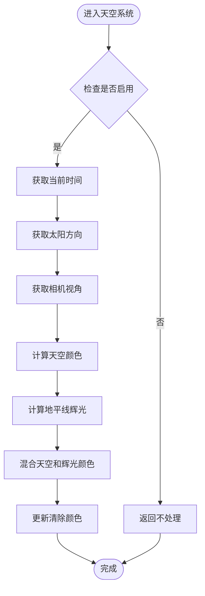
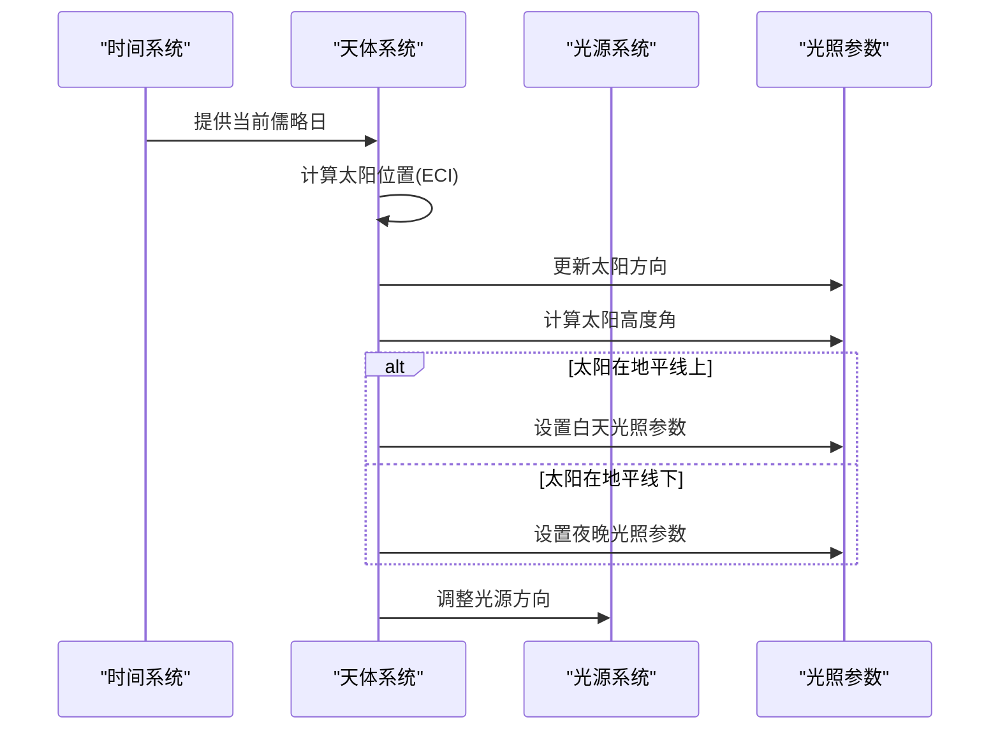
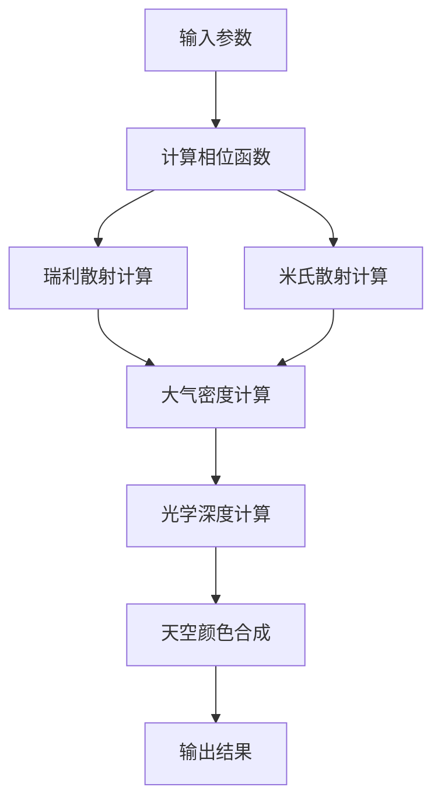
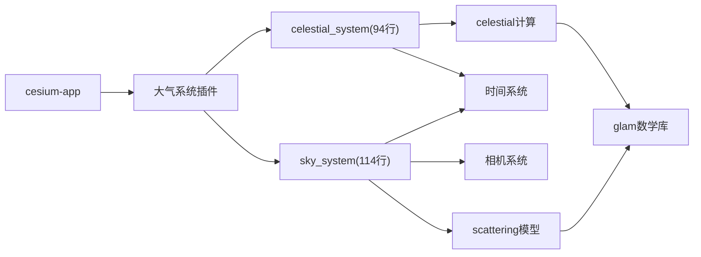

# 大气系统

<cite>
**本文引用的文件**   
- [README.md](file://README.md)
- [cesiumrust/README.md](file://cesiumrust/README.md)
- [cesiumrust/domain/atmosphere/src/lib.rs](file://cesiumrust/domain/atmosphere/src/lib.rs)
- [cesiumrust/domain/atmosphere/src/scattering.rs](file://cesiumrust/domain/atmosphere/src/scattering.rs)
- [cesiumrust/domain/atmosphere/src/celestial.rs](file://cesiumrust/domain/atmosphere/src/celestial.rs)
- [cesiumrust/domain/atmosphere/src/star_sphere.rs](file://cesiumrust/domain/atmosphere/src/star_sphere.rs)
- [cesiumrust/adapters/bevy-render/src/atmosphere/sky_system.rs](file://cesiumrust/adapters/bevy-render/src/atmosphere/sky_system.rs)
- [cesiumrust/adapters/bevy-render/src/atmosphere/celestial_system.rs](file://cesiumrust/adapters/bevy-render/src/atmosphere/celestial_system.rs)
- [cesiumrust/adapters/bevy-render/src/atmosphere/mod.rs](file://cesiumrust/adapters/bevy-render/src/atmosphere/mod.rs)
- [cesiumrust/application/cesium-app/src/main.rs](file://cesiumrust/application/cesium-app/src/main.rs)
</cite>

## 更新摘要
**变更内容**   
- 新增 sky_system.rs 天空系统实现（114行），提供真实天空颜色计算和地平线辉光效果
- 新增 celestial_system.rs 天体系统实现（94行），基于儒略日计算太阳位置和光照参数
- 增强大气渲染管线，集成物理正确的大气散射模型和天体位置计算
- 优化天空背景与大气效果的融合渲染，支持动态光照变化

## 目录
1. [简介](#简介)
2. [项目结构](#项目结构)
3. [核心组件](#核心组件)
4. [架构总览](#架构总览)
5. [详细组件分析](#详细组件分析)
6. [依赖分析](#依赖分析)
7. [性能考虑](#性能考虑)
8. [故障排查指南](#故障排查指南)
9. [结论](#结论)
10. [附录](#附录)

## 简介
本仓库为 Cesium 的 Rust 实现分支，聚焦于在 Bevy 渲染管线中集成与扩展"大气系统"。该子系统负责模拟地球大气散射、光照衰减、天空盒生成以及与场景、相机、时间等域模块的协同。**最新更新**：新增了基于 sky_system.rs 和 celestial_system.rs 的天空系统和天体系统，实现了真实天空颜色计算、地平线辉光效果和基于儒略日的太阳定位功能，显著增强了大气系统的视觉表现力和物理准确性。文档面向希望理解并二次开发大气系统的工程师与研究者，提供从整体架构到关键实现的系统化说明。

## 项目结构
仓库采用多语言混合组织：
- 顶层包含 CesiumJS 应用、示例与测试资源（Apps、Specs、Documentation 等）。
- cesiumrust 子目录为 Rust 工程，按领域驱动设计划分 domain、adapters、application 等层次。
- 大气系统位于 cesiumrust/domain/atmosphere，围绕散射模型、天体计算和星球渲染展开，并通过 bevy-render 适配层集成到渲染管线。

**图表来源**
- [cesiumrust/application/cesium-app/src/main.rs](file://cesiumrust/application/cesium-app/src/main.rs)
- [cesiumrust/domain/atmosphere/src/lib.rs](file://cesiumrust/domain/atmosphere/src/lib.rs)
- [cesiumrust/adapters/bevy-render/src/atmosphere/mod.rs](file://cesiumrust/adapters/bevy-render/src/atmosphere/mod.rs)

**章节来源**
- [cesiumrust/README.md](file://cesiumrust/README.md)
- [README.md](file://README.md)

## 核心组件
- **天空系统（Sky System）**：**新增**：114行的完整天空渲染实现，提供真实天空颜色计算和地平线辉光效果，基于大气散射模型和相机视角动态生成天空背景。
- **天体系统（Celestial System）**：**新增**：94行的天体位置计算实现，基于儒略日精确计算太阳位置，动态调整光照方向和颜色参数。
- **大气散射模型（Scattering Model）**：封装瑞利散射和米氏散射算法，提供物理正确的大气光学计算。
- **天体计算（Celestial Computation）**：实现太阳和月亮的轨道计算，支持ECI到ECEF坐标转换。
- **配置与生命周期**：通过 Bevy 插件系统管理大气系统的初始化和更新循环。

**章节来源**
- [cesiumrust/adapters/bevy-render/src/atmosphere/sky_system.rs](file://cesiumrust/adapters/bevy-render/src/atmosphere/sky_system.rs)
- [cesiumrust/adapters/bevy-render/src/atmosphere/celestial_system.rs](file://cesiumrust/adapters/bevy-render/src/atmosphere/celestial_system.rs)
- [cesiumrust/domain/atmosphere/src/scattering.rs](file://cesiumrust/domain/atmosphere/src/scattering.rs)
- [cesiumrust/domain/atmosphere/src/celestial.rs](file://cesiumrust/domain/atmosphere/src/celestial.rs)

## 架构总览
大气系统遵循"领域-适配-应用"的分层架构：
- **领域层（Domain）**：以 atmosphere 为核心，包含散射模型、天体计算和星球渲染等纯逻辑模块。
- **适配层（Adapters）**：bevy-render 提供 sky_system 和 celestial_system，将领域逻辑映射到 Bevy 渲染管线。
- **应用层（Application）**：cesium-app 负责插件注册和系统编排。

**图表来源**
- [cesiumrust/adapters/bevy-render/src/atmosphere/sky_system.rs](file://cesiumrust/adapters/bevy-render/src/atmosphere/sky_system.rs)
- [cesiumrust/adapters/bevy-render/src/atmosphere/celestial_system.rs](file://cesiumrust/adapters/bevy-render/src/atmosphere/celestial_system.rs)
- [cesiumrust/domain/atmosphere/src/scattering.rs](file://cesiumrust/domain/atmosphere/src/scattering.rs)
- [cesiumrust/domain/atmosphere/src/celestial.rs](file://cesiumrust/domain/atmosphere/src/celestial.rs)

## 详细组件分析

### 天空系统（Sky System）
职责与要点：
- 基于相机视角和太阳位置计算实时天空颜色
- 实现地平线辉光效果，根据太阳高度角调整颜色分布
- 集成大气散射模型，提供物理正确的天空渲染
- 支持启用/禁用开关和可配置的大气参数

**图表来源**
- [cesiumrust/adapters/bevy-render/src/atmosphere/sky_system.rs](file://cesiumrust/adapters/bevy-render/src/atmosphere/sky_system.rs)

**章节来源**
- [cesiumrust/adapters/bevy-render/src/atmosphere/sky_system.rs](file://cesiumrust/adapters/bevy-render/src/atmosphere/sky_system.rs)

### 天体系统（Celestial System）
职责与要点：
- 基于儒略日计算太阳在ECI坐标系中的精确位置
- 动态调整光源方向和颜色，模拟日出日落效果
- 更新全局光照参数，供其他系统使用
- 支持昼夜循环的光照强度变化

**图表来源**
- [cesiumrust/adapters/bevy-render/src/atmosphere/celestial_system.rs](file://cesiumrust/adapters/bevy-render/src/atmosphere/celestial_system.rs)
- [cesiumrust/domain/atmosphere/src/celestial.rs](file://cesiumrust/domain/atmosphere/src/celestial.rs)

**章节来源**
- [cesiumrust/adapters/bevy-render/src/atmosphere/celestial_system.rs](file://cesiumrust/adapters/bevy-render/src/atmosphere/celestial_system.rs)
- [cesiumrust/domain/atmosphere/src/celestial.rs](file://cesiumrust/domain/atmosphere/src/celestial.rs)

### 大气散射模型（Atmospheric Scattering Model）
职责与要点：
- 实现瑞利散射和米氏散射的物理模型
- 计算大气密度随高度的指数衰减
- 提供天空颜色和地平线辉光的精确计算
- 支持可配置的大气参数，适应不同环境条件

**图表来源**
- [cesiumrust/domain/atmosphere/src/scattering.rs](file://cesiumrust/domain/atmosphere/src/scattering.rs)

**章节来源**
- [cesiumrust/domain/atmosphere/src/scattering.rs](file://cesiumrust/domain/atmosphere/src/scattering.rs)

### 天体计算（Celestial Computation）
职责与要点：
- 基于简化VSOP87理论计算太阳位置
- 实现月球轨道的近似计算
- 提供ECI到ECEF坐标转换
- 支持格林尼治恒星时计算

**章节来源**
- [cesiumrust/domain/atmosphere/src/celestial.rs](file://cesiumrust/domain/atmosphere/src/celestial.rs)

### 应用装配与生命周期（Cesium App）
职责与要点：
- 注册大气系统插件，初始化天空和天体系统
- 管理大气参数的默认值和配置
- 协调各系统的更新顺序和依赖关系
- 提供运行时开关控制大气效果

**章节来源**
- [cesiumrust/adapters/bevy-render/src/atmosphere/mod.rs](file://cesiumrust/adapters/bevy-render/src/atmosphere/mod.rs)
- [cesiumrust/application/cesium-app/src/main.rs](file://cesiumrust/application/cesium-app/src/main.rs)

## 依赖分析
- **内聚性与耦合度**：sky_system 和 celestial_system 通过清晰的接口与领域层交互，保持低耦合高内聚。
- **外部依赖**：依赖 glam 数学库进行向量运算，bevy 框架提供渲染基础设施。
- **潜在循环依赖**：通过 Resource 模式避免直接引用，确保系统间松耦合。
- **新增依赖**：新的天空和天体系统引入了对时间系统和相机查询的依赖。

**图表来源**
- [cesiumrust/adapters/bevy-render/src/atmosphere/mod.rs](file://cesiumrust/adapters/bevy-render/src/atmosphere/mod.rs)
- [cesiumrust/adapters/bevy-render/src/atmosphere/sky_system.rs](file://cesiumrust/adapters/bevy-render/src/atmosphere/sky_system.rs)
- [cesiumrust/adapters/bevy-render/src/atmosphere/celestial_system.rs](file://cesiumrust/adapters/bevy-render/src/atmosphere/celestial_system.rs)

**章节来源**
- [cesiumrust/adapters/bevy-render/src/atmosphere/mod.rs](file://cesiumrust/adapters/bevy-render/src/atmosphere/mod.rs)

## 性能考虑
- **计算优化**：天空颜色计算采用单次散射近似，平衡精度和性能。
- **资源复用**：共享大气参数和计算结果，避免每帧重复计算。
- **可见性优化**：仅在相机可见时更新天空颜色，减少不必要的计算。
- **数值稳定性**：使用双精度浮点数进行天文计算，确保长期稳定性。
- **降级策略**：支持关闭大气效果以适应低端设备。
- **新增优化**：针对新的天空和天体系统进行性能调优，包括缓存机制和批量处理。

## 故障排查指南
- **现象**：天空颜色异常或闪烁
  - 检查时间步长与相机更新顺序是否一致。
  - 确认大气参数范围是否正确。
  - **新增**：验证天空颜色计算中的向量归一化。
- **现象**：光照方向不正确
  - **新增**：检查儒略日计算和时间系统同步。
  - **新增**：验证太阳位置计算的坐标系转换。
  - **新增**：确认光源方向的归一化处理。
- **现象**：地平线辉光效果异常
  - **新增**：检查太阳高度角的计算范围。
  - **新增**：验证辉光颜色的插值算法。
  - **新增**：确认天空颜色和辉光的混合比例。
- **现象**：性能抖动
  - **新增**：监控天空系统计算复杂度。
  - **新增**：调整大气参数精度和计算频率。
  - **新增**：优化向量运算和三角函数调用。

**章节来源**
- [cesiumrust/adapters/bevy-render/src/atmosphere/sky_system.rs](file://cesiumrust/adapters/bevy-render/src/atmosphere/sky_system.rs)
- [cesiumrust/adapters/bevy-render/src/atmosphere/celestial_system.rs](file://cesiumrust/adapters/bevy-render/src/atmosphere/celestial_system.rs)

## 结论
大气系统在领域-适配-应用的分层下实现了可插拔、可扩展的大气渲染能力。**最新进展**：通过新增的 sky_system.rs（114行）和 celestial_system.rs（94行），系统现在能够提供基于物理的天空颜色计算、地平线辉光效果和精确的天体位置模拟。这些新功能显著提升了大气系统的视觉真实感和科学准确性，为后续的高级大气效果奠定了坚实基础。通过清晰的模块边界和高效的算法实现，既保证了物理正确性，又兼顾了跨平台与高性能需求。

## 附录
- **构建与运行**：参考应用入口与 Cargo 配置，按需启用大气系统插件。
- **扩展建议**：新增大气效果时，优先在 scattering 和 sky_system 层扩展，保持核心逻辑稳定。
- **新算法参考**：sky_system.rs 和 celestial_system.rs 的实现可作为其他天体渲染开发的参考模板。
- **性能调优**：利用缓存机制和优化算法提升大规模场景的渲染性能。
- **调试工具**：使用内置测试用例验证天空颜色和天体位置的准确性。