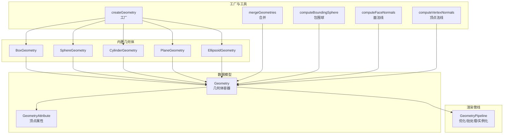
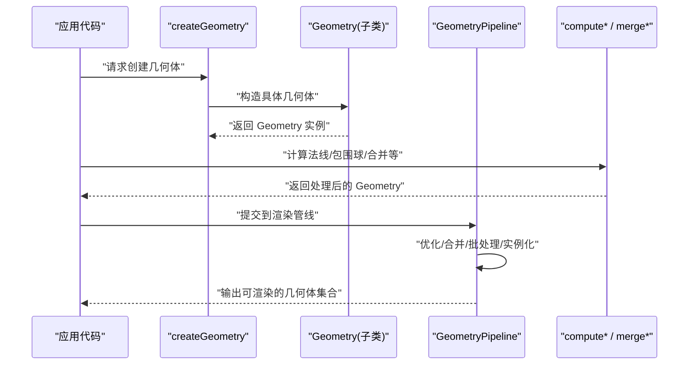
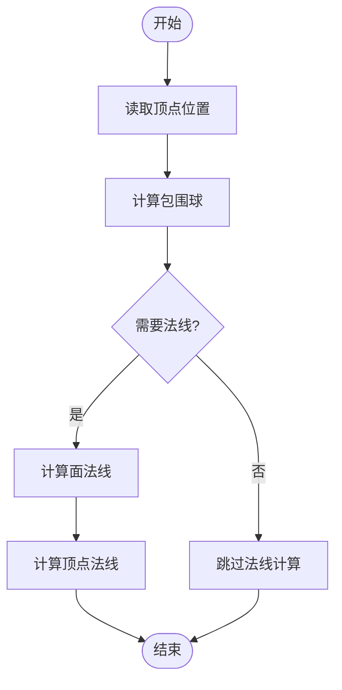
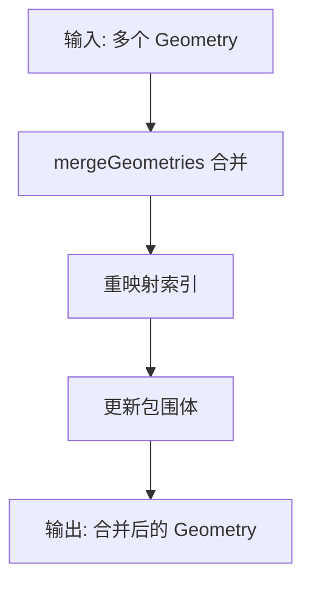
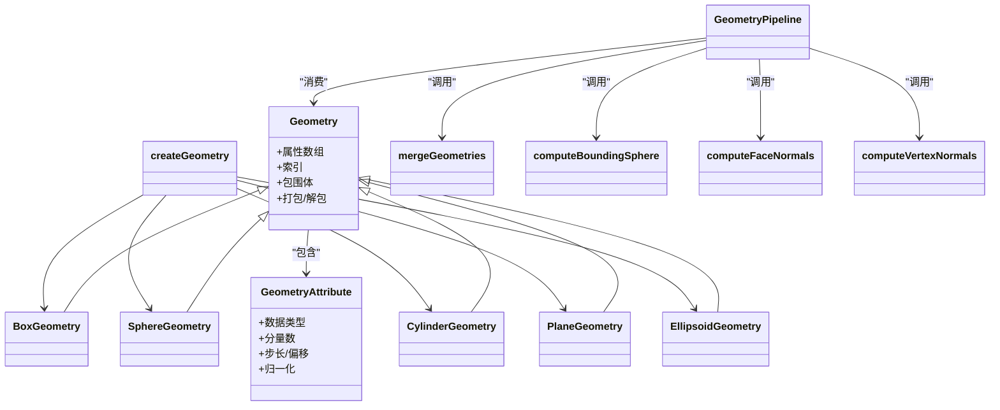

# 几何体处理

<cite>
**本文引用的文件**   
- [Geometry.js](file://Source/Core/Geometry.js)
- [GeometryAttribute.js](file://Source/Core/GeometryAttribute.js)
- [GeometryPipeline.js](file://Source/Core/GeometryPipeline.js)
- [BoxGeometry.js](file://Source/Core/BoxGeometry.js)
- [SphereGeometry.js](file://Source/Core/SphereGeometry.js)
- [CylinderGeometry.js](file://Source/Core/CylinderGeometry.js)
- [PlaneGeometry.js](file://Source/Core/PlaneGeometry.js)
- [EllipsoidGeometry.js](file://Source/Core/EllipsoidGeometry.js)
- [createGeometry.js](file://Source/Core/createGeometry.js)
- [mergeGeometries.js](file://Source/Core/mergeGeometries.js)
- [computeBoundingSphere.js](file://Source/Core/computeBoundingSphere.js)
- [computeFaceNormals.js](file://Source/Core/computeFaceNormals.js)
- [computeVertexNormals.js](file://Source/Core/computeVertexNormals.js)
- [addAtIndex.js](file://Source/Core/addAtIndex.js)
- [removeAtIndex.js](file://Source/Core/removeAtIndex.js)
- [pack.js](file://Source/Core/pack.js)
- [unpack.js](file://Source/Core/unpack.js)
</cite>

## 目录
1. [简介](#简介)
2. [项目结构](#项目结构)
3. [核心组件](#核心组件)
4. [架构总览](#架构总览)
5. [详细组件分析](#详细组件分析)
6. [依赖关系分析](#依赖关系分析)
7. [性能考量](#性能考量)
8. [故障排查指南](#故障排查指南)
9. [结论](#结论)
10. [附录](#附录)

## 简介
本技术文档聚焦于 Cesium 的几何体处理系统，围绕 Geometry 基类与几何体数据结构展开，系统性阐述顶点、索引、法线、纹理坐标等属性的组织方式；详解内置几何体（Box、Sphere、Cylinder、Plane、Ellipsoid）的创建方法与参数配置；深入讲解变换操作、合并策略、LOD 生成等高级能力；并完整介绍 GeometryPipeline 渲染管线处理流程，包括优化、批处理与实例化渲染。文末提供自定义几何体的实践路径与最佳实践建议。

## 项目结构
Cesium 的几何体子系统位于 Source/Core 目录下，采用“数据模型 + 工厂 + 管线”的分层组织：
- 数据模型：Geometry、GeometryAttribute 定义几何体与属性布局
- 几何体实现：BoxGeometry、SphereGeometry、CylinderGeometry、PlaneGeometry、EllipsoidGeometry 等
- 工厂与工具：createGeometry、mergeGeometries、compute* 系列算法
- 渲染管线：GeometryPipeline 负责优化、合并、批处理、实例化等



图表来源
- [Geometry.js:1-200](file://Source/Core/Geometry.js#L1-L200)
- [GeometryAttribute.js:1-200](file://Source/Core/GeometryAttribute.js#L1-L200)
- [BoxGeometry.js:1-200](file://Source/Core/BoxGeometry.js#L1-L200)
- [SphereGeometry.js:1-200](file://Source/Core/SphereGeometry.js#L1-L200)
- [CylinderGeometry.js:1-200](file://Source/Core/CylinderGeometry.js#L1-L200)
- [PlaneGeometry.js:1-200](file://Source/Core/PlaneGeometry.js#L1-L200)
- [EllipsoidGeometry.js:1-200](file://Source/Core/EllipsoidGeometry.js#L1-L200)
- [createGeometry.js:1-200](file://Source/Core/createGeometry.js#L1-L200)
- [mergeGeometries.js:1-200](file://Source/Core/mergeGeometries.js#L1-L200)
- [computeBoundingSphere.js:1-200](file://Source/Core/computeBoundingSphere.js#L1-L200)
- [computeFaceNormals.js:1-200](file://Source/Core/computeFaceNormals.js#L1-L200)
- [computeVertexNormals.js:1-200](file://Source/Core/computeVertexNormals.js#L1-L200)
- [GeometryPipeline.js:1-200](file://Source/Core/GeometryPipeline.js#L1-L200)

章节来源
- [Geometry.js:1-200](file://Source/Core/Geometry.js#L1-L200)
- [GeometryAttribute.js:1-200](file://Source/Core/GeometryAttribute.js#L1-L200)
- [createGeometry.js:1-200](file://Source/Core/createGeometry.js#L1-L200)
- [GeometryPipeline.js:1-200](file://Source/Core/GeometryPipeline.js#L1-L200)

## 核心组件
本节从数据模型角度解析 Geometry 与 GeometryAttribute 的设计要点，说明顶点、索引、法线、纹理坐标等属性的组织方式与生命周期。

- Geometry 作为几何体容器，统一描述：
  - 顶点位置数组（Position）
  - 可选的法线（Normal）、切线（Tangent）、副切线（Bitangent）
  - 纹理坐标（TextureCoordinate）
  - 颜色（Color）
  - 索引（Index）用于三角形绘制
  - 包围体（如包围球）与元数据（如 batchId）
- GeometryAttribute 描述单个属性的布局：
  - 数据类型（Float、Byte、UnsignedByte、Short、UnsignedShort、UnsignedInt）
  - 分量数（1~4）
  - 步长与偏移（支持交错存储）
  - 归一化标志（针对整数类型）
- 典型属性语义：
  - Position：三维顶点坐标
  - Normal：单位法线向量
  - TextureCoordinate：UV 坐标
  - Color：RGBA 顶点色
  - Index：无符号整型索引，指向 Position 等属性

章节来源
- [Geometry.js:1-200](file://Source/Core/Geometry.js#L1-L200)
- [GeometryAttribute.js:1-200](file://Source/Core/GeometryAttribute.js#L1-L200)

## 架构总览
下图展示从“几何体创建 → 管线处理 → 渲染准备”的整体流程，以及关键模块间的交互。



图表来源
- [createGeometry.js:1-200](file://Source/Core/createGeometry.js#L1-L200)
- [GeometryPipeline.js:1-200](file://Source/Core/GeometryPipeline.js#L1-L200)
- [computeBoundingSphere.js:1-200](file://Source/Core/computeBoundingSphere.js#L1-L200)
- [computeFaceNormals.js:1-200](file://Source/Core/computeFaceNormals.js#L1-L200)
- [computeVertexNormals.js:1-200](file://Source/Core/computeVertexNormals.js#L1-L200)
- [mergeGeometries.js:1-200](file://Source/Core/mergeGeometries.js#L1-L200)

## 详细组件分析

### Geometry 基类与属性组织
- 设计目标
  - 抽象出通用的几何体表示，屏蔽不同几何类型的差异
  - 通过 GeometryAttribute 灵活定义属性布局，支持交错与非交错
- 关键职责
  - 维护各属性数组与索引
  - 提供打包/解包接口以支持序列化与传输
  - 暴露包围体计算入口
- 复杂度与内存
  - 属性数组通常为 Float32Array/Uint32Array 等 TypedArray
  - 交错存储可减少缓存未命中，但会增加访问开销，需权衡

章节来源
- [Geometry.js:1-200](file://Source/Core/Geometry.js#L1-L200)
- [GeometryAttribute.js:1-200](file://Source/Core/GeometryAttribute.js#L1-L200)
- [pack.js:1-200](file://Source/Core/pack.js#L1-L200)
- [unpack.js:1-200](file://Source/Core/unpack.js#L1-L200)

### 内置几何体类型与参数配置
- BoxGeometry
  - 用途：轴对齐或经变换的立方体
  - 常用参数：尺寸（宽、高、深）、细分段数（x/y/z）、中心点、变换矩阵
- SphereGeometry
  - 用途：球体网格
  - 常用参数：半径、水平/垂直分段数、起始/结束角度范围、是否双面
- CylinderGeometry
  - 用途：圆柱/圆锥
  - 常用参数：顶部/底部半径、高度、径向分段数、轴向分段数、起始/结束角度
- PlaneGeometry
  - 用途：平面片
  - 常用参数：宽度、高度、横向/纵向分段数、方向（法线朝向）
- EllipsoidGeometry
  - 用途：椭球体
  - 常用参数：半轴（x/y/z）、经纬度分段数、起始/结束角度范围

章节来源
- [BoxGeometry.js:1-200](file://Source/Core/BoxGeometry.js#L1-L200)
- [SphereGeometry.js:1-200](file://Source/Core/SphereGeometry.js#L1-L200)
- [CylinderGeometry.js:1-200](file://Source/Core/CylinderGeometry.js#L1-L200)
- [PlaneGeometry.js:1-200](file://Source/Core/PlaneGeometry.js#L1-L200)
- [EllipsoidGeometry.js:1-200](file://Source/Core/EllipsoidGeometry.js#L1-L200)

### 变换操作与包围体
- 变换
  - 通过矩阵将局部坐标转换到世界坐标，常见于平移、旋转、缩放组合
  - 对法线进行相应变换（通常使用逆转置矩阵），保持光照正确性
- 包围体
  - computeBoundingSphere 基于顶点位置快速估算包围球，用于视锥剔除与 LOD 选择
- 法线计算
  - computeFaceNormals：按三角形面计算面法线
  - computeVertexNormals：按顶点聚合相邻面法线，得到平滑着色所需法线



图表来源
- [computeBoundingSphere.js:1-200](file://Source/Core/computeBoundingSphere.js#L1-L200)
- [computeFaceNormals.js:1-200](file://Source/Core/computeFaceNormals.js#L1-L200)
- [computeVertexNormals.js:1-200](file://Source/Core/computeVertexNormals.js#L1-L200)

章节来源
- [computeBoundingSphere.js:1-200](file://Source/Core/computeBoundingSphere.js#L1-L200)
- [computeFaceNormals.js:1-200](file://Source/Core/computeFaceNormals.js#L1-L200)
- [computeVertexNormals.js:1-200](file://Source/Core/computeVertexNormals.js#L1-L200)

### 几何体合并与批量处理
- mergeGeometries
  - 将多个 Geometry 合并为单一几何体，减少 draw call
  - 自动重映射索引、合并属性数组、更新包围体
- addAtIndex / removeAtIndex
  - 在运行时动态增删顶点/索引，适用于动画与编辑场景
- 批处理
  - 通过 batchId 将相同材质/状态的几何体分组，提升 GPU 批次效率



图表来源
- [mergeGeometries.js:1-200](file://Source/Core/mergeGeometries.js#L1-L200)
- [addAtIndex.js:1-200](file://Source/Core/addAtIndex.js#L1-L200)
- [removeAtIndex.js:1-200](file://Source/Core/removeAtIndex.js#L1-L200)

章节来源
- [mergeGeometries.js:1-200](file://Source/Core/mergeGeometries.js#L1-L200)
- [addAtIndex.js:1-200](file://Source/Core/addAtIndex.js#L1-L200)
- [removeAtIndex.js:1-200](file://Source/Core/removeAtIndex.js#L1-L200)

### GeometryPipeline 渲染管线
- 主要职责
  - 几何体优化：去除冗余顶点、合并小三角、简化拓扑
  - 批处理：按材质/状态分组，生成批句柄
  - 实例化渲染：复用同一几何体，仅变换矩阵不同，极大降低 CPU/GPU 负载
- 典型流程
  - 输入：原始 Geometry 列表
  - 预处理：计算必要属性（法线、UV、包围体）
  - 优化：合并、去重、压缩
  - 批处理：分配 batchId，构建实例缓冲
  - 输出：供渲染器直接使用的几何体集合

```mermaid
sequenceDiagram
participant App as "应用"
participant GP as "GeometryPipeline"
participant Opt as "优化器"
participant Batch as "批处理器"
participant Inst as "实例化引擎"
App->>GP : "提交几何体集合"
GP->>Opt : "执行优化"
Opt-->>GP : "返回优化后几何体"
GP->>Batch : "批处理分组"
Batch-->>GP : "返回批句柄"
GP->>Inst : "实例化渲染准备"
Inst-->>GP : "返回实例缓冲"
GP-->>App : "渲染就绪"
```

图表来源
- [GeometryPipeline.js:1-200](file://Source/Core/GeometryPipeline.js#L1-L200)

章节来源
- [GeometryPipeline.js:1-200](file://Source/Core/GeometryPipeline.js#L1-L200)

### 自定义几何体与操作示例（路径指引）
- 创建自定义几何体
  - 参考 createGeometry 的工厂模式，注册新几何体类型并在其中实现属性填充逻辑
  - 参考现有内置几何体（如 BoxGeometry、PlaneGeometry）的属性布局与索引生成方式
- 几何体操作
  - 使用 computeFaceNormals / computeVertexNormals 补充法线
  - 使用 computeBoundingSphere 获取包围体
  - 使用 mergeGeometries 合并多个几何体
  - 使用 addAtIndex / removeAtIndex 动态修改顶点/索引
- 示例路径（不含代码内容）
  - 工厂与注册：[createGeometry.js:1-200](file://Source/Core/createGeometry.js#L1-L200)
  - 基础几何体参考：[BoxGeometry.js:1-200](file://Source/Core/BoxGeometry.js#L1-L200)、[PlaneGeometry.js:1-200](file://Source/Core/PlaneGeometry.js#L1-L200)
  - 法线与包围体：[computeFaceNormals.js:1-200](file://Source/Core/computeFaceNormals.js#L1-L200)、[computeBoundingSphere.js:1-200](file://Source/Core/computeBoundingSphere.js#L1-L200)
  - 合并与动态修改：[mergeGeometries.js:1-200](file://Source/Core/mergeGeometries.js#L1-L200)、[addAtIndex.js:1-200](file://Source/Core/addAtIndex.js#L1-L200)、[removeAtIndex.js:1-200](file://Source/Core/removeAtIndex.js#L1-L200)

章节来源
- [createGeometry.js:1-200](file://Source/Core/createGeometry.js#L1-L200)
- [BoxGeometry.js:1-200](file://Source/Core/BoxGeometry.js#L1-L200)
- [PlaneGeometry.js:1-200](file://Source/Core/PlaneGeometry.js#L1-L200)
- [computeFaceNormals.js:1-200](file://Source/Core/computeFaceNormals.js#L1-L200)
- [computeBoundingSphere.js:1-200](file://Source/Core/computeBoundingSphere.js#L1-L200)
- [mergeGeometries.js:1-200](file://Source/Core/mergeGeometries.js#L1-L200)
- [addAtIndex.js:1-200](file://Source/Core/addAtIndex.js#L1-L200)
- [removeAtIndex.js:1-200](file://Source/Core/removeAtIndex.js#L1-L200)

## 依赖关系分析
- 内聚性与耦合
  - Geometry 与 GeometryAttribute 强内聚，形成稳定的数据模型
  - 内置几何体对 Geometry 有直接依赖，但对 GeometryPipeline 无直接依赖，保持关注点分离
  - GeometryPipeline 依赖 compute* 与 merge* 工具函数，体现“管线编排 + 工具实现”的模式
- 外部依赖与集成点
  - 与渲染器的集成通过 GeometryPipeline 的输出接口完成
  - 与序列化/传输通过 pack/unpack 接口对接



图表来源
- [Geometry.js:1-200](file://Source/Core/Geometry.js#L1-L200)
- [GeometryAttribute.js:1-200](file://Source/Core/GeometryAttribute.js#L1-L200)
- [BoxGeometry.js:1-200](file://Source/Core/BoxGeometry.js#L1-L200)
- [SphereGeometry.js:1-200](file://Source/Core/SphereGeometry.js#L1-L200)
- [CylinderGeometry.js:1-200](file://Source/Core/CylinderGeometry.js#L1-L200)
- [PlaneGeometry.js:1-200](file://Source/Core/PlaneGeometry.js#L1-L200)
- [EllipsoidGeometry.js:1-200](file://Source/Core/EllipsoidGeometry.js#L1-L200)
- [createGeometry.js:1-200](file://Source/Core/createGeometry.js#L1-L200)
- [mergeGeometries.js:1-200](file://Source/Core/mergeGeometries.js#L1-L200)
- [computeBoundingSphere.js:1-200](file://Source/Core/computeBoundingSphere.js#L1-L200)
- [computeFaceNormals.js:1-200](file://Source/Core/computeFaceNormals.js#L1-L200)
- [computeVertexNormals.js:1-200](file://Source/Core/computeVertexNormals.js#L1-L200)
- [GeometryPipeline.js:1-200](file://Source/Core/GeometryPipeline.js#L1-L200)

章节来源
- [Geometry.js:1-200](file://Source/Core/Geometry.js#L1-L200)
- [GeometryPipeline.js:1-200](file://Source/Core/GeometryPipeline.js#L1-L200)
- [createGeometry.js:1-200](file://Source/Core/createGeometry.js#L1-L200)

## 性能考量
- 属性布局
  - 优先使用交错存储以减少缓存未命中，但需评估访问复杂度
  - 合理选择数据类型（如用 Uint16 索引替代 Uint32）以降低带宽
- 合并与批处理
  - 尽量合并同材质/状态的几何体，减少 draw call
  - 使用 batchId 进行分组，避免频繁切换状态
- 实例化渲染
  - 大量重复对象应使用实例化，仅传递变换矩阵
- 法线与包围体
  - 仅在需要时计算法线，避免不必要的 CPU 开销
  - 利用包围球进行视锥剔除与 LOD 选择，提高整体吞吐

## 故障排查指南
- 常见问题
  - 缺少法线导致光照异常：检查是否调用 computeFaceNormals / computeVertexNormals
  - 索引越界或渲染错位：核对索引与顶点数量一致性
  - 合并后包围体不正确：确认合并后重新计算包围体
  - 批处理无效：检查 batchId 分配与材质状态是否一致
- 定位方法
  - 打印 Geometry 属性长度与索引范围
  - 使用 computeBoundingSphere 验证包围体
  - 逐步启用 GeometryPipeline 的各阶段，观察中间结果

章节来源
- [computeFaceNormals.js:1-200](file://Source/Core/computeFaceNormals.js#L1-L200)
- [computeVertexNormals.js:1-200](file://Source/Core/computeVertexNormals.js#L1-L200)
- [computeBoundingSphere.js:1-200](file://Source/Core/computeBoundingSphere.js#L1-L200)
- [mergeGeometries.js:1-200](file://Source/Core/mergeGeometries.js#L1-L200)
- [GeometryPipeline.js:1-200](file://Source/Core/GeometryPipeline.js#L1-L200)

## 结论
Cesium 的几何体处理系统以 Geometry 为核心，结合 GeometryAttribute 的灵活布局、丰富的内置几何体、完善的工具函数与强大的 GeometryPipeline，形成了从“几何体创建 → 优化 → 批处理 → 实例化渲染”的完整链路。遵循本文档的最佳实践与性能建议，可在保证视觉效果的同时显著提升渲染效率。

## 附录
- 术语表
  - 几何体（Geometry）：描述三维形状的数据结构
  - 属性（Attribute）：顶点级别的数据（位置、法线、UV、颜色等）
  - 索引（Index）：三角形顶点的引用数组
  - 批处理（Batching）：将多个几何体合并为一次绘制
  - 实例化（Instancing）：复用几何体，仅变换不同
- 参考路径
  - 数据模型：[Geometry.js:1-200](file://Source/Core/Geometry.js#L1-L200)、[GeometryAttribute.js:1-200](file://Source/Core/GeometryAttribute.js#L1-L200)
  - 内置几何体：[BoxGeometry.js:1-200](file://Source/Core/BoxGeometry.js#L1-L200)、[SphereGeometry.js:1-200](file://Source/Core/SphereGeometry.js#L1-L200)、[CylinderGeometry.js:1-200](file://Source/Core/CylinderGeometry.js#L1-L200)、[PlaneGeometry.js:1-200](file://Source/Core/PlaneGeometry.js#L1-L200)、[EllipsoidGeometry.js:1-200](file://Source/Core/EllipsoidGeometry.js#L1-L200)
  - 工厂与工具：[createGeometry.js:1-200](file://Source/Core/createGeometry.js#L1-L200)、[mergeGeometries.js:1-200](file://Source/Core/mergeGeometries.js#L1-L200)、[computeBoundingSphere.js:1-200](file://Source/Core/computeBoundingSphere.js#L1-L200)、[computeFaceNormals.js:1-200](file://Source/Core/computeFaceNormals.js#L1-L200)、[computeVertexNormals.js:1-200](file://Source/Core/computeVertexNormals.js#L1-L200)
  - 渲染管线：[GeometryPipeline.js:1-200](file://Source/Core/GeometryPipeline.js#L1-L200)