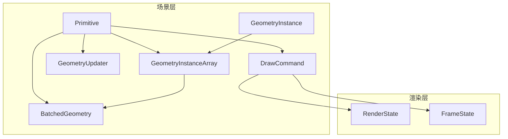
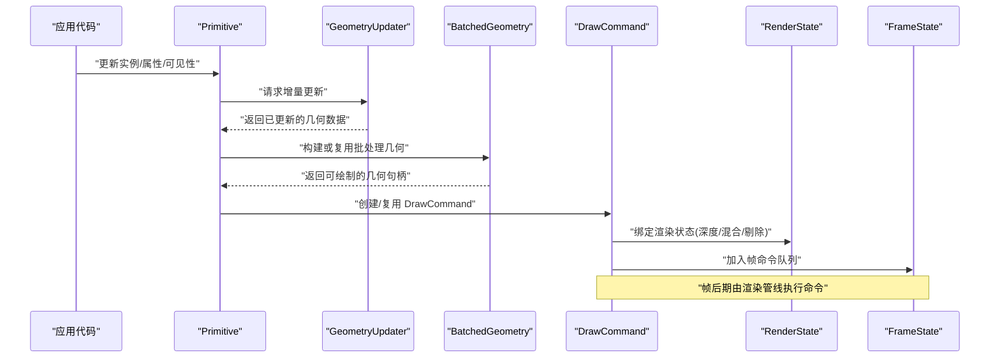
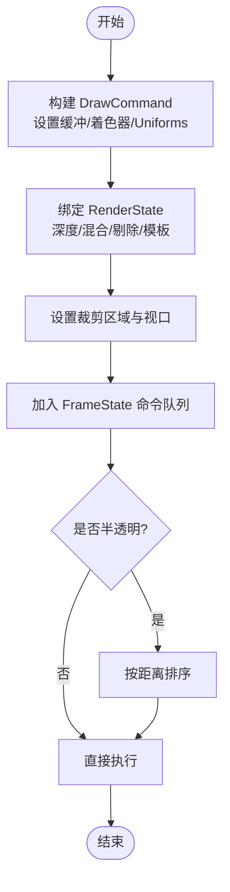
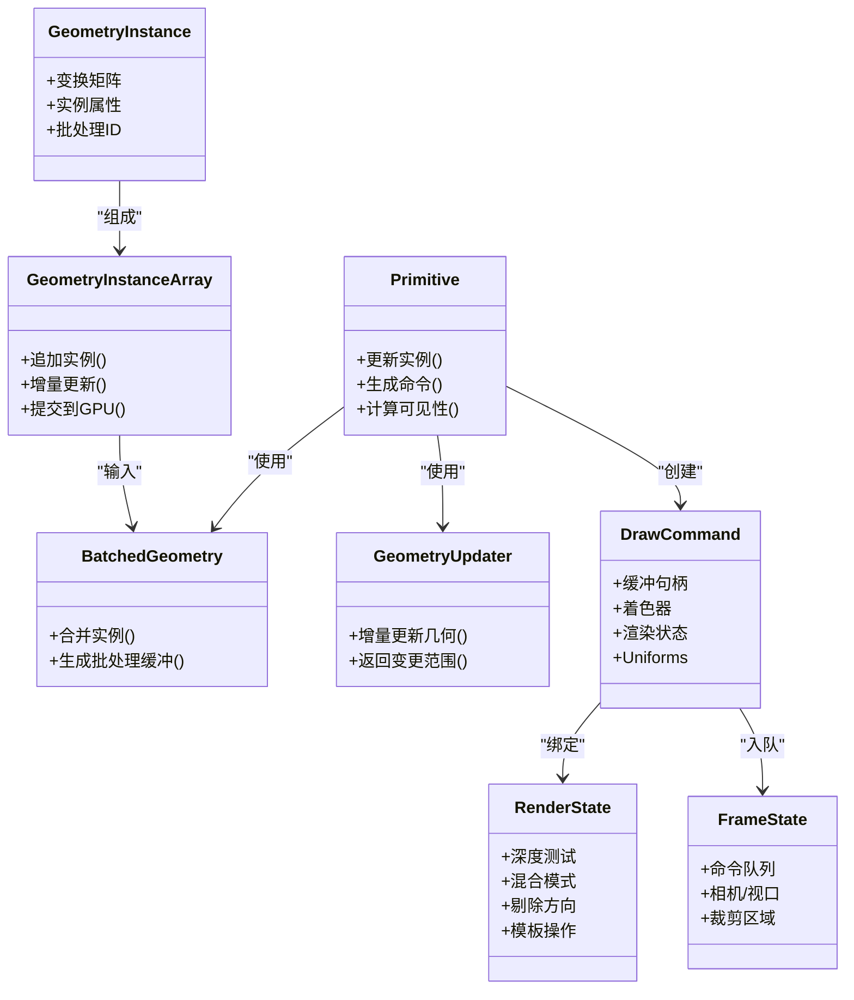
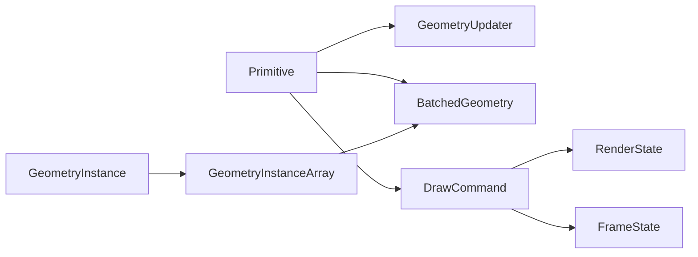

# 基础图元渲染

<cite>
**本文引用的文件**   
- [Primitive.js](file://packages/engine/Source/Scene/Primitive.js)
- [DrawCommand.js](file://packages/engine/Source/Scene/DrawCommand.js)
- [GeometryInstance.js](file://packages/engine/Source/Scene/GeometryInstance.js)
- [GeometryInstanceArray.js](file://packages/engine/Source/Scene/GeometryInstanceArray.js)
- [RenderState.js](file://packages/engine/Source/Renderer/RenderState.js)
- [FrameState.js](file://packages/engine/Source/Scene/FrameState.js)
- [BatchedGeometry.js](file://packages/engine/Source/Scene/BatchedGeometry.js)
- [GeometryUpdater.js](file://packages/engine/Source/Scene/GeometryUpdater.js)
</cite>

## 目录
1. [简介](#简介)
2. [项目结构](#项目结构)
3. [核心组件](#核心组件)
4. [架构总览](#架构总览)
5. [详细组件分析](#详细组件分析)
6. [依赖关系分析](#依赖关系分析)
7. [性能考量](#性能考量)
8. [故障排查指南](#故障排查指南)
9. [结论](#结论)
10. [附录](#附录)

## 简介
本技术文档聚焦于 Cesium 的基础图元（Primitive）渲染系统，围绕 Primitive 基类的底层渲染机制展开，涵盖绘制命令队列、渲染状态管理、GPU 资源分配与释放、实例化渲染等关键主题。同时深入解析 GeometryInstance 的数据结构与批量实例化渲染技术，阐述 DrawCommand 的创建与执行流程（包括深度测试、混合模式、裁剪区域等渲染状态设置），并介绍 GeometryInstanceArray 的高效数据组织方式与批量优化策略。文末提供实践建议与高级 API 集成思路，帮助读者在复杂场景中实现高性能的自定义 Primitive。

## 项目结构
Cesium 引擎将场景渲染相关能力集中在 packages/engine/Source 下。与基础图元渲染直接相关的核心模块包括：
- Scene 层：Primitive、DrawCommand、GeometryInstance、GeometryInstanceArray、BatchedGeometry、GeometryUpdater
- Renderer 层：RenderState（封装 WebGL 渲染状态）
- 帧级上下文：FrameState（贯穿一帧的渲染上下文）

下图给出概念性的模块关系示意（非代码映射）：

[本图为概念性结构示意，不直接对应具体源码文件，故无图示来源]

## 核心组件
本节概述各核心组件的职责与协作关系，为后续深入分析奠定基础。

- Primitive：基础图元的抽象基类，负责几何体与材质组合的可见性、更新、以及生成 DrawCommand 并入队到当前帧。
- GeometryInstance：描述单个几何体的实例化参数（变换矩阵、属性、批处理 ID 等）。
- GeometryInstanceArray：高效存储多个 GeometryInstance 的数组容器，支持批量上传与 GPU 缓冲复用。
- BatchedGeometry：对多实例几何进行批处理合并，减少 draw call 数量。
- GeometryUpdater：根据实例变化增量更新几何数据，避免每帧全量重建。
- DrawCommand：一次 GPU 绘制的指令对象，包含顶点/索引缓冲、着色器、渲染状态、变换矩阵、裁剪区域等。
- RenderState：封装 WebGL 渲染状态（深度测试、混合、剔除、模板等），供 DrawCommand 使用。
- FrameState：单帧渲染上下文，持有命令队列、相机、视口、裁剪区域等全局信息。

章节来源
- [Primitive.js](file://packages/engine/Source/Scene/Primitive.js)
- [DrawCommand.js](file://packages/engine/Source/Scene/DrawCommand.js)
- [GeometryInstance.js](file://packages/engine/Source/Scene/GeometryInstance.js)
- [GeometryInstanceArray.js](file://packages/engine/Source/Scene/GeometryInstanceArray.js)
- [BatchedGeometry.js](file://packages/engine/Source/Scene/BatchedGeometry.js)
- [GeometryUpdater.js](file://packages/engine/Source/Scene/GeometryUpdater.js)
- [RenderState.js](file://packages/engine/Source/Renderer/RenderState.js)
- [FrameState.js](file://packages/engine/Source/Scene/FrameState.js)

## 架构总览
下图展示从 Primitive 到 GPU 的一次典型渲染路径，体现命令入队、状态绑定与执行的关键环节。

图示来源
- [Primitive.js](file://packages/engine/Source/Scene/Primitive.js)
- [GeometryUpdater.js](file://packages/engine/Source/Scene/GeometryUpdater.js)
- [BatchedGeometry.js](file://packages/engine/Source/Scene/BatchedGeometry.js)
- [DrawCommand.js](file://packages/engine/Source/Scene/DrawCommand.js)
- [RenderState.js](file://packages/engine/Source/Renderer/RenderState.js)
- [FrameState.js](file://packages/engine/Source/Scene/FrameState.js)

## 详细组件分析

### Primitive 基类与绘制命令队列
- 职责
  - 维护几何体与材质的组合关系
  - 计算可见性与包围体，决定是否参与渲染
  - 在每一帧中生成 DrawCommand 并加入 FrameState 的命令队列
- 关键点
  - 通过 GeometryUpdater 获取最新几何数据，避免重复计算
  - 使用 BatchedGeometry 聚合多个实例，降低 draw call
  - 将 DrawCommand 推入 FrameState 的队列，交由渲染器统一执行
- 常见扩展点
  - 重写更新逻辑以支持动态几何
  - 自定义材质与渲染状态组合

章节来源
- [Primitive.js](file://packages/engine/Source/Scene/Primitive.js)
- [FrameState.js](file://packages/engine/Source/Scene/FrameState.js)

### GeometryInstance 数据结构与实例化渲染
- 数据结构要点
  - 变换矩阵：控制实例位置、旋转、缩放
  - 属性：如颜色、法线、纹理坐标、自定义 per-instance 属性
  - 批处理标识：用于分组与着色器内区分不同实例
- 实例化渲染
  - 通过 GeometryInstanceArray 将大量实例打包上传至 GPU
  - 结合 BatchedGeometry 将同批次实例合并为单次绘制
- 适用场景
  - 大规模重复几何（如树木、建筑、粒子）
  - 需要按实例独立控制外观或变换的场景

章节来源
- [GeometryInstance.js](file://packages/engine/Source/Scene/GeometryInstance.js)
- [GeometryInstanceArray.js](file://packages/engine/Source/Scene/GeometryInstanceArray.js)
- [BatchedGeometry.js](file://packages/engine/Source/Scene/BatchedGeometry.js)

### GeometryInstanceArray 高效数据组织与批量优化
- 设计目标
  - 最小化 CPU-GPU 数据传输开销
  - 支持增量更新与缓冲复用
- 组织方式
  - 连续内存布局，按属性分块或交错布局（取决于后端实现）
  - 提供追加、删除、替换接口，内部维护脏标记与更新范围
- 批量优化
  - 将相同几何类型与属性的实例合并到一个缓冲区
  - 利用批处理 ID 在着色器中分支处理不同实例属性
- 注意事项
  - 合理选择属性布局以减少缓存未命中
  - 控制每批大小以避免超出 GPU 限制

章节来源
- [GeometryInstanceArray.js](file://packages/engine/Source/Scene/GeometryInstanceArray.js)

### DrawCommand 创建与执行流程（深度测试、混合、裁剪）
- 创建阶段
  - 指定顶点/索引缓冲、着色程序、Uniforms
  - 绑定 RenderState（深度测试、混合模式、剔除方向、模板操作等）
  - 设置模型视图投影矩阵、裁剪区域、可见性掩码
- 执行阶段
  - 渲染器遍历 FrameState 的命令队列，依次绑定状态并调用底层绘制 API
  - 对于半透明对象，通常按距离排序后执行以确保正确混合
- 状态管理
  - RenderState 作为状态快照，避免频繁切换状态
  - 通过命令排序与状态合并减少状态切换次数

图示来源
- [DrawCommand.js](file://packages/engine/Source/Scene/DrawCommand.js)
- [RenderState.js](file://packages/engine/Source/Renderer/RenderState.js)
- [FrameState.js](file://packages/engine/Source/Scene/FrameState.js)

章节来源
- [DrawCommand.js](file://packages/engine/Source/Scene/DrawCommand.js)
- [RenderState.js](file://packages/engine/Source/Renderer/RenderState.js)
- [FrameState.js](file://packages/engine/Source/Scene/FrameState.js)

### 面向对象关系图（代码级）
下图展示与基础图元渲染密切相关的类及其关系（基于源码命名与职责）：

图示来源
- [Primitive.js](file://packages/engine/Source/Scene/Primitive.js)
- [GeometryInstance.js](file://packages/engine/Source/Scene/GeometryInstance.js)
- [GeometryInstanceArray.js](file://packages/engine/Source/Scene/GeometryInstanceArray.js)
- [BatchedGeometry.js](file://packages/engine/Source/Scene/BatchedGeometry.js)
- [GeometryUpdater.js](file://packages/engine/Source/Scene/GeometryUpdater.js)
- [DrawCommand.js](file://packages/engine/Source/Scene/DrawCommand.js)
- [RenderState.js](file://packages/engine/Source/Renderer/RenderState.js)
- [FrameState.js](file://packages/engine/Source/Scene/FrameState.js)

## 依赖关系分析
- 耦合与内聚
  - Primitive 与 GeometryUpdater、BatchedGeometry 高内聚，共同完成几何数据的准备与批处理
  - DrawCommand 与 RenderState 解耦良好，便于状态复用与切换优化
- 外部依赖
  - 依赖底层 WebGL 状态机与缓冲对象
  - 依赖 FrameState 提供的帧级上下文（相机、视口、裁剪区）
- 潜在循环依赖
  - 通过命令队列与状态对象间接耦合，避免直接循环引用
- 接口契约
  - GeometryInstanceArray 需保证数据布局与着色器期望一致
  - DrawCommand 需确保所有必需 Uniforms 与状态在绑定前就绪

图示来源
- [Primitive.js](file://packages/engine/Source/Scene/Primitive.js)
- [GeometryUpdater.js](file://packages/engine/Source/Scene/GeometryUpdater.js)
- [BatchedGeometry.js](file://packages/engine/Source/Scene/BatchedGeometry.js)
- [DrawCommand.js](file://packages/engine/Source/Scene/DrawCommand.js)
- [RenderState.js](file://packages/engine/Source/Renderer/RenderState.js)
- [FrameState.js](file://packages/engine/Source/Scene/FrameState.js)
- [GeometryInstance.js](file://packages/engine/Source/Scene/GeometryInstance.js)
- [GeometryInstanceArray.js](file://packages/engine/Source/Scene/GeometryInstanceArray.js)

章节来源
- [Primitive.js](file://packages/engine/Source/Scene/Primitive.js)
- [DrawCommand.js](file://packages/engine/Source/Scene/DrawCommand.js)
- [RenderState.js](file://packages/engine/Source/Renderer/RenderState.js)
- [FrameState.js](file://packages/engine/Source/Scene/FrameState.js)
- [GeometryInstance.js](file://packages/engine/Source/Scene/GeometryInstance.js)
- [GeometryInstanceArray.js](file://packages/engine/Source/Scene/GeometryInstanceArray.js)
- [BatchedGeometry.js](file://packages/engine/Source/Scene/BatchedGeometry.js)
- [GeometryUpdater.js](file://packages/engine/Source/Scene/GeometryUpdater.js)

## 性能考量
- 批处理与合并
  - 尽量将相同几何与材质合并为一个批次，减少 draw call
  - 使用 GeometryInstanceArray 批量上传实例数据，避免逐条上传
- 增量更新
  - 使用 GeometryUpdater 仅更新变化的部分，降低 CPU 与带宽压力
- 状态切换优化
  - 通过命令排序与状态合并减少 RenderState 切换次数
- 内存与缓冲
  - 合理选择属性布局（连续 vs 交错）以提升缓存命中率
  - 控制每批大小，避免超过 GPU 限制导致回退
- 半透明渲染
  - 对半透明对象进行距离排序，确保正确的混合顺序
- 裁剪与视口
  - 使用裁剪区域减少不必要的片段着色器执行

[本节为通用性能指导，不直接分析具体文件，故无章节来源]

## 故障排查指南
- 常见问题
  - 实例属性缺失或类型不匹配：检查 GeometryInstance 的属性定义与着色器期望是否一致
  - 批处理失败或渲染异常：确认 GeometryInstanceArray 的数据布局与 BatchedGeometry 的合并策略
  - 深度冲突或遮挡错误：检查深度测试与深度写入设置
  - 半透明叠加不正确：确认混合模式与排序策略
  - 裁剪区域异常：验证视口与裁剪区域的设置是否与相机和屏幕分辨率匹配
- 定位方法
  - 打印 DrawCommand 的状态与 Uniforms，确认绑定是否正确
  - 使用调试工具查看 GPU 缓冲内容与着色器输出
  - 逐步关闭特性（如混合、剔除、模板）以隔离问题

章节来源
- [DrawCommand.js](file://packages/engine/Source/Scene/DrawCommand.js)
- [RenderState.js](file://packages/engine/Source/Renderer/RenderState.js)
- [GeometryInstanceArray.js](file://packages/engine/Source/Scene/GeometryInstanceArray.js)
- [BatchedGeometry.js](file://packages/engine/Source/Scene/BatchedGeometry.js)

## 结论
Cesium 的基础图元渲染系统以 Primitive 为核心，通过 GeometryInstance 与 GeometryInstanceArray 实现高效的实例化与批处理，借助 DrawCommand 与 RenderState 将渲染状态与绘制指令解耦，最终在 FrameState 的统一调度下完成 GPU 绘制。理解这些组件的职责与交互，有助于在复杂场景中实现高性能的自定义 Primitive，并通过合理的批处理、增量更新与状态优化获得更好的渲染表现。

[本节为总结性内容，不直接分析具体文件，故无章节来源]

## 附录
- 实践建议
  - 自定义 Primitive：继承 Primitive，重写更新与命令生成逻辑，结合 GeometryUpdater 实现动态几何
  - 批量优化：优先合并相同几何与材质，使用 GeometryInstanceArray 批量上传实例
  - 状态管理：集中配置 RenderState，避免频繁切换；对半透明对象进行距离排序
  - 高级 API 集成：与更高层的实体/图层系统协作时，保持 Primitive 的低层细节与上层语义解耦
- 参考路径
  - 示例与测试用例可在 Specs 与 Apps 目录下查找相关用法与数据

[本节为补充说明，不直接分析具体文件，故无章节来源]