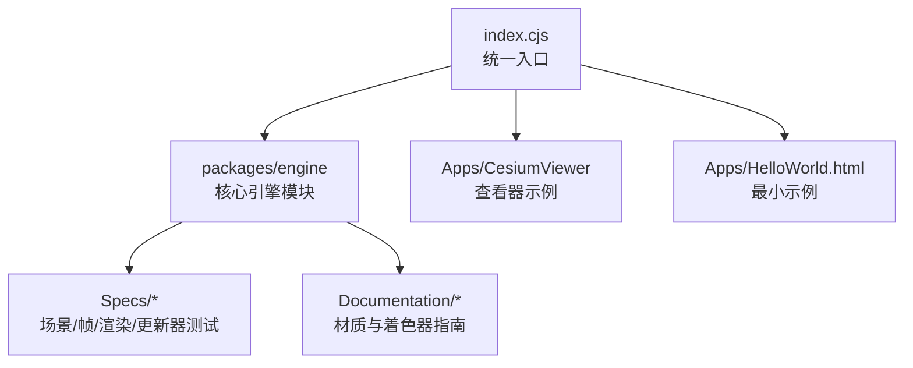
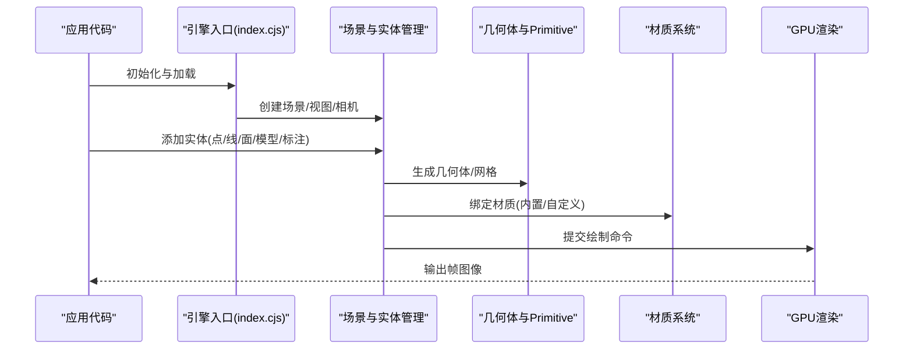
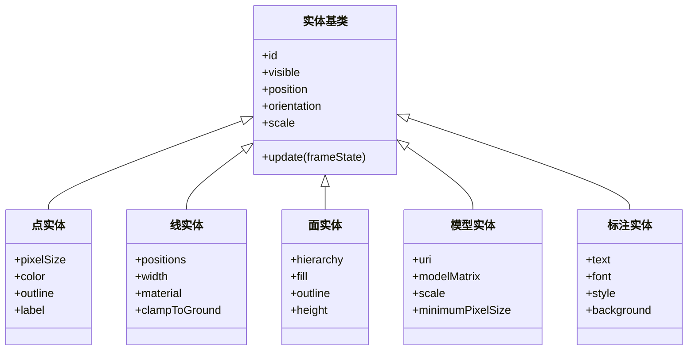
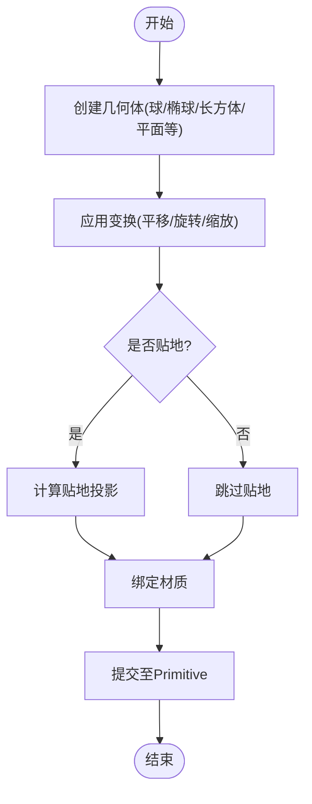
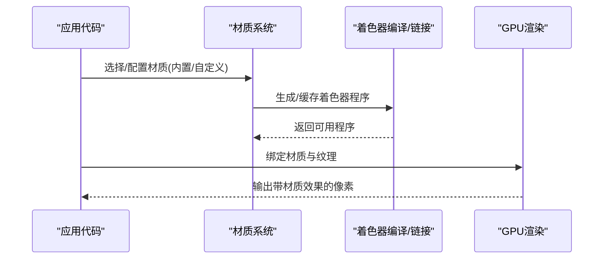
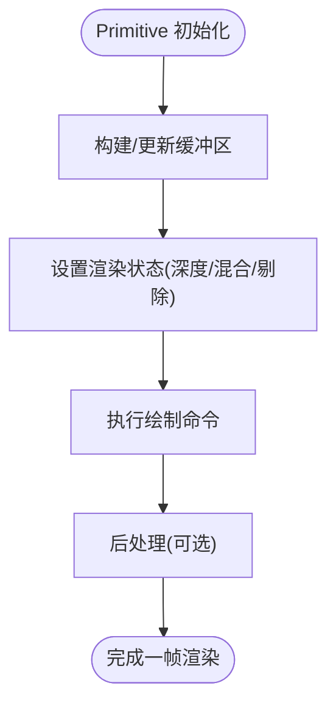
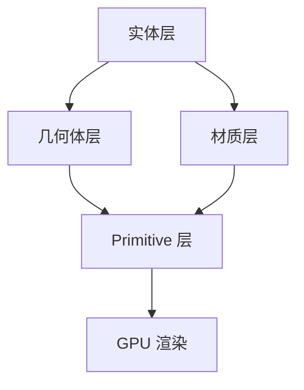

# 实体与几何体系统

<cite>
**本文引用的文件**   
- [README.md](file://README.md)
- [index.cjs](file://index.cjs)
- [package.json](file://package.json)
- [CesiumViewer.js](file://Apps/CesiumViewer/CesiumViewer.js)
- [HelloWorld.html](file://Apps/HelloWorld.html)
- [createScene.js](file://Specs/createScene.js)
- [createGlobe.js](file://Specs/createGlobe.js)
- [createFrameState.js](file://Specs/createFrameState.js)
- [render.js](file://Specs/render.js)
- [createDynamicGeometryUpdaterSpecs.js](file://Specs/createDynamicGeometryUpdaterSpecs.js)
- [createGeometryUpdaterSpecs.js](file://Specs/createGeometryUpdaterSpecs.js)
- [testMaterialDefinitionChanged.js](file://Specs/testMaterialDefinitionChanged.js)
- [CustomShaderGuide/README.md](file://Documentation/CustomShaderGuide/README.md)
- [FabricGuide/README.md](file://Documentation/FabricGuide/README.md)
</cite>

## 目录
1. [简介](#简介)
2. [项目结构](#项目结构)
3. [核心组件](#核心组件)
4. [架构总览](#架构总览)
5. [详细组件分析](#详细组件分析)
6. [依赖关系分析](#依赖关系分析)
7. [性能考量](#性能考量)
8. [故障排查指南](#故障排查指南)
9. [结论](#结论)
10. [附录](#附录)

## 简介
本技术文档聚焦于 Cesium 的“实体与几何体系统”，围绕以下目标展开：
- 深入解析实体抽象层的设计，包括点、线、面、模型、标注等高级地理对象。
- 详细说明几何体的创建、变换、材质应用等核心功能。
- 阐述材质的渲染管道，涵盖内置材质类型、自定义材质开发与纹理映射技术。
- 介绍 Primitive 基础图元的底层渲染机制。
- 提供丰富的示例路径与最佳实践，帮助读者快速上手并高效使用。

本仓库为 CesiumJS 源码工程，包含引擎包（packages/engine）、示例应用（Apps）、测试与规范（Specs）以及文档（Documentation）。本文档将结合这些资源，系统化地梳理实体与几何体体系的结构与用法。

## 项目结构
- 入口与构建
  - index.cjs 作为统一入口，聚合导出引擎能力，供上层应用与示例使用。
  - package.json 定义脚本与依赖，驱动构建与运行流程。
- 示例与应用
  - Apps/CesiumViewer 提供可视化查看器示例，便于直观理解实体与几何体的展示效果。
  - Apps/HelloWorld.html 是最小化示例，用于快速验证环境。
- 测试与规范
  - Specs 下的大量脚本用于构造场景、帧状态、渲染管线与更新器，是理解渲染与更新机制的关键参考。
- 文档
  - Documentation 下的 CustomShaderGuide 与 FabricGuide 对材质与着色器扩展、Fabric 描述语言有权威说明。

图表来源
- [index.cjs:1-200](file://index.cjs#L1-L200)
- [package.json:1-100](file://package.json#L1-L100)

章节来源
- [index.cjs:1-200](file://index.cjs#L1-L200)
- [package.json:1-100](file://package.json#L1-L100)
- [README.md:1-200](file://README.md#L1-L200)

## 核心组件
- 实体抽象层
  - 点、线、面、模型、标注等高级地理对象通过统一的实体接口进行声明与管理，屏蔽底层几何与渲染细节。
- 几何体与 Primitive
  - 几何体负责顶点、索引、法线等数据组织；Primitive 负责将这些几何体提交给 GPU 进行绘制。
- 材质系统
  - 材质定义了表面外观（颜色、纹理、光照、透明度等），支持内置材质与自定义着色器扩展。
- 更新与渲染管线
  - 通过 FrameState、Update 与 Render 阶段，完成从场景图到最终像素的转换。

章节来源
- [createScene.js:1-200](file://Specs/createScene.js#L1-L200)
- [createGlobe.js:1-200](file://Specs/createGlobe.js#L1-L200)
- [createFrameState.js:1-200](file://Specs/createFrameState.js#L1-L200)
- [render.js:1-200](file://Specs/render.js#L1-L200)

## 架构总览
下图展示了从应用入口到渲染输出的关键路径，以及实体、几何体、材质与 Primitive 的协作关系。

图表来源
- [index.cjs:1-200](file://index.cjs#L1-L200)
- [createScene.js:1-200](file://Specs/createScene.js#L1-L200)
- [createFrameState.js:1-200](file://Specs/createFrameState.js#L1-L200)
- [render.js:1-200](file://Specs/render.js#L1-L200)

## 详细组件分析

### 实体抽象层设计
- 设计要点
  - 统一接口：点、线、面、模型、标注等高级对象共享一致的属性与生命周期管理。
  - 数据驱动：实体的位置、方向、缩放、可见性、时间动态等通过属性系统驱动。
  - 组合模式：复杂实体由多个子实体或几何体组合而成，便于层次化管理。
- 典型用法
  - 创建点实体：设置经纬度高度、样式（大小、颜色、标签）。
  - 创建线实体：设置折线点集、宽度、颜色、是否贴地。
  - 创建面实体：设置多边形边界、孔洞、填充材质、高度。
  - 模型实体：加载 glTF 模型，设置姿态、动画、材质覆盖。
  - 标注实体：文本标签、字体、对齐、阴影、背景框等。

图表来源
- [createScene.js:1-200](file://Specs/createScene.js#L1-L200)
- [createGlobe.js:1-200](file://Specs/createGlobe.js#L1-L200)

章节来源
- [createScene.js:1-200](file://Specs/createScene.js#L1-L200)
- [createGlobe.js:1-200](file://Specs/createGlobe.js#L1-L200)

### 几何体创建与变换
- 几何体类型
  - 基本几何体：球体、椭球、长方体、圆柱、圆锥、平面等。
  - 复合几何体：由多个基本几何体组合，或通过布尔运算生成。
- 变换操作
  - 平移、旋转、缩放通过矩阵或四元数表示，支持局部坐标系与世界坐标系切换。
  - 时间动态：位置、方向、缩放可随时间变化，实现动画轨迹与姿态控制。
- 贴地与投影
  - 贴地模式将几何体约束到地形表面，避免悬浮或穿透。
  - 投影模式支持不同坐标系的投影与变换。

图表来源
- [createDynamicGeometryUpdaterSpecs.js:1-200](file://Specs/createDynamicGeometryUpdaterSpecs.js#L1-L200)
- [createGeometryUpdaterSpecs.js:1-200](file://Specs/createGeometryUpdaterSpecs.js#L1-L200)

章节来源
- [createDynamicGeometryUpdaterSpecs.js:1-200](file://Specs/createDynamicGeometryUpdaterSpecs.js#L1-L200)
- [createGeometryUpdaterSpecs.js:1-200](file://Specs/createGeometryUpdaterSpecs.js#L1-L200)

### 材质系统与渲染管道
- 内置材质
  - 颜色材质、纹理材质、高亮材质、透明材质、法线贴图、粗糙度/金属度等。
- 自定义材质
  - 基于 Fabric 描述语言或 GLSL 着色器扩展，实现复杂外观与动态效果。
- 纹理映射
  - UV 坐标、重复模式、偏移、旋转、缩放，支持多层纹理叠加。
- 渲染管道
  - 材质在片段着色器中参与光照计算与混合，影响最终像素颜色。

图表来源
- [testMaterialDefinitionChanged.js:1-200](file://Specs/testMaterialDefinitionChanged.js#L1-L200)
- [CustomShaderGuide/README.md:1-200](file://Documentation/CustomShaderGuide/README.md#L1-L200)
- [FabricGuide/README.md:1-200](file://Documentation/FabricGuide/README.md#L1-L200)

章节来源
- [testMaterialDefinitionChanged.js:1-200](file://Specs/testMaterialDefinitionChanged.js#L1-L200)
- [CustomShaderGuide/README.md:1-200](file://Documentation/CustomShaderGuide/README.md#L1-L200)
- [FabricGuide/README.md:1-200](file://Documentation/FabricGuide/README.md#L1-L200)

### Primitive 基础图元渲染机制
- 职责划分
  - Primitive 封装几何体与材质，负责向 GPU 提交绘制命令。
  - 支持批量绘制、实例化渲染、深度排序与剔除优化。
- 渲染流程
  - 准备顶点缓冲与索引缓冲，绑定材质与纹理，调用 WebGL/WebGPU 绘制 API。
  - 处理深度、混合、裁剪、视锥剔除等渲染状态。
- 性能优化
  - 合并几何体减少 draw call，使用实例化渲染提升吞吐。
  - 按需更新几何体与材质，避免每帧全量重建。

图表来源
- [createFrameState.js:1-200](file://Specs/createFrameState.js#L1-L200)
- [render.js:1-200](file://Specs/render.js#L1-L200)

章节来源
- [createFrameState.js:1-200](file://Specs/createFrameState.js#L1-L200)
- [render.js:1-200](file://Specs/render.js#L1-L200)

### 示例与最佳实践
- 快速入门
  - 使用 HelloWorld.html 搭建最小环境，验证引擎与渲染是否正常。
  - 通过 CesiumViewer 加载示例数据，观察实体与几何体的显示效果。
- 常见操作
  - 创建点实体并添加标签，调整大小与颜色。
  - 创建线实体并启用贴地，设置宽度与材质。
  - 创建面实体并填充纹理，设置高度与轮廓。
  - 加载模型实体并设置姿态与动画。
- 性能建议
  - 合理分组与合并几何体，减少绘制次数。
  - 使用实例化渲染批量绘制相同几何体。
  - 按需更新材质与几何体，避免频繁重建。

章节来源
- [HelloWorld.html:1-200](file://Apps/HelloWorld.html#L1-L200)
- [CesiumViewer.js:1-200](file://Apps/CesiumViewer/CesiumViewer.js#L1-L200)

## 依赖关系分析
- 模块耦合
  - 实体层依赖几何体与材质子系统，Primitive 作为渲染桥接层。
  - 场景管理器协调实体、几何体、材质与渲染状态。
- 外部依赖
  - WebGL/WebGPU 作为底层图形 API，提供绘制与状态管理能力。
  - 纹理与模型格式（如 glTF）通过解码器加载与解析。
- 潜在循环依赖
  - 通过分层与接口隔离避免循环引用，确保模块解耦。

图表来源
- [index.cjs:1-200](file://index.cjs#L1-L200)
- [createScene.js:1-200](file://Specs/createScene.js#L1-L200)

章节来源
- [index.cjs:1-200](file://index.cjs#L1-L200)
- [createScene.js:1-200](file://Specs/createScene.js#L1-L200)

## 性能考量
- 几何体合并与实例化
  - 将大量相同几何体合并或使用实例化渲染，显著降低 draw call。
- 材质复用与缓存
  - 复用材质实例与着色器程序，避免重复编译与分配。
- 更新频率控制
  - 仅对变化的几何体与材质进行更新，减少每帧开销。
- 贴地与投影优化
  - 合理使用贴地模式，避免不必要的投影计算。
- 内存管理
  - 及时释放不再使用的几何体、纹理与模型资源，防止内存泄漏。

[本节为通用指导，不直接分析具体文件]

## 故障排查指南
- 常见问题
  - 实体不显示：检查可见性、位置、尺寸与材质是否正确。
  - 材质异常：确认纹理路径、UV 映射与着色器编译是否成功。
  - 性能瓶颈：统计 draw call 数量与内存占用，定位热点。
- 调试工具
  - 使用浏览器开发者工具监控网络与资源加载。
  - 通过 Spec 脚本构造最小复现场景，逐步排查问题。
- 日志与断点
  - 在关键路径（实体创建、材质绑定、Primitive 提交）插入日志与断点。

章节来源
- [createScene.js:1-200](file://Specs/createScene.js#L1-L200)
- [createFrameState.js:1-200](file://Specs/createFrameState.js#L1-L200)
- [render.js:1-200](file://Specs/render.js#L1-L200)

## 结论
Cesium 的实体与几何体系统通过清晰的抽象层与模块化设计，提供了强大的三维地理对象建模与渲染能力。掌握实体、几何体、材质与 Primitive 的核心概念与最佳实践，能够帮助开发者构建高性能、可扩展的三维可视化应用。建议结合示例与文档，逐步深入理解渲染管线与优化策略。

[本节为总结性内容，不直接分析具体文件]

## 附录
- 相关文档
  - CustomShaderGuide：自定义着色器开发指南。
  - FabricGuide：Fabric 描述语言与材质定义。
- 示例资源
  - Apps/CesiumViewer：查看器示例与演示数据。
  - Apps/HelloWorld.html：最小化示例页面。

章节来源
- [CustomShaderGuide/README.md:1-200](file://Documentation/CustomShaderGuide/README.md#L1-L200)
- [FabricGuide/README.md:1-200](file://Documentation/FabricGuide/README.md#L1-L200)
- [CesiumViewer.js:1-200](file://Apps/CesiumViewer/CesiumViewer.js#L1-L200)
- [HelloWorld.html:1-200](file://Apps/HelloWorld.html#L1-L200)