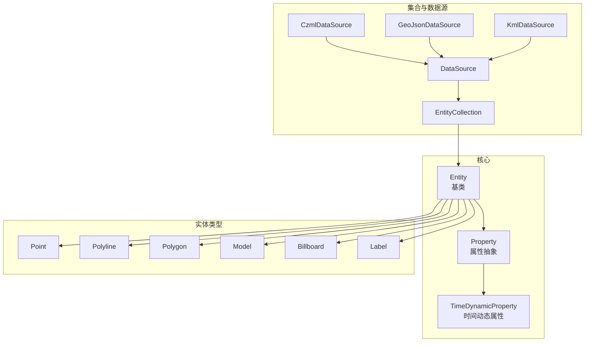
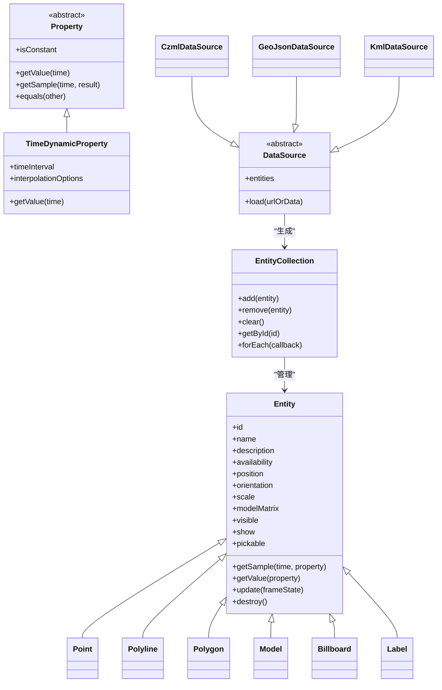
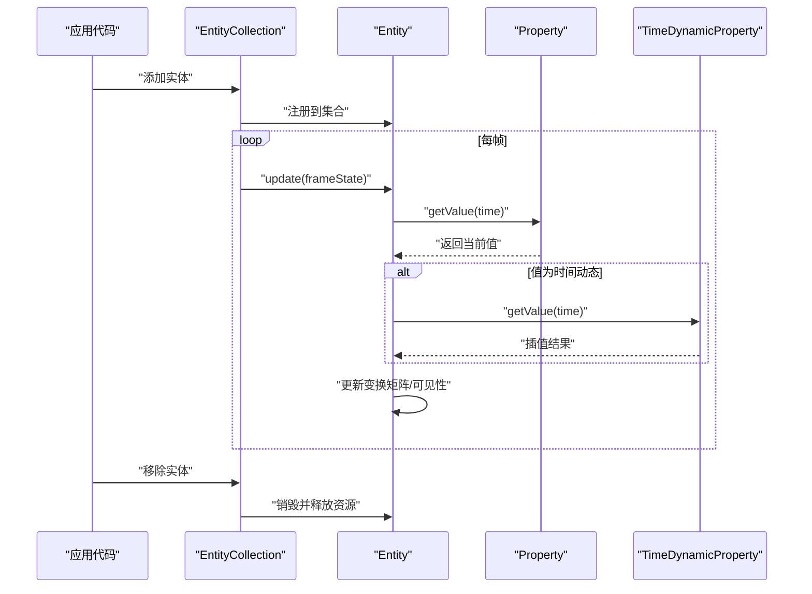
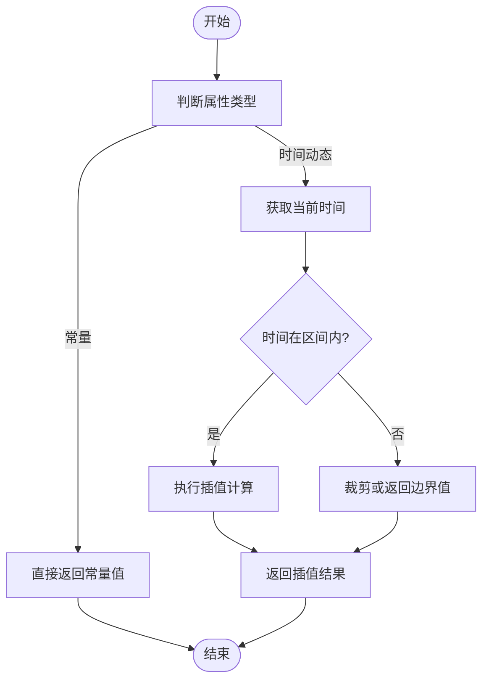
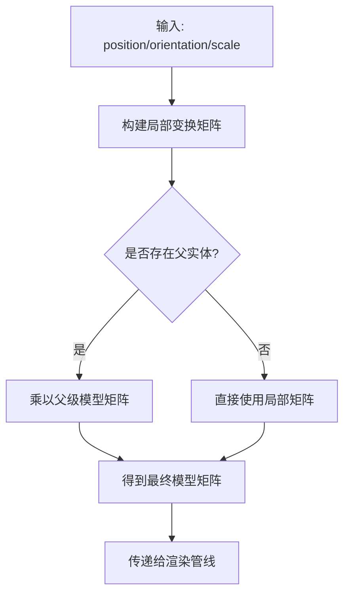
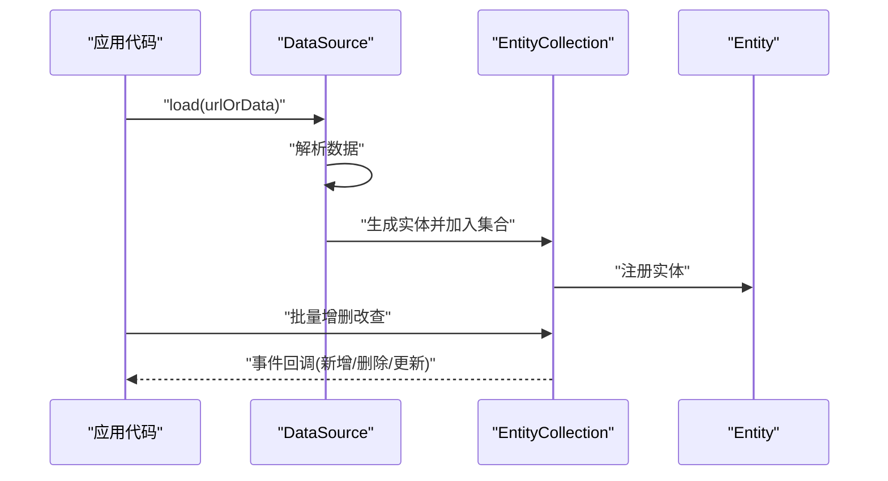
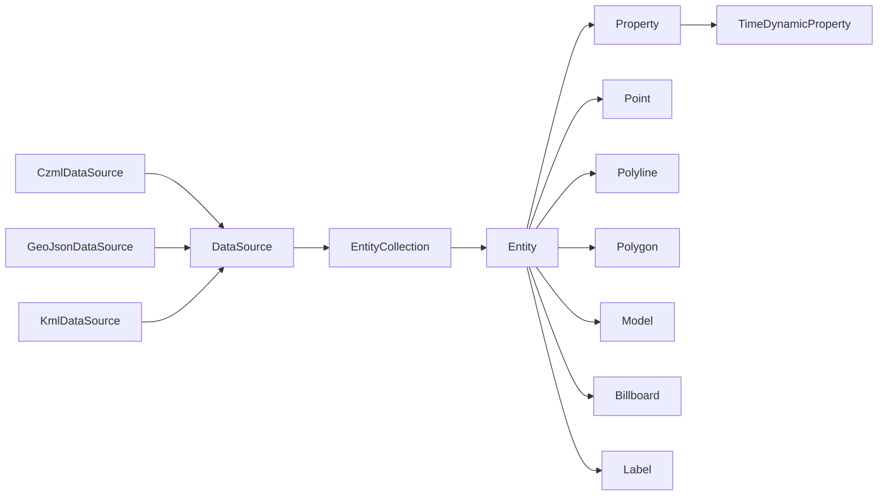

# 实体抽象层

<cite>
**本文引用的文件**   
- [Entity.js](file://Source/Core/Entity.js)
- [Property.js](file://Source/Core/Property.js)
- [TimeDynamicProperty.js](file://Source/Core/TimeDynamicProperty.js)
- [Point.js](file://Source/Scene/Entities/Point.js)
- [Polyline.js](file://Source/Scene/Entities/Polyline.js)
- [Polygon.js](file://Source/Scene/Entities/Polygon.js)
- [Model.js](file://Source/Scene/Entities/Model.js)
- [Billboard.js](file://Source/Scene/Entities/Billboard.js)
- [Label.js](file://Source/Scene/Entities/Label.js)
- [EntityCollection.js](file://Source/Scene/Entities/EntityCollection.js)
- [DataSource.js](file://Source/Scene/DataSource.js)
- [CzmlDataSource.js](file://Source/Scene/CzmlDataSource.js)
- [GeoJsonDataSource.js](file://Source/Scene/GeoJsonDataSource.js)
- [KmlDataSource.js](file://Source/Scene/KmlDataSource.js)
</cite>

## 目录
1. [简介](#简介)
2. [项目结构](#项目结构)
3. [核心组件](#核心组件)
4. [架构总览](#架构总览)
5. [详细组件分析](#详细组件分析)
6. [依赖关系分析](#依赖关系分析)
7. [性能考虑](#性能考虑)
8. [故障排查指南](#故障排查指南)
9. [结论](#结论)
10. [附录](#附录)

## 简介
本技术文档聚焦于 Cesium 的“实体抽象层”，围绕 Entity 基类的设计与实现，系统阐述实体的生命周期管理、属性系统、时间动态支持、坐标系统与变换矩阵、可见性控制等基础能力；并对常见实体类型（Point、Polyline、Polygon、Model、Billboard、Label）的特性与用法进行说明。同时，提供与数据源（CZML、GeoJSON、KML）的集成方式、批量操作与性能优化建议，帮助读者在工程实践中高效使用实体抽象层。

## 项目结构
实体抽象层位于 Source/Scene/Entities 与 Source/Core 下，采用“基类 + 具体实体类型”的分层组织：
- 基类与通用能力
  - Entity：实体基类，统一生命周期、属性系统、时间动态、坐标与变换、可见性与选择等。
  - Property / TimeDynamicProperty：属性与时间动态属性的抽象。
- 具体实体类型
  - Point、Polyline、Polygon、Model、Billboard、Label 等，继承自 Entity，扩展各自渲染与配置语义。
- 集合与数据源
  - EntityCollection：实体集合，提供批量增删改查与事件通知。
  - DataSource 及其子类（CzmlDataSource、GeoJsonDataSource、KmlDataSource）：将外部数据转换为实体并加入集合。

图表来源
- [Entity.js:1-200](file://Source/Core/Entity.js#L1-L200)
- [Property.js:1-200](file://Source/Core/Property.js#L1-L200)
- [TimeDynamicProperty.js:1-200](file://Source/Core/TimeDynamicProperty.js#L1-L200)
- [Point.js:1-200](file://Source/Scene/Entities/Point.js#L1-L200)
- [Polyline.js:1-200](file://Source/Scene/Entities/Polyline.js#L1-L200)
- [Polygon.js:1-200](file://Source/Scene/Entities/Polygon.js#L1-L200)
- [Model.js:1-200](file://Source/Scene/Entities/Model.js#L1-L200)
- [Billboard.js:1-200](file://Source/Scene/Entities/Billboard.js#L1-L200)
- [Label.js:1-200](file://Source/Scene/Entities/Label.js#L1-L200)
- [EntityCollection.js:1-200](file://Source/Scene/Entities/EntityCollection.js#L1-L200)
- [DataSource.js:1-200](file://Source/Scene/DataSource.js#L1-L200)
- [CzmlDataSource.js:1-200](file://Source/Scene/CzmlDataSource.js#L1-L200)
- [GeoJsonDataSource.js:1-200](file://Source/Scene/GeoJsonDataSource.js#L1-L200)
- [KmlDataSource.js:1-200](file://Source/Scene/KmlDataSource.js#L1-L200)

章节来源
- [Entity.js:1-200](file://Source/Core/Entity.js#L1-L200)
- [Property.js:1-200](file://Source/Core/Property.js#L1-L200)
- [TimeDynamicProperty.js:1-200](file://Source/Core/TimeDynamicProperty.js#L1-L200)
- [EntityCollection.js:1-200](file://Source/Scene/Entities/EntityCollection.js#L1-L200)
- [DataSource.js:1-200](file://Source/Scene/DataSource.js#L1-L200)
- [CzmlDataSource.js:1-200](file://Source/Scene/CzmlDataSource.js#L1-L200)
- [GeoJsonDataSource.js:1-200](file://Source/Scene/GeoJsonDataSource.js#L1-L200)
- [KmlDataSource.js:1-200](file://Source/Scene/KmlDataSource.js#L1-L200)

## 核心组件
本节从设计角度概述实体抽象层的关键概念与职责划分。

- 实体基类（Entity）
  - 生命周期：创建、更新、销毁；与场景帧循环联动，负责状态同步与资源释放。
  - 属性系统：基于 Property 抽象，支持常量、表达式、采样器与时间动态值；提供 getSample、getValue 等接口。
  - 时间与参考系：支持时间范围、时钟同步、参考坐标系（如固定/相对地球）。
  - 坐标与变换：位置、方向、缩放、模型矩阵；支持局部与全局坐标转换。
  - 可见性与选择：visible、show、pickable 等开关；与拾取、高亮交互配合。
  - 事件与监听：属性变更、可见性变化、生命周期事件等。

- 属性系统（Property / TimeDynamicProperty）
  - Property：所有可动画化值的抽象，提供时间无关的值获取与订阅机制。
  - TimeDynamicProperty：封装随时间变化的值，内部维护时间区间与插值策略。

- 实体集合（EntityCollection）
  - 批量管理实体，提供 add/remove/clear、遍历、按 id 查找、事件聚合等。
  - 与数据源协作，接收数据源推送的实体变更。

- 数据源（DataSource 及子类）
  - 定义统一的加载、解析、转换流程，输出实体集合。
  - CzmlDataSource、GeoJsonDataSource、KmlDataSource 分别处理不同格式的数据。

章节来源
- [Entity.js:1-200](file://Source/Core/Entity.js#L1-L200)
- [Property.js:1-200](file://Source/Core/Property.js#L1-L200)
- [TimeDynamicProperty.js:1-200](file://Source/Core/TimeDynamicProperty.js#L1-L200)
- [EntityCollection.js:1-200](file://Source/Scene/Entities/EntityCollection.js#L1-L200)
- [DataSource.js:1-200](file://Source/Scene/DataSource.js#L1-L200)

## 架构总览
下图展示实体抽象层在整体系统中的位置与交互关系：数据源将外部数据解析为实体，实体集合统一管理实体实例，具体实体类型继承基类并扩展渲染相关能力。

图表来源
- [Entity.js:1-200](file://Source/Core/Entity.js#L1-L200)
- [Property.js:1-200](file://Source/Core/Property.js#L1-L200)
- [TimeDynamicProperty.js:1-200](file://Source/Core/TimeDynamicProperty.js#L1-L200)
- [Point.js:1-200](file://Source/Scene/Entities/Point.js#L1-L200)
- [Polyline.js:1-200](file://Source/Scene/Entities/Polyline.js#L1-L200)
- [Polygon.js:1-200](file://Source/Scene/Entities/Polygon.js#L1-L200)
- [Model.js:1-200](file://Source/Scene/Entities/Model.js#L1-L200)
- [Billboard.js:1-200](file://Source/Scene/Entities/Billboard.js#L1-L200)
- [Label.js:1-200](file://Source/Scene/Entities/Label.js#L1-L200)
- [EntityCollection.js:1-200](file://Source/Scene/Entities/EntityCollection.js#L1-L200)
- [DataSource.js:1-200](file://Source/Scene/DataSource.js#L1-L200)
- [CzmlDataSource.js:1-200](file://Source/Scene/CzmlDataSource.js#L1-L200)
- [GeoJsonDataSource.js:1-200](file://Source/Scene/GeoJsonDataSource.js#L1-L200)
- [KmlDataSource.js:1-200](file://Source/Scene/KmlDataSource.js#L1-L200)

## 详细组件分析

### Entity 基类分析
- 设计要点
  - 统一的生命周期钩子：update 在每帧被调用，用于根据当前时间计算属性值、更新变换矩阵、协调子组件。
  - 属性系统接入：通过 Property 抽象，使任何可动画化的字段（位置、颜色、透明度等）都能以时间驱动。
  - 坐标与变换：提供 position、orientation、scale、modelMatrix 等常用变换入口，内部组合为最终模型矩阵。
  - 可见性与选择：visible/show/pickable 控制渲染与拾取行为，便于交互与性能优化。
  - 事件与订阅：属性变更、可见性变化、生命周期事件对外暴露，供上层逻辑响应。

- 关键流程（序列图）

图表来源
- [Entity.js:1-200](file://Source/Core/Entity.js#L1-L200)
- [Property.js:1-200](file://Source/Core/Property.js#L1-L200)
- [TimeDynamicProperty.js:1-200](file://Source/Core/TimeDynamicProperty.js#L1-L200)
- [EntityCollection.js:1-200](file://Source/Scene/Entities/EntityCollection.js#L1-L200)

章节来源
- [Entity.js:1-200](file://Source/Core/Entity.js#L1-L200)

### 属性系统与时间动态
- 属性抽象（Property）
  - 提供 getValue/getSample 接口，屏蔽底层数据源差异。
  - isConstant 标识常量属性，避免不必要的计算。
- 时间动态属性（TimeDynamicProperty）
  - 封装时间区间与插值策略，支持线性、阶跃等插值模式。
  - 与 Entity.update 协同，在指定时间范围内取值。

图表来源
- [Property.js:1-200](file://Source/Core/Property.js#L1-L200)
- [TimeDynamicProperty.js:1-200](file://Source/Core/TimeDynamicProperty.js#L1-L200)

章节来源
- [Property.js:1-200](file://Source/Core/Property.js#L1-L200)
- [TimeDynamicProperty.js:1-200](file://Source/Core/TimeDynamicProperty.js#L1-L200)

### 坐标系统与变换矩阵
- 坐标系统
  - 世界坐标（WGS84/地心固定系）与局部坐标（相对于父实体或模型空间）。
  - 位置属性通常以 Cartesian3 表示，支持高度、贴地等变体。
- 变换矩阵
  - modelMatrix 由 position、orientation、scale 组合得到，决定实体在场景中的最终位姿。
  - 支持父子层级变换，子实体的局部变换会叠加到父级矩阵上。

图表来源
- [Entity.js:1-200](file://Source/Core/Entity.js#L1-L200)

章节来源
- [Entity.js:1-200](file://Source/Core/Entity.js#L1-L200)

### 可见性与选择
- visible/show：控制实体是否参与渲染；show 常用于 UI 绑定。
- pickable：控制是否参与拾取；关闭后可减少拾取开销。
- 与集合事件联动：当可见性或选择状态变化时，触发相应事件，供上层刷新 UI 或调整交互。

章节来源
- [Entity.js:1-200](file://Source/Core/Entity.js#L1-L200)

### 具体实体类型特性与用法

#### Point（点）
- 特性
  - 支持像素大小、颜色、透明度、轮廓线、阴影等样式。
  - 可与 Label 组合形成标注点。
- 典型用法
  - 设置位置与样式属性，添加到集合中显示。
  - 使用属性系统实现尺寸或颜色的时间动画。

章节来源
- [Point.js:1-200](file://Source/Scene/Entities/Point.js#L1-L200)

#### Polyline（折线）
- 特性
  - 支持宽度、颜色、透明度、虚线样式、贴地、轮廓等。
  - 路径可由点位数组或几何对象定义。
- 典型用法
  - 传入点位数组，配置材质与轮廓，实现轨迹或边界线。

章节来源
- [Polyline.js:1-200](file://Source/Scene/Entities/Polyline.js#L1-L200)

#### Polygon（多边形）
- 特性
  - 支持填充色、透明度、轮廓、孔洞、贴地等。
  - 可通过点位数组定义外环与内环。
- 典型用法
  - 绘制区域面，结合时间动态属性实现渐变或闪烁效果。

章节来源
- [Polygon.js:1-200](file://Source/Scene/Entities/Polygon.js#L1-L200)

#### Model（三维模型）
- 特性
  - 支持 glTF/glb 模型加载、动画播放、材质替换、阴影、缩放与朝向。
  - 支持实例化与批渲染以提升性能。
- 典型用法
  - 加载模型资源，设置初始姿态与动画，按需启用/禁用。

章节来源
- [Model.js:1-200](file://Source/Scene/Entities/Model.js#L1-L200)

#### Billboard（图标）
- 特性
  - 支持图片、对齐方式、垂直/水平偏移、旋转、缩放、阴影等。
  - 适合大量图标的高效显示。
- 典型用法
  - 为点实体附加图标，实现地图标记或设备状态指示。

章节来源
- [Billboard.js:1-200](file://Source/Scene/Entities/Billboard.js#L1-L200)

#### Label（标签）
- 特性
  - 支持文本内容、字体、大小、颜色、背景、描边、对齐、偏移等。
  - 常与 Point/Billboard 组合使用。
- 典型用法
  - 为地标或目标添加可读信息，支持动态文本更新。

章节来源
- [Label.js:1-200](file://Source/Scene/Entities/Label.js#L1-L200)

### 数据源集成与批量操作
- 数据源（DataSource）
  - 统一 load 接口，内部解析数据并生成实体集合。
  - 提供 entities 集合，供场景或上层逻辑访问。
- 具体数据源
  - CzmlDataSource：解析 CZML 描述，支持时间动态与复杂场景。
  - GeoJsonDataSource：解析 GeoJSON，自动映射为点/线/面实体。
  - KmlDataSource：解析 KML，支持网络链接与样式映射。
- 批量操作
  - 通过 EntityCollection.add/remove/clear 进行批量增删。
  - 数据源加载完成后，可直接对 entities 集合进行操作。

图表来源
- [DataSource.js:1-200](file://Source/Scene/DataSource.js#L1-L200)
- [CzmlDataSource.js:1-200](file://Source/Scene/CzmlDataSource.js#L1-L200)
- [GeoJsonDataSource.js:1-200](file://Source/Scene/GeoJsonDataSource.js#L1-L200)
- [KmlDataSource.js:1-200](file://Source/Scene/KmlDataSource.js#L1-L200)
- [EntityCollection.js:1-200](file://Source/Scene/Entities/EntityCollection.js#L1-L200)

章节来源
- [DataSource.js:1-200](file://Source/Scene/DataSource.js#L1-L200)
- [CzmlDataSource.js:1-200](file://Source/Scene/CzmlDataSource.js#L1-L200)
- [GeoJsonDataSource.js:1-200](file://Source/Scene/GeoJsonDataSource.js#L1-L200)
- [KmlDataSource.js:1-200](file://Source/Scene/KmlDataSource.js#L1-L200)
- [EntityCollection.js:1-200](file://Source/Scene/Entities/EntityCollection.js#L1-L200)

## 依赖关系分析
- 耦合与内聚
  - Entity 与 Property/TimeDynamicProperty 低耦合，通过抽象接口交互，提升可测试性与可扩展性。
  - 具体实体类型仅关注自身渲染与配置，复用基类的通用能力。
- 外部依赖与集成点
  - 数据源作为外部数据到实体的桥梁，解耦业务逻辑与数据格式。
  - 集合与场景帧循环的交互集中在 update 阶段，保证时序一致。

图表来源
- [Entity.js:1-200](file://Source/Core/Entity.js#L1-L200)
- [Property.js:1-200](file://Source/Core/Property.js#L1-L200)
- [TimeDynamicProperty.js:1-200](file://Source/Core/TimeDynamicProperty.js#L1-L200)
- [EntityCollection.js:1-200](file://Source/Scene/Entities/EntityCollection.js#L1-L200)
- [DataSource.js:1-200](file://Source/Scene/DataSource.js#L1-L200)
- [CzmlDataSource.js:1-200](file://Source/Scene/CzmlDataSource.js#L1-L200)
- [GeoJsonDataSource.js:1-200](file://Source/Scene/GeoJsonDataSource.js#L1-L200)
- [KmlDataSource.js:1-200](file://Source/Scene/KmlDataSource.js#L1-L200)

章节来源
- [Entity.js:1-200](file://Source/Core/Entity.js#L1-L200)
- [EntityCollection.js:1-200](file://Source/Scene/Entities/EntityCollection.js#L1-L200)
- [DataSource.js:1-200](file://Source/Scene/DataSource.js#L1-L200)

## 性能考虑
- 合理使用可见性与选择
  - 对不可见或不参与交互的实体关闭 show/pickable，降低渲染与拾取开销。
- 批量操作与集合事件
  - 使用 EntityCollection 的批量方法，减少频繁的事件触发与重绘。
- 属性与时间动态
  - 尽量使用常量属性或缓存插值结果，避免每帧重复计算。
  - 合理设置时间区间与采样频率，避免过细的时间粒度导致性能下降。
- 模型与贴图
  - 使用合适的模型压缩与纹理格式，减少内存占用与带宽消耗。
  - 对静态模型启用批渲染或实例化，提高绘制效率。
- 数据源加载
  - 分批次加载大型数据集，避免一次性创建过多实体。
  - 利用数据源的增量更新机制，只处理变更部分。

[本节为通用指导，不直接分析具体文件]

## 故障排查指南
- 常见问题
  - 实体未显示：检查 visible/show 状态、位置是否在可视范围内、层级与遮挡关系。
  - 动画不生效：确认属性是否为时间动态类型、时间区间是否正确、时钟是否与实体关联。
  - 模型不加载：检查资源路径、格式支持、跨域与权限问题。
  - 性能抖动：排查每帧大量属性更新、过多高开销材质或阴影。
- 定位手段
  - 使用集合事件监听实体变更，确认数据源解析与实体生成流程。
  - 在 update 钩子中打印关键属性值，验证变换矩阵与可见性计算。
  - 针对时间动态属性，校验插值策略与边界处理。

章节来源
- [Entity.js:1-200](file://Source/Core/Entity.js#L1-L200)
- [EntityCollection.js:1-200](file://Source/Scene/Entities/EntityCollection.js#L1-L200)
- [DataSource.js:1-200](file://Source/Scene/DataSource.js#L1-L200)

## 结论
实体抽象层通过 Entity 基类统一了生命周期、属性系统、时间动态、坐标与变换、可见性与选择等核心能力，并以 Property/TimeDynamicProperty 抽象出可动画化的值体系。具体实体类型在此基础上扩展各自的渲染语义，数据源则负责将外部数据转换为实体集合。借助集合与数据源的协作，开发者可以高效地进行批量操作与性能优化，满足复杂可视化场景的需求。

[本节为总结性内容，不直接分析具体文件]

## 附录
- 实践建议
  - 优先使用数据源加载结构化数据，减少手工创建实体的工作量。
  - 对高频更新的属性，采用合理的采样与插值策略，平衡精度与性能。
  - 对大规模实体，分层管理与按需加载，结合视锥剔除与 LOD 策略。
- 示例指引
  - 创建点实体：参考 Point 的属性配置与集合添加流程。
  - 绘制折线与多边形：参考 Polyline 与 Polygon 的路径定义与样式配置。
  - 加载模型：参考 Model 的资源加载与动画控制。
  - 添加图标与标签：参考 Billboard 与 Label 的对齐与偏移设置。
  - 数据源集成：参考 CzmlDataSource、GeoJsonDataSource、KmlDataSource 的加载与实体集合访问。

[本节为补充说明，不直接分析具体文件]