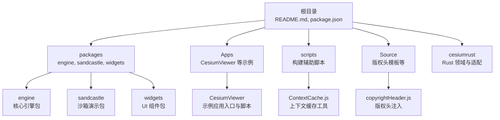
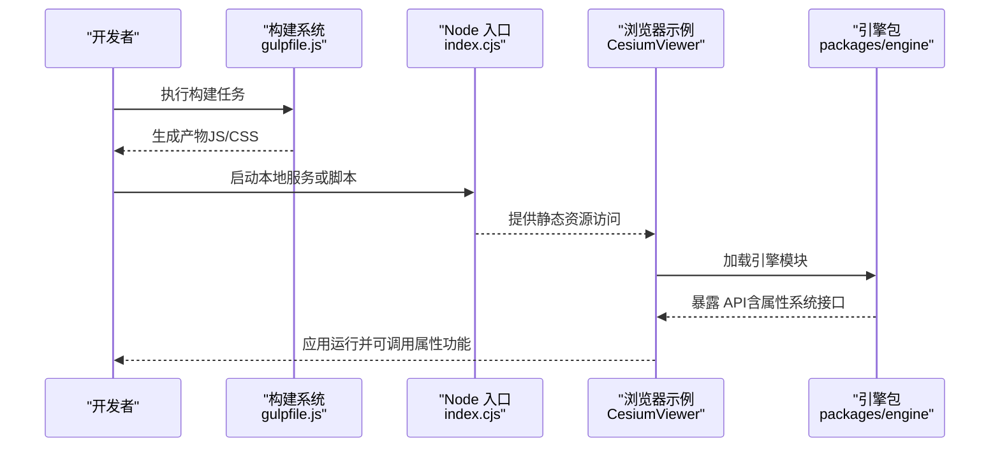
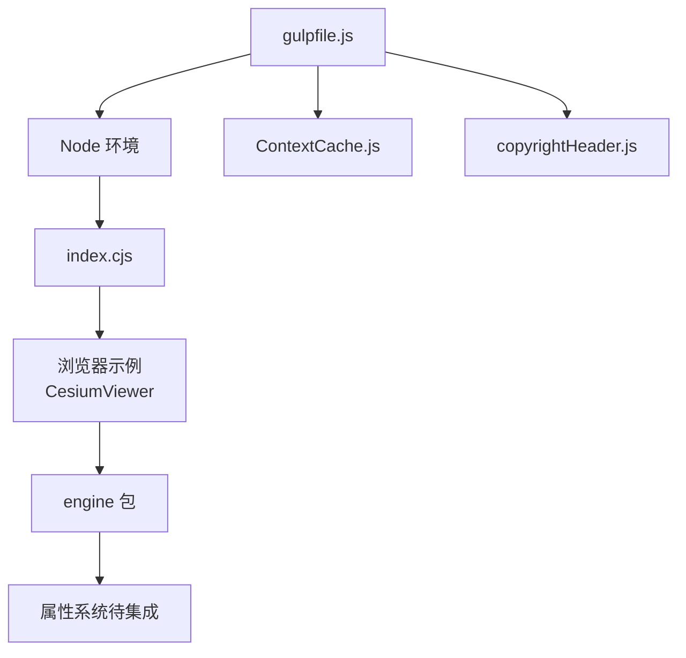

# 属性系统

<cite>
**本文引用的文件**   
- [README.md](file://README.md)
- [package.json](file://package.json)
- [index.cjs](file://index.cjs)
- [gulpfile.js](file://gulpfile.js)
- [Scripts/ContextCache.js](file://scripts/ContextCache.js)
- [Source/copyrightHeader.js](file://Source/copyrightHeader.js)
- [Apps/CesiumViewer/index.html](file://Apps/CesiumViewer/index.html)
- [Apps/CesiumViewer/CesiumViewer.js](file://Apps/CesiumViewer/CesiumViewer.js)
- [packages/engine/package.json](file://packages/engine/package.json)
- [packages/sandcastle/package.json](file://packages/sandcastle/package.json)
- [packages/widgets/package.json](file://packages/widgets/package.json)
</cite>

## 目录
1. [简介](#简介)
2. [项目结构](#项目结构)
3. [核心组件](#核心组件)
4. [架构总览](#架构总览)
5. [详细组件分析](#详细组件分析)
6. [依赖关系分析](#依赖关系分析)
7. [性能考量](#性能考量)
8. [故障排查指南](#故障排查指南)
9. [结论](#结论)
10. [附录](#附录)

## 简介
本文件围绕“属性系统”这一主题，对仓库中与属性相关的构建、打包与运行时入口进行梳理。由于当前仓库未包含具体的属性实现源码（如属性定义、解析器或渲染管线中的属性处理逻辑），本文聚焦于：
- 工程结构与构建流程如何暴露与组织模块，为后续属性系统的集成提供基础
- 应用入口与示例页面如何加载引擎与资源，便于在应用中启用属性相关能力
- 脚本与工具链如何参与构建与发布，确保属性系统可被正确打包与分发

## 项目结构
该仓库采用多包与多语言混合的组织方式：
- JavaScript/TypeScript 引擎与应用位于根目录与 packages 子包中
- Rust 领域与适配层位于 cesiumrust 目录
- 示例与文档位于 Apps 与 Documentation 目录
- 构建与脚本位于 scripts 与 gulpfile.js

图表来源
- [README.md:1-200](file://README.md#L1-L200)
- [package.json:1-200](file://package.json#L1-L200)
- [packages/engine/package.json:1-100](file://packages/engine/package.json#L1-L100)
- [packages/sandcastle/package.json:1-100](file://packages/sandcastle/package.json#L1-L100)
- [packages/widgets/package.json:1-100](file://packages/widgets/package.json#L1-L100)
- [Apps/CesiumViewer/index.html:1-200](file://Apps/CesiumViewer/index.html#L1-L200)
- [Apps/CesiumViewer/CesiumViewer.js:1-200](file://Apps/CesiumViewer/CesiumViewer.js#L1-L200)
- [scripts/ContextCache.js:1-200](file://scripts/ContextCache.js#L1-L200)
- [Source/copyrightHeader.js:1-200](file://Source/copyrightHeader.js#L1-L200)

章节来源
- [README.md:1-200](file://README.md#L1-L200)
- [package.json:1-200](file://package.json#L1-L200)

## 核心组件
- 构建与打包
  - gulpfile.js：定义构建任务，负责将各包与示例整合输出
  - scripts/ContextCache.js：构建期上下文缓存，提升构建效率
  - Source/copyrightHeader.js：构建期注入版权头，保证产物合规
- 应用入口与示例
  - index.cjs：Node 侧入口，常用于启动本地服务或运行脚本
  - Apps/CesiumViewer/index.html：浏览器端示例入口，加载 CesiumViewer 脚本
  - Apps/CesiumViewer/CesiumViewer.js：示例应用初始化与场景配置
- 包管理
  - packages/*/package.json：定义 engine、sandcastle、widgets 等包的元数据与依赖

这些组件共同构成属性系统集成的基础设施：通过构建任务生成可用产物，由应用入口加载并初始化，从而为属性系统的启用与使用提供环境。

章节来源
- [gulpfile.js:1-200](file://gulpfile.js#L1-L200)
- [scripts/ContextCache.js:1-200](file://scripts/ContextCache.js#L1-L200)
- [Source/copyrightHeader.js:1-200](file://Source/copyrightHeader.js#L1-L200)
- [index.cjs:1-200](file://index.cjs#L1-L200)
- [Apps/CesiumViewer/index.html:1-200](file://Apps/CesiumViewer/index.html#L1-L200)
- [Apps/CesiumViewer/CesiumViewer.js:1-200](file://Apps/CesiumViewer/CesiumViewer.js#L1-L200)
- [packages/engine/package.json:1-100](file://packages/engine/package.json#L1-L100)
- [packages/sandcastle/package.json:1-100](file://packages/sandcastle/package.json#L1-L100)
- [packages/widgets/package.json:1-100](file://packages/widgets/package.json#L1-L100)

## 架构总览
下图展示从 Node 侧入口到浏览器示例的加载路径，以及构建产物如何被应用消费。该路径是属性系统接入的关键链路：构建阶段产出可被浏览器加载的模块，应用入口加载并初始化引擎，随后即可使用属性相关能力。

图表来源
- [gulpfile.js:1-200](file://gulpfile.js#L1-L200)
- [index.cjs:1-200](file://index.cjs#L1-L200)
- [Apps/CesiumViewer/index.html:1-200](file://Apps/CesiumViewer/index.html#L1-L200)
- [Apps/CesiumViewer/CesiumViewer.js:1-200](file://Apps/CesiumViewer/CesiumViewer.js#L1-L200)
- [packages/engine/package.json:1-100](file://packages/engine/package.json#L1-L100)

## 详细组件分析

### 构建系统与产物组织
- gulpfile.js
  - 职责：定义构建任务、合并与压缩、复制资源、生成文档与发布包
  - 与属性系统的关系：确保属性系统代码被正确纳入构建流程，并在最终产物中可用
- scripts/ContextCache.js
  - 职责：维护构建期上下文缓存，减少重复计算
  - 与属性系统的关系：加速属性系统相关模块的构建与增量更新
- Source/copyrightHeader.js
  - 职责：向构建产物注入版权头
  - 与属性系统的关系：保证属性系统产物的合规性

章节来源
- [gulpfile.js:1-200](file://gulpfile.js#L1-L200)
- [scripts/ContextCache.js:1-200](file://scripts/ContextCache.js#L1-L200)
- [Source/copyrightHeader.js:1-200](file://Source/copyrightHeader.js#L1-L200)

### 应用入口与示例
- index.cjs
  - 职责：Node 侧入口，用于启动开发服务器或执行构建后脚本
  - 与属性系统的关系：提供本地调试环境，便于验证属性系统行为
- Apps/CesiumViewer/index.html
  - 职责：浏览器端示例入口，引入构建后的脚本与样式
  - 与属性系统的关系：作为属性系统能力的演示与测试载体
- Apps/CesiumViewer/CesiumViewer.js
  - 职责：初始化示例应用，创建场景、相机、图层等
  - 与属性系统的关系：在此处可添加属性相关的初始化与调用逻辑

章节来源
- [index.cjs:1-200](file://index.cjs#L1-L200)
- [Apps/CesiumViewer/index.html:1-200](file://Apps/CesiumViewer/index.html#L1-L200)
- [Apps/CesiumViewer/CesiumViewer.js:1-200](file://Apps/CesiumViewer/CesiumViewer.js#L1-L200)

### 包管理与依赖
- packages/engine/package.json
  - 职责：定义引擎包的元数据、入口与依赖
  - 与属性系统的关系：若属性系统属于引擎能力，则其接口与版本由该包管理
- packages/sandcastle/package.json
  - 职责：定义沙箱演示包的元数据与依赖
  - 与属性系统的关系：可用于快速验证属性系统的交互效果
- packages/widgets/package.json
  - 职责：定义 UI 组件包的元数据与依赖
  - 与属性系统的关系：属性系统的可视化控件可能依赖此包

章节来源
- [packages/engine/package.json:1-100](file://packages/engine/package.json#L1-L100)
- [packages/sandcastle/package.json:1-100](file://packages/sandcastle/package.json#L1-L100)
- [packages/widgets/package.json:1-100](file://packages/widgets/package.json#L1-L100)

## 依赖关系分析
- 构建依赖
  - gulpfile.js 依赖 Node 环境与 npm 脚本，驱动整个构建流程
  - ContextCache.js 被构建任务引用，提升构建性能
  - copyrightHeader.js 在构建时注入版权信息
- 运行时依赖
  - index.cjs 启动服务或脚本，为浏览器示例提供资源
  - CesiumViewer 示例依赖引擎包提供的 API
  - 属性系统若作为引擎能力，将通过 engine 包对外暴露

图表来源
- [gulpfile.js:1-200](file://gulpfile.js#L1-L200)
- [scripts/ContextCache.js:1-200](file://scripts/ContextCache.js#L1-L200)
- [Source/copyrightHeader.js:1-200](file://Source/copyrightHeader.js#L1-L200)
- [index.cjs:1-200](file://index.cjs#L1-L200)
- [Apps/CesiumViewer/index.html:1-200](file://Apps/CesiumViewer/index.html#L1-L200)
- [Apps/CesiumViewer/CesiumViewer.js:1-200](file://Apps/CesiumViewer/CesiumViewer.js#L1-L200)
- [packages/engine/package.json:1-100](file://packages/engine/package.json#L1-L100)

章节来源
- [gulpfile.js:1-200](file://gulpfile.js#L1-L200)
- [index.cjs:1-200](file://index.cjs#L1-L200)
- [packages/engine/package.json:1-100](file://packages/engine/package.json#L1-L100)

## 性能考量
- 构建期优化
  - 使用 ContextCache.js 缓存中间结果，减少重复计算
  - 合理拆分构建任务，避免全量重建
- 运行时优化
  - 按需加载引擎模块，减少初始体积
  - 在示例应用中延迟初始化非关键属性，降低首帧开销

[本节为通用指导，不直接分析具体文件]

## 故障排查指南
- 构建失败
  - 检查 gulpfile.js 任务是否完整，确认依赖安装无误
  - 查看 ContextCache.js 缓存是否损坏，必要时清理缓存
- 应用无法加载
  - 确认 index.cjs 启动的服务端口与浏览器请求一致
  - 检查 CesiumViewer 入口是否正确引入构建产物
- 属性系统不可用
  - 确认 engine 包已正确引入且版本匹配
  - 在示例应用中逐步添加属性相关调用，定位问题位置

章节来源
- [gulpfile.js:1-200](file://gulpfile.js#L1-L200)
- [scripts/ContextCache.js:1-200](file://scripts/ContextCache.js#L1-L200)
- [index.cjs:1-200](file://index.cjs#L1-L200)
- [Apps/CesiumViewer/index.html:1-200](file://Apps/CesiumViewer/index.html#L1-L200)
- [Apps/CesiumViewer/CesiumViewer.js:1-200](file://Apps/CesiumViewer/CesiumViewer.js#L1-L200)

## 结论
当前仓库为属性系统的集成提供了完整的构建、打包与示例环境。虽然尚未包含属性系统的具体实现源码，但通过理解构建流程、应用入口与包依赖，可以顺利地将属性系统接入并投入使用。建议在 engine 包中扩展属性相关能力，并在 CesiumViewer 示例中进行验证与演示。

[本节为总结，不直接分析具体文件]

## 附录
- 建议的下一步工作
  - 在 engine 包中定义属性系统的接口与数据结构
  - 在构建任务中加入属性系统模块的编译与打包
  - 在 CesiumViewer 示例中添加属性系统的调用与可视化

[本节为补充说明，不直接分析具体文件]