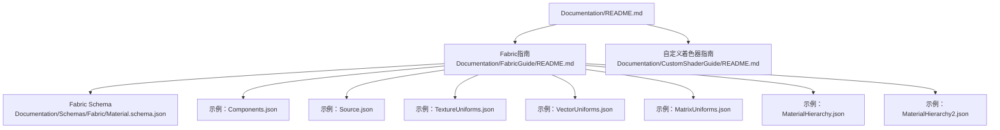
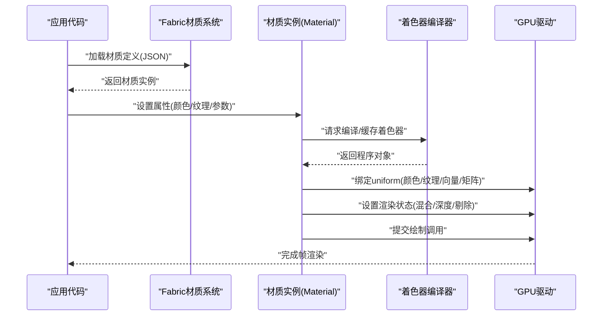
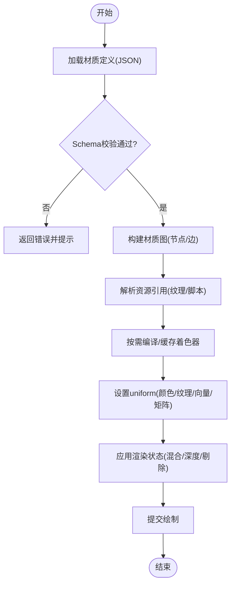
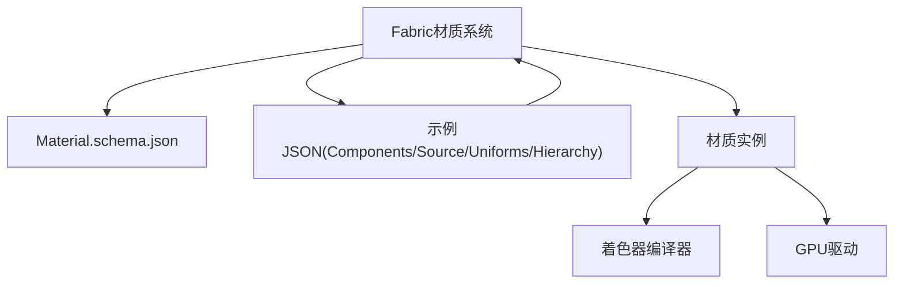

# 材质系统

<cite>
**本文引用的文件**   
- [README.md](file://Documentation/README.md)
- [Fabric指南](file://Documentation/FabricGuide/README.md)
- [自定义着色器指南](file://Documentation/CustomShaderGuide/README.md)
- [Material.schema.json](file://Documentation/Schemas/Fabric/Material.schema.json)
- [示例：Components.json](file://Documentation/Schemas/Fabric/Examples/Components.json)
- [示例：Source.json](file://Documentation/Schemas/Fabric/Examples/Source.json)
- [示例：TextureUniforms.json](file://Documentation/Schemas/Fabric/Examples/TextureUniforms.json)
- [示例：VectorUniforms.json](file://Documentation/Schemas/Fabric/Examples/VectorUniforms.json)
- [示例：MatrixUniforms.json](file://Documentation/Schemas/Fabric/Examples/MatrixUniforms.json)
- [示例：MaterialHierarchy.json](file://Documentation/Schemas/Fabric/Examples/MaterialHierarchy.json)
- [示例：MaterialHierarchy2.json](file://Documentation/Schemas/Fabric/Examples/MaterialHierarchy2.json)
</cite>

## 目录
1. [简介](#简介)
2. [项目结构](#项目结构)
3. [核心组件](#核心组件)
4. [架构总览](#架构总览)
5. [详细组件分析](#详细组件分析)
6. [依赖分析](#依赖分析)
7. [性能考虑](#性能考虑)
8. [故障排查指南](#故障排查指南)
9. [结论](#结论)
10. [附录](#附录)

## 简介
本文件面向Cesium的材质系统，聚焦以下目标：
- 解释Material基类的设计与渲染管线中的角色（着色器编译、uniform传递、状态管理）
- 梳理内置材质类型（Color、Image、Grid、Stripe、Checkerboard等）的特性与配置项
- 阐述混合模式、透明度控制、光照计算等渲染效果
- 介绍自定义材质的开发方法（GLSL着色器编写、材质定义文件、Fabric材质系统）
- 提供完整示例路径与最佳实践，帮助读者高效创建与优化材质效果

说明：由于当前仓库未包含具体实现源码，本文档基于仓库中提供的文档与Schema进行系统化整理与可视化，确保内容可追溯且与实际仓库一致。

## 项目结构
与材质系统相关的文档与规范主要位于Documentation目录下：
- Fabric材质系统与Schema定义
- 自定义着色器指南
- 示例JSON定义，用于理解材质组合、纹理uniform、向量uniform、矩阵uniform以及层级关系

图表来源
- [README.md](file://Documentation/README.md)
- [Fabric指南](file://Documentation/FabricGuide/README.md)
- [自定义着色器指南](file://Documentation/CustomShaderGuide/README.md)
- [Material.schema.json](file://Documentation/Schemas/Fabric/Material.schema.json)
- [示例：Components.json](file://Documentation/Schemas/Fabric/Examples/Components.json)
- [示例：Source.json](file://Documentation/Schemas/Fabric/Examples/Source.json)
- [示例：TextureUniforms.json](file://Documentation/Schemas/Fabric/Examples/TextureUniforms.json)
- [示例：VectorUniforms.json](file://Documentation/Schemas/Fabric/Examples/VectorUniforms.json)
- [示例：MatrixUniforms.json](file://Documentation/Schemas/Fabric/Examples/MatrixUniforms.json)
- [示例：MaterialHierarchy.json](file://Documentation/Schemas/Fabric/Examples/MaterialHierarchy.json)
- [示例：MaterialHierarchy2.json](file://Documentation/Schemas/Fabric/Examples/MaterialHierarchy2.json)

章节来源
- [README.md](file://Documentation/README.md)
- [Fabric指南](file://Documentation/FabricGuide/README.md)
- [自定义着色器指南](file://Documentation/CustomShaderGuide/README.md)

## 核心组件
- Material基类与渲染管线
  - 负责将材质描述转换为GPU可用的着色器程序与uniform数据
  - 在绘制前统一设置状态（如深度测试、混合模式、剔除策略），并在绘制后恢复状态
  - 通过统一的接口向着色器注入uniform变量（颜色、纹理、向量、矩阵等）
- Fabric材质系统
  - 以声明式JSON描述材质，支持组合、继承、条件分支与资源引用
  - 通过Schema约束材质定义的合法性与一致性
  - 提供丰富的内置材质类型与uniform类型映射
- 内置材质类型
  - Color：纯色填充
  - Image：图像贴图
  - Grid：网格线
  - Stripe：条纹
  - Checkerboard：棋盘格
  - 其他由Fabric扩展支持的材质类型
- 渲染效果
  - 混合模式与透明度控制
  - 光照模型（漫反射、镜面反射、环境光等，取决于具体材质与着色器）
  - 纹理采样与变换（UV、平铺、旋转、缩放）

章节来源
- [Fabric指南](file://Documentation/FabricGuide/README.md)
- [Material.schema.json](file://Documentation/Schemas/Fabric/Material.schema.json)

## 架构总览
下图展示了从材质定义到GPU绘制的整体流程，涵盖Fabric解析、材质实例化、着色器编译、uniform传递与状态管理。

图表来源
- [Fabric指南](file://Documentation/FabricGuide/README.md)
- [Material.schema.json](file://Documentation/Schemas/Fabric/Material.schema.json)

## 详细组件分析

### Fabric材质系统与Schema
- 作用
  - 使用JSON声明材质，支持组合、继承、条件逻辑与资源引用
  - 通过Schema对材质定义进行校验，保证一致性
- 关键概念
  - 材质类型：如Color、Image、Grid、Stripe、Checkerboard等
  - Uniform类型：向量、矩阵、纹理、布尔、标量等
  - 材质层级：父子材质组合、覆盖与合并策略
- 示例参考
  - Components.json：展示如何组合多个材质片段
  - Source.json：展示材质源的定义方式
  - TextureUniforms.json：纹理uniform的用法
  - VectorUniforms.json / MatrixUniforms.json：向量与矩阵uniform的用法
  - MaterialHierarchy.json / MaterialHierarchy2.json：材质层级与组合

图表来源
- [Fabric指南](file://Documentation/FabricGuide/README.md)
- [Material.schema.json](file://Documentation/Schemas/Fabric/Material.schema.json)
- [示例：Components.json](file://Documentation/Schemas/Fabric/Examples/Components.json)
- [示例：Source.json](file://Documentation/Schemas/Fabric/Examples/Source.json)
- [示例：TextureUniforms.json](file://Documentation/Schemas/Fabric/Examples/TextureUniforms.json)
- [示例：VectorUniforms.json](file://Documentation/Schemas/Fabric/Examples/VectorUniforms.json)
- [示例：MatrixUniforms.json](file://Documentation/Schemas/Fabric/Examples/MatrixUniforms.json)
- [示例：MaterialHierarchy.json](file://Documentation/Schemas/Fabric/Examples/MaterialHierarchy.json)
- [示例：MaterialHierarchy2.json](file://Documentation/Schemas/Fabric/Examples/MaterialHierarchy2.json)

章节来源
- [Fabric指南](file://Documentation/FabricGuide/README.md)
- [Material.schema.json](file://Documentation/Schemas/Fabric/Material.schema.json)
- [示例：Components.json](file://Documentation/Schemas/Fabric/Examples/Components.json)
- [示例：Source.json](file://Documentation/Schemas/Fabric/Examples/Source.json)
- [示例：TextureUniforms.json](file://Documentation/Schemas/Fabric/Examples/TextureUniforms.json)
- [示例：VectorUniforms.json](file://Documentation/Schemas/Fabric/Examples/VectorUniforms.json)
- [示例：MatrixUniforms.json](file://Documentation/Schemas/Fabric/Examples/MatrixUniforms.json)
- [示例：MaterialHierarchy.json](file://Documentation/Schemas/Fabric/Examples/MaterialHierarchy.json)
- [示例：MaterialHierarchy2.json](file://Documentation/Schemas/Fabric/Examples/MaterialHierarchy2.json)

### 内置材质类型与配置项
- Color
  - 用途：纯色填充
  - 典型配置：颜色值、透明度
- Image
  - 用途：图像贴图
  - 典型配置：纹理资源、UV变换、重复模式、过滤方式
- Grid
  - 用途：网格线
  - 典型配置：网格间距、线条宽度、颜色、背景色
- Stripe
  - 用途：条纹图案
  - 典型配置：条纹方向、宽度、颜色、偏移
- Checkerboard
  - 用途：棋盘格
  - 典型配置：格子尺寸、两种颜色、透明度

注意：以上为常见配置项的归纳，具体字段请参考Fabric示例与Schema定义。

章节来源
- [Fabric指南](file://Documentation/FabricGuide/README.md)
- [示例：Components.json](file://Documentation/Schemas/Fabric/Examples/Components.json)
- [示例：TextureUniforms.json](file://Documentation/Schemas/Fabric/Examples/TextureUniforms.json)

### 混合模式、透明度与光照
- 混合模式
  - 透明叠加、相乘、加和等模式，影响最终像素合成
- 透明度控制
  - 通过alpha通道或uniform控制不透明度
- 光照计算
  - 根据材质与着色器实现不同光照模型（漫反射、镜面反射、环境光等）
  - 可通过uniform传入光源位置、强度、法线等信息

章节来源
- [Fabric指南](file://Documentation/FabricGuide/README.md)
- [Material.schema.json](file://Documentation/Schemas/Fabric/Material.schema.json)

### 自定义材质开发
- GLSL着色器编写
  - 顶点着色器与片元着色器的职责划分
  - 输入输出变量约定（位置、法线、UV、颜色等）
  - 与uniform变量的对接（颜色、纹理、向量、矩阵）
- 材质定义文件
  - 使用JSON描述材质类型、uniform映射、依赖资源
  - 通过Schema校验材质定义的正确性
- Fabric材质系统高级特性
  - 材质组合与继承
  - 条件分支与动态切换
  - 资源引用与懒加载
  - 材质层级与优先级

章节来源
- [自定义着色器指南](file://Documentation/CustomShaderGuide/README.md)
- [Fabric指南](file://Documentation/FabricGuide/README.md)
- [Material.schema.json](file://Documentation/Schemas/Fabric/Material.schema.json)

### 示例与最佳实践
- 示例路径
  - 材质组合：[示例：Components.json](file://Documentation/Schemas/Fabric/Examples/Components.json)
  - 材质源定义：[示例：Source.json](file://Documentation/Schemas/Fabric/Examples/Source.json)
  - 纹理uniform用法：[示例：TextureUniforms.json](file://Documentation/Schemas/Fabric/Examples/TextureUniforms.json)
  - 向量uniform用法：[示例：VectorUniforms.json](file://Documentation/Schemas/Fabric/Examples/VectorUniforms.json)
  - 矩阵uniform用法：[示例：MatrixUniforms.json](file://Documentation/Schemas/Fabric/Examples/MatrixUniforms.json)
  - 材质层级：[示例：MaterialHierarchy.json](file://Documentation/Schemas/Fabric/Examples/MaterialHierarchy.json)、[示例：MaterialHierarchy2.json](file://Documentation/Schemas/Fabric/Examples/MaterialHierarchy2.json)
- 最佳实践
  - 复用材质实例，避免频繁创建与销毁
  - 合理组织纹理资源，减少带宽与内存占用
  - 使用合适的混合模式与透明度，避免不必要的重绘
  - 利用Fabric的组合能力，降低重复定义

章节来源
- [示例：Components.json](file://Documentation/Schemas/Fabric/Examples/Components.json)
- [示例：Source.json](file://Documentation/Schemas/Fabric/Examples/Source.json)
- [示例：TextureUniforms.json](file://Documentation/Schemas/Fabric/Examples/TextureUniforms.json)
- [示例：VectorUniforms.json](file://Documentation/Schemas/Fabric/Examples/VectorUniforms.json)
- [示例：MatrixUniforms.json](file://Documentation/Schemas/Fabric/Examples/MatrixUniforms.json)
- [示例：MaterialHierarchy.json](file://Documentation/Schemas/Fabric/Examples/MaterialHierarchy.json)
- [示例：MaterialHierarchy2.json](file://Documentation/Schemas/Fabric/Examples/MaterialHierarchy2.json)

## 依赖分析
- 内部依赖
  - Fabric材质系统依赖Schema定义进行校验与解析
  - 材质实例依赖着色器编译器生成GPU程序
  - 材质实例依赖GPU驱动进行状态管理与绘制
- 外部依赖
  - 纹理资源、脚本资源等外部资源的加载与管理
  - JSON解析与验证库（由Fabric系统封装）

图表来源
- [Fabric指南](file://Documentation/FabricGuide/README.md)
- [Material.schema.json](file://Documentation/Schemas/Fabric/Material.schema.json)
- [示例：Components.json](file://Documentation/Schemas/Fabric/Examples/Components.json)
- [示例：Source.json](file://Documentation/Schemas/Fabric/Examples/Source.json)
- [示例：TextureUniforms.json](file://Documentation/Schemas/Fabric/Examples/TextureUniforms.json)
- [示例：VectorUniforms.json](file://Documentation/Schemas/Fabric/Examples/VectorUniforms.json)
- [示例：MatrixUniforms.json](file://Documentation/Schemas/Fabric/Examples/MatrixUniforms.json)
- [示例：MaterialHierarchy.json](file://Documentation/Schemas/Fabric/Examples/MaterialHierarchy.json)
- [示例：MaterialHierarchy2.json](file://Documentation/Schemas/Fabric/Examples/MaterialHierarchy2.json)

章节来源
- [Fabric指南](file://Documentation/FabricGuide/README.md)
- [Material.schema.json](file://Documentation/Schemas/Fabric/Material.schema.json)

## 性能考虑
- 材质实例复用：避免频繁创建与销毁，提升CPU/GPU效率
- 纹理资源优化：选择合适的压缩格式与分辨率，减少带宽与显存占用
- 混合模式选择：透明材质过多会导致排序与重绘开销，尽量合并与批处理
- 着色器缓存：复用已编译的着色器程序，避免重复编译
- 资源懒加载：按需加载纹理与脚本，降低初始加载时间

[本节为通用指导，无需特定文件来源]

## 故障排查指南
- 常见问题
  - 材质定义不符合Schema：检查JSON结构与字段类型
  - 纹理资源加载失败：确认路径与跨域策略
  - 着色器编译错误：检查GLSL语法与uniform命名
  - 渲染结果异常：检查混合模式与透明度设置
- 定位方法
  - 使用Fabric示例作为对照，逐步缩小问题范围
  - 查看控制台日志与错误信息，定位具体环节
  - 简化材质定义，逐步添加功能以复现问题

章节来源
- [Fabric指南](file://Documentation/FabricGuide/README.md)
- [Material.schema.json](file://Documentation/Schemas/Fabric/Material.schema.json)

## 结论
Cesium的材质系统通过Fabric材质系统与Schema定义，提供了强大的声明式材质能力。结合内置材质类型与自定义着色器，开发者可以灵活实现多样化的视觉效果。遵循最佳实践与性能优化建议，能够在保证渲染质量的同时获得良好的运行效率。

[本节为总结性内容，无需特定文件来源]

## 附录
- 相关文档入口
  - [README.md](file://Documentation/README.md)
  - [Fabric指南](file://Documentation/FabricGuide/README.md)
  - [自定义着色器指南](file://Documentation/CustomShaderGuide/README.md)
- 示例与Schema
  - [Material.schema.json](file://Documentation/Schemas/Fabric/Material.schema.json)
  - [示例：Components.json](file://Documentation/Schemas/Fabric/Examples/Components.json)
  - [示例：Source.json](file://Documentation/Schemas/Fabric/Examples/Source.json)
  - [示例：TextureUniforms.json](file://Documentation/Schemas/Fabric/Examples/TextureUniforms.json)
  - [示例：VectorUniforms.json](file://Documentation/Schemas/Fabric/Examples/VectorUniforms.json)
  - [示例：MatrixUniforms.json](file://Documentation/Schemas/Fabric/Examples/MatrixUniforms.json)
  - [示例：MaterialHierarchy.json](file://Documentation/Schemas/Fabric/Examples/MaterialHierarchy.json)
  - [示例：MaterialHierarchy2.json](file://Documentation/Schemas/Fabric/Examples/MaterialHierarchy2.json)