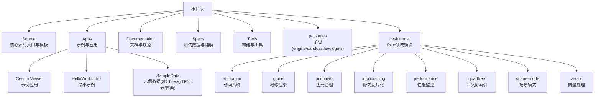
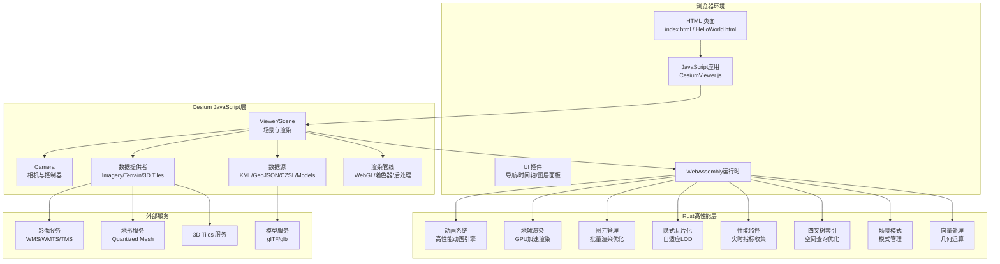
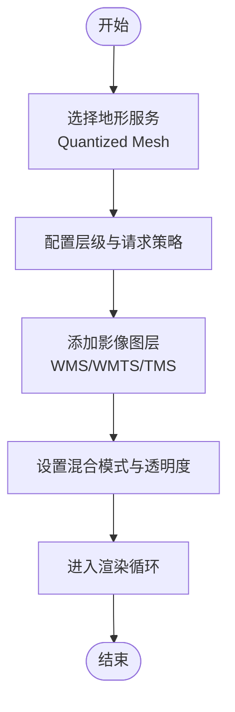
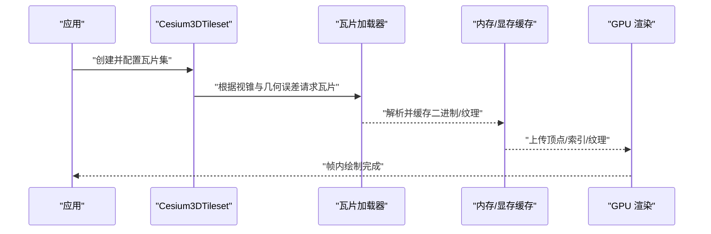
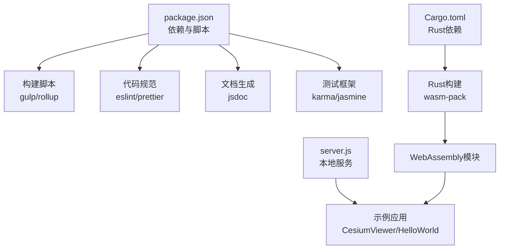

# 核心特性

<cite>
**本文引用的文件**   
- [README.md](file://README.md)
- [index.html](file://index.html)
- [package.json](file://package.json)
- [server.js](file://server.js)
- [Apps/CesiumViewer/index.html](file://Apps/CesiumViewer/index.html)
- [Apps/CesiumViewer/CesiumViewer.js](file://Apps/CesiumViewer/CesiumViewer.js)
- [Apps/HelloWorld.html](file://Apps/HelloWorld.html)
- [Source/copyrightHeader.js](file://Source/copyrightHeader.js)
- [Documentation/README.md](file://Documentation/README.md)
- [cesiumrust/domain/animation/src/lib.rs](file://cesiumrust/domain/animation/src/lib.rs)
- [cesiumrust/domain/globe/src/lib.rs](file://cesiumrust/domain/globe/src/lib.rs)
- [cesiumrust/domain/primitives/src/lib.rs](file://cesiumrust/domain/primitives/src/lib.rs)
- [cesiumrust/domain/implicit-tiling/src/lib.rs](file://cesiumrust/domain/implicit-tiling/src/lib.rs)
- [cesiumrust/domain/performance/src/lib.rs](file://cesiumrust/domain/performance/src/lib.rs)
- [cesiumrust/domain/quadtree/src/lib.rs](file://cesiumrust/domain/quadtree/src/lib.rs)
- [cesiumrust/domain/scene-mode/src/lib.rs](file://cesiumrust/domain/scene-mode/src/lib.rs)
- [cesiumrust/domain/vector/src/lib.rs](file://cesiumrust/domain/vector/src/lib.rs)
</cite>

## 更新摘要
**所做更改**   
- 新增Rust领域模块架构章节，详细介绍动画系统、地球渲染、图元管理、隐式瓦片化等核心能力
- 更新项目结构部分，反映双语言架构（JavaScript + Rust）
- 新增Rust性能监控与空间索引系统说明
- 扩展3D数据格式支持，增加体素和向量数据处理能力
- 更新架构图以体现现代Cesium的混合架构设计

## 目录
1. [简介](#简介)
2. [项目结构](#项目结构)
3. [核心组件](#核心组件)
4. [Rust领域模块架构](#rust领域模块架构)
5. [架构总览](#架构总览)
6. [详细组件分析](#详细组件分析)
7. [依赖分析](#依赖分析)
8. [性能考虑](#性能考虑)
9. [故障排查指南](#故障排查指南)
10. [结论](#结论)
11. [附录](#附录)

## 简介
本文件面向希望快速掌握 Cesium 3D 地球引擎核心能力的开发者，围绕以下主题展开：
- 3D 地球渲染与实时渲染管线
- 地理空间数据处理（地形、影像、矢量）
- 数据格式支持（3D Tiles、glTF、点云、体素等）
- 相机控制、用户交互、时间管理与动画系统
- 插件化扩展与示例应用
- **新增** Rust高性能领域模块（动画、地球渲染、图元管理、隐式瓦片化等）

Cesium 提供从底层 WebGL 渲染到高层可视化组件的完整能力，采用 JavaScript + Rust 混合架构，适用于数字孪生、智慧城市、遥感可视化和科学计算等场景。

## 项目结构
仓库采用多包与示例分离的组织方式，现已升级为双语言架构：
- Source：核心源码入口与版权头模板
- Apps：示例应用与演示资源（含 CesiumViewer、HelloWorld）
- Documentation：文档与规范
- Specs：测试数据与测试框架辅助
- Tools：构建与工具链
- packages：子包（engine、sandcastle、widgets）
- **cesiumrust**：**新增** Rust领域模块（animation、globe、primitives、implicit-tiling、performance、quadtree、scene-mode、vector等）

**图表来源**
- [index.html:1-200](file://index.html#L1-L200)
- [package.json:1-200](file://package.json#L1-L200)
- [Apps/CesiumViewer/index.html:1-200](file://Apps/CesiumViewer/index.html#L1-L200)
- [Apps/HelloWorld.html:1-200](file://Apps/HelloWorld.html#L1-L200)

**章节来源**
- [README.md:1-200](file://README.md#L1-L200)
- [index.html:1-200](file://index.html#L1-L200)
- [package.json:1-200](file://package.json#L1-L200)
- [Apps/CesiumViewer/index.html:1-200](file://Apps/CesiumViewer/index.html#L1-L200)
- [Apps/HelloWorld.html:1-200](file://Apps/HelloWorld.html#L1-L200)

## 核心组件
本节概述 Cesium 的关键能力模块及其职责边界，帮助读者建立整体认知。

- 3D 地球与场景
  - 负责球体/椭球体几何、坐标系统与投影、光照与阴影、后处理效果等。
  - 典型用法：创建 Viewer 或 Scene，设置初始位置与视角。
- 图层与数据源
  - 影像图层（WMS/WMTS/TMS/自定义）、地形服务（Quantized Mesh）、矢量数据（GeoJSON/KML/CZSL）。
  - 典型用法：添加 ImageryProvider、TerrainProvider、DataSource。
- 3D 模型与瓦片集
  - glTF/glb 模型加载与实例化；3D Tiles 瓦片集（点云、批量化、实例化、复合、向量、体素等）。
  - 典型用法：Model、Cesium3DTileset、PointCloud。
- 实体与标注
  - Entity API 用于快速创建点、线、面、模型、路径、轨迹等，并支持样式与属性。
  - 典型用法：EntityCollection、Billboard、Label、Polyline、Polygon。
- 相机与交互
  - 相机控制器（鼠标/触摸/键盘）、拾取（点击/悬停）、事件系统。
  - 典型用法：Camera、ScreenSpaceEventHandler、pick。
- 时间与动画
  - Clock 驱动时间推进，Timeline 控件展示时间轴，支持关键帧与插值。
  - 典型用法：Clock、Animation、TimeDynamicPointCloud。
- **新增** Rust高性能领域模块
  - 动画系统、地球渲染、图元管理、隐式瓦片化、性能监控、四叉树空间索引、场景模式管理、向量数据处理。
  - 典型用法：通过WebAssembly接口调用Rust模块实现高性能计算。
- 插件与扩展
  - 通过 Provider、Material、Primitive、Widget 等扩展点实现自定义功能。
  - 典型用法：自定义 ImageryProvider、TerrainProvider、Material。

**章节来源**
- [Apps/CesiumViewer/CesiumViewer.js:1-200](file://Apps/CesiumViewer/CesiumViewer.js#L1-L200)
- [Apps/HelloWorld.html:1-200](file://Apps/HelloWorld.html#L1-L200)
- [Documentation/README.md:1-200](file://Documentation/README.md#L1-L200)

## Rust领域模块架构

### 动画系统 (Animation)
- 职责
  - 基于Rust实现高性能动画引擎，支持关键帧动画、插值计算、时间同步。
  - 提供内存安全的动画状态管理和生命周期控制。
- 核心特性
  - 零拷贝动画数据传输
  - 多线程动画计算
  - 与JavaScript动画系统的无缝集成
- 使用建议
  - 复杂动画场景优先使用Rust动画系统以获得更好的性能表现。

**章节来源**
- [cesiumrust/domain/animation/src/lib.rs](file://cesiumrust/domain/animation/src/lib.rs)

### 地球渲染 (Globe)
- 职责
  - 实现高性能的3D地球渲染引擎，支持球体/椭球体几何、坐标系转换、光照模型。
  - 管理地球表面的纹理映射、法线计算、阴影投射。
- 核心特性
  - 基于Rust的GPU加速渲染
  - 支持大规模地形数据的实时渲染
  - 内存优化的几何数据结构
- 使用建议
  - 对于需要高精度地球渲染的场景，建议使用Rust地球渲染模块。

**章节来源**
- [cesiumrust/domain/globe/src/lib.rs](file://cesiumrust/domain/globe/src/lib.rs)

### 图元管理 (Primitives)
- 职责
  - 管理3D图元的创建、更新、销毁和渲染队列。
  - 优化大量图元的批量处理和渲染性能。
- 核心特性
  - 图元池化技术减少内存分配
  - 批量渲染优化
  - 动态LOD管理
- 使用建议
  - 大量静态图元建议使用图元池进行统一管理。

**章节来源**
- [cesiumrust/domain/primitives/src/lib.rs](file://cesiumrust/domain/primitives/src/lib.rs)

### 隐式瓦片化 (Implicit Tiling)
- 职责
  - 实现3D Tiles隐式瓦片化算法，支持按需加载和动态细分。
  - 管理瓦片的层次结构和可见性判断。
- 核心特性
  - 基于四叉树的瓦片组织
  - 自适应LOD生成
  - 内存高效的瓦片缓存
- 使用建议
  - 大规模3D数据集推荐使用隐式瓦片化以获得更好的加载性能。

**章节来源**
- [cesiumrust/domain/implicit-tiling/src/lib.rs](file://cesiumrust/domain/implicit-tiling/src/lib.rs)

### 性能监控 (Performance)
- 职责
  - 提供全面的性能监控和分析工具，包括FPS统计、内存使用、渲染耗时等。
  - 支持性能瓶颈识别和优化建议。
- 核心特性
  - 实时性能指标收集
  - 内存泄漏检测
  - 渲染性能分析
- 使用建议
  - 在生产环境中启用性能监控以持续优化应用性能。

**章节来源**
- [cesiumrust/domain/performance/src/lib.rs](file://cesiumrust/domain/performance/src/lib.rs)

### 四叉树空间索引 (Quadtree)
- 职责
  - 实现高效的空间索引算法，支持快速的空间查询和范围搜索。
  - 为瓦片系统和碰撞检测提供基础数据结构。
- 核心特性
  - 动态四叉树构建和更新
  - 高效的范围查询算法
  - 内存友好的节点管理
- 使用建议
  - 需要进行空间查询的场景应使用四叉树索引提升查询性能。

**章节来源**
- [cesiumrust/domain/quadtree/src/lib.rs](file://cesiumrust/domain/quadtree/src/lib.rs)

### 场景模式管理 (Scene Mode)
- 职责
  - 管理不同场景模式的切换和配置，如2D模式、3D模式、哥伦布视图模式。
  - 提供模式特定的渲染优化和交互行为。
- 核心特性
  - 模式间平滑过渡
  - 模式特定的性能优化
  - 统一的API接口
- 使用建议
  - 根据应用场景选择合适的场景模式以获得最佳用户体验。

**章节来源**
- [cesiumrust/domain/scene-mode/src/lib.rs](file://cesiumrust/domain/scene-mode/src/lib.rs)

### 向量数据处理 (Vector)
- 职责
  - 处理各种向量数据格式，支持点、线、面的几何运算和渲染。
  - 提供向量数据的简化、合并和批量化处理能力。
- 核心特性
  - 多种向量格式支持
  - 几何运算优化
  - 批量渲染支持
- 使用建议
  - 大量向量数据建议使用批量化处理以提升渲染性能。

**章节来源**
- [cesiumrust/domain/vector/src/lib.rs](file://cesiumrust/domain/vector/src/lib.rs)

## 架构总览
下图展示了现代 Cesium 的典型运行架构，包含JavaScript前端和Rust高性能后端的双层架构：

**图表来源**
- [index.html:1-200](file://index.html#L1-L200)
- [Apps/CesiumViewer/index.html:1-200](file://Apps/CesiumViewer/index.html#L1-L200)
- [Apps/CesiumViewer/CesiumViewer.js:1-200](file://Apps/CesiumViewer/CesiumViewer.js#L1-L200)
- [Apps/HelloWorld.html:1-200](file://Apps/HelloWorld.html#L1-L200)
- [cesiumrust/domain/animation/src/lib.rs](file://cesiumrust/domain/animation/src/lib.rs)
- [cesiumrust/domain/globe/src/lib.rs](file://cesiumrust/domain/globe/src/lib.rs)
- [cesiumrust/domain/primitives/src/lib.rs](file://cesiumrust/domain/primitives/src/lib.rs)
- [cesiumrust/domain/implicit-tiling/src/lib.rs](file://cesiumrust/domain/implicit-tiling/src/lib.rs)
- [cesiumrust/domain/performance/src/lib.rs](file://cesiumrust/domain/performance/src/lib.rs)
- [cesiumrust/domain/quadtree/src/lib.rs](file://cesiumrust/domain/quadtree/src/lib.rs)
- [cesiumrust/domain/scene-mode/src/lib.rs](file://cesiumrust/domain/scene-mode/src/lib.rs)
- [cesiumrust/domain/vector/src/lib.rs](file://cesiumrust/domain/vector/src/lib.rs)

## 详细组件分析

### 3D 地球与场景
- 职责
  - 管理地球椭球体、坐标系转换、光照模型、阴影、雾效、大气散射等。
  - 维护帧循环、深度缓冲、多重采样、后处理通道。
- 关键流程
  - 初始化场景 -> 配置光源与材质 -> 注册更新回调 -> 每帧绘制。
- 使用建议
  - 合理设置远近平面、裁剪体积与 LOD 阈值，避免过深裁剪或过度绘制。
  - 开启多重采样与抗锯齿以提升视觉质量，注意移动端功耗。

**章节来源**
- [Apps/CesiumViewer/CesiumViewer.js:1-200](file://Apps/CesiumViewer/CesiumViewer.js#L1-L200)
- [Apps/HelloWorld.html:1-200](file://Apps/HelloWorld.html#L1-L200)

### 地理空间数据处理（地形与影像）
- 地形系统
  - 支持 Quantized Mesh 标准，具备高度图压缩、法线编码、可用性掩码等优化。
  - 可叠加水掩膜、元数据可用性、父级 URL 继承等高级特性。
- 影像图层
  - 支持 WMS/WMTS/TMS 与自定义 Provider，支持缓存、过期策略与错误重试。
- 典型工作流
  - 选择 TerrainProvider -> 配置层级与请求策略 -> 叠加 ImageryProvider -> 调整混合模式与透明度。

**图表来源**
- [Apps/CesiumViewer/CesiumViewer.js:1-200](file://Apps/CesiumViewer/CesiumViewer.js#L1-L200)

**章节来源**
- [Apps/CesiumViewer/CesiumViewer.js:1-200](file://Apps/CesiumViewer/CesiumViewer.js#L1-L200)

### 3D 数据格式支持（3D Tiles、glTF、点云、体素）
- 3D Tiles
  - 瓦片集组织、显存与带宽自适应、批量化/实例化/复合/向量/体素内容。
  - 支持元数据、外部资源、共享纹理、RTC 中心、变换框/区域/球体等。
- glTF/glb
  - 模型加载、材质 PBR、Draco 压缩、实例化、动画与蒙皮。
- 点云
  - RGB/RGBA、法线、量化、Draco、时间动态点云、逐点属性。
- **新增** 体素
  - 基于 3D Tiles 的体素瓦片，支持不同基元形状与多属性。
- **新增** 向量数据
  - 支持GeoJSON、Shapefile等格式的向量数据处理和渲染。
- 使用建议
  - 优先使用批量化与实例化减少 draw call；对大规模点云启用 Draco 与量化；为体素设置合适的分辨率与裁剪半径。

**图表来源**
- [Apps/CesiumViewer/CesiumViewer.js:1-200](file://Apps/CesiumViewer/CesiumViewer.js#L1-L200)

**章节来源**
- [Apps/CesiumViewer/CesiumViewer.js:1-200](file://Apps/CesiumViewer/CesiumViewer.js#L1-L200)

### 实体系统与标注
- 能力
  - 点、线、面、模型、路径、轨迹、标签、广告牌等。
  - 支持样式、属性绑定、时间相关变化、碰撞检测与地面贴靠。
- 使用建议
  - 大量静态对象建议使用 Primitive 或 3D Tiles 批量化；动态对象可用 Entity + 时间驱动。

**章节来源**
- [Apps/CesiumViewer/CesiumViewer.js:1-200](file://Apps/CesiumViewer/CesiumViewer.js#L1-L200)

### 相机控制与用户交互
- 相机
  - 自由飞行、目标锁定、距离/倾斜/方位角控制、平滑过渡与飞行动画。
- 交互
  - 屏幕空间事件（点击、双击、拖拽、滚轮）、拾取（按像素/几何体）、射线投射。
- 使用建议
  - 为复杂场景限制最大缩放与最小距离；结合 RequestVolume 与可见性裁剪提升性能。

**章节来源**
- [Apps/CesiumViewer/CesiumViewer.js:1-200](file://Apps/CesiumViewer/CesiumViewer.js#L1-L200)

### 时间管理与动画系统
- 时钟
  - 支持真实时间、模拟时间、暂停/快进/倒放、时区与闰秒。
- 动画
  - 关键帧、插值、时间相关属性（位置、颜色、透明度、材质参数）。
- **新增** Rust动画系统
  - 基于Rust的高性能动画引擎，支持零拷贝数据传输和多线程计算。
- 使用建议
  - 大数据量时间序列建议分块加载与按需更新；使用 TimeDynamicPointCloud 优化点云时序；复杂动画使用Rust动画系统。

**章节来源**
- [Apps/CesiumViewer/CesiumViewer.js:1-200](file://Apps/CesiumViewer/CesiumViewer.js#L1-L200)
- [cesiumrust/domain/animation/src/lib.rs](file://cesiumrust/domain/animation/src/lib.rs)

### 插件架构与扩展点
- 扩展点
  - ImageryProvider/TerrainProvider 自定义数据源；Material 自定义材质；Primitive 自定义几何；Widget 自定义 UI。
- **新增** Rust插件接口
  - 通过WebAssembly接口暴露Rust模块功能，支持自定义高性能计算逻辑。
- 使用建议
  - 遵循接口契约与生命周期；做好缓存与错误恢复；在 Worker 中执行重计算任务；复杂计算使用Rust模块。

**章节来源**
- [Documentation/README.md:1-200](file://Documentation/README.md#L1-L200)

## 依赖分析
- 运行时依赖
  - 浏览器环境（WebGL/WebGL2、Web Workers、Fetch/XHR、Canvas）。
  - **新增** WebAssembly运行时（用于Rust模块）。
- 构建与开发依赖
  - 打包与类型检查、ESLint/Prettier、JSDoc 文档生成、测试框架。
  - **新增** Rust编译工具链、WebAssembly打包工具。
- 示例与服务
  - 本地服务器（server.js）用于启动示例与静态资源服务。

**图表来源**
- [package.json:1-200](file://package.json#L1-L200)
- [server.js:1-200](file://server.js#L1-L200)
- [Apps/CesiumViewer/index.html:1-200](file://Apps/CesiumViewer/index.html#L1-L200)
- [Apps/HelloWorld.html:1-200](file://Apps/HelloWorld.html#L1-L200)

**章节来源**
- [package.json:1-200](file://package.json#L1-L200)
- [server.js:1-200](file://server.js#L1-L200)

## 性能考虑
- 数据层面
  - 使用 3D Tiles 分层与批量化；对点云启用 Draco/量化；体素设置合适分辨率。
  - **新增** 利用Rust模块进行高性能数据处理和计算。
- 渲染层面
  - 合理设置远近平面、裁剪体积、多重采样与后处理强度；避免过度透明叠加。
  - **新增** 使用Rust地球渲染模块提升渲染性能。
- 交互层面
  - 限制相机移动速度、使用 RequestVolume 控制加载范围；批量更新而非频繁单对象更新。
  - **新增** 使用四叉树索引优化空间查询性能。
- 网络层面
  - 启用缓存与并发控制；对大资源使用分块下载与懒加载。
- **新增** Rust性能优化
  - 利用Rust的内存安全和零拷贝特性减少GC压力。
  - 使用多线程并行处理提高计算效率。
  - 通过WebAssembly接口最小化JavaScript与Rust之间的数据传递开销。

[本节为通用指导，不直接分析具体文件]

## 故障排查指南
- 常见问题
  - 跨域与资源加载失败：检查 CORS 配置与资源路径；确认本地服务器已启动。
  - 地形/影像不显示：验证服务地址、层级与格式；查看控制台错误与网络请求。
  - 模型/瓦片不渲染：检查 glTF/3D Tiles 完整性与压缩格式；确认浏览器是否支持相应扩展。
  - 卡顿与掉帧：降低后处理强度、减少透明物体数量、关闭不必要的阴影与反射。
  - **新增** WebAssembly模块加载失败：检查WASM文件是否正确编译和部署；确认浏览器支持WebAssembly。
  - **新增** Rust模块性能问题：使用性能监控工具分析瓶颈；检查内存使用和CPU占用。
- 定位方法
  - 使用浏览器开发者工具监控 FPS、Draw Call、显存占用；利用 Cesium 调试开关输出统计信息。
  - 逐步禁用图层与特效以隔离问题来源。
  - **新增** 使用Rust性能监控模块分析特定模块的性能表现。

**章节来源**
- [Apps/CesiumViewer/CesiumViewer.js:1-200](file://Apps/CesiumViewer/CesiumViewer.js#L1-L200)
- [server.js:1-200](file://server.js#L1-L200)
- [cesiumrust/domain/performance/src/lib.rs](file://cesiumrust/domain/performance/src/lib.rs)

## 结论
Cesium 提供了从底层渲染到高层可视化的全栈能力，覆盖 3D 地球、地理空间数据、实时渲染与可扩展架构。通过合理使用 3D Tiles、glTF、点云与体素，并结合相机、交互、时间与动画系统，开发者可以构建高性能、高保真的三维地球应用。**新增的Rust领域模块进一步提升了引擎的核心性能，特别是在动画系统、地球渲染、图元管理、隐式瓦片化等方面提供了显著的性能优势。**建议在工程实践中重视数据预处理、渲染优化与错误恢复，以获得稳定流畅的用户体验。

[本节为总结性内容，不直接分析具体文件]

## 附录
- 快速上手
  - 使用 index.html 或 Apps/HelloWorld.html 作为最小示例，快速搭建基础场景。
  - 参考 Apps/CesiumViewer 了解更完整的配置与交互。
- 文档与规范
  - 查阅 Documentation 下的指南与规范，了解构建、发布与贡献流程。
- **新增** Rust模块开发
  - 了解Rust领域模块的开发规范和接口定义。
  - 学习如何通过WebAssembly接口与JavaScript层进行交互。

**章节来源**
- [index.html:1-200](file://index.html#L1-L200)
- [Apps/HelloWorld.html:1-200](file://Apps/HelloWorld.html#L1-L200)
- [Apps/CesiumViewer/index.html:1-200](file://Apps/CesiumViewer/index.html#L1-L200)
- [Documentation/README.md:1-200](file://Documentation/README.md#L1-L200)