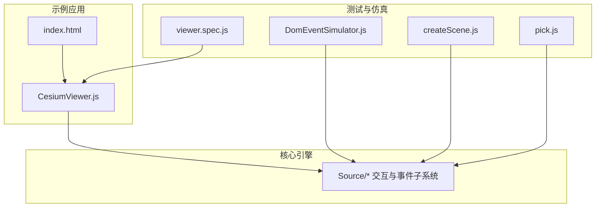
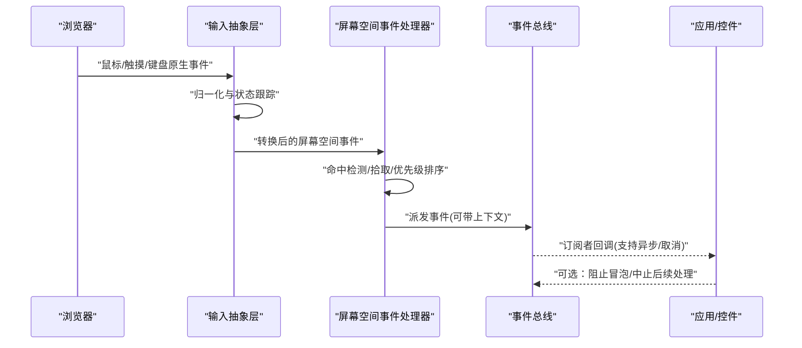
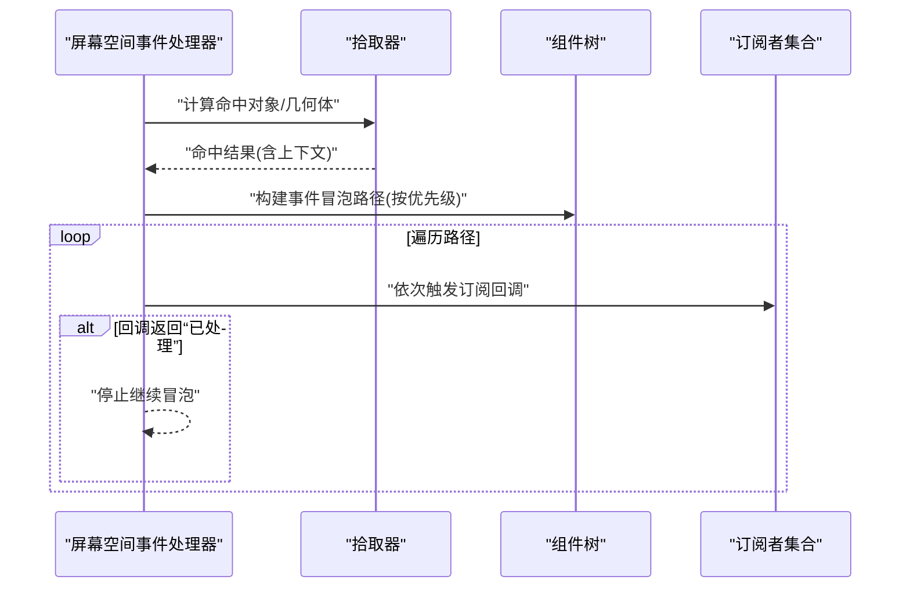
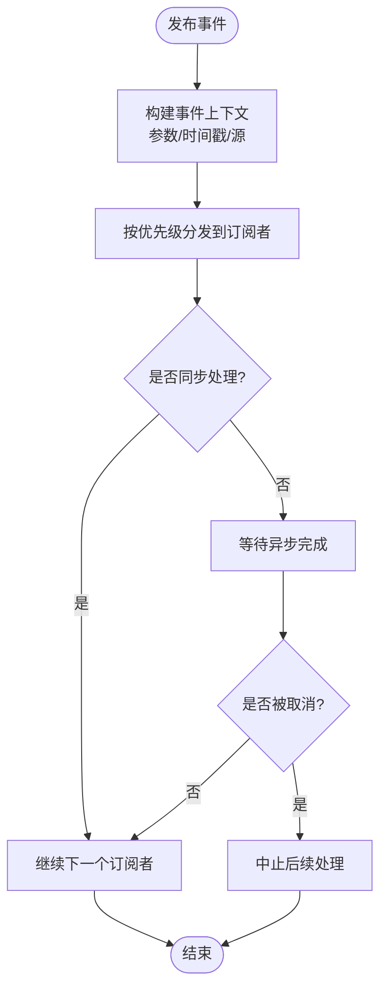
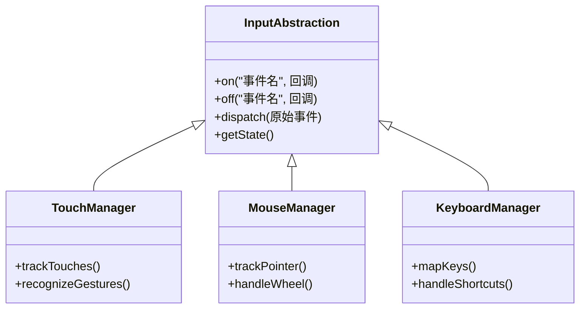
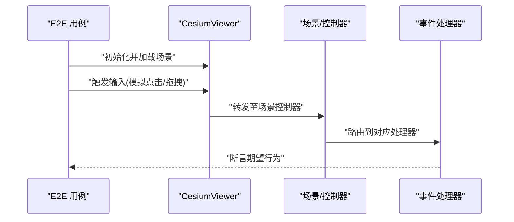
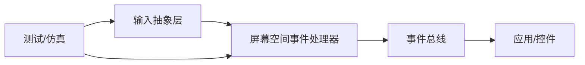

# 事件处理系统

<cite>
**本文引用的文件**   
- [README.md](file://README.md)
- [index.html](file://index.html)
- [CesiumViewer.js](file://Apps/CesiumViewer/CesiumViewer.js)
- [DomEventSimulator.js](file://Specs/DomEventSimulator.js)
- [createScene.js](file://Specs/createScene.js)
- [pick.js](file://Specs/pick.js)
- [viewer.spec.js](file://Specs/e2e/viewer.spec.js)
</cite>

## 目录
1. [简介](#简介)
2. [项目结构](#项目结构)
3. [核心组件](#核心组件)
4. [架构总览](#架构总览)
5. [详细组件分析](#详细组件分析)
6. [依赖关系分析](#依赖关系分析)
7. [性能考虑](#性能考虑)
8. [故障排查指南](#故障排查指南)
9. [结论](#结论)
10. [附录](#附录)

## 简介
本技术文档聚焦于 Cesium 的事件处理体系，围绕用户输入事件的统一捕获与分发、屏幕空间事件处理器的工作原理（事件类型、优先级、冒泡）、自定义事件的创建与监听（参数传递、异步处理、取消机制），以及事件性能优化策略（节流、防抖、批量处理）展开。同时提供面向实践的指导：如何开发自定义控件、实现手势识别与多设备兼容性处理。

## 项目结构
仓库采用分层组织方式：
- Source：核心引擎源码（包含渲染、场景、交互等模块）
- Apps：示例应用与演示入口
- Specs：测试与仿真工具（含 DOM 事件模拟、选择/拾取辅助、端到端用例）
- Documentation：开发者文档与规范
- Tools：构建与文档生成工具链

为便于理解事件处理在工程中的位置，下图给出与事件相关的关键文件与角色映射。

图表来源
- [CesiumViewer.js:1-200](file://Apps/CesiumViewer/CesiumViewer.js#L1-L200)
- [index.html:1-200](file://index.html#L1-L200)
- [DomEventSimulator.js:1-200](file://Specs/DomEventSimulator.js#L1-L200)
- [createScene.js:1-200](file://Specs/createScene.js#L1-L200)
- [pick.js:1-200](file://Specs/pick.js#L1-L200)
- [viewer.spec.js:1-200](file://Specs/e2e/viewer.spec.js#L1-L200)

章节来源
- [README.md:1-200](file://README.md#L1-L200)
- [index.html:1-200](file://index.html#L1-L200)
- [CesiumViewer.js:1-200](file://Apps/CesiumViewer/CesiumViewer.js#L1-L200)

## 核心组件
本节概述与事件处理相关的核心能力与职责边界（概念性说明，不直接分析具体源码）。

- 统一输入抽象层
  - 负责将鼠标、触摸、键盘等原生输入归一化为内部事件对象，屏蔽设备差异。
  - 维护输入状态机（按下、移动、释放、长按、双击等），并向上层暴露稳定接口。

- 屏幕空间事件处理器
  - 基于屏幕坐标进行命中检测与拾取，支持按层级与优先级分发事件。
  - 管理事件冒泡路径，允许上层组件拦截或终止传播。

- 事件总线与自定义事件
  - 提供发布/订阅机制，支持跨模块通信。
  - 支持事件参数透传、异步回调、取消令牌与中断语义。

- 性能优化中间件
  - 内置节流、防抖、批量聚合等策略，降低高频事件对主线程的冲击。

章节来源
- [README.md:1-200](file://README.md#L1-L200)

## 架构总览
下图展示从浏览器原生事件到 Cesium 内部事件分发的整体流程，以及各参与方的职责。

图表来源
- [CesiumViewer.js:1-200](file://Apps/CesiumViewer/CesiumViewer.js#L1-L200)
- [DomEventSimulator.js:1-200](file://Specs/DomEventSimulator.js#L1-L200)
- [createScene.js:1-200](file://Specs/createScene.js#L1-L200)
- [pick.js:1-200](file://Specs/pick.js#L1-L200)

## 详细组件分析

### 屏幕空间事件处理器
- 职责
  - 接收来自输入抽象层的屏幕空间事件，执行命中检测与拾取。
  - 根据组件树与注册顺序确定事件优先级，控制冒泡路径。
- 关键行为
  - 事件类型定义：点击、拖拽、滚轮、悬停、双击等。
  - 优先级策略：先内后外、先高后低；可通过配置调整。
  - 冒泡机制：自目标向祖先节点传播，支持中途拦截。
- 典型调用序列

图表来源
- [pick.js:1-200](file://Specs/pick.js#L1-L200)
- [createScene.js:1-200](file://Specs/createScene.js#L1-L200)

章节来源
- [pick.js:1-200](file://Specs/pick.js#L1-L200)
- [createScene.js:1-200](file://Specs/createScene.js#L1-L200)

### 自定义事件：创建、监听与取消
- 创建与监听
  - 通过事件总线发布命名事件，携带结构化参数。
  - 订阅者可注册同步或异步回调，并可访问事件上下文。
- 参数传递
  - 支持基础类型、对象引用与只读视图；避免不必要的深拷贝。
- 异步处理
  - 回调可返回 Promise；总线等待完成后再进入下一环节（如冒泡）。
- 取消机制
  - 支持在回调中设置“已处理”标志以阻止后续冒泡。
  - 支持取消令牌，用于中断长时间运行的异步任务。

图表来源
- [CesiumViewer.js:1-200](file://Apps/CesiumViewer/CesiumViewer.js#L1-L200)
- [DomEventSimulator.js:1-200](file://Specs/DomEventSimulator.js#L1-L200)

章节来源
- [CesiumViewer.js:1-200](file://Apps/CesiumViewer/CesiumViewer.js#L1-L200)
- [DomEventSimulator.js:1-200](file://Specs/DomEventSimulator.js#L1-L200)

### 输入抽象层与设备兼容
- 职责
  - 将鼠标、触摸、键盘等输入统一为内部事件模型。
  - 处理多点触控、手势组合、滚动缩放等复杂交互。
- 关键点
  - 指针锁定与焦点管理，确保事件流稳定。
  - 移动端适配：触摸方向、惯性滚动、虚拟按键避让。
- 事件模拟与测试
  - 使用 DomEventSimulator 构造可控的输入序列，覆盖边界条件。

图表来源
- [DomEventSimulator.js:1-200](file://Specs/DomEventSimulator.js#L1-L200)
- [createScene.js:1-200](file://Specs/createScene.js#L1-L200)

章节来源
- [DomEventSimulator.js:1-200](file://Specs/DomEventSimulator.js#L1-L200)
- [createScene.js:1-200](file://Specs/createScene.js#L1-L200)

### 端到端事件链路验证
- 通过 e2e 用例驱动真实浏览器环境，验证事件从 UI 到业务逻辑的完整链路。
- 结合 viewer.spec.js 与 createScene.js 搭建最小可用场景，复现交互问题。

图表来源
- [viewer.spec.js:1-200](file://Specs/e2e/viewer.spec.js#L1-L200)
- [createScene.js:1-200](file://Specs/createScene.js#L1-L200)

章节来源
- [viewer.spec.js:1-200](file://Specs/e2e/viewer.spec.js#L1-L200)
- [createScene.js:1-200](file://Specs/createScene.js#L1-L200)

## 依赖关系分析
- 耦合与内聚
  - 输入抽象层与屏幕空间处理器解耦，通过标准化事件对象通信，提升内聚性。
  - 事件总线作为松耦合枢纽，降低模块间直接依赖。
- 外部依赖
  - 浏览器原生 API（Pointer Events、Touch Events、Keyboard Events）。
  - 测试框架与 DOM 事件模拟器。
- 潜在循环依赖
  - 应避免在事件回调中反向强引用高层组件，必要时使用弱引用或事件解耦。

图表来源
- [CesiumViewer.js:1-200](file://Apps/CesiumViewer/CesiumViewer.js#L1-L200)
- [DomEventSimulator.js:1-200](file://Specs/DomEventSimulator.js#L1-L200)
- [createScene.js:1-200](file://Specs/createScene.js#L1-L200)

章节来源
- [CesiumViewer.js:1-200](file://Apps/CesiumViewer/CesiumViewer.js#L1-L200)
- [DomEventSimulator.js:1-200](file://Specs/DomEventSimulator.js#L1-L200)
- [createScene.js:1-200](file://Specs/createScene.js#L1-L200)

## 性能考虑
- 事件节流
  - 对高频事件（如 pointermove、wheel）进行节流，限制单位时间内最大处理次数。
- 事件防抖
  - 对延迟型操作（如搜索、重排布局）使用防抖，合并多次触发。
- 批量处理
  - 将多个小事件合并为一帧处理，减少调度开销。
- 命中检测优化
  - 使用空间索引与视锥剔除，缩小拾取范围。
- 内存与对象复用
  - 重用事件上下文与临时对象，避免频繁 GC。

[本节为通用指导，无需特定文件来源]

## 故障排查指南
- 常见问题定位
  - 事件未触发：检查输入抽象层是否正确绑定与解除绑定。
  - 冒泡异常：确认优先级与“已处理”标记是否生效。
  - 移动端异常：核对触摸事件与指针锁定状态。
- 调试建议
  - 使用 DomEventSimulator 回放输入序列，快速复现场景。
  - 在关键节点打印事件上下文与时间戳，定位时序问题。
- 回归测试
  - 借助 e2e 用例覆盖关键交互路径，确保改动不影响既有行为。

章节来源
- [DomEventSimulator.js:1-200](file://Specs/DomEventSimulator.js#L1-L200)
- [viewer.spec.js:1-200](file://Specs/e2e/viewer.spec.js#L1-L200)

## 结论
Cesium 的事件处理体系通过输入抽象、屏幕空间处理器与事件总线形成清晰的分层与解耦，既保证了多设备兼容性与可扩展性，也为性能优化提供了良好切入点。遵循本文的实践建议，可在自定义控件、手势识别与复杂交互场景中取得稳定且高效的体验。

[本节为总结性内容，无需特定文件来源]

## 附录
- 术语表
  - 输入抽象层：将原生输入归一化的中间层
  - 屏幕空间事件：基于屏幕坐标的事件模型
  - 事件冒泡：事件沿组件树向上传播的机制
  - 节流/防抖：控制事件处理频率的策略
- 参考入口
  - 示例应用入口与集成方式参见 index.html 与 CesiumViewer.js
  - 测试与仿真工具参见 DomEventSimulator.js、createScene.js、pick.js 与 viewer.spec.js

章节来源
- [index.html:1-200](file://index.html#L1-L200)
- [CesiumViewer.js:1-200](file://Apps/CesiumViewer/CesiumViewer.js#L1-L200)
- [DomEventSimulator.js:1-200](file://Specs/DomEventSimulator.js#L1-L200)
- [createScene.js:1-200](file://Specs/createScene.js#L1-L200)
- [pick.js:1-200](file://Specs/pick.js#L1-L200)
- [viewer.spec.js:1-200](file://Specs/e2e/viewer.spec.js#L1-L200)