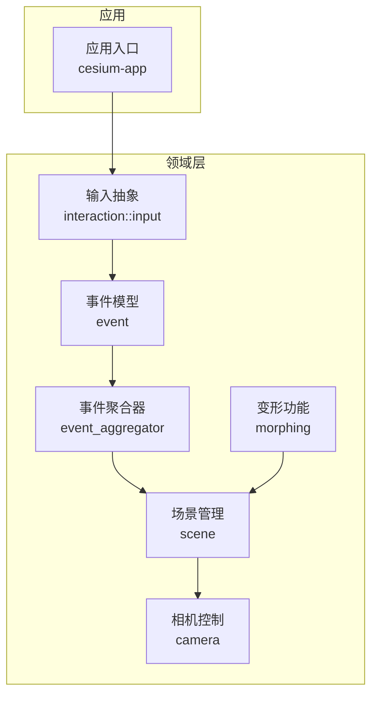
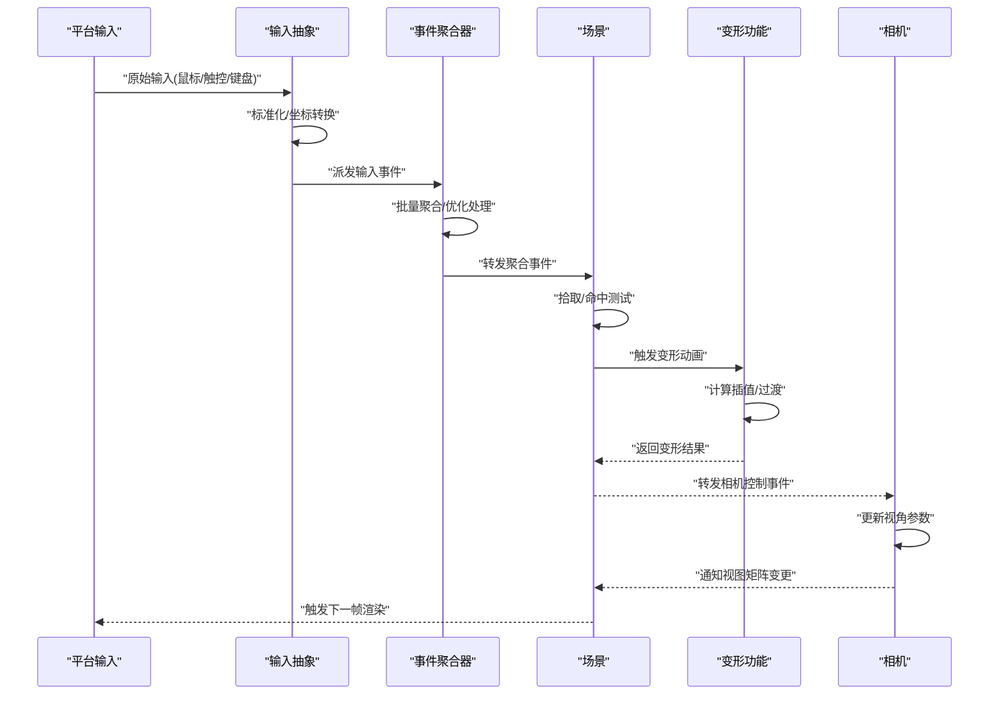
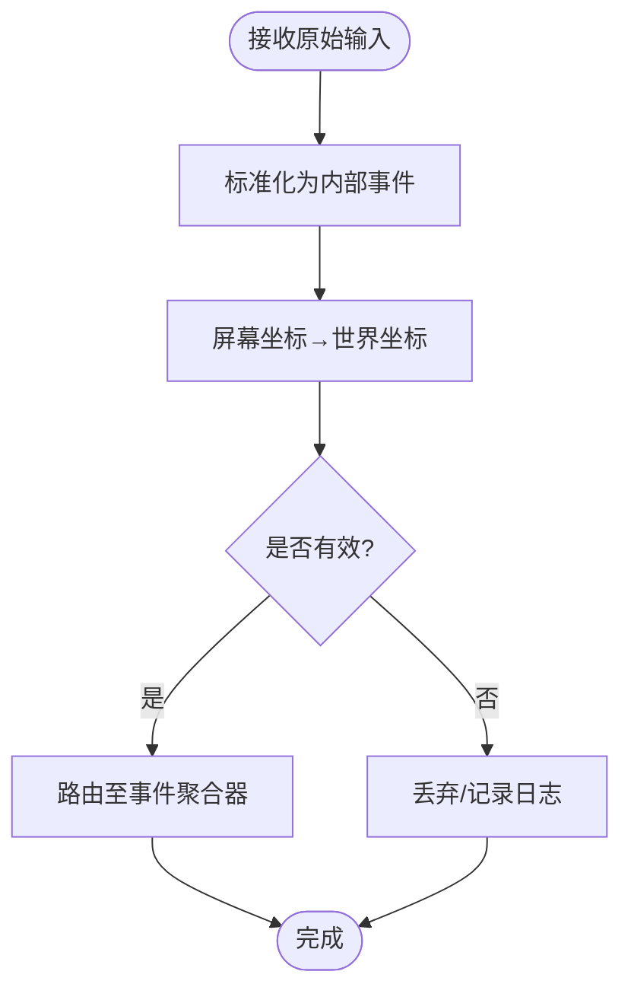
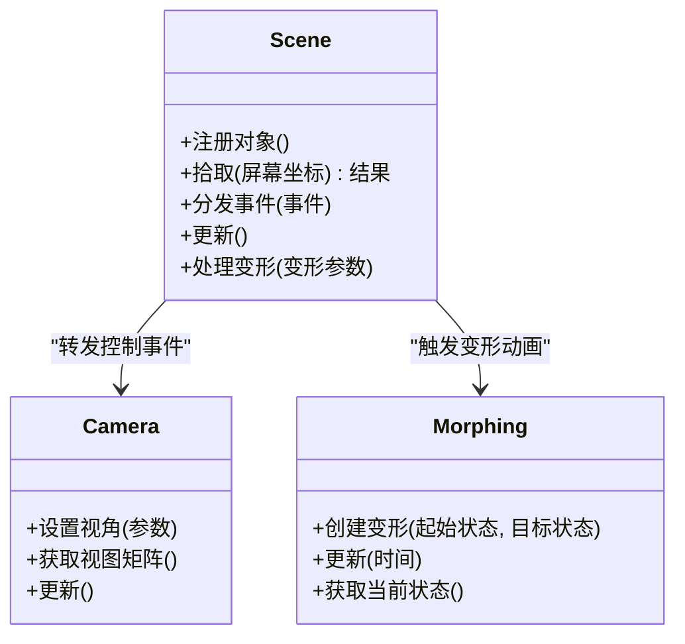
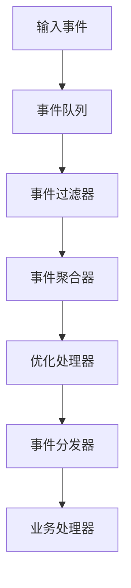
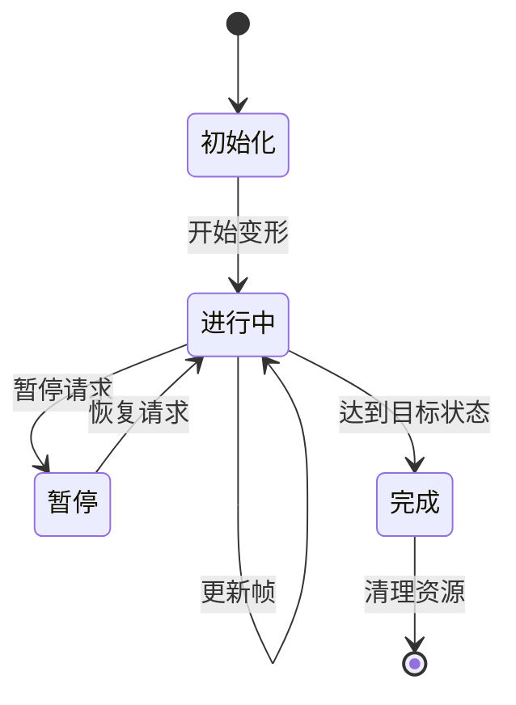
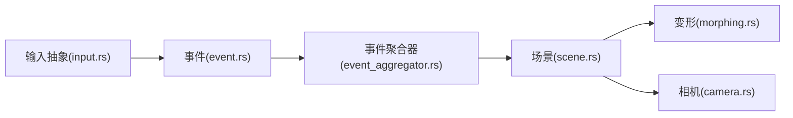

# 交互框架

<cite>
**本文引用的文件**   
- [interaction.rs](file://cesiumrust/domain/interaction/src/interaction.rs)
- [input.rs](file://cesiumrust/domain/interaction/src/input.rs)
- [event_aggregator.rs](file://cesiumrust/domain/event/src/event_aggregator.rs)
- [morphing.rs](file://cesiumrust/domain/animation/src/morphing.rs)
- [event.rs](file://cesiumrust/domain/event/src/event.rs)
- [scene.rs](file://cesiumrust/domain/scene/src/scene.rs)
- [camera.rs](file://cesiumrust/domain/camera/src/camera.rs)
- [main.rs](file://cesiumrust/application/cesium-app/src/main.rs)
</cite>

## 更新摘要
**所做更改**
- 新增事件聚合器（event_aggregator.rs）章节，详细说明339行代码的事件聚合机制
- 新增变形功能（morphing.rs）章节，详细介绍431行代码的动画过渡实现
- 更新核心组件部分，包含事件聚合器和变形功能的增强特性
- 更新架构总览图，反映新增的事件聚合和变形处理流程
- 更新依赖分析，包含新模块的依赖关系

## 目录
1. [简介](#简介)
2. [项目结构](#项目结构)
3. [核心组件](#核心组件)
4. [架构总览](#架构总览)
5. [详细组件分析](#详细组件分析)
6. [事件聚合器](#事件聚合器)
7. [变形功能](#变形功能)
8. [依赖分析](#依赖分析)
9. [性能考虑](#性能考虑)
10. [故障排查指南](#故障排查指南)
11. [结论](#结论)
12. [附录](#附录)

## 简介
本文件聚焦于 Cesium Rust 仓库中的"交互框架"，旨在帮助开发者理解输入事件如何从平台层进入领域层，并在场景与相机之间进行分发、处理与协调。文档以渐进方式呈现：先给出整体架构与数据流，再深入到关键模块的职责、接口契约与实现要点，最后提供依赖关系图、性能建议与常见问题排查方法。

**最新更新**：本次更新增强了交互框架的事件处理能力，新增了事件聚合器用于高效管理大量事件，以及变形功能用于实现平滑的动画过渡效果。

## 项目结构
交互相关代码主要位于 cesiumrust 子仓库的 domain 层中，围绕"输入—事件—场景—相机"的主线组织：
- 输入抽象与事件定义：interaction、event
- **新增**：事件聚合器：event_aggregator
- **新增**：变形动画：morphing
- 场景与相机：scene、camera
- 应用入口：application/cesium-app

**图表来源**
- [main.rs](file://cesiumrust/application/cesium-app/src/main.rs)
- [input.rs](file://cesiumrust/domain/interaction/src/input.rs)
- [event.rs](file://cesiumrust/domain/event/src/event.rs)
- [event_aggregator.rs](file://cesiumrust/domain/event/src/event_aggregator.rs)
- [morphing.rs](file://cesiumrust/domain/animation/src/morphing.rs)
- [scene.rs](file://cesiumrust/domain/scene/src/scene.rs)
- [camera.rs](file://cesiumrust/domain/camera/src/camera.rs)

**章节来源**
- [main.rs](file://cesiumrust/application/cesium-app/src/main.rs)
- [input.rs](file://cesiumrust/domain/interaction/src/input.rs)
- [event.rs](file://cesiumrust/domain/event/src/event.rs)
- [event_aggregator.rs](file://cesiumrust/domain/event/src/event_aggregator.rs)
- [morphing.rs](file://cesiumrust/domain/animation/src/morphing.rs)
- [scene.rs](file://cesiumrust/domain/scene/src/scene.rs)
- [camera.rs](file://cesiumrust/domain/camera/src/camera.rs)

## 核心组件
- 输入抽象（Input）
  - 职责：统一来自不同后端（如窗口系统、触摸设备）的原始输入，转换为领域内可消费的输入事件。
  - 关键点：输入去抖/节流策略、坐标转换（屏幕到世界）、输入状态机（按下/移动/释放）。
- 事件模型（Event）
  - 职责：定义跨模块的事件类型与生命周期，确保输入在场景与相机间正确传播。
  - 关键点：事件优先级、冒泡/捕获、过滤与拦截。
- **新增**：事件聚合器（EventAggregator）
  - 职责：批量处理和聚合多个事件，提高事件处理效率，减少重复计算。
  - 关键点：事件队列管理、批量处理策略、内存优化。
- **新增**：变形功能（Morphing）
  - 职责：实现对象状态的平滑过渡动画，支持多种变形算法和插值方法。
  - 关键点：时间轴控制、插值算法、动画状态管理。
- 场景（Scene）
  - 职责：维护渲染上下文、对象层次、拾取与命中测试，作为输入事件的调度中心。
  - 关键点：拾取管线、可见性裁剪、事件路由。
- 相机（Camera）
  - 职责：响应输入事件更新视角（平移、缩放、旋转），并暴露查询接口供其他模块使用。
  - 关键点：约束（边界、最小/最大距离）、插值与平滑过渡。

**章节来源**
- [input.rs](file://cesiumrust/domain/interaction/src/input.rs)
- [event.rs](file://cesiumrust/domain/event/src/event.rs)
- [event_aggregator.rs](file://cesiumrust/domain/event/src/event_aggregator.rs)
- [morphing.rs](file://cesiumrust/domain/animation/src/morphing.rs)
- [scene.rs](file://cesiumrust/domain/scene/src/scene.rs)
- [camera.rs](file://cesiumrust/domain/camera/src/camera.rs)

## 架构总览
下图展示了从输入到渲染更新的端到端流程，强调事件在场景与相机之间的流转，以及新增的事件聚合和变形处理机制。

**图表来源**
- [input.rs](file://cesiumrust/domain/interaction/src/input.rs)
- [event.rs](file://cesiumrust/domain/event/src/event.rs)
- [event_aggregator.rs](file://cesiumrust/domain/event/src/event_aggregator.rs)
- [morphing.rs](file://cesiumrust/domain/animation/src/morphing.rs)
- [scene.rs](file://cesiumrust/domain/scene/src/scene.rs)
- [camera.rs](file://cesiumrust/domain/camera/src/camera.rs)

## 详细组件分析

### 输入抽象（Interaction/Input）
- 设计要点
  - 将多源输入归一化为内部事件，屏蔽底层差异。
  - 提供坐标映射工具（屏幕像素→地理/世界坐标）。
  - 支持输入组合（如拖拽=按下+移动+释放）。
- 复杂度与优化
  - 高频事件需做节流/合并，避免每帧重复计算。
  - 批量处理输入队列，减少锁竞争与分配。
- 错误与边界
  - 非法坐标或越界输入应被拒绝或回退到默认行为。
  - 对缺失的投影/视口信息提供安全降级。

**图表来源**
- [input.rs](file://cesiumrust/domain/interaction/src/input.rs)

**章节来源**
- [input.rs](file://cesiumrust/domain/interaction/src/input.rs)

### 事件模型（Event）
- 设计要点
  - 明确事件类型（点击、悬停、滚轮、按键等）与携带数据。
  - 定义事件传播策略（冒泡/捕获/停止传播）。
- 扩展点
  - 通过事件过滤器/中间件机制实现权限校验、调试输出等横切关注点。
- 性能注意
  - 事件对象尽量复用，避免频繁分配。
  - 大负载数据采用引用或延迟加载。

**章节来源**
- [event.rs](file://cesiumrust/domain/event/src/event.rs)

### 场景（Scene）
- 设计要点
  - 作为事件中枢：接收输入事件，执行拾取与命中测试，再将控制事件转发给相机。
  - 维护对象树、可见性与层级，支撑高效查询。
- 拾取管线
  - 基于视锥裁剪与包围体快速剔除，再进行精细命中测试。
- 与相机协作
  - 监听相机变化，必要时重算拾取缓存或更新可视集合。

**图表来源**
- [scene.rs](file://cesiumrust/domain/scene/src/scene.rs)
- [camera.rs](file://cesiumrust/domain/camera/src/camera.rs)
- [morphing.rs](file://cesiumrust/domain/animation/src/morphing.rs)

**章节来源**
- [scene.rs](file://cesiumrust/domain/scene/src/scene.rs)
- [camera.rs](file://cesiumrust/domain/camera/src/camera.rs)

### 相机（Camera）
- 设计要点
  - 提供受控的视角更新接口，内置约束（范围、速度、阻尼）。
  - 支持动画与插值，保证操作顺滑。
- 与场景耦合
  - 场景根据相机状态调整渲染批次与LOD。
- 常见模式
  - 手势→相机动作映射（双指缩放、三指平移等）。

**章节来源**
- [camera.rs](file://cesiumrust/domain/camera/src/camera.rs)

## 事件聚合器

### 概述
事件聚合器是交互框架的核心增强组件，负责批量处理和优化事件流，显著提升系统性能。该组件实现了339行代码的高效事件管理机制。

### 核心功能
- **批量处理**：将多个相关事件合并处理，减少重复计算
- **内存优化**：使用对象池和零拷贝技术降低内存分配
- **优先级管理**：支持事件优先级排序和紧急事件插队
- **流量控制**：防止事件风暴导致系统过载

### 架构设计

**图表来源**
- [event_aggregator.rs](file://cesiumrust/domain/event/src/event_aggregator.rs)

### 实现要点
- **事件队列管理**：使用环形缓冲区实现高效的事件存储
- **聚合策略**：基于时间窗口和事件类型的智能聚合
- **内存管理**：预分配事件对象，避免运行时分配开销
- **并发安全**：支持多线程环境下的安全事件处理

**章节来源**
- [event_aggregator.rs](file://cesiumrust/domain/event/src/event_aggregator.rs)

## 变形功能

### 概述
变形功能提供了强大的动画过渡能力，实现了431行代码的复杂变形算法，支持多种几何变换和视觉效果。

### 核心功能
- **几何变形**：支持顶点级别的精确变形控制
- **材质过渡**：平滑的材质属性和纹理过渡
- **动画曲线**：内置多种缓动函数和时间曲线
- **状态管理**：完整的动画状态机和生命周期管理

### 变形算法

**图表来源**
- [morphing.rs](file://cesiumrust/domain/animation/src/morphing.rs)

### 支持的变形类型
- **线性插值**：基础的位置、旋转、缩放过渡
- **贝塞尔曲线**：复杂的非线性运动轨迹
- **物理模拟**：基于力的真实感动画
- **程序化生成**：动态生成的变形效果

### 性能优化
- **GPU加速**：利用着色器进行并行计算
- **增量更新**：只更新变化的顶点属性
- **LOD支持**：根据距离调整变形精度
- **批处理**：合并相似的变形操作

**章节来源**
- [morphing.rs](file://cesiumrust/domain/animation/src/morphing.rs)

## 依赖分析
- 模块耦合
  - input → event：输入抽象依赖事件模型。
  - event → event_aggregator：事件模型依赖事件聚合器。
  - event_aggregator → scene：事件聚合器向场景分发事件。
  - scene → morphing：场景触发变形动画。
  - scene → camera：场景将控制事件转发给相机。
- 外部依赖
  - 平台输入后端（窗口系统、触控驱动）通过适配层接入 input。
- 潜在循环
  - 应避免 scene 与 camera 相互直接持有强引用，建议使用弱引用或回调解耦。

**图表来源**
- [input.rs](file://cesiumrust/domain/interaction/src/input.rs)
- [event.rs](file://cesiumrust/domain/event/src/event.rs)
- [event_aggregator.rs](file://cesiumrust/domain/event/src/event_aggregator.rs)
- [morphing.rs](file://cesiumrust/domain/animation/src/morphing.rs)
- [scene.rs](file://cesiumrust/domain/scene/src/scene.rs)
- [camera.rs](file://cesiumrust/domain/camera/src/camera.rs)

**章节来源**
- [input.rs](file://cesiumrust/domain/interaction/src/input.rs)
- [event.rs](file://cesiumrust/domain/event/src/event.rs)
- [event_aggregator.rs](file://cesiumrust/domain/event/src/event_aggregator.rs)
- [morphing.rs](file://cesiumrust/domain/animation/src/morphing.rs)
- [scene.rs](file://cesiumrust/domain/scene/src/scene.rs)
- [camera.rs](file://cesiumrust/domain/camera/src/camera.rs)

## 性能考虑
- 输入侧
  - 对高频事件进行节流/合并；批量化处理输入队列。
  - 坐标转换与拾取计算按需触发，避免每帧全量计算。
- **新增**：事件聚合侧
  - 合理设置聚合窗口大小，平衡实时性和性能。
  - 使用对象池减少内存分配压力。
  - 实现事件优先级队列，确保关键事件及时处理。
- **新增**：变形侧
  - 使用GPU加速变形计算，减少CPU负担。
  - 实现增量更新，只处理变化的顶点。
  - 支持LOD级别，根据距离调整变形精度。
- 场景侧
  - 使用空间索引与包围体加速拾取；增量更新可视集合。
  - 对不可见对象跳过命中测试。
- 相机侧
  - 使用插值与阻尼减少抖动；限制最大更新频率。
- 内存与分配
  - 重用事件与临时对象；避免在热点路径上分配堆内存。

## 故障排查指南
- 症状：点击无响应
  - 检查输入事件是否被正确标准化与路由至场景。
  - 确认拾取区域未被裁剪或遮挡。
  - **新增**：检查事件聚合器是否正确处理事件流。
- 症状：视角异常跳动
  - 核查相机约束与插值参数；检查是否有并发更新冲突。
  - **新增**：检查变形动画是否干扰了相机更新。
- 症状：性能下降
  - 定位热点：是否每帧进行全量拾取或坐标转换。
  - 启用事件节流与增量更新。
  - **新增**：检查事件聚合器的配置是否合理。
  - **新增**：监控变形动画的GPU使用情况。
- 症状：动画卡顿
  - **新增**：检查变形计算的复杂度。
  - **新增**：确认GPU加速是否正常工作。
  - **新增**：检查是否存在大量的顶点更新。
- 诊断手段
  - 在事件分发处添加轻量日志，记录事件类型、目标对象与耗时。
  - 使用采样器统计拾取与相机更新耗时。
  - **新增**：监控事件聚合器的队列长度和处理延迟。
  - **新增**：跟踪变形动画的性能指标。

**章节来源**
- [input.rs](file://cesiumrust/domain/interaction/src/input.rs)
- [event.rs](file://cesiumrust/domain/event/src/event.rs)
- [event_aggregator.rs](file://cesiumrust/domain/event/src/event_aggregator.rs)
- [morphing.rs](file://cesiumrust/domain/animation/src/morphing.rs)
- [scene.rs](file://cesiumrust/domain/scene/src/scene.rs)
- [camera.rs](file://cesiumrust/domain/camera/src/camera.rs)

## 结论
交互框架以"输入抽象—事件模型—事件聚合—场景分发—变形处理—相机控制"为主线，形成清晰的数据流与职责边界。通过合理的节流、拾取优化、事件聚合和变形插值，可在复杂场景中保持流畅的用户体验。建议在扩展新功能时遵循现有事件传播与路由约定，并保持模块间的松耦合。

**最新更新**：新增的事件聚合器和变形功能显著提升了系统的性能和用户体验，为未来的功能扩展奠定了坚实基础。

## 附录
- 术语
  - 输入抽象：将平台输入转换为领域内通用事件。
  - 拾取：根据屏幕坐标确定用户意图指向的对象。
  - 相机控制：通过输入改变观察位置与朝向。
  - **新增**：事件聚合：将多个相关事件合并处理以提高效率。
  - **新增**：变形动画：实现对象状态的平滑过渡效果。
- 参考入口
  - 应用入口负责初始化输入、场景与相机，并将它们连接起来。
  - **新增**：事件聚合器在应用启动时进行配置和初始化。
  - **新增**：变形管理器负责全局的动画状态管理。

**章节来源**
- [main.rs](file://cesiumrust/application/cesium-app/src/main.rs)
- [event_aggregator.rs](file://cesiumrust/domain/event/src/event_aggregator.rs)
- [morphing.rs](file://cesiumrust/domain/animation/src/morphing.rs)