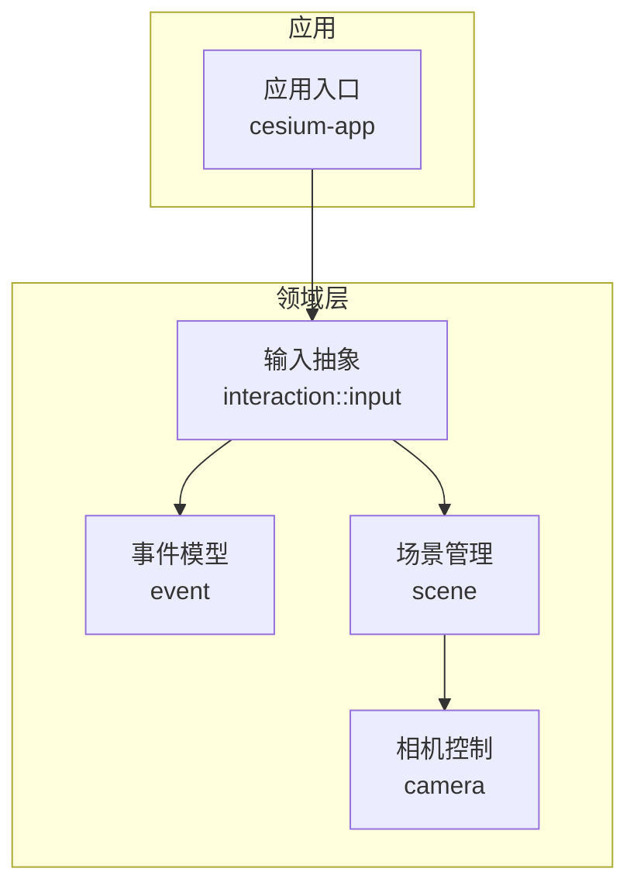
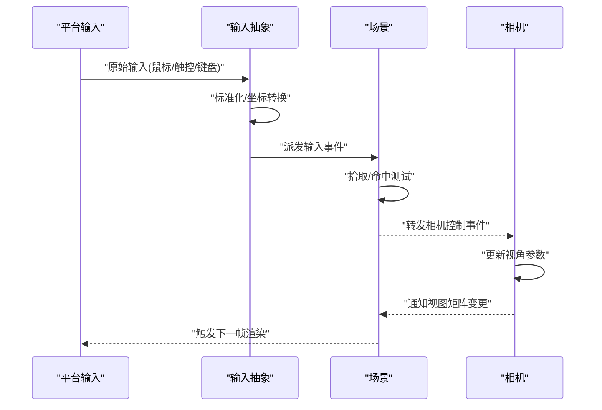
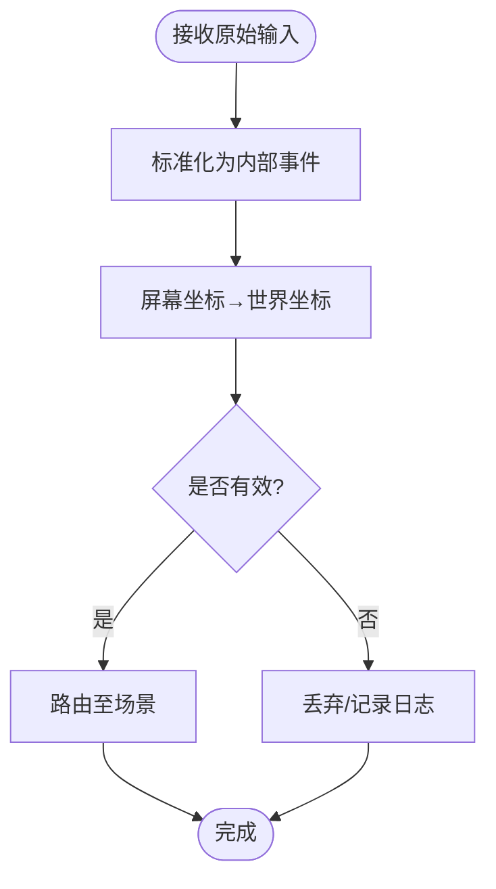
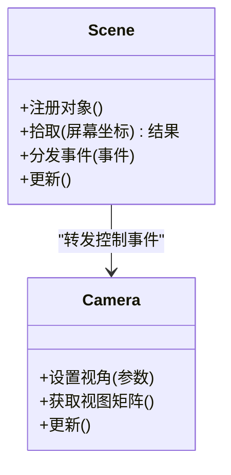
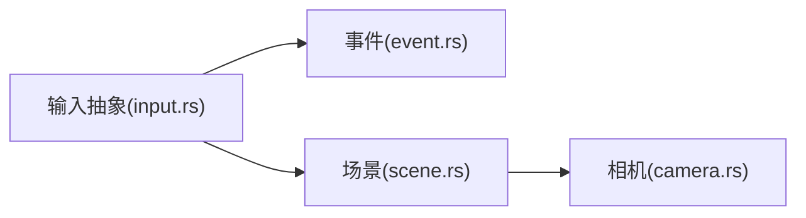

# 交互框架

<cite>
**本文引用的文件**   
- [interaction.rs](file://cesiumrust/domain/interaction/src/interaction.rs)
- [input.rs](file://cesiumrust/domain/interaction/src/input.rs)
- [event.rs](file://cesiumrust/domain/event/src/event.rs)
- [scene.rs](file://cesiumrust/domain/scene/src/scene.rs)
- [camera.rs](file://cesiumrust/domain/camera/src/camera.rs)
- [main.rs](file://cesiumrust/application/cesium-app/src/main.rs)
</cite>

## 目录
1. [简介](#简介)
2. [项目结构](#项目结构)
3. [核心组件](#核心组件)
4. [架构总览](#架构总览)
5. [详细组件分析](#详细组件分析)
6. [依赖分析](#依赖分析)
7. [性能考虑](#性能考虑)
8. [故障排查指南](#故障排查指南)
9. [结论](#结论)
10. [附录](#附录)

## 简介
本文件聚焦于 Cesium Rust 仓库中的“交互框架”，旨在帮助开发者理解输入事件如何从平台层进入领域层，并在场景与相机之间进行分发、处理与协调。文档以渐进方式呈现：先给出整体架构与数据流，再深入到关键模块的职责、接口契约与实现要点，最后提供依赖关系图、性能建议与常见问题排查方法。

## 项目结构
交互相关代码主要位于 cesiumrust 子仓库的 domain 层中，围绕“输入—事件—场景—相机”的主线组织：
- 输入抽象与事件定义：interaction、event
- 场景与相机：scene、camera
- 应用入口：application/cesium-app

图表来源
- [main.rs](file://cesiumrust/application/cesium-app/src/main.rs)
- [input.rs](file://cesiumrust/domain/interaction/src/input.rs)
- [event.rs](file://cesiumrust/domain/event/src/event.rs)
- [scene.rs](file://cesiumrust/domain/scene/src/scene.rs)
- [camera.rs](file://cesiumrust/domain/camera/src/camera.rs)

章节来源
- [main.rs](file://cesiumrust/application/cesium-app/src/main.rs)
- [input.rs](file://cesiumrust/domain/interaction/src/input.rs)
- [event.rs](file://cesiumrust/domain/event/src/event.rs)
- [scene.rs](file://cesiumrust/domain/scene/src/scene.rs)
- [camera.rs](file://cesiumrust/domain/camera/src/camera.rs)

## 核心组件
- 输入抽象（Input）
  - 职责：统一来自不同后端（如窗口系统、触摸设备）的原始输入，转换为领域内可消费的输入事件。
  - 关键点：输入去抖/节流策略、坐标转换（屏幕到世界）、输入状态机（按下/移动/释放）。
- 事件模型（Event）
  - 职责：定义跨模块的事件类型与生命周期，确保输入在场景与相机间正确传播。
  - 关键点：事件优先级、冒泡/捕获、过滤与拦截。
- 场景（Scene）
  - 职责：维护渲染上下文、对象层次、拾取与命中测试，作为输入事件的调度中心。
  - 关键点：拾取管线、可见性裁剪、事件路由。
- 相机（Camera）
  - 职责：响应输入事件更新视角（平移、缩放、旋转），并暴露查询接口供其他模块使用。
  - 关键点：约束（边界、最小/最大距离）、插值与平滑过渡。

章节来源
- [input.rs](file://cesiumrust/domain/interaction/src/input.rs)
- [event.rs](file://cesiumrust/domain/event/src/event.rs)
- [scene.rs](file://cesiumrust/domain/scene/src/scene.rs)
- [camera.rs](file://cesiumrust/domain/camera/src/camera.rs)

## 架构总览
下图展示了从输入到渲染更新的端到端流程，强调事件在场景与相机之间的流转。

图表来源
- [input.rs](file://cesiumrust/domain/interaction/src/input.rs)
- [event.rs](file://cesiumrust/domain/event/src/event.rs)
- [scene.rs](file://cesiumrust/domain/scene/src/scene.rs)
- [camera.rs](file://cesiumrust/domain/camera/src/camera.rs)

## 详细组件分析

### 输入抽象（Interaction/Input）
- 设计要点
  - 将多源输入归一化为内部事件，屏蔽底层差异。
  - 提供坐标映射工具（屏幕像素→地理/世界坐标）。
  - 支持输入组合（如拖拽=按下+移动+释放）。
- 复杂度与优化
  - 高频事件需做节流/合并，避免每帧重复计算。
  - 批量处理输入队列，减少锁竞争与分配。
- 错误与边界
  - 非法坐标或越界输入应被拒绝或回退到默认行为。
  - 对缺失的投影/视口信息提供安全降级。

图表来源
- [input.rs](file://cesiumrust/domain/interaction/src/input.rs)

章节来源
- [input.rs](file://cesiumrust/domain/interaction/src/input.rs)

### 事件模型（Event）
- 设计要点
  - 明确事件类型（点击、悬停、滚轮、按键等）与携带数据。
  - 定义事件传播策略（冒泡/捕获/停止传播）。
- 扩展点
  - 通过事件过滤器/中间件机制实现权限校验、调试输出等横切关注点。
- 性能注意
  - 事件对象尽量复用，避免频繁分配。
  - 大负载数据采用引用或延迟加载。

章节来源
- [event.rs](file://cesiumrust/domain/event/src/event.rs)

### 场景（Scene）
- 设计要点
  - 作为事件中枢：接收输入事件，执行拾取与命中测试，再将控制事件转发给相机。
  - 维护对象树、可见性与层级，支撑高效查询。
- 拾取管线
  - 基于视锥裁剪与包围体快速剔除，再进行精细命中测试。
- 与相机协作
  - 监听相机变化，必要时重算拾取缓存或更新可视集合。

图表来源
- [scene.rs](file://cesiumrust/domain/scene/src/scene.rs)
- [camera.rs](file://cesiumrust/domain/camera/src/camera.rs)

章节来源
- [scene.rs](file://cesiumrust/domain/scene/src/scene.rs)
- [camera.rs](file://cesiumrust/domain/camera/src/camera.rs)

### 相机（Camera）
- 设计要点
  - 提供受控的视角更新接口，内置约束（范围、速度、阻尼）。
  - 支持动画与插值，保证操作顺滑。
- 与场景耦合
  - 场景根据相机状态调整渲染批次与LOD。
- 常见模式
  - 手势→相机动作映射（双指缩放、三指平移等）。

章节来源
- [camera.rs](file://cesiumrust/domain/camera/src/camera.rs)

## 依赖分析
- 模块耦合
  - input → event：输入抽象依赖事件模型。
  - input → scene：输入事件由场景分发。
  - scene → camera：场景将控制事件转发给相机。
- 外部依赖
  - 平台输入后端（窗口系统、触控驱动）通过适配层接入 input。
- 潜在循环
  - 应避免 scene 与 camera 相互直接持有强引用，建议使用弱引用或回调解耦。

图表来源
- [input.rs](file://cesiumrust/domain/interaction/src/input.rs)
- [event.rs](file://cesiumrust/domain/event/src/event.rs)
- [scene.rs](file://cesiumrust/domain/scene/src/scene.rs)
- [camera.rs](file://cesiumrust/domain/camera/src/camera.rs)

章节来源
- [input.rs](file://cesiumrust/domain/interaction/src/input.rs)
- [event.rs](file://cesiumrust/domain/event/src/event.rs)
- [scene.rs](file://cesiumrust/domain/scene/src/scene.rs)
- [camera.rs](file://cesiumrust/domain/camera/src/camera.rs)

## 性能考虑
- 输入侧
  - 对高频事件进行节流/合并；批量化处理输入队列。
  - 坐标转换与拾取计算按需触发，避免每帧全量计算。
- 场景侧
  - 使用空间索引与包围体加速拾取；增量更新可视集合。
  - 对不可见对象跳过命中测试。
- 相机侧
  - 使用插值与阻尼减少抖动；限制最大更新频率。
- 内存与分配
  - 重用事件与临时对象；避免在热点路径上分配堆内存。

## 故障排查指南
- 症状：点击无响应
  - 检查输入事件是否被正确标准化与路由至场景。
  - 确认拾取区域未被裁剪或遮挡。
- 症状：视角异常跳动
  - 核查相机约束与插值参数；检查是否有并发更新冲突。
- 症状：性能下降
  - 定位热点：是否每帧进行全量拾取或坐标转换。
  - 启用事件节流与增量更新。
- 诊断手段
  - 在事件分发处添加轻量日志，记录事件类型、目标对象与耗时。
  - 使用采样器统计拾取与相机更新耗时。

章节来源
- [input.rs](file://cesiumrust/domain/interaction/src/input.rs)
- [event.rs](file://cesiumrust/domain/event/src/event.rs)
- [scene.rs](file://cesiumrust/domain/scene/src/scene.rs)
- [camera.rs](file://cesiumrust/domain/camera/src/camera.rs)

## 结论
交互框架以“输入抽象—事件模型—场景分发—相机控制”为主线，形成清晰的数据流与职责边界。通过合理的节流、拾取优化与相机插值，可在复杂场景中保持流畅的用户体验。建议在扩展新功能时遵循现有事件传播与路由约定，并保持模块间的松耦合。

## 附录
- 术语
  - 输入抽象：将平台输入转换为领域内通用事件。
  - 拾取：根据屏幕坐标确定用户意图指向的对象。
  - 相机控制：通过输入改变观察位置与朝向。
- 参考入口
  - 应用入口负责初始化输入、场景与相机，并将它们连接起来。

章节来源
- [main.rs](file://cesiumrust/application/cesium-app/src/main.rs)