# 拾取与选择系统

<cite>
**本文引用的文件**   
- [pick.js](file://Specs/pick.js)
- [picking.spec.js](file://Specs/e2e/picking.spec.js)
- [createScene.js](file://Specs/createScene.js)
- [Viewer.js](file://packages/widgets/src/Viewer.js)
- [Scene.js](file://packages/engine/src/Scene/Scene.js)
- [ScreenSpaceEventHandler.js](file://packages/engine/src/Scene/ScreenSpaceEventHandler.js)
- [Ray.js](file://packages/engine/src/Core/Ray.js)
- [Matrix4.js](file://packages/engine/src/Core/Matrix4.js)
- [BoundingSphere.js](file://packages/engine/src/Core/BoundingSphere.js)
- [Primitive.js](file://packages/engine/src/Scene/Primitive.js)
- [Entity.js](file://packages/engine/src/Scene/Entity.js)
- [Cesium3DTileset.js](file://packages/engine/src/Scene/Cesium3DTileset.js)
- [TerrainProvider.js](file://packages/engine/src/Terrain/TerrainProvider.js)
- [ImageryLayer.js](file://packages/engine/src/Scene/ImageryLayer.js)
</cite>

## 目录
1. [简介](#简介)
2. [项目结构](#项目结构)
3. [核心组件](#核心组件)
4. [架构总览](#架构总览)
5. [详细组件分析](#详细组件分析)
6. [依赖关系分析](#依赖关系分析)
7. [性能考量](#性能考量)
8. [故障排查指南](#故障排查指南)
9. [结论](#结论)
10. [附录](#附录)

## 简介
本技术文档聚焦于 Cesium 的“拾取与选择”系统，围绕屏幕坐标到世界坐标的转换算法（射线投射、深度测试、包围盒检测）、不同数据类型的拾取机制（实体、几何体、3D Tiles、地形、影像图层）、拾取结果的获取与处理（对象属性访问、材质修改、高亮显示），以及在复杂场景下的优化策略（空间索引、分层拾取、批量处理）展开。文档同时提供代码示例路径与最佳实践建议，帮助读者在工程实践中高效使用并扩展拾取能力。

## 项目结构
Cesium 的拾取相关逻辑分布在引擎层与部件层：
- 交互事件入口：屏幕空间事件处理器负责捕获鼠标/触摸事件，并将屏幕坐标转换为相机射线。
- 场景渲染与查询：场景对象维护可拾取的图元集合，执行射线与几何体的求交计算，返回最近命中结果。
- 数据类型支持：实体、几何体、3D Tiles、地形、影像图层各自实现或集成相应的拾取流程。
- 测试与示例：端到端测试覆盖常见拾取用例，便于验证行为与回归。

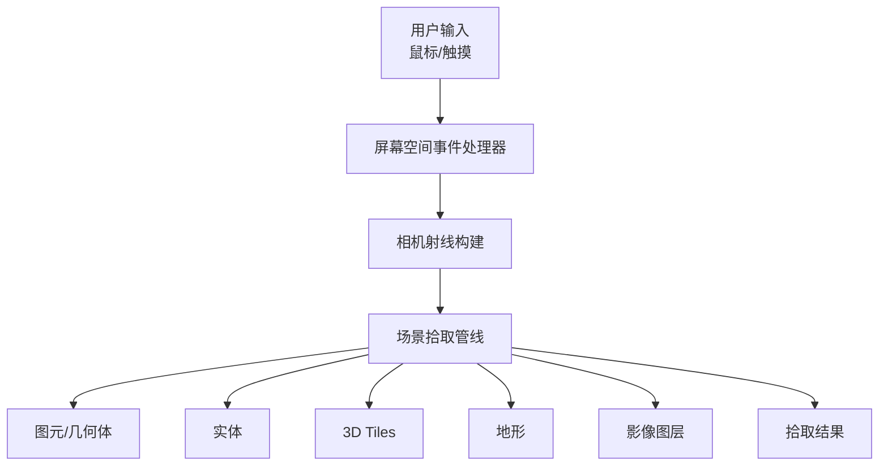

[本节为概念性概述，不直接分析具体文件，故无章节来源]

## 核心组件
- 屏幕空间事件处理器：将屏幕坐标映射为相机射线，触发拾取流程。
- 场景：组织和管理所有可拾取对象，协调各类对象的拾取策略。
- 射线与矩阵工具：用于坐标变换与射线构造。
- 包围体：快速剔除不可见或非相交对象，提升拾取效率。
- 各数据类型提供者：分别实现针对自身结构的拾取逻辑。

**章节来源**
- [ScreenSpaceEventHandler.js](file://packages/engine/src/Scene/ScreenSpaceEventHandler.js)
- [Scene.js](file://packages/engine/src/Scene/Scene.js)
- [Ray.js](file://packages/engine/src/Core/Ray.js)
- [Matrix4.js](file://packages/engine/src/Core/Matrix4.js)
- [BoundingSphere.js](file://packages/engine/src/Core/BoundingSphere.js)

## 架构总览
下图展示了从用户输入到最终拾取结果的完整调用链，以及关键参与者的职责边界。

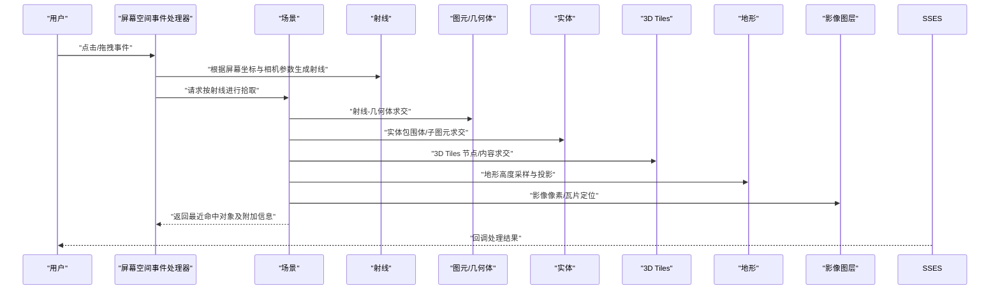

**图表来源**
- [ScreenSpaceEventHandler.js](file://packages/engine/src/Scene/ScreenSpaceEventHandler.js)
- [Scene.js](file://packages/engine/src/Scene/Scene.js)
- [Ray.js](file://packages/engine/src/Core/Ray.js)
- [Primitive.js](file://packages/engine/src/Scene/Primitive.js)
- [Entity.js](file://packages/engine/src/Scene/Entity.js)
- [Cesium3DTileset.js](file://packages/engine/src/Scene/Cesium3DTileset.js)
- [TerrainProvider.js](file://packages/engine/src/Terrain/TerrainProvider.js)
- [ImageryLayer.js](file://packages/engine/src/Scene/ImageryLayer.js)

## 详细组件分析

### 屏幕坐标到世界坐标的转换算法
- 射线投射：基于当前相机的视口、近远裁剪面与屏幕坐标，构建世界空间中的射线。该过程依赖相机矩阵与投影矩阵的组合。
- 深度测试：在场景内部对候选对象进行深度比较，确保返回的是离相机最近的可见表面点。
- 包围盒检测：先以包围球/包围盒做粗筛，再对通过粗筛的对象进行精确求交，降低计算量。

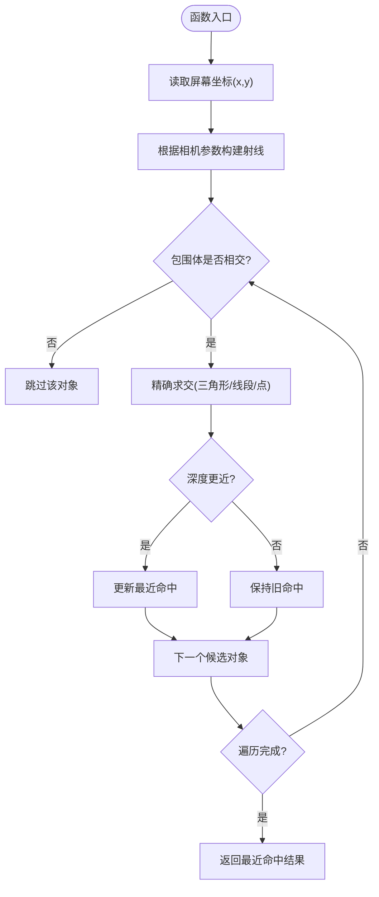

**图表来源**
- [Ray.js](file://packages/engine/src/Core/Ray.js)
- [Matrix4.js](file://packages/engine/src/Core/Matrix4.js)
- [BoundingSphere.js](file://packages/engine/src/Core/BoundingSphere.js)
- [Scene.js](file://packages/engine/src/Scene/Scene.js)

**章节来源**
- [Ray.js](file://packages/engine/src/Core/Ray.js)
- [Matrix4.js](file://packages/engine/src/Core/Matrix4.js)
- [BoundingSphere.js](file://packages/engine/src/Core/BoundingSphere.js)
- [Scene.js](file://packages/engine/src/Scene/Scene.js)

### 实体拾取机制
- 实体通常包含位置、模型、标注等可视化元素。拾取时优先检查实体的包围体，若命中则进一步对其子图元或几何体进行精确求交。
- 对于复合实体（如包含多个子图元），需考虑层级结构与绘制顺序，确保返回最上层或最近表面的命中。

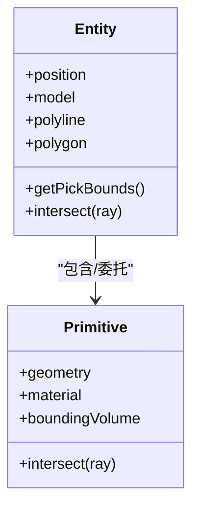

**图表来源**
- [Entity.js](file://packages/engine/src/Scene/Entity.js)
- [Primitive.js](file://packages/engine/src/Scene/Primitive.js)

**章节来源**
- [Entity.js](file://packages/engine/src/Scene/Entity.js)
- [Primitive.js](file://packages/engine/src/Scene/Primitive.js)

### 几何体拾取机制
- 几何体（如 Box、Sphere、Polyline、Polygon）在场景中作为 Primitive 存在，其拾取依赖于几何体的顶点/索引数据与法线信息。
- 为提高性能，几何体通常预计算包围体；在射线求交前进行快速剔除。

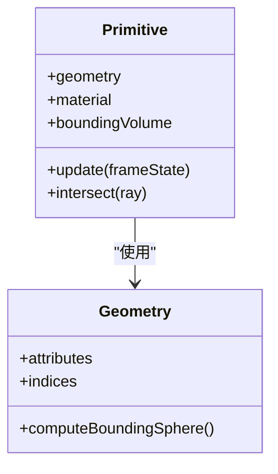

**图表来源**
- [Primitive.js](file://packages/engine/src/Scene/Primitive.js)

**章节来源**
- [Primitive.js](file://packages/engine/src/Scene/Primitive.js)

### 3D Tiles 拾取机制
- 3D Tiles 采用分块与层次结构，拾取时先对可见瓦片节点进行包围体检测，再进入具体内容（如 glTF 模型、点云）进行精确求交。
- 支持批表（Batch Table）与实例化（Instanced）数据的属性访问，以便在命中后获取丰富的语义信息。

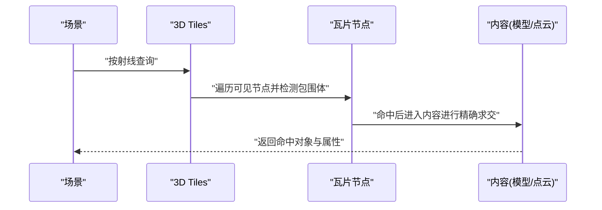

**图表来源**
- [Cesium3DTileset.js](file://packages/engine/src/Scene/Cesium3DTileset.js)

**章节来源**
- [Cesium3DTileset.js](file://packages/engine/src/Scene/Cesium3DTileset.js)

### 地形拾取机制
- 地形拾取通常将屏幕坐标投影到地表，结合地形高程服务获取实际三维坐标。
- 当射线与地形相交时，需要在地形网格上进行插值或采样，得到精确的命中点。

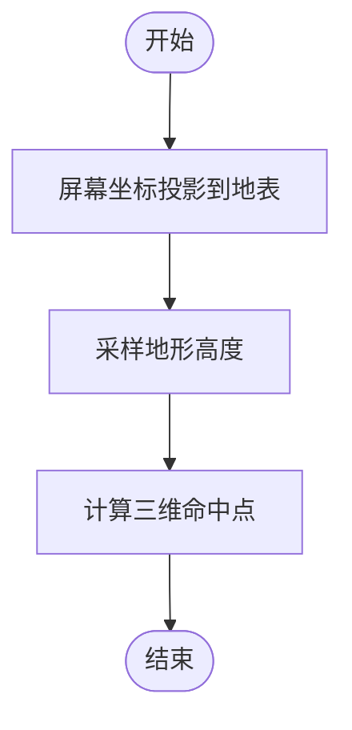

**图表来源**
- [TerrainProvider.js](file://packages/engine/src/Terrain/TerrainProvider.js)

**章节来源**
- [TerrainProvider.js](file://packages/engine/src/Terrain/TerrainProvider.js)

### 影像图层拾取机制
- 影像图层主要用于纹理展示，拾取时可返回瓦片标识、像素坐标或地理范围。
- 在某些情况下，影像层可与矢量要素叠加，拾取时需区分底层影像与上层要素。

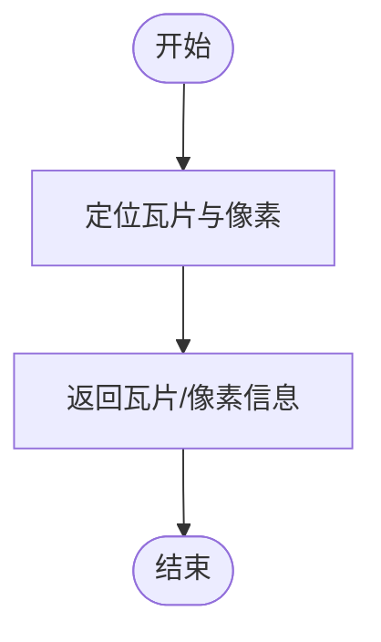

**图表来源**
- [ImageryLayer.js](file://packages/engine/src/Scene/ImageryLayer.js)

**章节来源**
- [ImageryLayer.js](file://packages/engine/src/Scene/ImageryLayer.js)

### 拾取结果的获取与处理
- 对象属性访问：命中后可访问对象的 ID、名称、自定义属性等，用于业务逻辑与 UI 展示。
- 材质修改：通过设置高亮材质或描边效果，实现对选中对象的视觉反馈。
- 高亮显示：可使用临时图元（如轮廓线、半透明覆盖）增强用户体验。

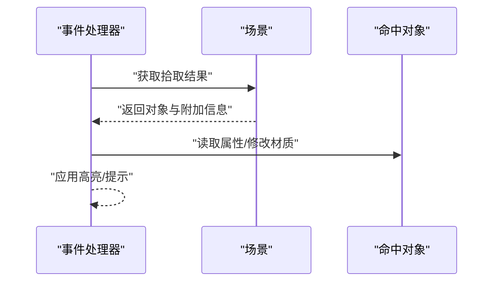

**图表来源**
- [ScreenSpaceEventHandler.js](file://packages/engine/src/Scene/ScreenSpaceEventHandler.js)
- [Scene.js](file://packages/engine/src/Scene/Scene.js)

**章节来源**
- [ScreenSpaceEventHandler.js](file://packages/engine/src/Scene/ScreenSpaceEventHandler.js)
- [Scene.js](file://packages/engine/src/Scene/Scene.js)

### 复杂场景下的拾取优化策略
- 空间索引：利用包围体树或分块结构减少求交次数，优先处理靠近相机或可视范围内的对象。
- 分层拾取：将不同类别的对象分组，按需启用或禁用某些层的拾取，避免不必要的计算。
- 批量处理：对大量相似对象（如点云、实例化模型）采用批处理策略，合并求交与属性查询。

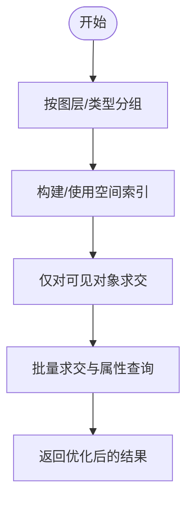

[本节为概念性概述，不直接分析具体文件，故无章节来源]

## 依赖关系分析
- 屏幕空间事件处理器依赖相机与射线工具，负责将用户输入转化为射线。
- 场景管理所有可拾取对象，协调各数据类型的拾取流程。
- 各数据类型提供者（实体、几何体、3D Tiles、地形、影像）在场景的统一接口下实现各自的拾取逻辑。

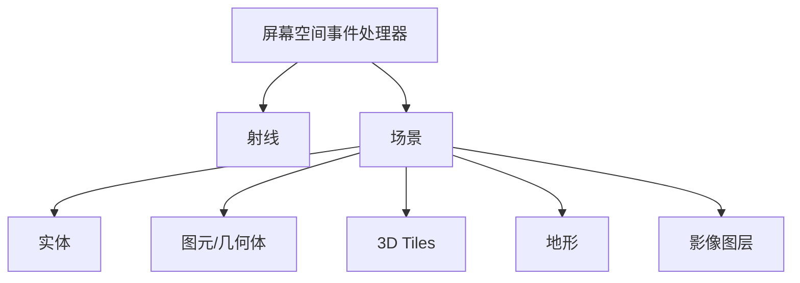

**图表来源**
- [ScreenSpaceEventHandler.js](file://packages/engine/src/Scene/ScreenSpaceEventHandler.js)
- [Scene.js](file://packages/engine/src/Scene/Scene.js)
- [Ray.js](file://packages/engine/src/Core/Ray.js)
- [Entity.js](file://packages/engine/src/Scene/Entity.js)
- [Primitive.js](file://packages/engine/src/Scene/Primitive.js)
- [Cesium3DTileset.js](file://packages/engine/src/Scene/Cesium3DTileset.js)
- [TerrainProvider.js](file://packages/engine/src/Terrain/TerrainProvider.js)
- [ImageryLayer.js](file://packages/engine/src/Scene/ImageryLayer.js)

**章节来源**
- [ScreenSpaceEventHandler.js](file://packages/engine/src/Scene/ScreenSpaceEventHandler.js)
- [Scene.js](file://packages/engine/src/Scene/Scene.js)

## 性能考量
- 合理设置拾取阈值与容差，避免过于严格的判定导致误判或性能下降。
- 使用包围体进行粗筛，仅在必要时进行精确求交。
- 对大规模数据采用分层与批量策略，减少每帧的求交次数。
- 避免频繁创建临时对象，复用内存以降低 GC 压力。

[本节为通用指导，不直接分析具体文件，故无章节来源]

## 故障排查指南
- 常见问题：
  - 拾取不到对象：检查相机参数、射线方向与目标对象可见性。
  - 命中点不准确：确认深度测试与地形采样是否正确。
  - 性能问题：评估对象数量与复杂度，启用空间索引与分层拾取。
- 调试建议：
  - 打印射线起点与方向，验证屏幕坐标到世界坐标的转换。
  - 输出包围体与求交结果，逐步定位问题。
  - 使用端到端测试用例复现与验证修复。

**章节来源**
- [picking.spec.js](file://Specs/e2e/picking.spec.js)
- [pick.js](file://Specs/pick.js)

## 结论
Cesium 的拾取与选择系统通过统一的场景接口与多数据类型适配，实现了从屏幕坐标到世界坐标的高精度转换与高效求交。借助包围体检测、分层与批量策略，可在复杂场景中保持良好的交互体验。开发者应结合实际业务需求，选择合适的拾取策略与优化手段，并通过测试与调试保障稳定性与性能。

[本节为总结性内容，不直接分析具体文件，故无章节来源]

## 附录
- 示例与测试参考路径：
  - 端到端拾取测试：[picking.spec.js](file://Specs/e2e/picking.spec.js)
  - 拾取辅助脚本：[pick.js](file://Specs/pick.js)
  - 场景初始化与配置：[createScene.js](file://Specs/createScene.js)
  - 部件入口（含交互集成）：[Viewer.js](file://packages/widgets/src/Viewer.js)

**章节来源**
- [picking.spec.js](file://Specs/e2e/picking.spec.js)
- [pick.js](file://Specs/pick.js)
- [createScene.js](file://Specs/createScene.js)
- [Viewer.js](file://packages/widgets/src/Viewer.js)