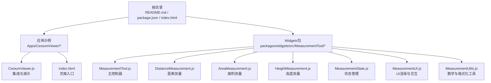
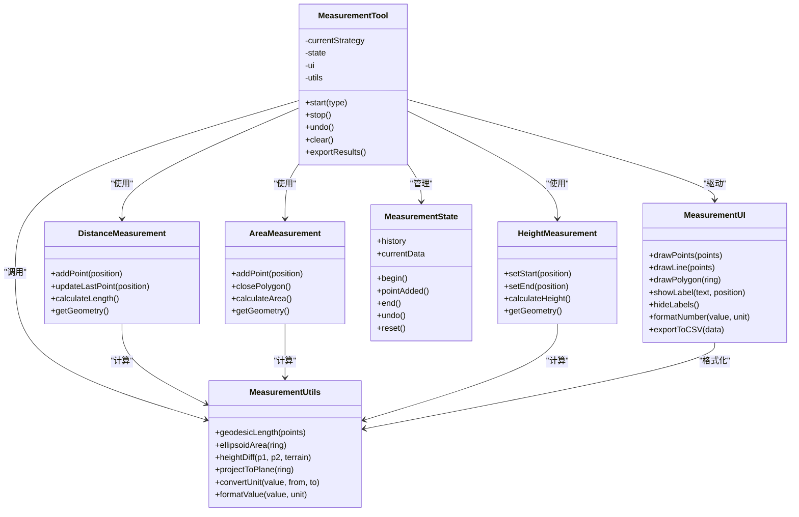
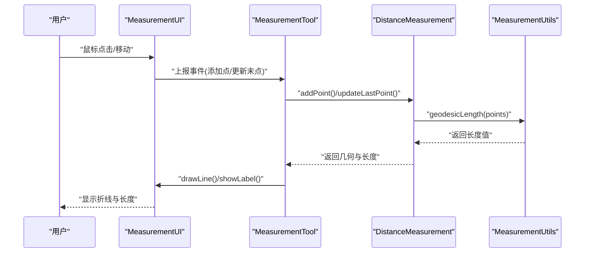
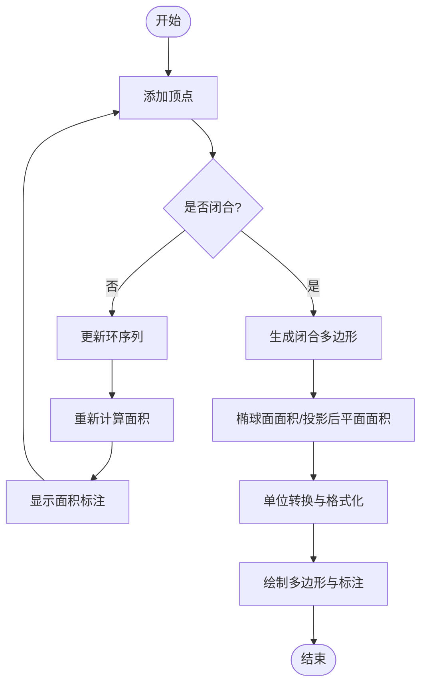
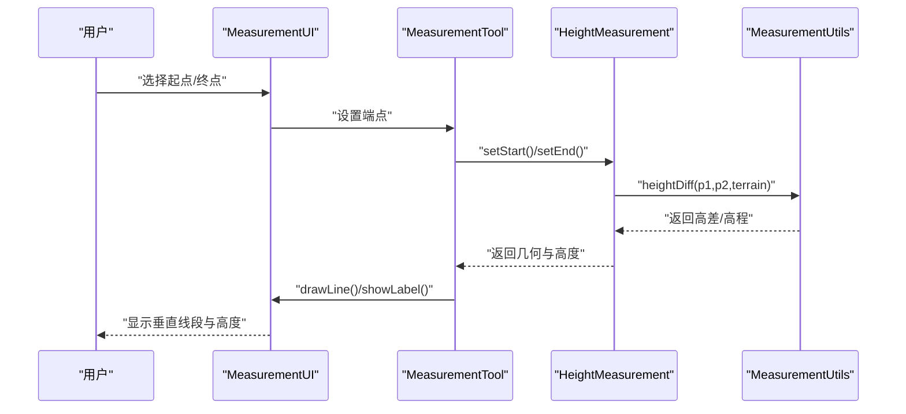
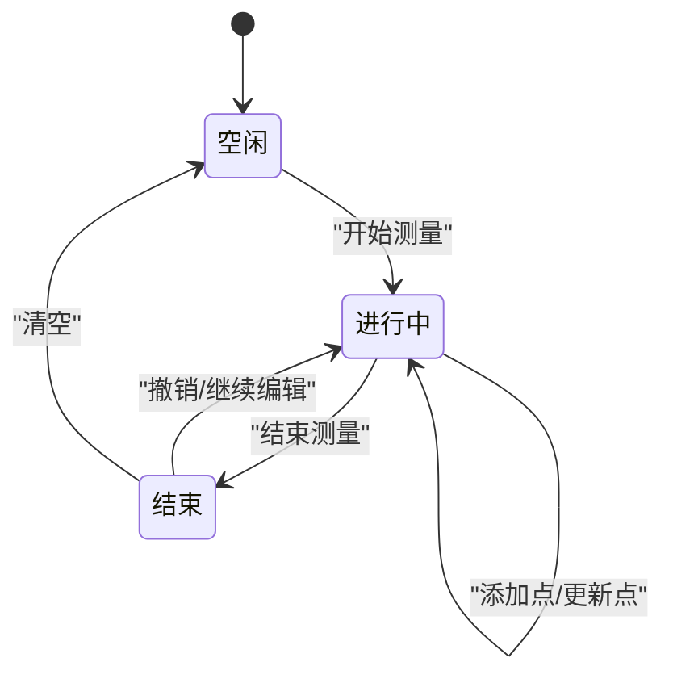
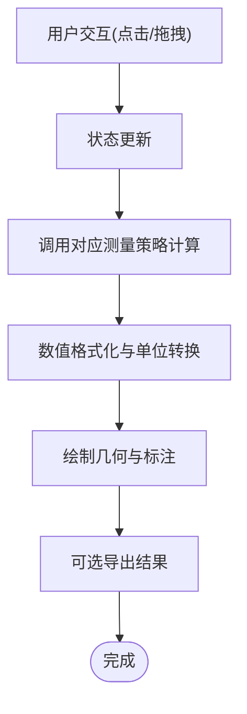
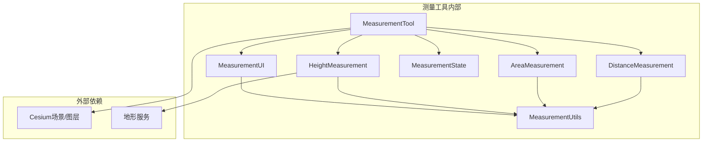

# 测量工具

<cite>
**本文引用的文件**   
- [README.md](file://README.md)
- [package.json](file://package.json)
- [index.html](file://index.html)
- [Apps/CesiumViewer/CesiumViewer.js](file://Apps/CesiumViewer/CesiumViewer.js)
- [Apps/CesiumViewer/index.html](file://Apps/CesiumViewer/index.html)
- [Apps/HelloWorld.html](file://Apps/HelloWorld.html)
- [packages/widgets/src/MeasurementTool/MeasurementTool.js](file://packages/widgets/src/MeasurementTool/MeasurementTool.js)
- [packages/widgets/src/MeasurementTool/DistanceMeasurement.js](file://packages/widgets/src/MeasurementTool/DistanceMeasurement.js)
- [packages/widgets/src/MeasurementTool/AreaMeasurement.js](file://packages/widgets/src/MeasurementTool/AreaMeasurement.js)
- [packages/widgets/src/MeasurementTool/HeightMeasurement.js](file://packages/widgets/src/MeasurementTool/HeightMeasurement.js)
- [packages/widgets/src/MeasurementTool/MeasurementState.js](file://packages/widgets/src/MeasurementTool/MeasurementState.js)
- [packages/widgets/src/MeasurementTool/MeasurementUI.js](file://packages/widgets/src/MeasurementTool/MeasurementUI.js)
- [packages/widgets/src/MeasurementTool/MeasurementUtils.js](file://packages/widgets/src/MeasurementTool/MeasurementUtils.js)
</cite>

## 目录
1. [简介](#简介)
2. [项目结构](#项目结构)
3. [核心组件](#核心组件)
4. [架构总览](#架构总览)
5. [详细组件分析](#详细组件分析)
6. [依赖分析](#依赖分析)
7. [性能考虑](#性能考虑)
8. [故障排查指南](#故障排查指南)
9. [结论](#结论)
10. [附录](#附录)

## 简介
本技术文档围绕Cesium的测量工具，系统阐述距离、面积、高度测量的实现原理与计算方法，覆盖地理坐标系下的精确测量（大地线计算、投影变换、高程校正）、实时显示与更新机制（动态标注、数值格式化、单位转换）、UI交互设计（绘制界面、编辑功能、结果导出），并提供开发示例（自定义测量类型、样式定制、国际化支持）。文档面向不同层次读者，既提供高层概览，也深入到代码级结构与数据流。

## 项目结构
仓库采用多包组织方式，测量工具位于widgets包的MeasurementTool子模块中；应用示例位于Apps目录；根目录包含构建与入口配置。下图给出与本主题相关的顶层结构映射：

图表来源
- [README.md](file://README.md)
- [package.json](file://package.json)
- [index.html](file://index.html)
- [Apps/CesiumViewer/CesiumViewer.js](file://Apps/CesiumViewer/CesiumViewer.js)
- [Apps/CesiumViewer/index.html](file://Apps/CesiumViewer/index.html)
- [packages/widgets/src/MeasurementTool/MeasurementTool.js](file://packages/widgets/src/MeasurementTool/MeasurementTool.js)
- [packages/widgets/src/MeasurementTool/DistanceMeasurement.js](file://packages/widgets/src/MeasurementTool/DistanceMeasurement.js)
- [packages/widgets/src/MeasurementTool/AreaMeasurement.js](file://packages/widgets/src/MeasurementTool/AreaMeasurement.js)
- [packages/widgets/src/MeasurementTool/HeightMeasurement.js](file://packages/widgets/src/MeasurementTool/HeightMeasurement.js)
- [packages/widgets/src/MeasurementTool/MeasurementState.js](file://packages/widgets/src/MeasurementTool/MeasurementState.js)
- [packages/widgets/src/MeasurementTool/MeasurementUI.js](file://packages/widgets/src/MeasurementTool/MeasurementUI.js)
- [packages/widgets/src/MeasurementTool/MeasurementUtils.js](file://packages/widgets/src/MeasurementTool/MeasurementUtils.js)

章节来源
- [README.md](file://README.md)
- [package.json](file://package.json)
- [index.html](file://index.html)
- [Apps/CesiumViewer/CesiumViewer.js](file://Apps/CesiumViewer/CesiumViewer.js)
- [Apps/CesiumViewer/index.html](file://Apps/CesiumViewer/index.html)

## 核心组件
- MeasurementTool：测量工具的主控制器，负责生命周期管理、事件分发、与Cesium场景集成、与其他测量类型的协调。
- DistanceMeasurement：距离测量实现，处理多点折线的长度计算、实时更新与可视化。
- AreaMeasurement：面积测量实现，处理闭合多边形的面积计算、投影与椭球面修正、实时更新与可视化。
- HeightMeasurement：高度测量实现，处理两点间的高差或点到地面高程的计算与可视化。
- MeasurementState：统一的状态机，管理测量开始、进行中、结束、撤销、清空等状态及数据缓存。
- MeasurementUI：负责绘制图形（点、线、面）、动态标注、数值格式化、单位转换、交互提示与结果导出。
- MeasurementUtils：封装数学与格式化工具，包括坐标转换、大地线计算、面积算法、单位换算、数值格式化等。

章节来源
- [packages/widgets/src/MeasurementTool/MeasurementTool.js](file://packages/widgets/src/MeasurementTool/MeasurementTool.js)
- [packages/widgets/src/MeasurementTool/DistanceMeasurement.js](file://packages/widgets/src/MeasurementTool/DistanceMeasurement.js)
- [packages/widgets/src/MeasurementTool/AreaMeasurement.js](file://packages/widgets/src/MeasurementTool/AreaMeasurement.js)
- [packages/widgets/src/MeasurementTool/HeightMeasurement.js](file://packages/widgets/src/MeasurementTool/HeightMeasurement.js)
- [packages/widgets/src/MeasurementTool/MeasurementState.js](file://packages/widgets/src/MeasurementTool/MeasurementState.js)
- [packages/widgets/src/MeasurementTool/MeasurementUI.js](file://packages/widgets/src/MeasurementTool/MeasurementUI.js)
- [packages/widgets/src/MeasurementTool/MeasurementUtils.js](file://packages/widgets/src/MeasurementTool/MeasurementUtils.js)

## 架构总览
测量工具整体采用“控制器+策略+状态+UI”的分层架构。MeasurementTool作为控制器，根据当前测量类型委托给对应的策略类（距离、面积、高度）进行计算与更新；MeasurementState维护全局状态与历史；MeasurementUI负责在Cesium场景中绘制与交互；MeasurementUtils提供底层数学与格式化工具。

图表来源
- [packages/widgets/src/MeasurementTool/MeasurementTool.js](file://packages/widgets/src/MeasurementTool/MeasurementTool.js)
- [packages/widgets/src/MeasurementTool/DistanceMeasurement.js](file://packages/widgets/src/MeasurementTool/DistanceMeasurement.js)
- [packages/widgets/src/MeasurementTool/AreaMeasurement.js](file://packages/widgets/src/MeasurementTool/AreaMeasurement.js)
- [packages/widgets/src/MeasurementTool/HeightMeasurement.js](file://packages/widgets/src/MeasurementTool/HeightMeasurement.js)
- [packages/widgets/src/MeasurementTool/MeasurementState.js](file://packages/widgets/src/MeasurementTool/MeasurementState.js)
- [packages/widgets/src/MeasurementTool/MeasurementUI.js](file://packages/widgets/src/MeasurementTool/MeasurementUI.js)
- [packages/widgets/src/MeasurementTool/MeasurementUtils.js](file://packages/widgets/src/MeasurementTool/MeasurementUtils.js)

## 详细组件分析

### 距离测量（DistanceMeasurement）
- 输入：用户点击添加点，拖拽更新最后一个点。
- 计算：基于大地线（Geodesic）对相邻点进行逐段长度累加，得到总长度。
- 输出：折线几何与累计长度，支持米、千米等单位转换。
- 实时性：每次点变化时触发重算与UI刷新。

图表来源
- [packages/widgets/src/MeasurementTool/DistanceMeasurement.js](file://packages/widgets/src/MeasurementTool/DistanceMeasurement.js)
- [packages/widgets/src/MeasurementTool/MeasurementUI.js](file://packages/widgets/src/MeasurementTool/MeasurementUI.js)
- [packages/widgets/src/MeasurementTool/MeasurementUtils.js](file://packages/widgets/src/MeasurementTool/MeasurementUtils.js)
- [packages/widgets/src/MeasurementTool/MeasurementTool.js](file://packages/widgets/src/MeasurementTool/MeasurementTool.js)

章节来源
- [packages/widgets/src/MeasurementTool/DistanceMeasurement.js](file://packages/widgets/src/MeasurementTool/DistanceMeasurement.js)
- [packages/widgets/src/MeasurementTool/MeasurementUI.js](file://packages/widgets/src/MeasurementTool/MeasurementUI.js)
- [packages/widgets/src/MeasurementTool/MeasurementUtils.js](file://packages/widgets/src/MeasurementTool/MeasurementUtils.js)
- [packages/widgets/src/MeasurementTool/MeasurementTool.js](file://packages/widgets/src/MeasurementTool/MeasurementTool.js)

### 面积测量（AreaMeasurement）
- 输入：用户依次点击形成多边形环，最后闭合。
- 计算：优先采用椭球面面积算法；若需平面近似，则先进行投影变换到局部平面再计算。
- 输出：多边形几何与面积值，支持平方米、公顷、平方千米等单位转换。
- 实时性：每增加一个顶点即重算并刷新标注。

图表来源
- [packages/widgets/src/MeasurementTool/AreaMeasurement.js](file://packages/widgets/src/MeasurementTool/AreaMeasurement.js)
- [packages/widgets/src/MeasurementTool/MeasurementUI.js](file://packages/widgets/src/MeasurementTool/MeasurementUI.js)
- [packages/widgets/src/MeasurementTool/MeasurementUtils.js](file://packages/widgets/src/MeasurementTool/MeasurementUtils.js)

章节来源
- [packages/widgets/src/MeasurementTool/AreaMeasurement.js](file://packages/widgets/src/MeasurementTool/AreaMeasurement.js)
- [packages/widgets/src/MeasurementTool/MeasurementUI.js](file://packages/widgets/src/MeasurementTool/MeasurementUI.js)
- [packages/widgets/src/MeasurementTool/MeasurementUtils.js](file://packages/widgets/src/MeasurementTool/MeasurementUtils.js)

### 高度测量（HeightMeasurement）
- 输入：选择起点与终点（或单点与地面）。
- 计算：获取两点的WGS84高程，结合地形服务进行高程校正，计算高差或绝对高程。
- 输出：垂直线段几何与高度值，支持米、英尺等单位转换。
- 实时性：拖动端点时即时更新高度标注。

图表来源
- [packages/widgets/src/MeasurementTool/HeightMeasurement.js](file://packages/widgets/src/MeasurementTool/HeightMeasurement.js)
- [packages/widgets/src/MeasurementTool/MeasurementUI.js](file://packages/widgets/src/MeasurementTool/MeasurementUI.js)
- [packages/widgets/src/MeasurementTool/MeasurementUtils.js](file://packages/widgets/src/MeasurementTool/MeasurementUtils.js)
- [packages/widgets/src/MeasurementTool/MeasurementTool.js](file://packages/widgets/src/MeasurementTool/MeasurementTool.js)

章节来源
- [packages/widgets/src/MeasurementTool/HeightMeasurement.js](file://packages/widgets/src/MeasurementTool/HeightMeasurement.js)
- [packages/widgets/src/MeasurementTool/MeasurementUI.js](file://packages/widgets/src/MeasurementTool/MeasurementUI.js)
- [packages/widgets/src/MeasurementTool/MeasurementUtils.js](file://packages/widgets/src/MeasurementTool/MeasurementUtils.js)
- [packages/widgets/src/MeasurementTool/MeasurementTool.js](file://packages/widgets/src/MeasurementTool/MeasurementTool.js)

### 状态管理（MeasurementState）
- 职责：维护测量流程的状态机（空闲、进行中、结束）、历史记录栈、当前数据缓存。
- 关键操作：开始测量、添加点、结束、撤销、清空。
- 与UI联动：状态变更触发UI重绘与标注更新。

图表来源
- [packages/widgets/src/MeasurementTool/MeasurementState.js](file://packages/widgets/src/MeasurementTool/MeasurementState.js)

章节来源
- [packages/widgets/src/MeasurementTool/MeasurementState.js](file://packages/widgets/src/MeasurementTool/MeasurementState.js)

### UI与交互（MeasurementUI）
- 绘制：点、线、面的几何创建与更新。
- 标注：动态文本标签，位置跟随端点或中心。
- 格式化：数值精度控制、单位转换、本地化字符串。
- 导出：将结果导出为CSV或JSON，便于后续处理。

图表来源
- [packages/widgets/src/MeasurementTool/MeasurementUI.js](file://packages/widgets/src/MeasurementTool/MeasurementUI.js)
- [packages/widgets/src/MeasurementTool/MeasurementUtils.js](file://packages/widgets/src/MeasurementTool/MeasurementUtils.js)

章节来源
- [packages/widgets/src/MeasurementTool/MeasurementUI.js](file://packages/widgets/src/MeasurementTool/MeasurementUI.js)
- [packages/widgets/src/MeasurementTool/MeasurementUtils.js](file://packages/widgets/src/MeasurementTool/MeasurementUtils.js)

### 数学与工具（MeasurementUtils）
- 大地线计算：用于距离测量的逐段长度累加。
- 面积算法：椭球面面积计算与平面投影后的面积近似。
- 高程校正：结合地形服务获取真实高程。
- 单位转换与格式化：统一单位体系与展示格式。

章节来源
- [packages/widgets/src/MeasurementTool/MeasurementUtils.js](file://packages/widgets/src/MeasurementTool/MeasurementUtils.js)

## 依赖分析
测量工具内部各模块之间耦合清晰：MeasurementTool聚合策略与状态，策略依赖工具函数，UI依赖工具函数进行格式化与导出。外部依赖主要为Cesium场景与地形服务。

图表来源
- [packages/widgets/src/MeasurementTool/MeasurementTool.js](file://packages/widgets/src/MeasurementTool/MeasurementTool.js)
- [packages/widgets/src/MeasurementTool/DistanceMeasurement.js](file://packages/widgets/src/MeasurementTool/DistanceMeasurement.js)
- [packages/widgets/src/MeasurementTool/AreaMeasurement.js](file://packages/widgets/src/MeasurementTool/AreaMeasurement.js)
- [packages/widgets/src/MeasurementTool/HeightMeasurement.js](file://packages/widgets/src/MeasurementTool/HeightMeasurement.js)
- [packages/widgets/src/MeasurementTool/MeasurementState.js](file://packages/widgets/src/MeasurementTool/MeasurementState.js)
- [packages/widgets/src/MeasurementTool/MeasurementUI.js](file://packages/widgets/src/MeasurementTool/MeasurementUI.js)
- [packages/widgets/src/MeasurementTool/MeasurementUtils.js](file://packages/widgets/src/MeasurementTool/MeasurementUtils.js)

章节来源
- [packages/widgets/src/MeasurementTool/MeasurementTool.js](file://packages/widgets/src/MeasurementTool/MeasurementTool.js)
- [packages/widgets/src/MeasurementTool/MeasurementUtils.js](file://packages/widgets/src/MeasurementTool/MeasurementUtils.js)

## 性能考虑
- 大数据量优化：对大量顶点进行抽稀与分段计算，避免频繁重算。
- 增量更新：仅在变化的部分触发重绘与重算。
- 投影与地形：在需要时使用局部投影减少误差；地形请求可缓存与节流。
- 内存管理：及时释放不再使用的几何与标注对象。

[本节为通用指导，不直接分析具体文件]

## 故障排查指南
- 现象：标注不显示或位置偏移
  - 检查UI绘制逻辑与坐标转换是否正确
  - 确认状态机是否处于可绘制阶段
- 现象：面积或距离异常
  - 验证大地线与椭球面算法参数
  - 检查投影变换与单位转换
- 现象：高度测量不准确
  - 确认地形服务可用性与采样点
  - 检查高程参考系与校正逻辑
- 现象：导出失败
  - 检查导出格式与序列化逻辑
  - 确认权限与路径

章节来源
- [packages/widgets/src/MeasurementTool/MeasurementUI.js](file://packages/widgets/src/MeasurementTool/MeasurementUI.js)
- [packages/widgets/src/MeasurementTool/MeasurementUtils.js](file://packages/widgets/src/MeasurementTool/MeasurementUtils.js)
- [packages/widgets/src/MeasurementTool/MeasurementState.js](file://packages/widgets/src/MeasurementTool/MeasurementState.js)

## 结论
本测量工具以清晰的模块化设计与分层架构实现了距离、面积、高度的精确测量与实时交互。通过大地线计算、椭球面面积算法与高程校正，保证了地理坐标系下的准确性；通过状态管理与UI联动，提供了流畅的用户体验。开发者可在此基础上扩展新的测量类型、定制样式与国际化，满足多样化业务需求。

[本节为总结，不直接分析具体文件]

## 附录
- 开发示例建议
  - 自定义测量类型：继承策略接口，实现计算与绘制逻辑，注册到MeasurementTool。
  - 样式定制：在MeasurementUI中扩展样式配置，支持颜色、线宽、透明度等。
  - 国际化支持：在MeasurementUtils中集中管理单位与数值格式化，按语言环境切换。
- 集成与运行
  - 在应用示例中引入MeasurementTool，初始化Cesium场景与地形服务，绑定交互事件。
  - 参考CesiumViewer示例进行快速上手。

章节来源
- [Apps/CesiumViewer/CesiumViewer.js](file://Apps/CesiumViewer/CesiumViewer.js)
- [Apps/CesiumViewer/index.html](file://Apps/CesiumViewer/index.html)
- [Apps/HelloWorld.html](file://Apps/HelloWorld.html)