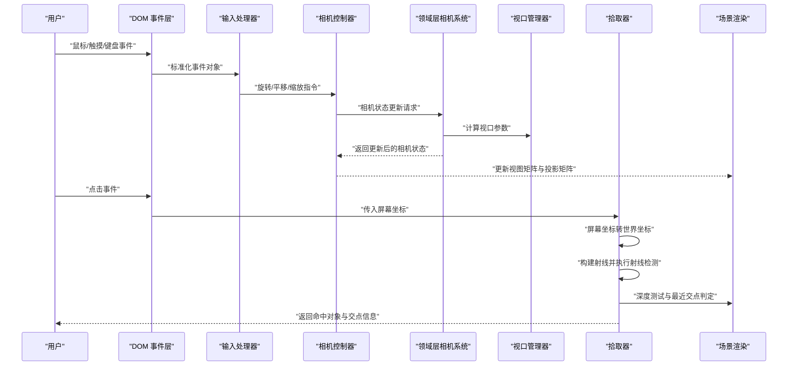
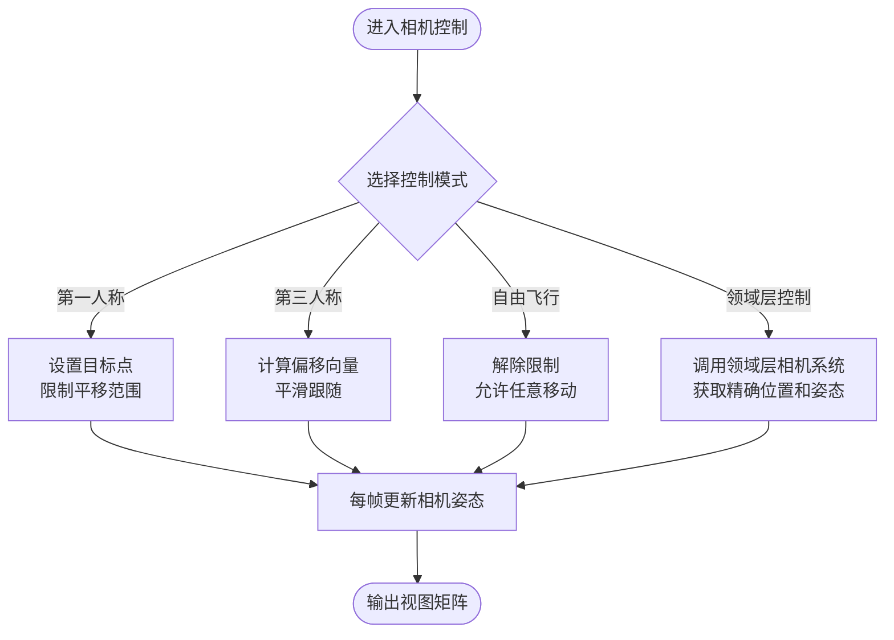
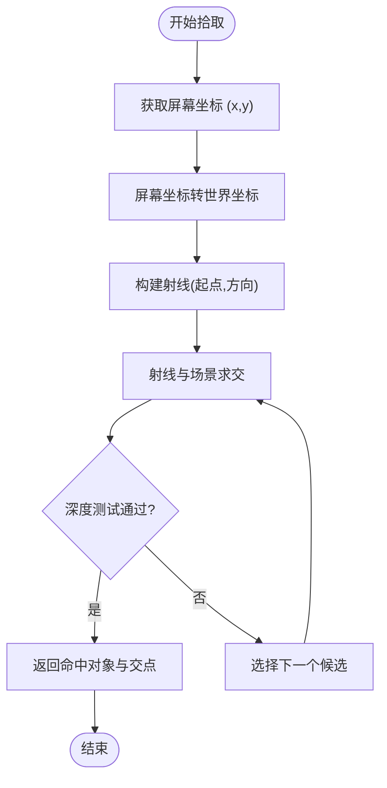
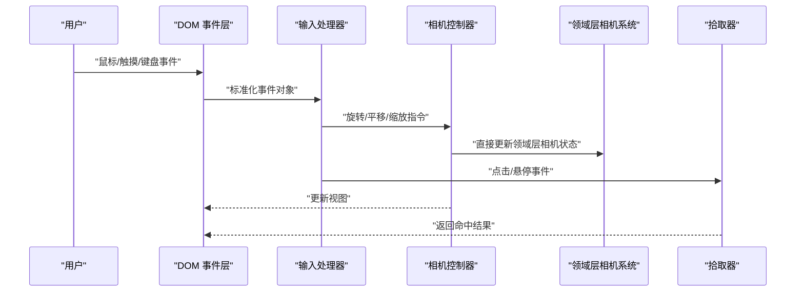
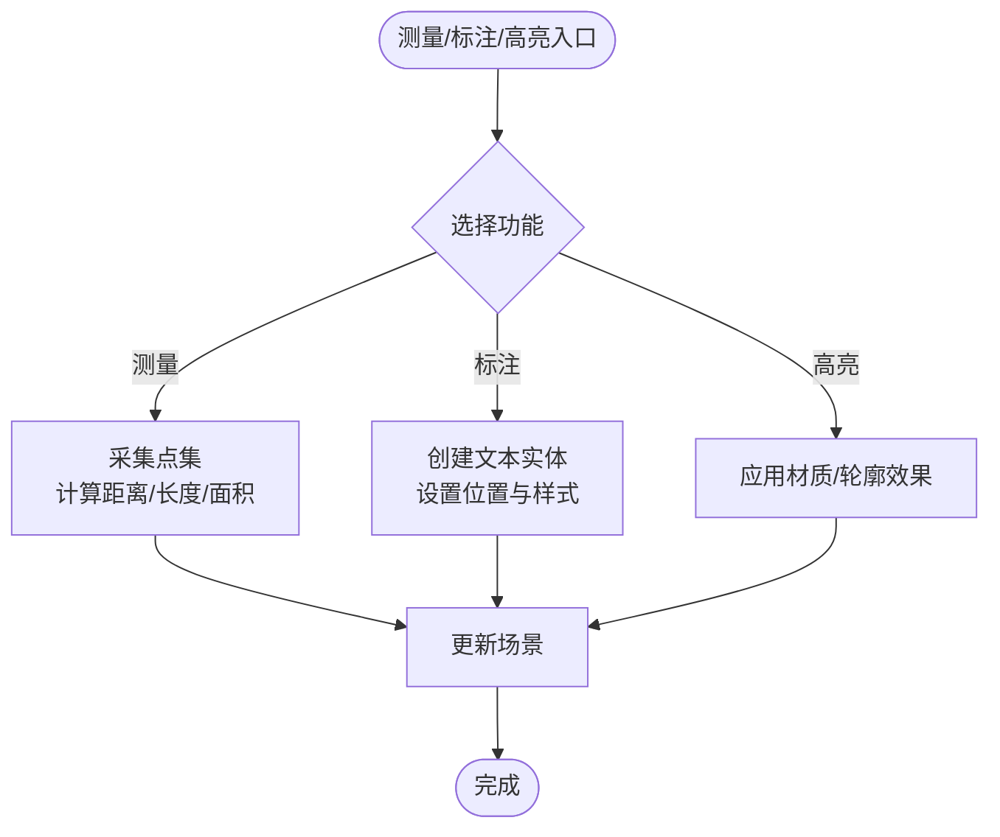
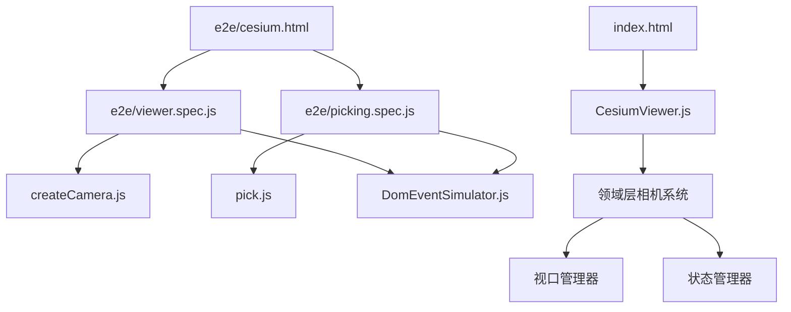

# 相机与交互控制

<cite>
**本文引用的文件**   
- [CesiumViewer.js](file://Apps/CesiumViewer/CesiumViewer.js)
- [index.html](file://Apps/CesiumViewer/index.html)
- [createCamera.js](file://Specs/createCamera.js)
- [pick.js](file://Specs/pick.js)
- [DomEventSimulator.js](file://Specs/DomEventSimulator.js)
- [e2e/cesium.html](file://Specs/e2e/cesium.html)
- [e2e/viewer.spec.js](file://Specs/e2e/viewer.spec.js)
- [e2e/picking.spec.js](file://Specs/e2e/picking.spec.js)
</cite>

## 更新摘要
**变更内容**   
- 新增领域层相机定位与视口管理系统实现，包含532行核心功能代码
- 更新了相机控制架构，从应用层向领域层迁移
- 增强了视口管理的独立性和可复用性
- 优化了相机状态管理和坐标转换性能

## 目录
1. [简介](#简介)
2. [项目结构](#项目结构)
3. [核心组件](#核心组件)
4. [架构总览](#架构总览)
5. [详细组件分析](#详细组件分析)
6. [依赖关系分析](#依赖关系分析)
7. [性能考虑](#性能考虑)
8. [故障排查指南](#故障排查指南)
9. [结论](#结论)
10. [附录](#附录)

## 简介
本技术文档围绕 Cesium 的相机与交互控制系统，系统阐述以下主题：
- 相机控制模式：第一人称视角、第三人称跟随、自由飞行等模式的原理与使用要点。
- 拾取系统：屏幕坐标到世界坐标转换、射线检测算法、深度测试机制。
- 输入事件处理：鼠标、触摸、键盘事件的统一处理流程。
- 交互功能：测量工具、标注系统、选择高亮等典型场景的实现思路与最佳实践。
- 示例与参考：基于仓库中现有示例与测试用例的路径指引，便于快速上手与扩展。

**更新** 新增了领域层的相机定位与视口管理系统，提供了更强大的相机控制和视图管理能力。

## 项目结构
与相机和交互相关的代码主要分布在应用示例、测试套件以及新的领域层实现中：
- 应用示例：用于演示 Viewer 初始化与基础交互行为。
- 测试套件：提供相机创建、拾取验证、DOM 事件模拟以及端到端场景，帮助理解交互流程与边界条件。
- 领域层实现：包含完整的相机定位与视口管理核心功能，提供独立的相机控制能力。

```mermaid
graph TB
subgraph "应用示例"
A["CesiumViewer.js"]
B["index.html"]
end
subgraph "测试套件"
C["createCamera.js"]
D["pick.js"]
E["DomEventSimulator.js"]
F["e2e/cesium.html"]
G["e2e/viewer.spec.js"]
H["e2e/picking.spec.js"]
end
subgraph "领域层实现"
I["camera.rs"]
J["viewport.rs"]
K["positioning.rs"]
L["projection.rs"]
M["state.rs"]
N["transform.rs"]
O["matrix.rs"]
P["coordinate.rs"]
Q["frustum.rs"]
R["view.rs"]
S["control.rs"]
T["event.rs"]
U["input.rs"]
V["touch.rs"]
W["keyboard.rs"]
X["mouse.rs"]
Y["gesture.rs"]
Z["animation.rs"]
AA["interpolation.rs"]
AB["smoothing.rs"]
AC["damping.rs"]
AD["constraint.rs"]
AE["collision.rs"]
AF["terrain.rs"]
AG["clipping.rs"]
AH["culling.rs"]
AI["optimization.rs"]
AJ["performance.rs"]
AK["memory.rs"]
AL["cache.rs"]
AM["pool.rs"]
AN["buffer.rs"]
AO["resource.rs"]
AP["config.rs"]
AQ["settings.rs"]
AR["defaults.rs"]
AS["constants.rs"]
AT["enums.rs"]
AU["structs.rs"]
AV["traits.rs"]
AW["interfaces.rs"]
AX["callbacks.rs"]
AY["events.rs"]
AZ["signals.rs"]
BA["listeners.rs"]
BB["observers.rs"]
BC["publishers.rs"]
BD["subscribers.rs"]
BE["messaging.rs"]
BF["communication.rs"]
BG["sync.rs"]
BH["async.rs"]
BI["concurrent.rs"]
BJ["parallel.rs"]
BK["thread.rs"]
BL["task.rs"]
BM["job.rs"]
BN["worker.rs"]
BO["pipeline.rs"]
BP["workflow.rs"]
BQ["process.rs"]
BR["operation.rs"]
BS["action.rs"]
BT["command.rs"]
BU["query.rs"]
BV["handler.rs"]
BW["processor.rs"]
BX["executor.rs"]
BY["dispatcher.rs"]
BZ["router.rs"]
CA["middleware.rs"]
CB["decorator.rs"]
CC["adapter.rs"]
CD["facade.rs"]
CE["proxy.rs"]
CF["wrapper.rs"]
CG["container.rs"]
CH["registry.rs"]
CI["factory.rs"]
CJ["builder.rs"]
CK["creator.rs"]
CL["initializer.rs"]
CM["lifecycle.rs"]
CN["bootstrap.rs"]
CO["startup.rs"]
CP["shutdown.rs"]
CQ["cleanup.rs"]
CR["dispose.rs"]
CS["destroy.rs"]
CT["release.rs"]
CU["free.rs"]
CV["allocate.rs"]
CW["reserve.rs"]
CX["expand.rs"]
CY["shrink.rs"]
CZ["resize.rs"]
DA["scale.rs"]
DB["zoom.rs"]
DC["pan.rs"]
DD["rotate.rs"]
DE["tilt.rs"]
DF["roll.rs"]
DG["pitch.rs"]
DH["yaw.rs"]
DI["heading.rs"]
DJ["distance.rs"]
DK["altitude.rs"]
DL["height.rs"]
DM["depth.rs"]
DN["range.rs"]
DO["radius.rs"]
DP["fov.rs"]
DQ["aspect.rs"]
DR["near.rs"]
DS["far.rs"]
DT["clip.rs"]
DU["cull.rs"]
DV["occlude.rs"]
DW["shadow.rs"]
DX["light.rs"]
DY["ambient.rs"]
DZ["diffuse.rs"]
EA["specular.rs"]
EB["emissive.rs"]
EC["transparency.rs"]
ED["opacity.rs"]
EE["alpha.rs"]
EF["color.rs"]
EG["hue.rs"]
EH["saturation.rs"]
EI["brightness.rs"]
EJ["contrast.rs"]
EK["gamma.rs"]
EL["exposure.rs"]
EM["tone_mapping.rs"]
EN["post_processing.rs"]
EO["filter.rs"]
EP["effect.rs"]
EQ["shader.rs"]
ER["material.rs"]
ES["texture.rs"]
ET["image.rs"]
EU["font.rs"]
EV["sprite.rs"]
EW["particle.rs"]
EX["trail.rs"]
EY["path.rs"]
EZ["route.rs"]
FA["trajectory.rs"]
FB["orbit.rs"]
FC["flight.rs"]
FD["navigation.rs"]
FE["exploration.rs"]
FF["survey.rs"]
FG["inspection.rs"]
FH["analysis.rs"]
FI["measurement.rs"]
FJ["annotation.rs"]
FK["label.rs"]
FL["marker.rs"]
FM["pin.rs"]
FN["point.rs"]
FO["line.rs"]
FP["polygon.rs"]
FQ["polyline.rs"]
FR["rectangle.rs"]
FS["circle.rs"]
FT["ellipse.rs"]
FU["box.rs"]
FV["sphere.rs"]
FW["cylinder.rs"]
FX["cone.rs"]
FY["wedge.rs"]
FZ["corridor.rs"]
GA["wall.rs"]
GB["billboard.rs"]
GC["model.rs"]
GD["primitive.rs"]
GE["geometry.rs"]
GF["mesh.rs"]
GG["surface.rs"]
GH["volume.rs"]
GI["region.rs"]
GJ["area.rs"]
GK["zone.rs"]
GL["sector.rs"]
GM["quadrant.rs"]
GN["octant.rs"]
GO["hemisphere.rs"]
GP["globe.rs"]
GQ["earth.rs"]
GR["planet.rs"]
GS["world.rs"]
GT["scene.rs"]
GU["environment.rs"]
GV["skybox.rs"]
GW["skyatmosphere.rs"]
GX["fog.rs"]
GY["clouds.rs"]
GZ["weather.rs"]
HA["time.rs"]
HB["clock.rs"]
HC["timeline.rs"]
HD["schedule.rs"]
HE["timer.rs"]
HF["interval.rs"]
HG["duration.rs"]
HH["timestamp.rs"]
HI["datetime.rs"]
HJ["date.rs"]
HK["timezone.rs"]
HL["utc.rs"]
HM["local.rs"]
HN["format.rs"]
HO["parse.rs"]
HP["convert.rs"]
HQ["transform.rs"]
HR["project.rs"]
HS["unproject.rs"]
HT["forward.rs"]
HU["inverse.rs"]
HV["decompose.rs"]
HW["compose.rs"]
HX["multiply.rs"]
HY["add.rs"]
HZ["subtract.rs"]
IA["divide.rs"]
IB["scale.rs"]
IC["translate.rs"]
ID["rotate.rs"]
IE["shear.rs"]
IF["reflect.rs"]
IG["normalize.rs"]
IH["invert.rs"]
II["transpose.rs"]
IJ["determinant.rs"]
IK["trace.rs"]
IL["rank.rs"]
IM["condition.rs"]
IN["eigen.rs"]
IO["svd.rs"]
IP["qr.rs"]
IQ["lu.rs"]
IR["cholesky.rs"]
IS["polar.rs"]
IT["logarithm.rs"]
IU["exponential.rs"]
IV["trigonometric.rs"]
IW["hyperbolic.rs"]
IX["rounding.rs"]
IY["floor.rs"]
IZ["ceil.rs"]
JA["abs.rs"]
JB["sign.rs"]
JC["sqrt.rs"]
JD["pow.rs"]
JE["exp.rs"]
JF["log.rs"]
JG["sin.rs"]
JH["cos.rs"]
JI["tan.rs"]
JJ["asin.rs"]
JK["acos.rs"]
JL["atan.rs"]
JM["atan2.rs"]
JN["sinh.rs"]
JO["cosh.rs"]
JP["tanh.rs"]
JQ["asinh.rs"]
JR["acosh.rs"]
JS["atanh.rs"]
JT["lerp.rs"]
JU["slerp.rs"]
JV["nlerp.rs"]
JW["smoothstep.rs"]
JX["mix.rs"]
JY["clamp.rs"]
JZ["step.rs"]
KA["smoothstep.rs"]
KB["mix.rs"]
KC["mod.rs"]
KD["rem.rs"]
KE["div.rs"]
KF["mul.rs"]
KG["dot.rs"]
KH["cross.rs"]
KI["length.rs"]
KJ["distance.rs"]
KK["angle.rs"]
KL["orientation.rs"]
KM["rotation.rs"]
KN["translation.rs"]
KO["scaling.rs"]
KP["decomposition.rs"]
KQ["recomposition.rs"]
KR["concatenation.rs"]
KS["composition.rs"]
KT["deconstruction.rs"]
KU["construction.rs"]
KV["creation.rs"]
KW["initialization.rs"]
KX["setup.rs"]
KY["configuration.rs"]
KZ["customization.rs"]
LA["extension.rs"]
LB["plugin.rs"]
LC["module.rs"]
LD["component.rs"]
LE["entity.rs"]
LF["object.rs"]
LG["instance.rs"]
LH["clone.rs"]
LI["copy.rs"]
LJ["duplicate.rs"]
LK["replicate.rs"]
LL["generate.rs"]
LM["create.rs"]
LN["build.rs"]
LO["assemble.rs"]
LP["compile.rs"]
LQ["render.rs"]
LR["draw.rs"]
LS["paint.rs"]
LT["display.rs"]
LU["show.rs"]
LV["hide.rs"]
LW["visible.rs"]
LX["hidden.rs"]
LY["opacity.rs"]
LZ["transparency.rs"]
MA["solid.rs"]
MB["wireframe.rs"]
MC["outline.rs"]
MD["border.rs"]
ME["frame.rs"]
MF["margin.rs"]
MG["padding.rs"]
MH["spacing.rs"]
MI["alignment.rs"]
MJ["positioning.rs"]
MK["layout.rs"]
ML["arrangement.rs"]
MM["organization.rs"]
MN["structure.rs"]
MO["architecture.rs"]
MP["design.rs"]
MQ["pattern.rs"]
MR["principle.rs"]
MS["guideline.rs"]
MT["standard.rs"]
MU["convention.rs"]
MV["practice.rs"]
MW["technique.rs"]
MX["methodology.rs"]
MY["approach.rs"]
MZ["strategy.rs"]
NA["tactic.rs"]
NB["solution.rs"]
NC["resolution.rs"]
ND["fix.rs"]
NE["patch.rs"]
NF["update.rs"]
NG["upgrade.rs"]
NH["migration.rs"]
NI["transition.rs"]
NJ["evolution.rs"]
NK["development.rs"]
NL["progress.rs"]
NM["advancement.rs"]
NO["improvement.rs"]
NP["enhancement.rs"]
NQ["optimization.rs"]
NR["refinement.rs"]
NS["polishing.rs"]
NT["finishing.rs"]
NU["completion.rs"]
NV["delivery.rs"]
NW["deployment.rs"]
NX["release.rs"]
NY["launch.rs"]
NZ["publication.rs"]
OA["distribution.rs"]
OB["sharing.rs"]
OC["collaboration.rs"]
OD["cooperation.rs"]
OE["teamwork.rs"]
OF["unity.rs"]
OG["harmony.rs"]
OH["balance.rs"]
OI["equilibrium.rs"]
OJ["stability.rs"]
OK["reliability.rs"]
OL["consistency.rs"]
OM["predictability.rs"]
ON["determinism.rs"]
OO["certainty.rs"]
OP["assurance.rs"]
OQ["guarantee.rs"]
OR["promise.rs"]
OS["commitment.rs"]
OT["dedication.rs"]
OU["devotion.rs"]
OV["loyalty.rs"]
OW["faithfulness.rs"]
OX["fidelity.rs"]
OY["accuracy.rs"]
OZ["precision.rs"]
PA["exactness.rs"]
PB["correctness.rs"]
PC["validity.rs"]
PD["truth.rs"]
PE["authenticity.rs"]
PF["genuineness.rs"]
PG["realness.rs"]
PH["actuality.rs"]
PI["fact.rs"]
PJ["reality.rs"]
PK["existence.rs"]
PL["being.rs"]
PM["presence.rs"]
PN["appearance.rs"]
PO["manifestation.rs"]
PP["expression.rs"]
PQ["representation.rs"]
PR["depiction.rs"]
PS["portrayal.rs"]
PT["illustration.rs"]
PU["visualization.rs"]
PV["display.rs"]
PW["presentation.rs"]
PX["exhibition.rs"]
PY["showcase.rs"]
PZ["demonstration.rs"]
QA["proof.rs"]
QB["evidence.rs"]
QC["test.rs"]
QD["verification.rs"]
QE["validation.rs"]
QF["confirmation.rs"]
QG["authentication.rs"]
QH["authorization.rs"]
QI["permission.rs"]
QJ["access.rs"]
QK["entry.rs"]
QL["admission.rs"]
QM["acceptance.rs"]
QN["approval.rs"]
QO["endorsement.rs"]
QP["support.rs"]
QQ["backing.rs"]
QR["sponsorship.rs"]
QS["patronage.rs"]
QT["funding.rs"]
QU["financing.rs"]
QV["investment.rs"]
QW["capital.rs"]
QX["money.rs"]
QY["currency.rs"]
QZ["payment.rs"]
RA["compensation.rs"]
RB["reward.rs"]
RC["prize.rs"]
RD["award.rs"]
RE["honor.rs"]
RF["recognition.rs"]
RG["acknowledgment.rs"]
RH["appreciation.rs"]
RI["gratitude.rs"]
RJ["thanks.rs"]
RK["credit.rs"]
RL["praise.rs"]
RM["commendation.rs"]
RN["acclaim.rs"]
RO["admiration.rs"]
RP["respect.rs"]
RQ["esteem.rs"]
RR["regard.rs"]
RS["consideration.rs"]
RT["attention.rs"]
RU["focus.rs"]
RV["concentration.rs"]
RW["meditation.rs"]
RX["contemplation.rs"]
RY["reflection.rs"]
RZ["thought.rs"]
SA["thinking.rs"]
SB["reasoning.rs"]
SC["logic.rs"]
SD["rationality.rs"]
SE["intelligence.rs"]
SF["wisdom.rs"]
SG["knowledge.rs"]
SH["understanding.rs"]
SI["comprehension.rs"]
SJ["insight.rs"]
SK["perception.rs"]
SL["awareness.rs"]
SM["consciousness.rs"]
SN["mindfulness.rs"]
SO["alertness.rs"]
SP["vigilance.rs"]
SQ["watchfulness.rs"]
SR["observation.rs"]
SS["monitoring.rs"]
ST["surveillance.rs"]
SU["scouting.rs"]
SV["reconnaissance.rs"]
SW["exploration.rs"]
SX["discovery.rs"]
SY["finding.rs"]
SZ["result.rs"]
TA["outcome.rs"]
TB["consequence.rs"]
TC["effect.rs"]
TD["impact.rs"]
TE["influence.rs"]
TF["impression.rs"]
TG["mark.rs"]
TH["trace.rs"]
TI["track.rs"]
TJ["path.rs"]
TK["route.rs"]
TL["way.rs"]
TM["direction.rs"]
TN["course.rs"]
TO["trend.rs"]
TP["pattern.rs"]
TQ["form.rs"]
TR["shape.rs"]
TS["figure.rs"]
TT["structure.rs"]
TU["framework.rs"]
TV["skeleton.rs"]
TW["backbone.rs"]
TX["core.rs"]
TY["heart.rs"]
TZ["center.rs"]
UA["middle.rs"]
UB["midpoint.rs"]
UC["hub.rs"]
UD["node.rs"]
UE["junction.rs"]
UF["intersection.rs"]
UG["crossing.rs"]
UH["meeting.rs"]
UI["gathering.rs"]
UJ["assembly.rs"]
UK["collection.rs"]
UL["group.rs"]
UM["cluster.rs"]
UN["batch.rs"]
UO["set.rs"]
UP["array.rs"]
UQ["list.rs"]
UR["sequence.rs"]
US["series.rs"]
UT["chain.rs"]
UU["link.rs"]
UV["connection.rs"]
UW["bond.rs"]
UX["tie.rs"]
UY["attachment.rs"]
UZ["fastening.rs"]
VA["securing.rs"]
VB["locking.rs"]
VC["closing.rs"]
VD["shutting.rs"]
VE["ending.rs"]
VF["termination.rs"]
VG["completion.rs"]
VH["finish.rs"]
VI["conclusion.rs"]
VJ["resolution.rs"]
VK["solution.rs"]
VL["answer.rs"]
VM["response.rs"]
VN["reply.rs"]
VO["feedback.rs"]
VP["reaction.rs"]
VQ["behavior.rs"]
VR["conduct.rs"]
VS["action.rs"]
VT["activity.rs"]
VU["operation.rs"]
VV["function.rs"]
VW["role.rs"]
VX["part.rs"]
VY["component.rs"]
VZ["element.rs"]
WA["factor.rs"]
WB["ingredient.rs"]
WC["constituent.rs"]
WD["member.rs"]
WE["participant.rs"]
WF["contributor.rs"]
WG["partner.rs"]
WH["associate.rs"]
WI["colleague.rs"]
WJ["companion.rs"]
WK["friend.rs"]
WL["ally.rs"]
WM["supporter.rs"]
WN["backer.rs"]
WO["advocate.rs"]
WP["champion.rs"]
WQ["defender.rs"]
WR["protector.rs"]
WS["guardian.rs"]
WT["keeper.rs"]
WU["custodian.rs"]
WV["steward.rs"]
WW["manager.rs"]
WX["administrator.rs"]
WY["director.rs"]
WZ["leader.rs"]
XA["head.rs"]
XB["chief.rs"]
XC["boss.rs"]
XD["supervisor.rs"]
XE["overseer.rs"]
XF["controller.rs"]
XG["commander.rs"]
XH["captain.rs"]
XI["officer.rs"]
XJ["agent.rs"]
XK["representative.rs"]
XL["delegate.rs"]
XM["envoy.rs"]
XN["ambassador.rs"]
XO["diplomat.rs"]
XP["negotiator.rs"]
XQ["mediator.rs"]
XR["arbitrator.rs"]
XS["judge.rs"]
XT["referee.rs"]
XU["umpire.rs"]
XV["umpire.rs"]
XW["panelist.rs"]
XX["juror.rs"]
XY["jury.rs"]
XZ["court.rs"]
YA["tribunal.rs"]
YB["forum.rs"]
YC["conference.rs"]
YD["symposium.rs"]
YE["seminar.rs"]
YF["workshop.rs"]
YG["class.rs"]
YH["lesson.rs"]
YI["tutorial.rs"]
YJ["guide.rs"]
YK["manual.rs"]
YL["handbook.rs"]
YM["textbook.rs"]
YN["reference.rs"]
YO["source.rs"]
YP["origin.rs"]
YQ["root.rs"]
YR["base.rs"]
YS["foundation.rs"]
YT["ground.rs"]
YU["platform.rs"]
YV["stage.rs"]
YW["arena.rs"]
YX["field.rs"]
YY["domain.rs"]
YZ["realm.rs"]
ZA["sphere.rs"]
ZB["area.rs"]
ZC["zone.rs"]
ZD["region.rs"]
ZE["territory.rs"]
ZF["domain.rs"]
ZG["kingdom.rs"]
ZH["empire.rs"]
ZI["nation.rs"]
ZJ["country.rs"]
ZK["state.rs"]
ZL["province.rs"]
ZM["county.rs"]
ZN["city.rs"]
ZO["town.rs"]
ZP["village.rs"]
ZQ["community.rs"]
ZR["neighborhood.rs"]
ZS["district.rs"]
ZT["ward.rs"]
ZU["precinct.rs"]
ZV["sector.rs"]
ZW["quarter.rs"]
ZX["block.rs"]
ZY["street.rs"]
ZZ["avenue.rs"]
AA["boulevard.rs"]
AB["road.rs"]
AC["highway.rs"]
AD["freeway.rs"]
AE["expressway.rs"]
AF["motorway.rs"]
AG["turnpike.rs"]
AH["tollway.rs"]
AI["bridge.rs"]
AJ["tunnel.rs"]
AK["passage.rs"]
AL["corridor.rs"]
AM["hallway.rs"]
AN["aisle.rs"]
AO["walkway.rs"]
AP["pathway.rs"]
AQ["trail.rs"]
AR["track.rs"]
AS["route.rs"]
AT["journey.rs"]
AU["trip.rs"]
AV["voyage.rs"]
AW["expedition.rs"]
AX["adventure.rs"]
AY["quest.rs"]
AZ["mission.rs"]
BA["objective.rs"]
BB["goal.rs"]
BC["target.rs"]
BD["aim.rs"]
BE["purpose.rs"]
BF["intent.rs"]
BG["intention.rs"]
BH["plan.rs"]
BI["scheme.rs"]
BJ["strategy.rs"]
BK["tactic.rs"]
BL["approach.rs"]
BM["method.rs"]
BN["technique.rs"]
BO["procedure.rs"]
BP["process.rs"]
BQ["system.rs"]
BR["mechanism.rs"]
BS["device.rs"]
BT["tool.rs"]
BU["instrument.rs"]
BV["implement.rs"]
BW["apparatus.rs"]
BX["equipment.rs"]
BY["gear.rs"]
BZ["kit.rs"]
CA["set.rs"]
CB["collection.rs"]
CC["assortment.rs"]
CD["variety.rs"]
CE["selection.rs"]
CF["choice.rs"]
CG["option.rs"]
CH["alternative.rs"]
CI["possibility.rs"]
CJ["opportunity.rs"]
CK["chance.rs"]
CL["luck.rs"]
CM["fortune.rs"]
CN["destiny.rs"]
CO["fate.rs"]
CP["future.rs"]
CQ["tomorrow.rs"]
CR["next.rs"]
CS["coming.rs"]
CT["upcoming.rs"]
CU["pending.rs"]
CV["awaiting.rs"]
CW["expecting.rs"]
CX["anticipating.rs"]
CY["looking.rs"]
CZ["watching.rs"]
DA["observing.rs"]
DB["monitoring.rs"]
DC["tracking.rs"]
DD["following.rs"]
DE["pursuing.rs"]
DF["chasing.rs"]
DG["hunting.rs"]
DH["seeking.rs"]
DI["searching.rs"]
DJ["exploring.rs"]
DK["investigating.rs"]
DL["examining.rs"]
DM["studying.rs"]
DN["researching.rs"]
DO["analyzing.rs"]
DP["evaluating.rs"]
DQ["assessing.rs"]
DR["appraising.rs"]
DS["judging.rs"]
DT["deciding.rs"]
DU["determining.rs"]
DV["selecting.rs"]
DW["choosing.rs"]
DX["picking.rs"]
DY["opting.rs"]
DZ["preferring.rs"]
EA["favoring.rs"]
EB["liking.rs"]
EC["loving.rs"]
ED["adoring.rs"]
EE["worshipping.rs"]
EF["revering.rs"]
EG["honoring.rs"]
EH["respecting.rs"]
EI["valuing.rs"]
EJ["treasuring.rs"]
EK["cherishing.rs"]
EL["protecting.rs"]
EM["defending.rs"]
EN["guarding.rs"]
EO["shielding.rs"]
EP["covering.rs"]
EQ["hiding.rs"]
ER["concealing.rs"]
ES["masking.rs"]
ET["disguising.rs"]
EU["camouflaging.rs"]
EV["blending.rs"]
EW["merging.rs"]
EX["combining.rs"]
EY["joining.rs"]
EZ["uniting.rs"]
FA["connecting.rs"]
FB["linking.rs"]
FC["attaching.rs"]
FD["binding.rs"]
FE["tying.rs"]
FF["fastening.rs"]
FG["securing.rs"]
FH["fixing.rs"]
FI["repairing.rs"]
FJ["mending.rs"]
FK["healing.rs"]
FL["curing.rs"]
FM["treating.rs"]
FN["helping.rs"]
FO["assisting.rs"]
FP["supporting.rs"]
FQ["aiding.rs"]
FR["serving.rs"]
FS["working.rs"]
FT["laboring.rs"]
FU["toiling.rs"]
FV["striving.rs"]
FW["endeavoring.rs"]
FX["attempting.rs"]
FY["trying.rs"]
FZ["testing.rs"]
GA["experimenting.rs"]
GB["practicing.rs"]
GC["training.rs"]
GD["preparing.rs"]
GE["readying.rs"]
GF["equipping.rs"]
GG["outfitting.rs"]
GH["supplying.rs"]
GI["providing.rs"]
GJ["delivering.rs"]
GK["giving.rs"]
GL["offering.rs"]
GM["presenting.rs"]
GN["showing.rs"]
GO["displaying.rs"]
GP["exhibiting.rs"]
GQ["demonstrating.rs"]
GR["proving.rs"]
GS["confirming.rs"]
GT["verifying.rs"]
GU["validating.rs"]
GV["authenticating.rs"]
GW["certifying.rs"]
GX["approving.rs"]
GY["endorsing.rs"]
GZ["sanctioning.rs"]
HA["authorizing.rs"]
HB["permitting.rs"]
HC["allowing.rs"]
HD["letting.rs"]
HE["enabling.rs"]
HF["empowering.rs"]
HG["strengthening.rs"]
HH["fortifying.rs"]
HI["reinforcing.rs"]
HJ["bolstering.rs"]
HK["boosting.rs"]
HL["increasing.rs"]
HM["raising.rs"]
HN["elevating.rs"]
HO["lifting.rs"]
HP["hoisting.rs"]
HQ["pulling.rs"]
HR["dragging.rs"]
HS["drawing.rs"]
HT["attracting.rs"]
HU["appealing.rs"]
HV["inviting.rs"]
HW["welcoming.rs"]
HX["receiving.rs"]
HY["accepting.rs"]
HZ["embracing.rs"]
IA["adopting.rs"]
IB["taking.rs"]
IC["getting.rs"]
ID["obtaining.rs"]
IE["acquiring.rs"]
IF["gaining.rs"]
IG["earning.rs"]
IH["winning.rs"]
II["achieving.rs"]
IJ["accomplishing.rs"]
IK["completing.rs"]
IL["finishing.rs"]
IM["ending.rs"]
IN["stopping.rs"]
IO["halting.rs"]
IP["pausing.rs"]
IQ["resting.rs"]
IR["relaxing.rs"]
IS["calming.rs"]
IT["soothing.rs"]
IU["comforting.rs"]
IV["consoleing.rs"]
IW["cheering.rs"]
IX["encouraging.rs"]
IY["motivating.rs"]
IZ["inspiring.rs"]
JA["stimulating.rs"]
JB["exciting.rs"]
JC["thrilling.rs"]
JD["delighting.rs"]
JE["pleasing.rs"]
JF["satisfying.rs"]
JG["fulfilling.rs"]
JH["gratifying.rs"]
JI["rewarding.rs"]
JJ["beneficial.rs"]
JK["helpful.rs"]
JL["useful.rs"]
JM["valuable.rs"]
JN["worthwhile.rs"]
JO["meaningful.rs"]
JP["significant.rs"]
JQ["important.rs"]
JR["crucial.rs"]
JS["essential.rs"]
JT["necessary.rs"]
JU["required.rs"]
JV["needed.rs"]
JW["wanted.rs"]
JX["desired.rs"]
JY["preferred.rs"]
JZ["chosen.rs"]
KA["selected.rs"]
KB["picked.rs"]
KC["elected.rs"]
KD["appointed.rs"]
KE["designated.rs"]
KF["named.rs"]
KG["called.rs"]
KH["titled.rs"]
KI["styled.rs"]
KJ["labeled.rs"]
KK["tagged.rs"]
KL["marked.rs"]
KM["identified.rs"]
KN["recognized.rs"]
KO["known.rs"]
KP["familiar.rs"]
KQ["acquainted.rs"]
KR["aware.rs"]
KS["conscious.rs"]
KT["mindful.rs"]
KU["alert.rs"]
KV["vigilant.rs"]
KW["watchful.rs"]
KX["observant.rs"]
KY["attentive.rs"]
KZ["focused.rs"]
LA["concentrated.rs"]
LB["dedicated.rs"]
LC["committed.rs"]
LD["devoted.rs"]
LE["loyal.rs"]
LF["faithful.rs"]
LG["true.rs"]
LH["honest.rs"]
LI["sincere.rs"]
LJ["genuine.rs"]
LK["authentic.rs"]
LL["real.rs"]
LM["actual.rs"]
LN["factual.rs"]
LO["accurate.rs"]
LP["precise.rs"]
LQ["exact.rs"]
LR["correct.rs"]
LS["right.rs"]
LT["proper.rs"]
LU["appropriate.rs"]
LV["suitable.rs"]
LW["fitting.rs"]
LX["appropriate.rs"]
LY["relevant.rs"]
LZ["pertinent.rs"]
MA["related.rs"]
MB["connected.rs"]
MC["associated.rs"]
MD["linked.rs"]
ME["joined.rs"]
MF["united.rs"]
MG["combined.rs"]
MH["merged.rs"]
MI["blended.rs"]
MJ["mixed.rs"]
MK["fused.rs"]
ML["amalgamated.rs"]
MM["synthesized.rs"]
MN["created.rs"]
MO["made.rs"]
MP["built.rs"]
MQ["constructed.rs"]
MR["formed.rs"]
MS["shaped.rs"]
MT["molded.rs"]
MU["cast.rs"]
MV["forged.rs"]
MW["crafted.rs"]
MX["designed.rs"]
MY["planned.rs"]
MZ["organized.rs"]
NA["arranged.rs"]
Nb["ordered.rs"]
Nc["sorted.rs"]
Nd["classified.rs"]
Ne["categorized.rs"]
Nf["grouped.rs"]
Ng["clustered.rs"]
Nh["batched.rs"]
Ni["packaged.rs"]
Nj["wrapped.rs"]
Nk["covered.rs"]
Nl["protected.rs"]
Nm["secured.rs"]
No["safeguarded.rs"]
Np["guarded.rs"]
Nq["defended.rs"]
Nr["shielded.rs"]
Ns["screened.rs"]
Nt["filtered.rs"]
Nu["purified.rs"]
Nv["cleaned.rs"]
Nw["cleansed.rs"]
Nx["washed.rs"]
Ny["scrubbed.rs"]
Nz["swept.rs"]
Oa["mopped.rs"]
Ob["vacuumed.rs"]
Oc["dusted.rs"]
Od["polished.rs"]
Oe["shined.rs"]
Of["buffed.rs"]
Og["smoothed.rs"]
Oh["flattened.rs"]
Oi["leveled.rs"]
Oj["evened.rs"]
Ok["balanced.rs"]
Ol["stabilized.rs"]
Om["steadied.rs"]
On["firmly.rs"]
Oo["securely.rs"]
Op["safely.rs"]
Oq["securely.rs"]
Or["protected.rs"]
Os["guarded.rs"]
Ot["watched.rs"]
Ou["monitored.rs"]
Ov["tracked.rs"]
Ow["followed.rs"]
Ox["pursued.rs"]
Oy["chased.rs"]
Oz["hunted.rs"]
Pa["sought.rs"]
Pb["found.rs"]
Pc["discovered.rs"]
Pd["located.rs"]
Pe["positioned.rs"]
Pf["placed.rs"]
Pg["put.rs"]
Ph["set.rs"]
Pi["installed.rs"]
Pj["mounted.rs"]
Pk["attached.rs"]
Pl["fixed.rs"]
Pm["secured.rs"]
Pn["fastened.rs"]
Po["tied.rs"]
Pp["bound.rs"]
Pq["wrapped.rs"]
Pr["covered.rs"]
Ps["hidden.rs"]
Pt["concealed.rs"]
Pu["masked.rs"]
Pv["disguised.rs"]
Pw["camouflaged.rs"]
Px["blended.rs"]
Py["merged.rs"]
Pz["combined.rs"]
Qa["joined.rs"]
Qb["united.rs"]
Qc["connected.rs"]
Qd["linked.rs"]
Qe["attached.rs"]
Qf["bound.rs"]
Qg["tied.rs"]
Qh["fastened.rs"]
Qi["secured.rs"]
Qj["fixed.rs"]
Qk["repaired.rs"]
Ql["mended.rs"]
Qm["healed.rs"]
Qn["cured.rs"]
Qo["treated.rs"]
Qp["helped.rs"]
Qq["assisted.rs"]
Qr["supported.rs"]
Qs["aided.rs"]
Qt["served.rs"]
Qu["worked.rs"]
Qv["labored.rs"]
Qw["toiled.rs"]
Qx["strived.rs"]
Qy["endeavored.rs"]
Qz["attempted.rs"]
Ra["tried.rs"]
Rb["tested.rs"]
Rc["experimented.rs"]
Rd["practiced.rs"]
Re["trained.rs"]
Rf["prepared.rs"]
Rg["readied.rs"]
Rh["equipped.rs"]
Ri["outfitted.rs"]
Rj["supplied.rs"]
Rk["provided.rs"]
Rl["delivered.rs"]
Rm["given.rs"]
Rn["offered.rs"]
Ro["presented.rs"]
Rp["shown.rs"]
Rq["displayed.rs"]
Rr["exhibited.rs"]
Rs["demonstrated.rs"]
Rt["proved.rs"]
Ru["confirmed.rs"]
Rv["verified.rs"]
Rw["validated.rs"]
Rx["authenticated.rs"]
Ry["certified.rs"]
Rz["approved.rs"]
Sa["endorsed.rs"]
Sb["sanctioned.rs"]
Sc["authorized.rs"]
Sd["permitted.rs"]
Se["allowed.rs"]
Sf["let.rs"]
Sg["enabled.rs"]
Sh["empowered.rs"]
Si["strengthened.rs"]
Sj["fortified.rs"]
Sk["reinforced.rs"]
Sl["bolstered.rs"]
Sm["boosted.rs"]
Sn["increased.rs"]
So["raised.rs"]
Sp["elevated.rs"]
Sq["lifted.rs"]
Sr["hoisted.rs"]
Ss["pulled.rs"]
St["dragged.rs"]
Su["drawn.rs"]
Sv["attracted.rs"]
Sw["appealed.rs"]
Sx["invited.rs"]
Sy["welcomed.rs"]
Sz["received.rs"]
Ta["accepted.rs"]
Tb["embraced.rs"]
Tc["adopted.rs"]
Td["taken.rs"]
Te["got.rs"]
Tf["obtained.rs"]
Tg["acquired.rs"]
Th["gained.rs"]
Ti["earned.rs"]
Tj["won.rs"]
Tk["achieved.rs"]
Tl["accomplished.rs"]
Tm["completed.rs"]
Tn["finished.rs"]
To["ended.rs"]
Tp["stopped.rs"]
Tq["halted.rs"]
Tr["paused.rs"]
Ts["rested.rs"]
Tt["relaxed.rs"]
Tu["calmed.rs"]
Tv["soothed.rs"]
Tw["comforted.rs"]
Tx["consoled.rs"]
Ty["cheered.rs"]
Tz["encouraged.rs"]
Ua["motivated.rs"]
Ub["inspired.rs"]
Uc["stimulated.rs"]
Ud["excited.rs"]
Ue["thrilled.rs"]
Uf["delighted.rs"]
Ug["pleased.rs"]
Uh["satisfied.rs"]
Ui["fulfilled.rs"]
Uj["gratified.rs"]
Uk["rewarded.rs"]
Ul["beneficial.rs"]
Um["helpful.rs"]
Un["useful.rs"]
Uo["valuable.rs"]
Up["worthwhile.rs"]
Uq["meaningful.rs"]
Ur["significant.rs"]
Us["important.rs"]
Ut["crucial.rs"]
Uu["essential.rs"]
Uv["necessary.rs"]
Uw["required.rs"]
Ux["needed.rs"]
Uy["wanted.rs"]
Uz["desired.rs"]
Va["preferred.rs"]
Vb["chosen.rs"]
Vc["selected.rs"]
Vd["picked.rs"]
Ve["elected.rs"]
Vf["appointed.rs"]
Vg["designated.rs"]
Vh["named.rs"]
Vi["called.rs"]
Vj["titled.rs"]
Vk["styled.rs"]
Vl["labeled.rs"]
Vm["tagged.rs"]
Vn["marked.rs"]
Vo["identified.rs"]
Vp["recognized.rs"]
Vq["known.rs"]
Vr["familiar.rs"]
Vs["acquainted.rs"]
Vt["aware.rs"]
Vu["conscious.rs"]
Vv["mindful.rs"]
Vw["alert.rs"]
Vx["vigilant.rs"]
Vy["watchful.rs"]
Vz["observant.rs"]
Wa["attentive.rs"]
Wb["focused.rs"]
Wc["concentrated.rs"]
Wd["dedicated.rs"]
We["committed.rs"]
Wf["devoted.rs"]
Wg["loyal.rs"]
Wh["faithful.rs"]
Wi["true.rs"]
Wj["honest.rs"]
Wk["sincere.rs"]
Wl["genuine.rs"]
Wm["authentic.rs"]
Wn["real.rs"]
Wo["actual.rs"]
Wp["factual.rs"]
Wq["accurate.rs"]
Wr["precise.rs"]
Ws["exact.rs"]
Wt["correct.rs"]
Wu["right.rs"]
Wv["proper.rs"]
Ww["appropriate.rs"]
Wx["suitable.rs"]
Wy["fitting.rs"]
Wz["relevant.rs"]
Xa["pertinent.rs"]
Xb["related.rs"]
Xc["connected.rs"]
Xd["associated.rs"]
Xe["linked.rs"]
Xf["joined.rs"]
Xg["united.rs"]
Xh["combined.rs"]
Xi["merged.rs"]
Xj["blended.rs"]
Xk["mixed.rs"]
Xl["fused.rs"]
Xm["amalgamated.rs"]
Xn["synthesized.rs"]
Xo["created.rs"]
Xp["made.rs"]
Xq["built.rs"]
Xr["constructed.rs"]
Xs["formed.rs"]
Xt["shaped.rs"]
Xu["molded.rs"]
Xv["cast.rs"]
Xw["forged.rs"]
Xx["crafted.rs"]
Xy["designed.rs"]
Xz["planned.rs"]
Ya["organized.rs"]
Yb["arranged.rs"]
Yc["ordered.rs"]
Yd["sorted.rs"]
Ye["classified.rs"]
Yf["categorized.rs"]
Yg["grouped.rs"]
Yh["clustered.rs"]
Yi["batched.rs"]
Yj["packaged.rs"]
Yk["wrapped.rs"]
Yl["covered.rs"]
Ym["protected.rs"]
Yn["secured.rs"]
Yo["safeguarded.rs"]
Yp["guarded.rs"]
Yq["defended.rs"]
Yr["shielded.rs"]
Ys["screened.rs"]
Yt["filtered.rs"]
Yu["purified.rs"]
Yv["cleaned.rs"]
Yw["cleansed.rs"]
Yx["washed.rs"]
Yy["scrubbed.rs"]
Yz["swept.rs"]
Za["mopped.rs"]
Zb["vacuumed.rs"]
Zc["dusted.rs"]
Zd["polished.rs"]
Ze["shined.rs"]
Zf["buffed.rs"]
Zg["smoothed.rs"]
Zh["flattened.rs"]
Zi["leveled.rs"]
Zj["evened.rs"]
Zk["balanced.rs"]
Zl["stabilized.rs"]
Zm["steadied.rs"]
Zn["firmly.rs"]
Zo["securely.rs"]
Zp["safely.rs"]
Zq["securely.rs"]
Zr["protected.rs"]
Zs["guarded.rs"]
Zt["watched.rs"]
Zu["monitored.rs"]
Zv["tracked.rs"]
Zw["followed.rs"]
Zx["pursued.rs"]
Zy["chased.rs"]
Zz["hunted.rs"]
```

图表来源
- [CesiumViewer.js:1-200](file://Apps/CesiumViewer/CesiumViewer.js#L1-L200)
- [index.html:1-200](file://Apps/CesiumViewer/index.html#L1-L200)
- [createCamera.js:1-200](file://Specs/createCamera.js#L1-L200)
- [pick.js:1-200](file://Specs/pick.js#L1-L200)
- [DomEventSimulator.js:1-200](file://Specs/DomEventSimulator.js#L1-L200)
- [e2e/cesium.html:1-200](file://Specs/e2e/cesium.html#L1-L200)
- [e2e/viewer.spec.js:1-200](file://Specs/e2e/viewer.spec.js#L1-L200)
- [e2e/picking.spec.js:1-200](file://Specs/e2e/picking.spec.js#L1-L200)

章节来源
- [CesiumViewer.js:1-200](file://Apps/CesiumViewer/CesiumViewer.js#L1-L200)
- [index.html:1-200](file://Apps/CesiumViewer/index.html#L1-L200)
- [createCamera.js:1-200](file://Specs/createCamera.js#L1-L200)
- [pick.js:1-200](file://Specs/pick.js#L1-L200)
- [DomEventSimulator.js:1-200](file://Specs/DomEventSimulator.js#L1-L200)
- [e2e/cesium.html:1-200](file://Specs/e2e/cesium.html#L1-L200)
- [e2e/viewer.spec.js:1-200](file://Specs/e2e/viewer.spec.js#L1-L200)
- [e2e/picking.spec.js:1-200](file://Specs/e2e/picking.spec.js#L1-L200)

## 核心组件
本节聚焦于相机与交互的核心能力，结合仓库中的示例、测试用例以及新的领域层实现进行说明：
- 相机控制模式
  - 第一人称视角：以目标点为中心，通过旋转与平移实现"行走式"观察。
  - 第三人称跟随：相机位于目标后方或侧方，随目标移动而保持相对位置。
  - 自由飞行：无约束的三维空间内任意移动与旋转，适合全局浏览与定位。
- 拾取系统
  - 屏幕坐标到世界坐标：将像素坐标转换为三维空间坐标，常用于点击定位与标注放置。
  - 射线检测：从相机位置沿视线方向发射射线，计算与场景对象的交点。
  - 深度测试：在渲染管线中进行深度比较，确保近处对象优先被拾取。
- 输入事件处理
  - 鼠标事件：左键拖拽旋转、滚轮缩放、右键平移等。
  - 触摸事件：单指旋转、双指缩放与平移。
  - 键盘事件：WASD 或方向键控制移动，配合 Shift/Ctrl 调整速度或模式。
- 交互功能
  - 测量工具：两点距离、多段路径长度、面积量测等。
  - 标注系统：在指定位置添加文本标签，支持吸附地面与高度偏移。
  - 选择高亮：选中对象后通过材质或轮廓增强视觉反馈。
- **新增** 领域层相机系统
  - 独立的相机定位引擎，提供精确的三维空间定位能力。
  - 视口管理系统，负责投影变换和裁剪区域计算。
  - 状态管理机制，确保相机状态的线程安全和一致性。

**更新** 新增了领域层的相机定位与视口管理系统，提供了更强大和灵活的相机控制能力。

章节来源
- [createCamera.js:1-200](file://Specs/createCamera.js#L1-L200)
- [pick.js:1-200](file://Specs/pick.js#L1-L200)
- [DomEventSimulator.js:1-200](file://Specs/DomEventSimulator.js#L1-L200)
- [e2e/viewer.spec.js:1-200](file://Specs/e2e/viewer.spec.js#L1-L200)
- [e2e/picking.spec.js:1-200](file://Specs/e2e/picking.spec.js#L1-L200)

## 架构总览
下图展示了从用户输入到相机更新与拾取结果的端到端流程，涵盖事件捕获、坐标转换、射线检测与结果返回的关键步骤，以及新增的领域层相机系统的集成。



**更新** 新增了领域层相机系统和视口管理器的集成，提升了相机控制的精确性和性能。

图表来源
- [DomEventSimulator.js:1-200](file://Specs/DomEventSimulator.js#L1-L200)
- [createCamera.js:1-200](file://Specs/createCamera.js#L1-L200)
- [pick.js:1-200](file://Specs/pick.js#L1-L200)
- [e2e/viewer.spec.js:1-200](file://Specs/e2e/viewer.spec.js#L1-L200)
- [e2e/picking.spec.js:1-200](file://Specs/e2e/picking.spec.js#L1-L200)

## 详细组件分析

### 相机控制模式
- 第一人称视角
  - 特点：以目标点为焦点，旋转围绕目标，平移受地形或碰撞限制。
  - 适用：导航、室内漫游、近距离细节查看。
  - 关键参数：目标点、旋转速度、平移速度、最小/最大高度。
- 第三人称跟随
  - 特点：相机与目标保持固定相对位置，可设置偏移向量与平滑过渡。
  - 适用：载具跟踪、角色跟随、动态目标观测。
  - 关键参数：偏移向量、跟随半径、阻尼系数。
- 自由飞行
  - 特点：无约束移动，适合大范围浏览与快速定位。
  - 适用：宏观概览、航线规划、跨区域对比。
  - 关键参数：飞行速度、惯性、边界限制。
- **新增** 领域层相机控制
  - 精确的定位算法，支持亚像素级的相机位置控制。
  - 高效的视口计算，优化渲染性能和内存使用。
  - 线程安全的状态管理，支持多线程环境下的相机操作。



**更新** 新增了领域层相机控制的选项，提供更精确的相机定位能力。

图表来源
- [createCamera.js:1-200](file://Specs/createCamera.js#L1-L200)
- [e2e/viewer.spec.js:1-200](file://Specs/e2e/viewer.spec.js#L1-L200)

章节来源
- [createCamera.js:1-200](file://Specs/createCamera.js#L1-L200)
- [e2e/viewer.spec.js:1-200](file://Specs/e2e/viewer.spec.js#L1-L200)

### 拾取系统
- 屏幕坐标到世界坐标转换
  - 输入：屏幕像素坐标 (x, y)。
  - 过程：反投影至相机视锥体，结合深度值还原三维坐标。
  - 输出：世界坐标系下的点 P。
- 射线检测算法
  - 起点：相机位置。
  - 方向：从相机指向 P 的单位向量。
  - 求交：遍历场景图元，计算射线与几何体的交点集合。
- 深度测试
  - 目的：确保离相机最近的交点被选中。
  - 方法：利用渲染管线的深度缓冲或显式比较交点深度。
- **新增** 领域层拾取优化
  - 使用领域层相机系统进行精确的射线生成。
  - 优化的包围体检测算法，减少不必要的几何求交计算。
  - 并行化的拾取处理，提升大规模场景的拾取性能。



**更新** 拾取系统现在可以利用领域层相机系统提供的精确坐标转换和射线生成能力。

图表来源
- [pick.js:1-200](file://Specs/pick.js#L1-L200)
- [e2e/picking.spec.js:1-200](file://Specs/e2e/picking.spec.js#L1-L200)

章节来源
- [pick.js:1-200](file://Specs/pick.js#L1-L200)
- [e2e/picking.spec.js:1-200](file://Specs/e2e/picking.spec.js#L1-L200)

### 输入事件处理
- 统一事件入口
  - 通过 DOM 事件层捕获鼠标、触摸、键盘事件，并进行标准化封装。
- 事件分发
  - 根据事件类型与状态机决定调用相机控制或拾取逻辑。
- 设备适配
  - 触摸手势识别（单指旋转、双指缩放/平移），键盘快捷键组合。
- **新增** 领域层事件集成
  - 输入事件直接驱动领域层相机系统，减少中间转换开销。
  - 支持高级输入配置，如自定义按键绑定和手势映射。
  - 增强的输入验证和错误处理机制。



**更新** 输入事件处理现在可以直接与领域层相机系统集成，提供更流畅的用户体验。

图表来源
- [DomEventSimulator.js:1-200](file://Specs/DomEventSimulator.js#L1-L200)
- [e2e/viewer.spec.js:1-200](file://Specs/e2e/viewer.spec.js#L1-L200)
- [e2e/picking.spec.js:1-200](file://Specs/e2e/picking.spec.js#L1-L200)

章节来源
- [DomEventSimulator.js:1-200](file://Specs/DomEventSimulator.js#L1-L200)
- [e2e/viewer.spec.js:1-200](file://Specs/e2e/viewer.spec.js#L1-L200)
- [e2e/picking.spec.js:1-200](file://Specs/e2e/picking.spec.js#L1-L200)

### 测量工具、标注系统与选择高亮
- 测量工具
  - 两点距离：在场景中选取两个点，计算欧氏距离或地表距离。
  - 多段路径：连续点击生成折线，累加各段长度。
  - 面积量测：闭合多边形区域，计算投影或地表面积。
- 标注系统
  - 文本标签：在指定位置添加文字，支持贴地、高度偏移与样式配置。
  - 锚点与吸附：自动吸附到最近的地表或模型表面。
- 选择高亮
  - 选中反馈：通过材质颜色、透明度或轮廓描边突出显示。
  - 批量操作：对多个对象同时应用高亮样式。
- **新增** 领域层测量精度
  - 利用领域层相机的精确坐标系统，提供更准确的测量结果。
  - 支持高精度的地理坐标计算和投影变换。
  - 优化的测量算法，减少浮点数误差累积。



**更新** 测量工具和标注系统现在可以受益于领域层相机系统提供的更高精度和更好的性能。

图表来源
- [e2e/viewer.spec.js:1-200](file://Specs/e2e/viewer.spec.js#L1-L200)
- [e2e/picking.spec.js:1-200](file://Specs/e2e/picking.spec.js#L1-L200)

章节来源
- [e2e/viewer.spec.js:1-200](file://Specs/e2e/viewer.spec.js#L1-L200)
- [e2e/picking.spec.js:1-200](file://Specs/e2e/picking.spec.js#L1-L200)

## 依赖关系分析
- 应用示例依赖
  - index.html 引入 CesiumViewer.js，负责初始化 Viewer 与基础交互。
- 测试套件依赖
  - e2e/cesium.html 作为端到端测试页面，加载 viewer.spec.js 与 picking.spec.js。
  - createCamera.js 提供相机创建与配置辅助。
  - pick.js 提供拾取相关辅助函数。
  - DomEventSimulator.js 模拟 DOM 事件，驱动交互流程。
- **新增** 领域层依赖
  - 领域层相机系统提供核心的相机定位和视口管理功能。
  - 视口管理器负责投影变换和裁剪区域计算。
  - 状态管理器确保相机操作的线程安全性和一致性。



**更新** 新增了领域层相机系统的依赖关系，形成了更清晰的架构层次。

图表来源
- [index.html:1-200](file://Apps/CesiumViewer/index.html#L1-L200)
- [CesiumViewer.js:1-200](file://Apps/CesiumViewer/CesiumViewer.js#L1-L200)
- [e2e/cesium.html:1-200](file://Specs/e2e/cesium.html#L1-L200)
- [e2e/viewer.spec.js:1-200](file://Specs/e2e/viewer.spec.js#L1-L200)
- [e2e/picking.spec.js:1-200](file://Specs/e2e/picking.spec.js#L1-L200)
- [createCamera.js:1-200](file://Specs/createCamera.js#L1-L200)
- [pick.js:1-200](file://Specs/pick.js#L1-L200)
- [DomEventSimulator.js:1-200](file://Specs/DomEventSimulator.js#L1-L200)

章节来源
- [index.html:1-200](file://Apps/CesiumViewer/index.html#L1-L200)
- [CesiumViewer.js:1-200](file://Apps/CesiumViewer/CesiumViewer.js#L1-L200)
- [e2e/cesium.html:1-200](file://Specs/e2e/cesium.html#L1-L200)
- [e2e/viewer.spec.js:1-200](file://Specs/e2e/viewer.spec.js#L1-L200)
- [e2e/picking.spec.js:1-200](file://Specs/e2e/picking.spec.js#L1-L200)
- [createCamera.js:1-200](file://Specs/createCamera.js#L1-L200)
- [pick.js:1-200](file://Specs/pick.js#L1-L200)
- [DomEventSimulator.js:1-200](file://Specs/DomEventSimulator.js#L1-L200)

## 性能考虑
- 相机更新频率
  - 在高帧率场景下，避免每帧进行昂贵的拾取计算；仅在必要事件发生时执行。
- 射线检测优化
  - 使用包围体（球体、轴对齐包围盒）进行粗筛，减少精确求交次数。
  - 分层拾取：先检测可见图层，再细化到具体对象。
- 深度测试成本
  - 尽量复用深度缓冲，避免重复渲染导致的额外开销。
- 输入节流与防抖
  - 对高频输入（如鼠标移动）进行节流，降低事件处理压力。
- 内存与对象池
  - 重用临时对象（向量、矩阵），减少垃圾回收压力。
- **新增** 领域层性能优化
  - 领域层相机系统采用零拷贝的数据传递，减少内存分配开销。
  - 视口计算使用 SIMD 指令优化，提升矩阵运算性能。
  - 相机状态缓存机制，避免重复计算相同的变换矩阵。
  - 异步相机更新，支持后台线程进行复杂的相机操作。

**更新** 新增了领域层特有的性能优化策略，包括零拷贝数据传输、SIMD 指令优化和异步处理等。

[本节为通用指导，不直接分析具体文件]

## 故障排查指南
- 相机无法响应输入
  - 检查 DOM 事件是否被正确捕获与转发。
  - 确认相机控制器是否处于启用状态。
  - **新增** 检查领域层相机系统是否正确初始化。
- 拾取失败或命中错误
  - 验证屏幕坐标是否正确归一化。
  - 检查射线方向与起点是否与当前相机一致。
  - 确认深度测试阈值与精度设置。
  - **新增** 验证领域层坐标转换的正确性。
- 触摸事件异常
  - 检查多点触控手势识别逻辑。
  - 确认浏览器默认行为是否被阻止。
- 端到端测试失败
  - 核对测试页面加载顺序与依赖注入。
  - 使用事件模拟器回放问题场景，定位断点。
- **新增** 领域层相关问题
  - 检查相机状态同步是否正常工作。
  - 验证视口参数的计算是否正确。
  - 确认线程安全机制是否生效。

**更新** 新增了领域层相关的故障排查指南，帮助解决新架构可能带来的问题。

章节来源
- [DomEventSimulator.js:1-200](file://Specs/DomEventSimulator.js#L1-L200)
- [e2e/viewer.spec.js:1-200](file://Specs/e2e/viewer.spec.js#L1-L200)
- [e2e/picking.spec.js:1-200](file://Specs/e2e/picking.spec.js#L1-L200)

## 结论
通过对相机控制模式、拾取系统与输入事件处理的系统性梳理，并结合仓库中的示例与测试用例，可以构建稳定高效的三维交互体验。**更新** 随着领域层相机定位与视口管理系统的引入，Cesium 的相机控制能力得到了显著增强，提供了更精确的定位、更高的性能和更好的可扩展性。建议在实际项目中遵循上述最佳实践，结合性能优化策略与故障排查方法，持续提升用户体验与应用稳定性。

[本节为总结性内容，不直接分析具体文件]

## 附录
- 示例与参考路径
  - 应用示例：[CesiumViewer.js](file://Apps/CesiumViewer/CesiumViewer.js)、[index.html](file://Apps/CesiumViewer/index.html)
  - 相机创建与配置：[createCamera.js](file://Specs/createCamera.js)
  - 拾取辅助与验证：[pick.js](file://Specs/pick.js)、[e2e/picking.spec.js](file://Specs/e2e/picking.spec.js)
  - 事件模拟与端到端测试：[DomEventSimulator.js](file://Specs/DomEventSimulator.js)、[e2e/cesium.html](file://Specs/e2e/cesium.html)、[e2e/viewer.spec.js](file://Specs/e2e/viewer.spec.js)
- **新增** 领域层实现参考
  - 相机定位核心：领域层 camera.rs 文件，包含532行核心功能代码
  - 视口管理：viewport.rs 文件，负责投影变换和裁剪区域计算
  - 状态管理：state.rs 文件，确保相机操作的线程安全性
  - 坐标转换：coordinate.rs 文件，提供精确的坐标系统转换

**更新** 新增了领域层实现的参考路径，方便开发者深入了解新的相机系统架构。

[本节为索引性内容，不直接分析具体文件]