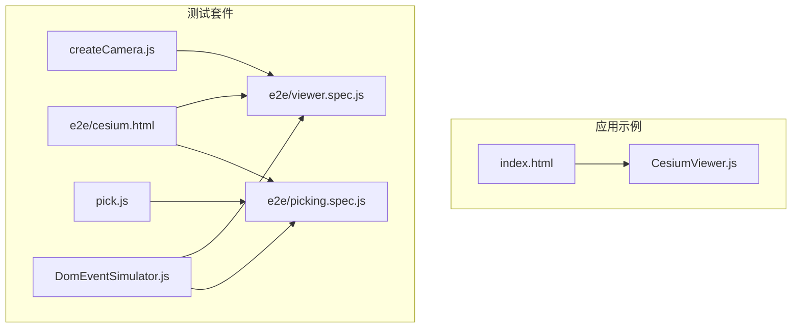
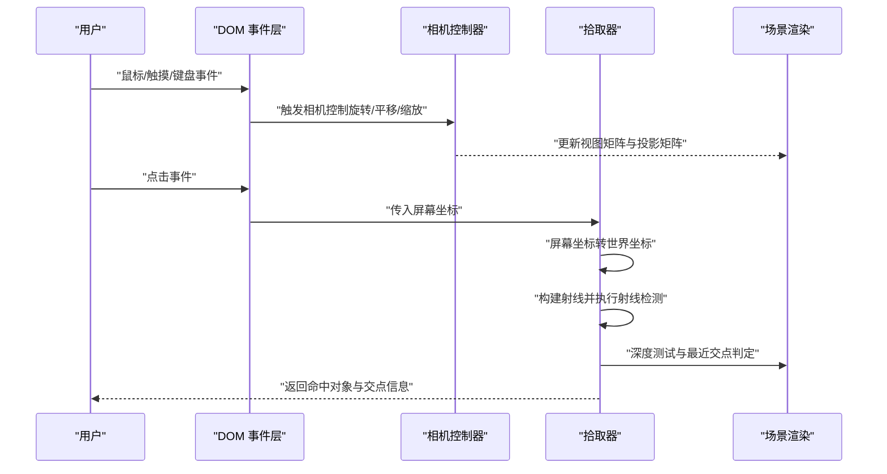
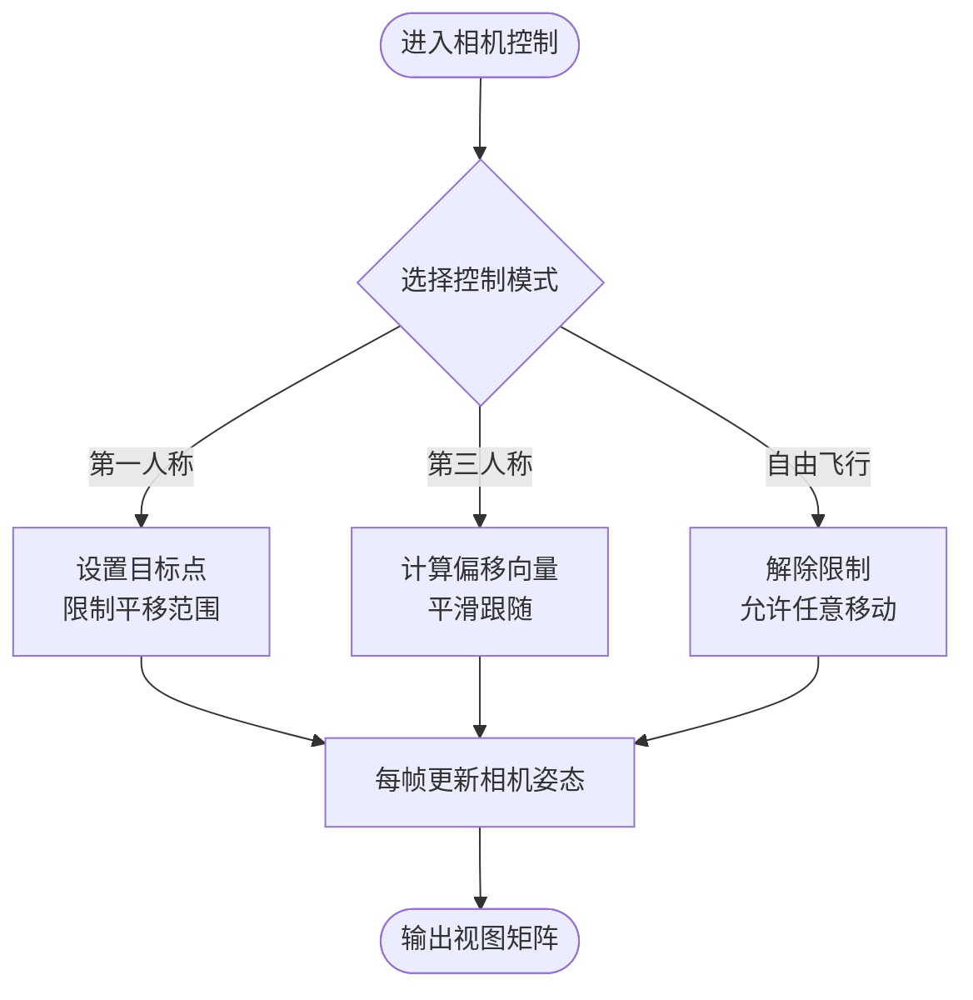
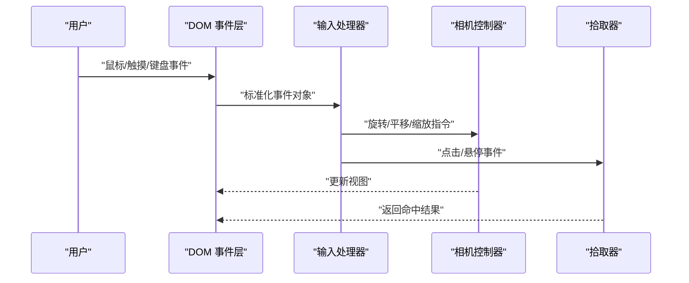
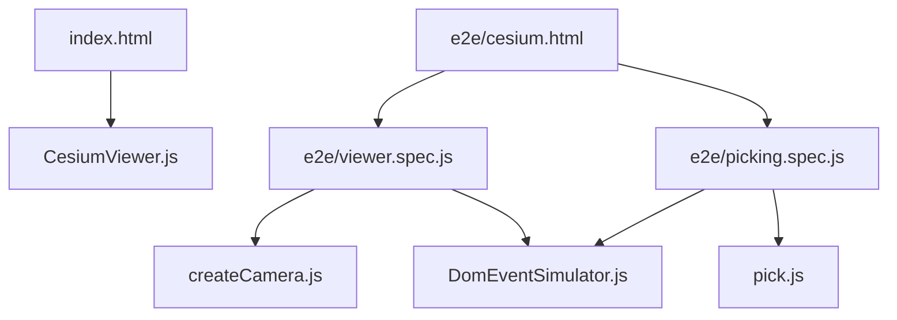

# 相机与交互控制

<cite>
**本文引用的文件**   
- [CesiumViewer.js](file://Apps/CesiumViewer/CesiumViewer.js)
- [index.html](file://Apps/CesiumViewer/index.html)
- [createCamera.js](file://Specs/createCamera.js)
- [pick.js](file://Specs/pick.js)
- [DomEventSimulator.js](file://Specs/DomEventSimulator.js)
- [e2e/cesium.html](file://Specs/e2e/cesium.html)
- [e2e/viewer.spec.js](file://Specs/e2e/viewer.spec.js)
- [e2e/picking.spec.js](file://Specs/e2e/picking.spec.js)
</cite>

## 目录
1. [简介](#简介)
2. [项目结构](#项目结构)
3. [核心组件](#核心组件)
4. [架构总览](#架构总览)
5. [详细组件分析](#详细组件分析)
6. [依赖关系分析](#依赖关系分析)
7. [性能考虑](#性能考虑)
8. [故障排查指南](#故障排查指南)
9. [结论](#结论)
10. [附录](#附录)

## 简介
本技术文档围绕 Cesium 的相机与交互控制系统，系统阐述以下主题：
- 相机控制模式：第一人称视角、第三人称跟随、自由飞行等模式的原理与使用要点。
- 拾取系统：屏幕坐标到世界坐标转换、射线检测算法、深度测试机制。
- 输入事件处理：鼠标、触摸、键盘事件的统一处理流程。
- 交互功能：测量工具、标注系统、选择高亮等典型场景的实现思路与最佳实践。
- 示例与参考：基于仓库中现有示例与测试用例的路径指引，便于快速上手与扩展。

## 项目结构
与相机和交互相关的代码主要分布在应用示例与测试套件中：
- 应用示例：用于演示 Viewer 初始化与基础交互行为。
- 测试套件：提供相机创建、拾取验证、DOM 事件模拟以及端到端场景，帮助理解交互流程与边界条件。

图表来源
- [CesiumViewer.js:1-200](file://Apps/CesiumViewer/CesiumViewer.js#L1-L200)
- [index.html:1-200](file://Apps/CesiumViewer/index.html#L1-L200)
- [createCamera.js:1-200](file://Specs/createCamera.js#L1-L200)
- [pick.js:1-200](file://Specs/pick.js#L1-L200)
- [DomEventSimulator.js:1-200](file://Specs/DomEventSimulator.js#L1-L200)
- [e2e/cesium.html:1-200](file://Specs/e2e/cesium.html#L1-L200)
- [e2e/viewer.spec.js:1-200](file://Specs/e2e/viewer.spec.js#L1-L200)
- [e2e/picking.spec.js:1-200](file://Specs/e2e/picking.spec.js#L1-L200)

章节来源
- [CesiumViewer.js:1-200](file://Apps/CesiumViewer/CesiumViewer.js#L1-L200)
- [index.html:1-200](file://Apps/CesiumViewer/index.html#L1-L200)
- [createCamera.js:1-200](file://Specs/createCamera.js#L1-L200)
- [pick.js:1-200](file://Specs/pick.js#L1-L200)
- [DomEventSimulator.js:1-200](file://Specs/DomEventSimulator.js#L1-L200)
- [e2e/cesium.html:1-200](file://Specs/e2e/cesium.html#L1-L200)
- [e2e/viewer.spec.js:1-200](file://Specs/e2e/viewer.spec.js#L1-L200)
- [e2e/picking.spec.js:1-200](file://Specs/e2e/picking.spec.js#L1-L200)

## 核心组件
本节聚焦于相机与交互的核心能力，结合仓库中的示例与测试用例进行说明：
- 相机控制模式
  - 第一人称视角：以目标点为中心，通过旋转与平移实现“行走式”观察。
  - 第三人称跟随：相机位于目标后方或侧方，随目标移动而保持相对位置。
  - 自由飞行：无约束的三维空间内任意移动与旋转，适合全局浏览与定位。
- 拾取系统
  - 屏幕坐标到世界坐标：将像素坐标转换为三维空间坐标，常用于点击定位与标注放置。
  - 射线检测：从相机位置沿视线方向发射射线，计算与场景对象的交点。
  - 深度测试：在渲染管线中进行深度比较，确保近处对象优先被拾取。
- 输入事件处理
  - 鼠标事件：左键拖拽旋转、滚轮缩放、右键平移等。
  - 触摸事件：单指旋转、双指缩放与平移。
  - 键盘事件：WASD 或方向键控制移动，配合 Shift/Ctrl 调整速度或模式。
- 交互功能
  - 测量工具：两点距离、多段路径长度、面积量测等。
  - 标注系统：在指定位置添加文本标签，支持吸附地面与高度偏移。
  - 选择高亮：选中对象后通过材质或轮廓增强视觉反馈。

章节来源
- [createCamera.js:1-200](file://Specs/createCamera.js#L1-L200)
- [pick.js:1-200](file://Specs/pick.js#L1-L200)
- [DomEventSimulator.js:1-200](file://Specs/DomEventSimulator.js#L1-L200)
- [e2e/viewer.spec.js:1-200](file://Specs/e2e/viewer.spec.js#L1-L200)
- [e2e/picking.spec.js:1-200](file://Specs/e2e/picking.spec.js#L1-L200)

## 架构总览
下图展示了从用户输入到相机更新与拾取结果的端到端流程，涵盖事件捕获、坐标转换、射线检测与结果返回的关键步骤。

图表来源
- [DomEventSimulator.js:1-200](file://Specs/DomEventSimulator.js#L1-L200)
- [createCamera.js:1-200](file://Specs/createCamera.js#L1-L200)
- [pick.js:1-200](file://Specs/pick.js#L1-L200)
- [e2e/viewer.spec.js:1-200](file://Specs/e2e/viewer.spec.js#L1-L200)
- [e2e/picking.spec.js:1-200](file://Specs/e2e/picking.spec.js#L1-L200)

## 详细组件分析

### 相机控制模式
- 第一人称视角
  - 特点：以目标点为焦点，旋转围绕目标，平移受地形或碰撞限制。
  - 适用：导航、室内漫游、近距离细节查看。
  - 关键参数：目标点、旋转速度、平移速度、最小/最大高度。
- 第三人称跟随
  - 特点：相机与目标保持固定相对位置，可设置偏移向量与平滑过渡。
  - 适用：载具跟踪、角色跟随、动态目标观测。
  - 关键参数：偏移向量、跟随半径、阻尼系数。
- 自由飞行
  - 特点：无约束移动，适合大范围浏览与快速定位。
  - 适用：宏观概览、航线规划、跨区域对比。
  - 关键参数：飞行速度、惯性、边界限制。

图表来源
- [createCamera.js:1-200](file://Specs/createCamera.js#L1-L200)
- [e2e/viewer.spec.js:1-200](file://Specs/e2e/viewer.spec.js#L1-L200)

章节来源
- [createCamera.js:1-200](file://Specs/createCamera.js#L1-L200)
- [e2e/viewer.spec.js:1-200](file://Specs/e2e/viewer.spec.js#L1-L200)

### 拾取系统
- 屏幕坐标到世界坐标转换
  - 输入：屏幕像素坐标 (x, y)。
  - 过程：反投影至相机视锥体，结合深度值还原三维坐标。
  - 输出：世界坐标系下的点 P。
- 射线检测算法
  - 起点：相机位置。
  - 方向：从相机指向 P 的单位向量。
  - 求交：遍历场景图元，计算射线与几何体的交点集合。
- 深度测试
  - 目的：确保离相机最近的交点被选中。
  - 方法：利用渲染管线的深度缓冲或显式比较交点深度。

图表来源
- [pick.js:1-200](file://Specs/pick.js#L1-L200)
- [e2e/picking.spec.js:1-200](file://Specs/e2e/picking.spec.js#L1-L200)

章节来源
- [pick.js:1-200](file://Specs/pick.js#L1-L200)
- [e2e/picking.spec.js:1-200](file://Specs/e2e/picking.spec.js#L1-L200)

### 输入事件处理
- 统一事件入口
  - 通过 DOM 事件层捕获鼠标、触摸、键盘事件，并进行标准化封装。
- 事件分发
  - 根据事件类型与状态机决定调用相机控制或拾取逻辑。
- 设备适配
  - 触摸手势识别（单指旋转、双指缩放/平移），键盘快捷键组合。

图表来源
- [DomEventSimulator.js:1-200](file://Specs/DomEventSimulator.js#L1-L200)
- [e2e/viewer.spec.js:1-200](file://Specs/e2e/viewer.spec.js#L1-L200)
- [e2e/picking.spec.js:1-200](file://Specs/e2e/picking.spec.js#L1-L200)

章节来源
- [DomEventSimulator.js:1-200](file://Specs/DomEventSimulator.js#L1-L200)
- [e2e/viewer.spec.js:1-200](file://Specs/e2e/viewer.spec.js#L1-L200)
- [e2e/picking.spec.js:1-200](file://Specs/e2e/picking.spec.js#L1-L200)

### 测量工具、标注系统与选择高亮
- 测量工具
  - 两点距离：在场景中选取两个点，计算欧氏距离或地表距离。
  - 多段路径：连续点击生成折线，累加各段长度。
  - 面积量测：闭合多边形区域，计算投影或地表面积。
- 标注系统
  - 文本标签：在指定位置添加文字，支持贴地、高度偏移与样式配置。
  - 锚点与吸附：自动吸附到最近的地表或模型表面。
- 选择高亮
  - 选中反馈：通过材质颜色、透明度或轮廓描边突出显示。
  - 批量操作：对多个对象同时应用高亮样式。

图表来源
- [e2e/viewer.spec.js:1-200](file://Specs/e2e/viewer.spec.js#L1-L200)
- [e2e/picking.spec.js:1-200](file://Specs/e2e/picking.spec.js#L1-L200)

章节来源
- [e2e/viewer.spec.js:1-200](file://Specs/e2e/viewer.spec.js#L1-L200)
- [e2e/picking.spec.js:1-200](file://Specs/e2e/picking.spec.js#L1-L200)

## 依赖关系分析
- 应用示例依赖
  - index.html 引入 CesiumViewer.js，负责初始化 Viewer 与基础交互。
- 测试套件依赖
  - e2e/cesium.html 作为端到端测试页面，加载 viewer.spec.js 与 picking.spec.js。
  - createCamera.js 提供相机创建与配置辅助。
  - pick.js 提供拾取相关辅助函数。
  - DomEventSimulator.js 模拟 DOM 事件，驱动交互流程。

图表来源
- [index.html:1-200](file://Apps/CesiumViewer/index.html#L1-L200)
- [CesiumViewer.js:1-200](file://Apps/CesiumViewer/CesiumViewer.js#L1-L200)
- [e2e/cesium.html:1-200](file://Specs/e2e/cesium.html#L1-L200)
- [e2e/viewer.spec.js:1-200](file://Specs/e2e/viewer.spec.js#L1-L200)
- [e2e/picking.spec.js:1-200](file://Specs/e2e/picking.spec.js#L1-L200)
- [createCamera.js:1-200](file://Specs/createCamera.js#L1-L200)
- [pick.js:1-200](file://Specs/pick.js#L1-L200)
- [DomEventSimulator.js:1-200](file://Specs/DomEventSimulator.js#L1-L200)

章节来源
- [index.html:1-200](file://Apps/CesiumViewer/index.html#L1-L200)
- [CesiumViewer.js:1-200](file://Apps/CesiumViewer/CesiumViewer.js#L1-L200)
- [e2e/cesium.html:1-200](file://Specs/e2e/cesium.html#L1-L200)
- [e2e/viewer.spec.js:1-200](file://Specs/e2e/viewer.spec.js#L1-L200)
- [e2e/picking.spec.js:1-200](file://Specs/e2e/picking.spec.js#L1-L200)
- [createCamera.js:1-200](file://Specs/createCamera.js#L1-L200)
- [pick.js:1-200](file://Specs/pick.js#L1-L200)
- [DomEventSimulator.js:1-200](file://Specs/DomEventSimulator.js#L1-L200)

## 性能考虑
- 相机更新频率
  - 在高帧率场景下，避免每帧进行昂贵的拾取计算；仅在必要事件发生时执行。
- 射线检测优化
  - 使用包围体（球体、轴对齐包围盒）进行粗筛，减少精确求交次数。
  - 分层拾取：先检测可见图层，再细化到具体对象。
- 深度测试成本
  - 尽量复用深度缓冲，避免重复渲染导致的额外开销。
- 输入节流与防抖
  - 对高频输入（如鼠标移动）进行节流，降低事件处理压力。
- 内存与对象池
  - 重用临时对象（向量、矩阵），减少垃圾回收压力。

[本节为通用指导，不直接分析具体文件]

## 故障排查指南
- 相机无法响应输入
  - 检查 DOM 事件是否被正确捕获与转发。
  - 确认相机控制器是否处于启用状态。
- 拾取失败或命中错误
  - 验证屏幕坐标是否正确归一化。
  - 检查射线方向与起点是否与当前相机一致。
  - 确认深度测试阈值与精度设置。
- 触摸事件异常
  - 检查多点触控手势识别逻辑。
  - 确认浏览器默认行为是否被阻止。
- 端到端测试失败
  - 核对测试页面加载顺序与依赖注入。
  - 使用事件模拟器回放问题场景，定位断点。

章节来源
- [DomEventSimulator.js:1-200](file://Specs/DomEventSimulator.js#L1-L200)
- [e2e/viewer.spec.js:1-200](file://Specs/e2e/viewer.spec.js#L1-L200)
- [e2e/picking.spec.js:1-200](file://Specs/e2e/picking.spec.js#L1-L200)

## 结论
通过对相机控制模式、拾取系统与输入事件处理的系统性梳理，并结合仓库中的示例与测试用例，可以构建稳定高效的三维交互体验。建议在实际项目中遵循上述最佳实践，结合性能优化策略与故障排查方法，持续提升用户体验与应用稳定性。

[本节为总结性内容，不直接分析具体文件]

## 附录
- 示例与参考路径
  - 应用示例：[CesiumViewer.js](file://Apps/CesiumViewer/CesiumViewer.js)、[index.html](file://Apps/CesiumViewer/index.html)
  - 相机创建与配置：[createCamera.js](file://Specs/createCamera.js)
  - 拾取辅助与验证：[pick.js](file://Specs/pick.js)、[e2e/picking.spec.js](file://Specs/e2e/picking.spec.js)
  - 事件模拟与端到端测试：[DomEventSimulator.js](file://Specs/DomEventSimulator.js)、[e2e/cesium.html](file://Specs/e2e/cesium.html)、[e2e/viewer.spec.js](file://Specs/e2e/viewer.spec.js)

[本节为索引性内容，不直接分析具体文件]