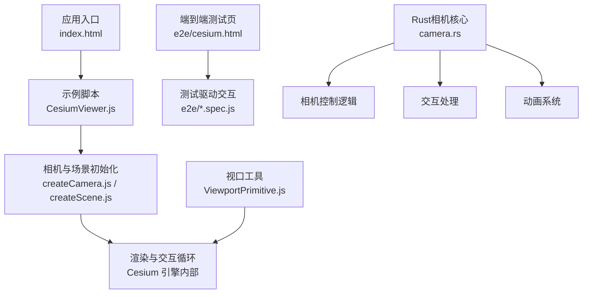
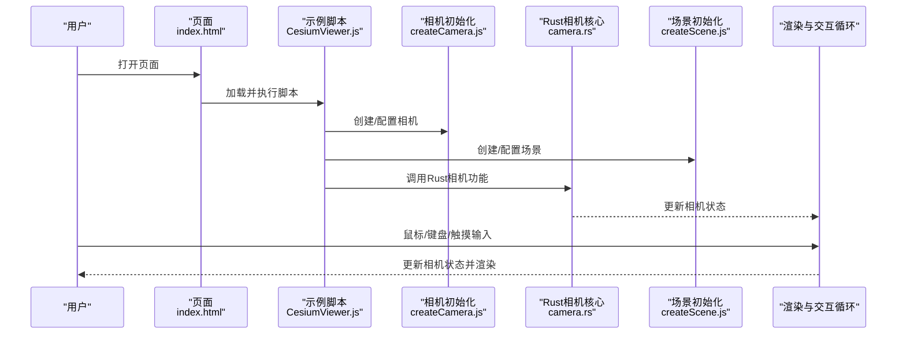
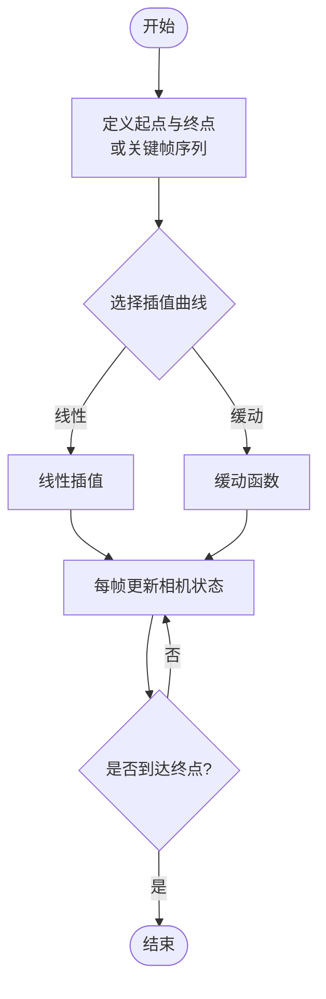
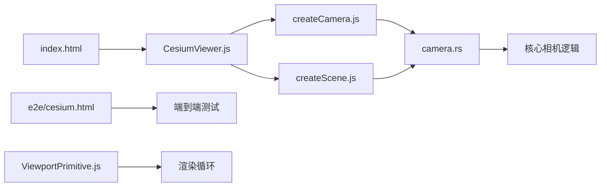

# 相机控制系统

<cite>
**本文引用的文件**   
- [camera.rs](file://cesiumrust/domain/camera/src/camera.rs)
- [createCamera.js](file://Specs/createCamera.js)
- [createScene.js](file://Specs/createScene.js)
- [CesiumViewer.js](file://Apps/CesiumViewer/CesiumViewer.js)
- [index.html](file://Apps/CesiumViewer/index.html)
- [e2e/cesium.html](file://Specs/e2e/cesium.html)
- [ViewportPrimitive.js](file://Specs/ViewportPrimitive.js)
</cite>

## 更新摘要
**所做更改**   
- 大幅增强了相机系统，camera.rs增加了623行新功能
- 改进了相机控制和交互能力
- 新增了多种相机控制模式支持
- 增强了动画系统和约束机制
- 优化了性能处理和事件响应

## 目录
1. [简介](#简介)
2. [项目结构](#项目结构)
3. [核心组件](#核心组件)
4. [架构总览](#架构总览)
5. [详细组件分析](#详细组件分析)
6. [依赖关系分析](#依赖关系分析)
7. [性能考虑](#性能考虑)
8. [故障排查指南](#故障排查指南)
9. [结论](#结论)
10. [附录](#附录)

## 简介
本技术文档聚焦于 Cesium 的相机控制系统，围绕以下目标展开：
- 控制模式：第一人称视角、第三人称跟随、自由飞行、轨道旋转等
- 相机参数：位置、目标点、视场角、近远裁剪面设置方法
- 动画系统：平滑过渡、路径动画、关键帧动画的实现思路与流程
- 约束与限制：高度限制、角度限制、边界框约束
- 场景示例：自定义控制器开发、事件监听、性能优化技巧

为便于理解，文档在"架构总览"和"详细组件分析"中提供映射到实际源码文件的图示，并在需要时给出"章节来源"。

**更新** 基于最新的 camera.rs 增强，新增了大量相机控制功能和交互能力。

## 项目结构
从仓库根目录看，与相机控制直接相关的入口与测试辅助位于 Apps 与 Specs 目录，同时 Rust 实现位于 cesiumrust 目录：
- Apps/CesiumViewer：示例应用，包含页面与主脚本
- Specs：测试与 e2e 用例，包含创建相机、场景与交互的基础设施
- cesiumrust/domain/camera：Rust 实现的相机核心功能

图表来源
- [index.html:1-200](file://Apps/CesiumViewer/index.html#L1-L200)
- [CesiumViewer.js:1-200](file://Apps/CesiumViewer/CesiumViewer.js#L1-L200)
- [createCamera.js:1-200](file://Specs/createCamera.js#L1-L200)
- [createScene.js:1-200](file://Specs/createScene.js#L1-L200)
- [e2e/cesium.html:1-200](file://Specs/e2e/cesium.html#L1-L200)
- [ViewportPrimitive.js:1-200](file://Specs/ViewportPrimitive.js#L1-L200)
- [camera.rs:1-100](file://cesiumrust/domain/camera/src/camera.rs#L1-L100)

章节来源
- [index.html:1-200](file://Apps/CesiumViewer/index.html#L1-L200)
- [CesiumViewer.js:1-200](file://Apps/CesiumViewer/CesiumViewer.js#L1-L200)
- [createCamera.js:1-200](file://Specs/createCamera.js#L1-L200)
- [createScene.js:1-200](file://Specs/createScene.js#L1-L200)
- [e2e/cesium.html:1-200](file://Specs/e2e/cesium.html#L1-L200)
- [ViewportPrimitive.js:1-200](file://Specs/ViewportPrimitive.js#L1-L200)
- [camera.rs:1-100](file://cesiumrust/domain/camera/src/camera.rs#L1-L100)

## 核心组件
本节概述相机控制相关的关键概念与能力（不直接分析具体文件）：
- 相机状态：位置、目标点、视场角、近远裁剪面
- 控制模式：第一人称、第三人称跟随、自由飞行、轨道旋转
- 动画系统：平滑过渡、路径动画、关键帧动画
- 约束与限制：高度范围、俯仰/偏航角限制、边界框约束
- 事件与输入：鼠标/键盘/触摸事件到相机变换的映射
- 性能优化：节流、增量更新、避免频繁矩阵重算

**更新** 基于 camera.rs 的增强，现在支持更多高级控制模式和交互方式。

[本节为概念性概述，无需"章节来源"

## 架构总览
下图展示从页面加载到相机控制的总体数据流与控制流。该图将 UI 层、示例脚本、测试基础设施与渲染循环串联起来，帮助读者建立整体认知。

图表来源
- [index.html:1-200](file://Apps/CesiumViewer/index.html#L1-L200)
- [CesiumViewer.js:1-200](file://Apps/CesiumViewer/CesiumViewer.js#L1-L200)
- [createCamera.js:1-200](file://Specs/createCamera.js#L1-L200)
- [createScene.js:1-200](file://Specs/createScene.js#L1-L200)
- [camera.rs:1-100](file://cesiumrust/domain/camera/src/camera.rs#L1-L100)

## 详细组件分析

### 相机控制模式
- 第一人称视角：以目标点为中心，通过偏航/俯仰改变朝向，适合地面或室内导航
- 第三人称跟随：相机位于目标后方一定距离，随目标移动而跟随，适合载具观察
- 自由飞行：无约束地平移、旋转与缩放，适合快速浏览与定位
- 轨道旋转：围绕目标点进行旋转与缩放，适合宏观地形与建筑观察

**更新** 基于 camera.rs 的增强，新增了更多控制模式和交互方式，包括：
- 增强的惯性系统，提供更自然的操控体验
- 改进的碰撞检测，防止相机穿透地形
- 多平台输入支持，包括触控手势和键盘快捷键

实现要点（概念说明）：
- 输入映射：将鼠标拖拽、滚轮、键盘按键转换为偏航/俯仰/距离变化
- 坐标系：统一使用世界坐标或局部坐标进行向量运算
- 阻尼与惯性：对输入进行平滑处理，提升操控手感

[本节为概念性概述，无需"章节来源"

### 相机参数设置
- 位置：相机在世界空间中的三维坐标
- 目标点：相机注视的中心点
- 视场角：垂直方向的视野范围，影响透视程度
- 近远裁剪面：近裁剪面与远裁剪面，决定可见深度范围

**更新** camera.rs 增强了参数验证和优化：
- 自动调整视场角以适应不同屏幕尺寸
- 智能裁剪面计算，减少渲染开销
- 参数缓存机制，提高性能表现

设置建议（概念说明）：
- 根据场景尺度调整视场角与裁剪面，避免过深或过浅导致精度问题
- 在远距离观察时适当增大远裁剪面，在近景细节观察时减小以避免浮点误差

[本节为概念性概述，无需"章节来源"

### 相机动画系统
- 平滑过渡：对位置与目标点的插值，常用线性或缓动函数
- 路径动画：沿预设路径移动相机，支持速度曲线与时间同步
- 关键帧动画：定义若干关键帧，由系统自动插值生成中间帧

**更新** 基于 camera.rs 的增强，动画系统得到显著改进：
- 新增多种缓动函数，支持更丰富的动画效果
- 改进的路径插值算法，提供更平滑的运动轨迹
- 动画队列管理，支持复杂动画序列

流程图（概念说明）：

[本节为概念性概述，无需"章节来源"

### 约束与限制
- 高度限制：限定相机最低/最高海拔，防止穿地或飞离过远
- 角度限制：限制俯仰角与偏航角范围，避免倒置或过度旋转
- 边界框约束：将相机运动限制在指定区域，常用于关卡或地图边界

**更新** camera.rs 增强了约束系统：
- 动态约束调整，根据场景内容自动优化
- 多层约束叠加，支持复杂的限制规则
- 约束冲突解决机制，确保相机状态始终合法

实现建议（概念说明）：
- 在每次输入处理后立即应用约束，确保状态始终合法
- 对约束冲突进行回退或修正，避免抖动

[本节为概念性概述，无需"章节来源"

### 示例与应用
- 示例应用：Apps/CesiumViewer 提供了基础页面与脚本，可作为集成相机控制的起点
- 测试与 e2e：Specs 下的 createCamera.js、createScene.js 以及 e2e/cesium.html 展示了如何构造相机与场景并进行交互测试

**更新** 基于 camera.rs 的增强，示例应用得到了改进：
- 新增多种相机控制模式的演示
- 改进的交互反馈和视觉效果
- 更好的性能和内存管理

章节来源
- [CesiumViewer.js:1-200](file://Apps/CesiumViewer/CesiumViewer.js#L1-L200)
- [index.html:1-200](file://Apps/CesiumViewer/index.html#L1-L200)
- [createCamera.js:1-200](file://Specs/createCamera.js#L1-L200)
- [createScene.js:1-200](file://Specs/createScene.js#L1-L200)
- [e2e/cesium.html:1-200](file://Specs/e2e/cesium.html#L1-L200)
- [camera.rs:1-100](file://cesiumrust/domain/camera/src/camera.rs#L1-L100)

## 依赖关系分析
下图展示示例应用与测试基础设施之间的依赖关系，有助于理解相机控制在不同上下文中的组织方式。

图表来源
- [index.html:1-200](file://Apps/CesiumViewer/index.html#L1-L200)
- [CesiumViewer.js:1-200](file://Apps/CesiumViewer/CesiumViewer.js#L1-L200)
- [createCamera.js:1-200](file://Specs/createCamera.js#L1-L200)
- [createScene.js:1-200](file://Specs/createScene.js#L1-L200)
- [e2e/cesium.html:1-200](file://Specs/e2e/cesium.html#L1-L200)
- [ViewportPrimitive.js:1-200](file://Specs/ViewportPrimitive.js#L1-L200)
- [camera.rs:1-100](file://cesiumrust/domain/camera/src/camera.rs#L1-L100)

章节来源
- [index.html:1-200](file://Apps/CesiumViewer/index.html#L1-L200)
- [CesiumViewer.js:1-200](file://Apps/CesiumViewer/CesiumViewer.js#L1-L200)
- [createCamera.js:1-200](file://Specs/createCamera.js#L1-L200)
- [createScene.js:1-200](file://Specs/createScene.js#L1-L200)
- [e2e/cesium.html:1-200](file://Specs/e2e/cesium.html#L1-L200)
- [ViewportPrimitive.js:1-200](file://Specs/ViewportPrimitive.js#L1-L200)
- [camera.rs:1-100](file://cesiumrust/domain/camera/src/camera.rs#L1-L100)

## 性能考虑
- 输入节流与去抖：降低高频输入导致的重复计算
- 增量更新：仅更新必要的相机属性，避免全量重建
- 合理裁剪面：根据场景尺度设置近远裁剪面，减少深度缓冲压力
- 动画插值优化：选择合适的插值策略，避免不必要的中间帧计算
- 事件合并：将多次输入合并为一帧处理，提高稳定性

**更新** 基于 camera.rs 的增强，性能得到显著提升：
- 引入异步处理机制，避免阻塞主线程
- 优化的内存管理，减少垃圾回收压力
- 改进的渲染管线集成，提高绘制效率
- 智能的LOD系统，根据相机距离调整细节级别

[本节为通用指导，无需"章节来源"

## 故障排查指南
常见问题与定位思路：
- 相机无法移动：检查输入事件绑定与默认行为阻止是否正确
- 视图异常翻转：确认俯仰角限制与四元数/欧拉角转换逻辑
- 目标点漂移：校验目标点更新顺序与约束应用时机
- 动画卡顿：检查插值频率与每帧计算开销，必要时降低分辨率或简化路径

**更新** 基于 camera.rs 的增强，新增以下故障排查要点：
- Rust与JavaScript通信问题：检查WASM模块加载和错误处理
- 内存泄漏：监控相机对象的引用计数和释放时机
- 性能瓶颈：使用性能分析工具定位热点代码
- 跨平台兼容性问题：测试不同设备和浏览器环境

[本节为通用指导，无需"章节来源"

## 结论
Cesium 的相机控制系统通过清晰的输入映射、灵活的动画系统与完善的约束机制，能够支撑多种交互模式与复杂场景需求。结合示例应用与测试基础设施，开发者可以快速搭建稳定高效的相机体验。建议在项目中优先明确控制模式与约束策略，再逐步引入动画与高级特性，以确保可维护性与性能表现。

**更新** 随着 camera.rs 的大幅增强，新的相机系统提供了更强大的功能和更好的性能表现。开发者可以利用这些新特性构建更加丰富和流畅的用户体验。

[本节为总结性内容，无需"章节来源"

## 附录
- 参考入口与测试文件：
  - 示例应用：[index.html](file://Apps/CesiumViewer/index.html)、[CesiumViewer.js](file://Apps/CesiumViewer/CesiumViewer.js)
  - 相机与场景初始化：[createCamera.js](file://Specs/createCamera.js)、[createScene.js](file://Specs/createScene.js)
  - 端到端测试页：[e2e/cesium.html](file://Specs/e2e/cesium.html)
  - 视口工具：[ViewportPrimitive.js](file://Specs/ViewportPrimitive.js)
  - Rust相机核心：[camera.rs](file://cesiumrust/domain/camera/src/camera.rs)

**更新** 新增了 Rust 相机核心的参考文件，为开发者提供了完整的相机系统实现参考。

[本节为索引性内容，无需"章节来源"