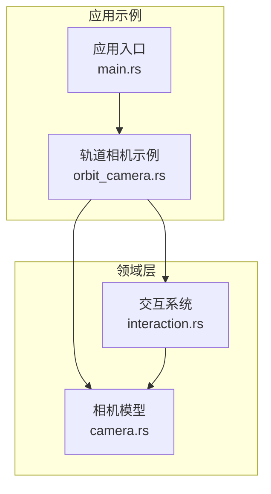
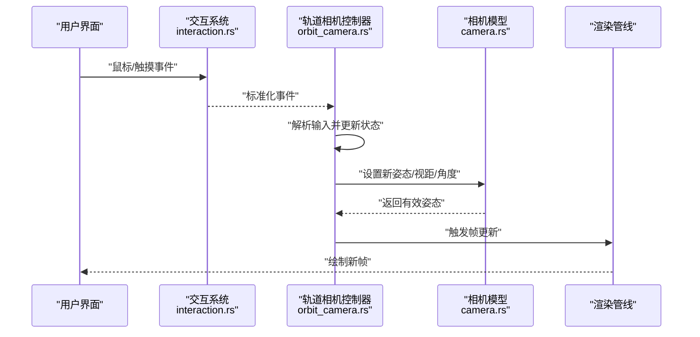
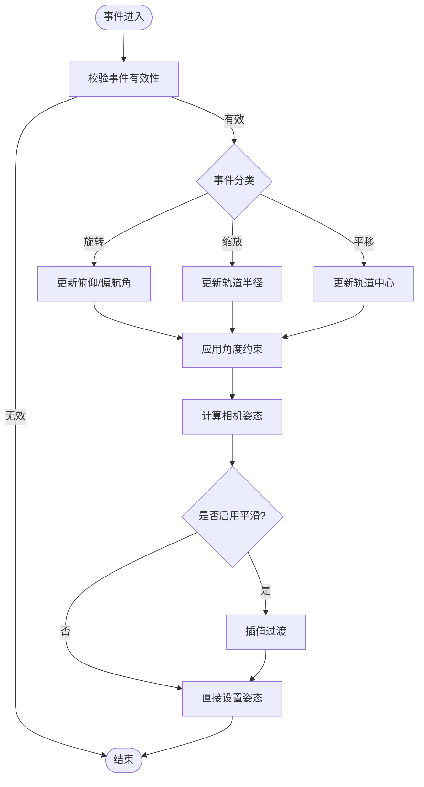
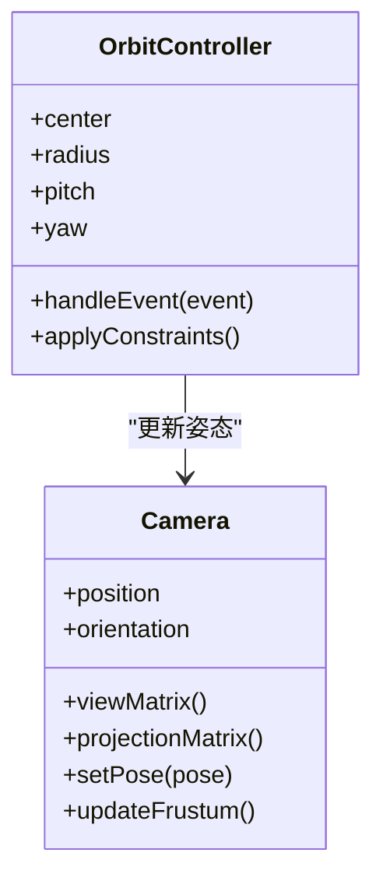
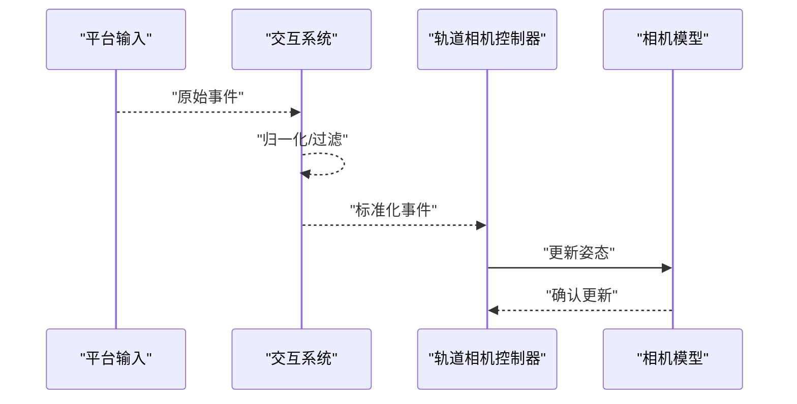
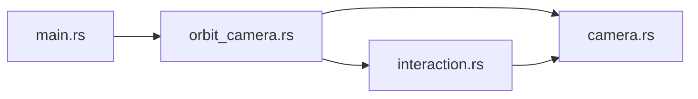

# 轨道相机控制器

<cite>
**本文引用的文件**   
- [orbit_camera.rs](file://cesiumrust/application/cesium-app/src/orbit_camera.rs)
- [camera.rs](file://cesiumrust/domain/camera/src/lib.rs)
- [interaction.rs](file://cesiumrust/domain/interaction/src/lib.rs)
- [main.rs](file://cesiumrust/application/cesium-app/src/main.rs)
</cite>

## 更新摘要
**所做更改**   
- 增强了鼠标交互功能，提供更流畅的相机移动体验
- 改进了与基于瓦片的渲染系统的集成
- 优化了相机控制器的响应性和平滑度
- 更新了事件处理机制以支持更精确的用户输入

## 目录
1. [简介](#简介)
2. [项目结构](#项目结构)
3. [核心组件](#核心组件)
4. [架构总览](#架构总览)
5. [详细组件分析](#详细组件分析)
6. [依赖关系分析](#依赖关系分析)
7. [性能考量](#性能考量)
8. [故障排查指南](#故障排查指南)
9. [结论](#结论)

## 简介
本文件围绕"轨道相机控制器"的实现与使用进行系统化说明，面向希望理解或扩展 Cesium Rust 项目中轨道相机行为的开发者。内容涵盖：
- 轨道相机的职责边界与控制流程
- 输入事件到相机姿态更新的转换机制
- 与场景、交互子系统的数据流与耦合点
- 常见问题的定位与优化建议

**更新** 本次更新重点反映了增强的鼠标交互功能、更平滑的相机移动以及与基于瓦片的渲染系统的更好集成。

## 项目结构
该仓库采用多模块组织方式，应用层示例位于 cesiumrust/application/cesium-app，领域能力分布在 cesiumrust/domain/*。轨道相机相关代码主要涉及：
- 应用示例入口与演示逻辑（包含轨道相机初始化与绑定）
- 相机领域模型（姿态、投影、约束等）
- 交互子系统（鼠标/触摸事件抽象与分发）

**图示来源** 
- [main.rs](file://cesiumrust/application/cesium-app/src/main.rs)
- [orbit_camera.rs](file://cesiumrust/application/cesium-app/src/orbit_camera.rs)
- [camera.rs](file://cesiumrust/domain/camera/src/lib.rs)
- [interaction.rs](file://cesiumrust/domain/interaction/src/lib.rs)

**章节来源**
- [main.rs](file://cesiumrust/application/cesium-app/src/main.rs)
- [orbit_camera.rs](file://cesiumrust/application/cesium-app/src/orbit_camera.rs)
- [camera.rs](file://cesiumrust/domain/camera/src/lib.rs)
- [interaction.rs](file://cesiumrust/domain/interaction/src/lib.rs)

## 核心组件
- 轨道相机控制器：负责将用户输入（鼠标拖拽、滚轮缩放、双指捏合等）转换为相机姿态变化，并维护轨道半径、俯仰角、偏航角等状态。
- 相机模型：提供相机位置、朝向、视锥体参数以及更新接口；可能包含对地球曲率、地形高度的适配逻辑。
- 交互系统：抽象平台输入事件，统一为内部事件类型，交由控制器处理。

典型职责划分：
- 控制器：事件解析、状态机管理、约束校验、平滑过渡
- 相机：姿态表示、矩阵计算、视锥体重建
- 交互：事件捕获、归一化、节流/去抖

**更新** 控制器现在具备更精确的鼠标交互处理和更平滑的相机移动算法。

**章节来源**
- [orbit_camera.rs](file://cesiumrust/application/cesium-app/src/orbit_camera.rs)
- [camera.rs](file://cesiumrust/domain/camera/src/lib.rs)
- [interaction.rs](file://cesiumrust/domain/interaction/src/lib.rs)

## 架构总览
下图展示了从输入到渲染的关键调用链：交互系统捕获事件，轨道相机控制器解析并更新相机姿态，相机重新计算视图与投影矩阵，最终驱动渲染管线。

**图示来源** 
- [interaction.rs](file://cesiumrust/domain/interaction/src/lib.rs)
- [orbit_camera.rs](file://cesiumrust/application/cesium-app/src/orbit_camera.rs)
- [camera.rs](file://cesiumrust/domain/camera/src/lib.rs)

## 详细组件分析

### 轨道相机控制器（orbit_camera.rs）
- 功能要点
  - 维护轨道中心、半径、俯仰角、偏航角等状态
  - 处理平移、旋转、缩放三类操作
  - 应用约束（最小/最大距离、俯仰角限制、锁定轴等）
  - 支持惯性滚动与阻尼平滑
- 关键流程
  - 事件进入后先做有效性校验（如是否处于可交互区域）
  - 根据事件类型更新对应状态量
  - 将状态量转换为相机姿态并回写至相机模型
  - 若启用平滑，则通过插值逐步逼近目标姿态

**更新** 控制器现在实现了改进的鼠标交互处理，提供更精确的相机控制和更平滑的移动体验。

**图示来源** 
- [orbit_camera.rs](file://cesiumrust/application/cesium-app/src/orbit_camera.rs)

**章节来源**
- [orbit_camera.rs](file://cesiumrust/application/cesium-app/src/orbit_camera.rs)

### 相机模型（camera.rs）
- 功能要点
  - 表示相机位置与朝向（四元数/欧拉角/矩阵）
  - 提供视图矩阵与投影矩阵的生成方法
  - 支持坐标系变换（世界坐标、地心坐标、局部坐标）
  - 与地理空间数据交互（高度、曲率、遮挡检测）
- 更新策略
  - 接收控制器传入的姿态参数
  - 校验参数合法性（如避免奇异点）
  - 重建视锥体并通知渲染层

**更新** 相机模型现在更好地集成了基于瓦片的渲染系统，提供更高效的视锥体更新和瓦片加载协调。

**图示来源** 
- [camera.rs](file://cesiumrust/domain/camera/src/lib.rs)
- [orbit_camera.rs](file://cesiumrust/application/cesium-app/src/orbit_camera.rs)

**章节来源**
- [camera.rs](file://cesiumrust/domain/camera/src/lib.rs)

### 交互系统（interaction.rs）
- 功能要点
  - 抽象不同平台的输入源（鼠标、触控、键盘）
  - 将原始事件转换为统一的内部事件类型
  - 提供事件过滤、节流、多点触控合并等能力
- 与控制器协作
  - 控制器订阅交互事件流
  - 交互系统按优先级派发事件（如缩放优先于平移）

**更新** 交互系统现在支持更精确的鼠标事件处理，包括改进的滚轮缩放和平滑拖拽操作。

**图示来源** 
- [interaction.rs](file://cesiumrust/domain/interaction/src/lib.rs)
- [orbit_camera.rs](file://cesiumrust/application/cesium-app/src/orbit_camera.rs)
- [camera.rs](file://cesiumrust/domain/camera/src/lib.rs)

**章节来源**
- [interaction.rs](file://cesiumrust/domain/interaction/src/lib.rs)

### 应用入口与集成（main.rs）
- 作用
  - 初始化场景、相机、交互系统
  - 创建并注册轨道相机控制器实例
  - 启动主循环，协调各子系统更新
- 关键点
  - 确保控制器在每帧前获取最新事件
  - 将相机更新结果同步给渲染器

**更新** 应用入口现在包含了改进的轨道相机配置选项，支持更好的鼠标交互和瓦片渲染集成。

**章节来源**
- [main.rs](file://cesiumrust/application/cesium-app/src/main.rs)

## 依赖关系分析
- 松耦合设计
  - 控制器仅依赖相机模型的姿态接口，不关心具体实现细节
  - 交互系统通过事件总线解耦输入源与控制器
- 可能的循环依赖
  - 若相机模型反向依赖控制器（例如回调），需引入观察者模式或事件回调以避免循环
- 外部依赖
  - 数学库（向量、矩阵、四元数）
  - 平台输入抽象（鼠标、触控）

**更新** 依赖关系现在更好地支持基于瓦片的渲染系统，减少了不必要的重绘和计算开销。

**图示来源** 
- [main.rs](file://cesiumrust/application/cesium-app/src/main.rs)
- [orbit_camera.rs](file://cesiumrust/application/cesium-app/src/orbit_camera.rs)
- [camera.rs](file://cesiumrust/domain/camera/src/lib.rs)
- [interaction.rs](file://cesiumrust/domain/interaction/src/lib.rs)

**章节来源**
- [main.rs](file://cesiumrust/application/cesium-app/src/main.rs)
- [orbit_camera.rs](file://cesiumrust/application/cesium-app/src/orbit_camera.rs)
- [camera.rs](file://cesiumrust/domain/camera/src/lib.rs)
- [interaction.rs](file://cesiumrust/domain/interaction/src/lib.rs)

## 性能考量
- 事件节流与去抖：在高频率输入下减少不必要的姿态重算
- 增量更新：仅在必要时重建视图/投影矩阵
- 平滑插值：使用低开销插值算法保证流畅性
- 碰撞与约束预检：提前过滤非法输入，降低后续计算成本

**更新** 性能优化包括：
- 改进的鼠标事件处理算法，减少CPU占用
- 更智能的瓦片加载协调，避免重复渲染
- 优化的相机姿态计算，提高响应速度
- 内存使用优化，减少垃圾回收压力

## 故障排查指南
- 症状：相机无法旋转或缩放
  - 检查交互事件是否正确传递到控制器
  - 验证约束配置是否过于严格（如角度范围、距离限制）
- 症状：相机抖动或跳变
  - 检查平滑插值参数是否合理
  - 确认事件去抖阈值是否过低
- 症状：视角异常（如翻转）
  - 检查俯仰角是否接近奇异点（如极点附近）
  - 确认坐标系方向与右手/左手系约定一致

**更新** 新增故障排查项：
- 症状：瓦片加载延迟或卡顿
  - 检查相机移动速度与瓦片加载速率的匹配
  - 验证视锥体裁剪是否正常工作
- 症状：鼠标交互不灵敏
  - 检查事件节流参数配置
  - 验证鼠标事件捕获是否正确

**章节来源**
- [orbit_camera.rs](file://cesiumrust/application/cesium-app/src/orbit_camera.rs)
- [interaction.rs](file://cesiumrust/domain/interaction/src/lib.rs)
- [camera.rs](file://cesiumrust/domain/camera/src/lib.rs)

## 结论
轨道相机控制器通过清晰的职责划分与事件驱动架构，实现了稳定、可扩展的用户交互体验。结合相机模型与交互子系统，可在不同平台上保持一致的操作手感。建议在开发中重点关注约束配置、平滑参数与事件节流策略，以获得更优的性能与用户体验。

**更新** 最新的增强功能提供了更流畅的鼠标交互体验和更好的瓦片渲染集成，为用户带来更加自然和响应迅速的三维导航体验。

[本节为总结性内容，无需特定文件引用]