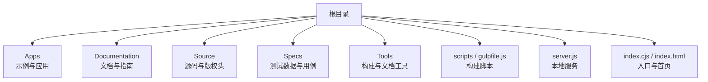
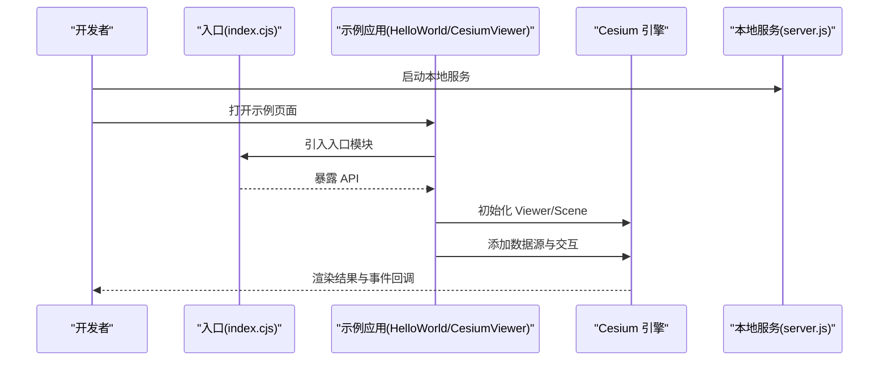
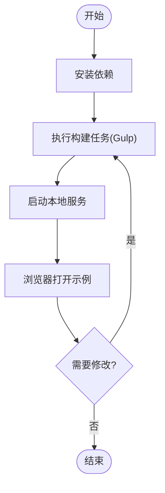
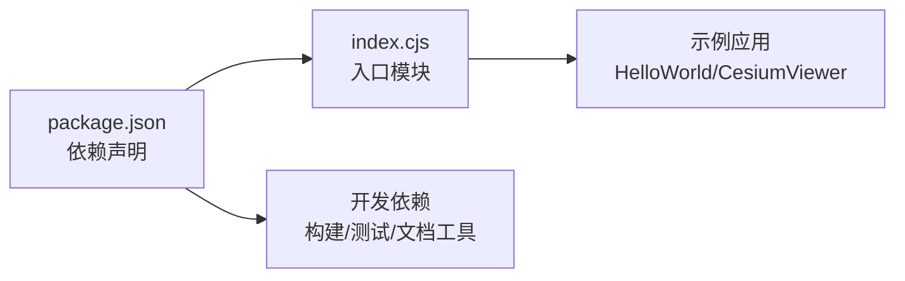

# 项目介绍

<cite>
**本文引用的文件**   
- [README.md](file://README.md)
- [CONTRIBUTING.md](file://CONTRIBUTING.md)
- [CODE_OF_CONDUCT.md](file://CODE_OF_CONDUCT.md)
- [package.json](file://package.json)
- [index.cjs](file://index.cjs)
- [index.html](file://index.html)
- [Apps/HelloWorld.html](file://Apps/HelloWorld.html)
- [Apps/CesiumViewer/CesiumViewer.js](file://Apps/CesiumViewer/CesiumViewer.js)
- [Documentation/Contributors/README.md](file://Documentation/Contributors/README.md)
- [Documentation/Contributors/ReleaseGuide/README.md](file://Documentation/Contributors/ReleaseGuide/README.md)
- [Documentation/Contributors/TestingGuide/README.md](file://Documentation/Contributors/TestingGuide/README.md)
- [gulpfile.js](file://gulpfile.js)
- [server.js](file://server.js)
</cite>

## 目录
1. [简介](#简介)
2. [项目结构](#项目结构)
3. [核心组件](#核心组件)
4. [架构总览](#架构总览)
5. [详细组件分析](#详细组件分析)
6. [依赖分析](#依赖分析)
7. [性能考量](#性能考量)
8. [故障排查指南](#故障排查指南)
9. [结论](#结论)
10. [附录](#附录)

## 简介
Cesium 是一个基于 WebGL 的开源三维地理空间可视化引擎，面向浏览器与移动端，提供高性能、跨平台的地球渲染与空间数据展示能力。其核心价值在于：
- 以 Web 原生技术栈实现大规模三维地理场景渲染，降低部署门槛与运行成本
- 提供从地形、影像到矢量、点云、倾斜摄影、BIM/城市场景的一体化加载与渲染管线
- 通过标准协议与开放生态（如 glTF、3D Tiles、KML/GPX、WMS/WMTS 等）连接广泛的数据源
- 在数字孪生、智慧城市、自然资源管理、应急指挥、航空航天等领域具备广泛应用价值

本仓库为 Cesium 源码与示例集合，包含构建脚本、文档、测试样例与应用演示，适合初学者入门与高级用户二次开发。

## 项目结构
仓库采用“应用 + 文档 + 源码 + 工具链”的分层组织方式：
- Apps：示例与演示应用，便于快速上手与功能验证
- Documentation：贡献者指南、发布流程、测试与离线使用指南等
- Source：核心源码（当前仓库中可见版权头文件，完整源码位于 packages 子包）
- Specs：单元测试与端到端测试数据与用例
- Tools：JSDoc 模板、代码规范检查、打包插件等工程化能力
- scripts/gulpfile：构建与打包脚本
- server.js：本地开发服务器
- index.cjs/index.html：入口与默认页面

图表来源
- [package.json:1-200](file://package.json#L1-L200)
- [gulpfile.js:1-200](file://gulpfile.js#L1-L200)
- [server.js:1-200](file://server.js#L1-L200)
- [index.cjs:1-200](file://index.cjs#L1-L200)
- [index.html:1-200](file://index.html#L1-L200)

章节来源
- [README.md:1-200](file://README.md#L1-L200)
- [package.json:1-200](file://package.json#L1-L200)
- [gulpfile.js:1-200](file://gulpfile.js#L1-L200)
- [server.js:1-200](file://server.js#L1-L200)
- [index.cjs:1-200](file://index.cjs#L1-L200)
- [index.html:1-200](file://index.html#L1-L200)

## 核心组件
- 示例与演示
  - HelloWorld：最小可运行的入门示例，帮助初学者快速体验
  - CesiumViewer：更完整的查看器示例，展示常用配置与交互
- 文档与指南
  - 贡献者指南：构建、测试、发布、代码审查等流程说明
  - 测试指南：单元与端到端测试方法
  - 离线指南：离线环境下的资源与部署建议
- 构建与服务
  - Gulp 构建脚本：打包、压缩、合并、生成文档等任务
  - 本地服务器：用于开发与调试静态资源
- 入口与打包
  - index.cjs：CommonJS 入口，便于 Node 环境与打包工具集成
  - index.html：默认首页，引导至示例或文档

章节来源
- [Apps/HelloWorld.html:1-200](file://Apps/HelloWorld.html#L1-L200)
- [Apps/CesiumViewer/CesiumViewer.js:1-200](file://Apps/CesiumViewer/CesiumViewer.js#L1-L200)
- [Documentation/Contributors/README.md:1-200](file://Documentation/Contributors/README.md#L1-L200)
- [Documentation/Contributors/TestingGuide/README.md:1-200](file://Documentation/Contributors/TestingGuide/README.md#L1-L200)
- [Documentation/Contributors/ReleaseGuide/README.md:1-200](file://Documentation/Contributors/ReleaseGuide/README.md#L1-L200)
- [gulpfile.js:1-200](file://gulpfile.js#L1-L200)
- [server.js:1-200](file://server.js#L1-L200)
- [index.cjs:1-200](file://index.cjs#L1-L200)
- [index.html:1-200](file://index.html#L1-L200)

## 架构总览
从开发者视角，Cesium 的典型使用路径如下：
- 引入入口模块（index.cjs）
- 初始化 Viewer 或 Scene
- 添加图层与数据源（影像、地形、模型、点云、矢量等）
- 绑定交互与动画
- 构建与部署（Gulp 任务）

图表来源
- [index.cjs:1-200](file://index.cjs#L1-L200)
- [Apps/HelloWorld.html:1-200](file://Apps/HelloWorld.html#L1-L200)
- [Apps/CesiumViewer/CesiumViewer.js:1-200](file://Apps/CesiumViewer/CesiumViewer.js#L1-L200)
- [server.js:1-200](file://server.js#L1-L200)

## 详细组件分析

### 示例应用：HelloWorld
- 目标：以最简方式展示 Cesium 的基本用法
- 关键点：引入入口、创建基础视图、加载默认数据源
- 适用人群：首次接触 Cesium 的初学者

章节来源
- [Apps/HelloWorld.html:1-200](file://Apps/HelloWorld.html#L1-L200)

### 示例应用：CesiumViewer
- 目标：提供更丰富的查看器示例，涵盖常见配置与交互
- 关键点：Viewer 初始化、控件与图层管理、事件处理
- 适用人群：希望快速搭建业务应用的开发者

章节来源
- [Apps/CesiumViewer/CesiumViewer.js:1-200](file://Apps/CesiumViewer/CesiumViewer.js#L1-L200)

### 构建与本地服务
- Gulp 任务：负责打包、压缩、合并、文档生成等
- 本地服务：提供静态资源访问，便于开发与调试
- 典型工作流：安装依赖 → 构建 → 启动服务 → 浏览器访问

图表来源
- [gulpfile.js:1-200](file://gulpfile.js#L1-L200)
- [server.js:1-200](file://server.js#L1-L200)

章节来源
- [gulpfile.js:1-200](file://gulpfile.js#L1-L200)
- [server.js:1-200](file://server.js#L1-L200)

### 入口与打包
- index.cjs：作为 CommonJS 入口，便于 Node 环境与打包工具集成
- index.html：默认首页，引导至示例或文档

章节来源
- [index.cjs:1-200](file://index.cjs#L1-L200)
- [index.html:1-200](file://index.html#L1-L200)

## 依赖分析
- 运行时依赖：由 package.json 声明，通常包括构建与运行所需的核心库
- 开发依赖：测试框架、代码质量工具、文档生成器等
- 入口关系：index.cjs 对外暴露 API，供示例与应用引用

图表来源
- [package.json:1-200](file://package.json#L1-L200)
- [index.cjs:1-200](file://index.cjs#L1-L200)
- [Apps/HelloWorld.html:1-200](file://Apps/HelloWorld.html#L1-L200)
- [Apps/CesiumViewer/CesiumViewer.js:1-200](file://Apps/CesiumViewer/CesiumViewer.js#L1-L200)

章节来源
- [package.json:1-200](file://package.json#L1-L200)

## 性能考量
- 数据分层与按需加载：利用瓦片与层级细节（LOD）减少首屏压力
- 几何与纹理优化：合理选择格式与压缩策略，控制内存占用
- 渲染批次与批处理：合并绘制调用，提升 GPU 利用率
- 异步与并发：避免主线程阻塞，合理使用 Worker 与异步加载
- 缓存策略：对静态资源与计算结果进行缓存，提高重复访问性能

[本节为通用指导，不直接分析具体文件]

## 故障排查指南
- 常见问题定位
  - 构建失败：检查依赖版本与 Node 环境，确认 Gulp 任务是否成功
  - 本地服务无法访问：确认端口占用与静态资源路径
  - 示例页面空白：检查控制台错误与网络请求状态
- 日志与调试
  - 启用浏览器开发者工具，关注 Console 与 Network 面板
  - 逐步注释示例逻辑，缩小问题范围
- 参考文档
  - 贡献者指南与测试指南：了解构建、测试与发布流程

章节来源
- [Documentation/Contributors/README.md:1-200](file://Documentation/Contributors/README.md#L1-L200)
- [Documentation/Contributors/TestingGuide/README.md:1-200](file://Documentation/Contributors/TestingGuide/README.md#L1-L200)
- [Documentation/Contributors/ReleaseGuide/README.md:1-200](file://Documentation/Contributors/ReleaseGuide/README.md#L1-L200)

## 结论
Cesium 以 Web 原生技术为核心，提供高性能、可扩展的三维地理空间可视化能力，适用于数字孪生、智慧城市、GIS 等多类场景。通过清晰的示例、完善的文档与开放的社区生态，开发者可以快速上手并持续演进自身应用。建议在项目中结合数据特性与性能目标，选择合适的加载与渲染策略，充分利用 Cesium 的生态与工具链。

[本节为总结性内容，不直接分析具体文件]

## 附录
- 历史发展与版本演进
  - 自 2011 年开源以来，Cesium 持续迭代，逐步完善 3D Tiles、glTF、点云、体素、材质系统等关键能力
  - 社区活跃，版本发布节奏稳定，兼容性与性能不断优化
- 开源协议与贡献者生态
  - 遵循 Apache 2.0 开源协议，鼓励社区参与与商业应用
  - 贡献流程清晰，包含代码规范、审查与发布指引
- 生态系统
  - 与主流 GIS 平台、数据格式与云服务深度集成
  - 丰富的第三方扩展与插件，覆盖行业解决方案

章节来源
- [README.md:1-200](file://README.md#L1-L200)
- [CONTRIBUTING.md:1-200](file://CONTRIBUTING.md#L1-L200)
- [CODE_OF_CONDUCT.md:1-200](file://CODE_OF_CONDUCT.md#L1-L200)
- [Documentation/Contributors/ReleaseGuide/README.md:1-200](file://Documentation/Contributors/ReleaseGuide/README.md#L1-L200)