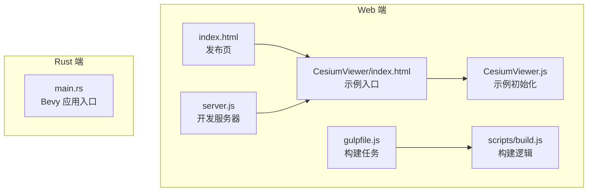
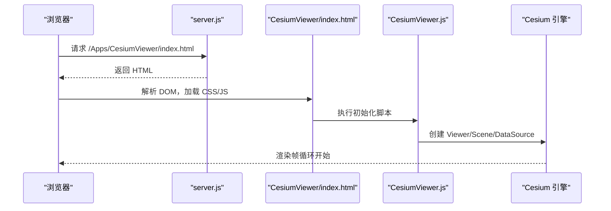
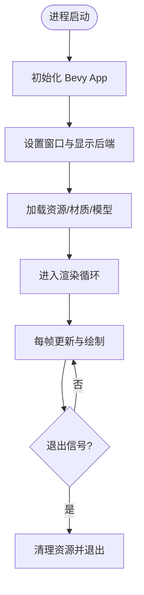
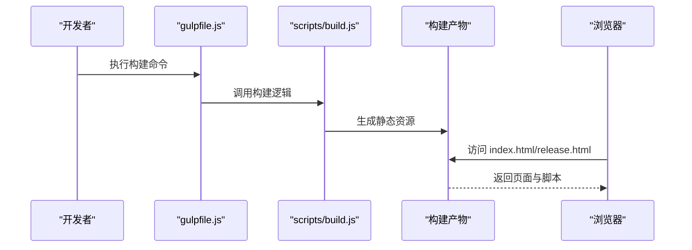
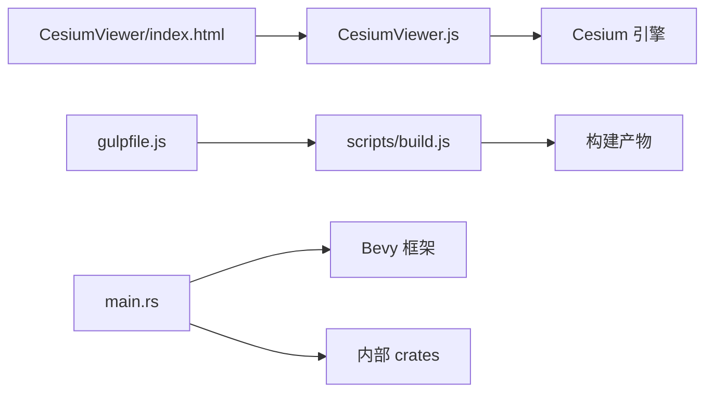

# 应用程序主入口

<cite>
**本文引用的文件**   
- [README.md](file://README.md)
- [package.json](file://package.json)
- [gulpfile.js](file://gulpfile.js)
- [server.js](file://server.js)
- [index.html](file://index.html)
- [index.release.html](file://index.release.html)
- [Apps/CesiumViewer/index.html](file://Apps/CesiumViewer/index.html)
- [Apps/CesiumViewer/CesiumViewer.js](file://Apps/CesiumViewer/CesiumViewer.js)
- [Apps/HelloWorld.html](file://Apps/HelloWorld.html)
- [scripts/build.js](file://scripts/build.js)
- [Scripts/ContextCache.js](file://scripts/ContextCache.js)
- [cesiumrust/application/cesium-app/src/main.rs](file://cesiumrust/application/cesium-app/src/main.rs)
</cite>

## 目录
1. [简介](#简介)
2. [项目结构](#项目结构)
3. [核心组件](#核心组件)
4. [架构总览](#架构总览)
5. [详细组件分析](#详细组件分析)
6. [依赖关系分析](#依赖关系分析)
7. [性能考虑](#性能考虑)
8. [故障排查指南](#故障排查指南)
9. [结论](#结论)
10. [附录](#附录)

## 简介
本文件聚焦于 CesiumJS 仓库中的“应用程序主入口”相关代码与流程，涵盖 Web 端与 Rust 端的启动入口、构建与运行脚本、以及示例应用如何加载引擎并初始化渲染。通过梳理入口点与关键脚本的协作关系，帮助读者快速理解从浏览器或本地可执行程序到图形渲染管线的首次调用路径。

## 项目结构
CesiumJS 仓库包含两类主入口：
- Web 端：以 HTML 页面为入口，配合 Gulp 构建与 Node 服务器；示例应用位于 Apps 目录。
- Rust 端：基于 Bevy 的应用程序入口位于 cesiumrust/application/cesium-app/src/main.rs。

图表来源
- [index.html](file://index.html)
- [Apps/CesiumViewer/index.html](file://Apps/CesiumViewer/index.html)
- [Apps/CesiumViewer/CesiumViewer.js](file://Apps/CesiumViewer/CesiumViewer.js)
- [server.js](file://server.js)
- [gulpfile.js](file://gulpfile.js)
- [scripts/build.js](file://scripts/build.js)
- [cesiumrust/application/cesium-app/src/main.rs](file://cesiumrust/application/cesium-app/src/main.rs)

章节来源
- [README.md](file://README.md)
- [package.json](file://package.json)
- [gulpfile.js](file://gulpfile.js)
- [server.js](file://server.js)
- [index.html](file://index.html)
- [index.release.html](file://index.release.html)
- [Apps/CesiumViewer/index.html](file://Apps/CesiumViewer/index.html)
- [Apps/CesiumViewer/CesiumViewer.js](file://Apps/CesiumViewer/CesiumViewer.js)
- [Apps/HelloWorld.html](file://Apps/HelloWorld.html)
- [scripts/build.js](file://scripts/build.js)
- [cesiumrust/application/cesium-app/src/main.rs](file://cesiumrust/application/cesium-app/src/main.rs)

## 核心组件
- Web 入口页面
  - index.html：仓库根发布页，通常用于引导至示例或文档。
  - index.release.html：发布版入口，指向构建产物。
  - Apps/CesiumViewer/index.html：示例应用的 HTML 入口，引入样式与脚本。
  - Apps/HelloWorld.html：最小化示例入口，便于快速验证环境。
- 示例初始化脚本
  - Apps/CesiumViewer/CesiumViewer.js：创建 Viewer、配置数据源与场景参数，是 Web 端业务入口。
- 构建与服务器
  - gulpfile.js：定义构建、压缩、打包等任务。
  - scripts/build.js：具体构建逻辑（如资源处理、模块打包）。
  - server.js：本地开发服务器，提供静态资源与代理能力。
- Rust 应用入口
  - cesiumrust/application/cesium-app/src/main.rs：Bevy 应用主函数，初始化窗口、渲染器与系统。

章节来源
- [index.html](file://index.html)
- [index.release.html](file://index.release.html)
- [Apps/CesiumViewer/index.html](file://Apps/CesiumViewer/index.html)
- [Apps/CesiumViewer/CesiumViewer.js](file://Apps/CesiumViewer/CesiumViewer.js)
- [Apps/HelloWorld.html](file://Apps/HelloWorld.html)
- [gulpfile.js](file://gulpfile.js)
- [scripts/build.js](file://scripts/build.js)
- [server.js](file://server.js)
- [cesiumrust/application/cesium-app/src/main.rs](file://cesiumrust/application/cesium-app/src/main.rs)

## 架构总览
下图展示 Web 端从浏览器加载到示例初始化的典型调用链，以及 Rust 端应用启动的主流程。

图表来源
- [server.js](file://server.js)
- [Apps/CesiumViewer/index.html](file://Apps/CesiumViewer/index.html)
- [Apps/CesiumViewer/CesiumViewer.js](file://Apps/CesiumViewer/CesiumViewer.js)

图表来源
- [cesiumrust/application/cesium-app/src/main.rs](file://cesiumrust/application/cesium-app/src/main.rs)

## 详细组件分析

### Web 端入口与示例初始化
- 入口页面
  - Apps/CesiumViewer/index.html：作为示例的 HTML 入口，负责引入样式与初始化脚本。
  - Apps/HelloWorld.html：最小示例，用于快速验证环境与依赖。
- 初始化脚本
  - Apps/CesiumViewer/CesiumViewer.js：创建 Viewer 实例、配置图层与交互、加载示例数据。该文件是 Web 端业务主入口。
- 构建与发布
  - gulpfile.js：定义构建任务，包括资源处理、压缩与打包。
  - scripts/build.js：实现具体的构建步骤，如模块合并、资源复制与输出目录管理。
  - index.html 与 index.release.html：分别对应开发与发布入口，指向不同构建产物。

图表来源
- [gulpfile.js](file://gulpfile.js)
- [scripts/build.js](file://scripts/build.js)
- [index.html](file://index.html)
- [index.release.html](file://index.release.html)

章节来源
- [Apps/CesiumViewer/index.html](file://Apps/CesiumViewer/index.html)
- [Apps/CesiumViewer/CesiumViewer.js](file://Apps/CesiumViewer/CesiumViewer.js)
- [Apps/HelloWorld.html](file://Apps/HelloWorld.html)
- [gulpfile.js](file://gulpfile.js)
- [scripts/build.js](file://scripts/build.js)
- [index.html](file://index.html)
- [index.release.html](file://index.release.html)

### Rust 端应用主入口
- main.rs：Bevy 应用主函数，负责初始化应用生命周期、窗口、渲染器与系统注册，随后进入渲染循环。
- 典型职责
  - 初始化窗口与显示后端
  - 注册插件与系统
  - 加载资源（纹理、模型、材质）
  - 启动渲染循环与事件处理

章节来源
- [cesiumrust/application/cesium-app/src/main.rs](file://cesiumrust/application/cesium-app/src/main.rs)

### 构建与服务器
- gulpfile.js：集中定义构建任务，如资源处理、压缩、打包与文档生成。
- scripts/build.js：实现构建细节，包括模块合并、资源复制、输出目录组织。
- server.js：本地开发服务器，提供静态文件服务与可能的代理转发，便于前端调试。

章节来源
- [gulpfile.js](file://gulpfile.js)
- [scripts/build.js](file://scripts/build.js)
- [server.js](file://server.js)

## 依赖关系分析
- Web 端依赖
  - HTML 页面依赖 CSS 与 JS 脚本，脚本依赖 Cesium 引擎库。
  - 构建阶段依赖 Gulp 任务与构建脚本，产出静态资源供浏览器加载。
- Rust 端依赖
  - main.rs 依赖 Bevy 框架与内部 crate（如 scene、material、gltf 等），在应用启动时按需加载。

图表来源
- [Apps/CesiumViewer/index.html](file://Apps/CesiumViewer/index.html)
- [Apps/CesiumViewer/CesiumViewer.js](file://Apps/CesiumViewer/CesiumViewer.js)
- [gulpfile.js](file://gulpfile.js)
- [scripts/build.js](file://scripts/build.js)
- [cesiumrust/application/cesium-app/src/main.rs](file://cesiumrust/application/cesium-app/src/main.rs)

章节来源
- [package.json](file://package.json)
- [gulpfile.js](file://gulpfile.js)
- [scripts/build.js](file://scripts/build.js)
- [server.js](file://server.js)
- [cesiumrust/application/cesium-app/src/main.rs](file://cesiumrust/application/cesium-app/src/main.rs)

## 性能考虑
- Web 端
  - 使用构建脚本进行资源压缩与合并，减少 HTTP 请求与传输体积。
  - 合理拆分示例脚本，按需加载大型资源（模型、纹理）。
  - 启用缓存策略，避免重复下载静态资源。
- Rust 端
  - 在 main.rs 中延迟加载资源，降低首帧耗时。
  - 控制渲染循环频率，避免不必要的重绘。
  - 利用 Bevy 的 ECS 特性优化系统调度与内存分配。

## 故障排查指南
- 无法打开示例页面
  - 检查 server.js 是否正常运行，端口占用与跨域配置是否正确。
  - 确认构建产物是否存在且路径正确。
- 页面空白或无渲染
  - 查看浏览器控制台错误，确认 Cesium 引擎脚本加载成功。
  - 检查 GPU 驱动与 WebGL 支持情况。
- Rust 应用崩溃
  - 检查 main.rs 初始化顺序与资源路径。
  - 使用日志定位系统注册失败或资源加载异常。

章节来源
- [server.js](file://server.js)
- [index.html](file://index.html)
- [index.release.html](file://index.release.html)
- [cesiumrust/application/cesium-app/src/main.rs](file://cesiumrust/application/cesium-app/src/main.rs)

## 结论
CesiumJS 仓库的“应用程序主入口”由 Web 端与 Rust 端两部分组成。Web 端以 HTML 页面为入口，通过示例脚本初始化 Cesium 引擎并渲染场景；Rust 端以 main.rs 为入口，基于 Bevy 框架完成应用生命周期管理与渲染循环。构建与服务器脚本贯穿开发流程，确保资源高效交付与稳定运行。理解这些入口点及其依赖关系，有助于快速搭建、调试与扩展 Cesium 应用。

## 附录
- 常用命令
  - 构建：参考 package.json 与 gulpfile.js 的任务定义。
  - 运行：启动 server.js 提供的本地服务器。
  - 发布：使用构建脚本生成 release 版本，并通过 index.release.html 访问。