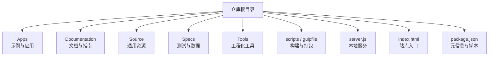
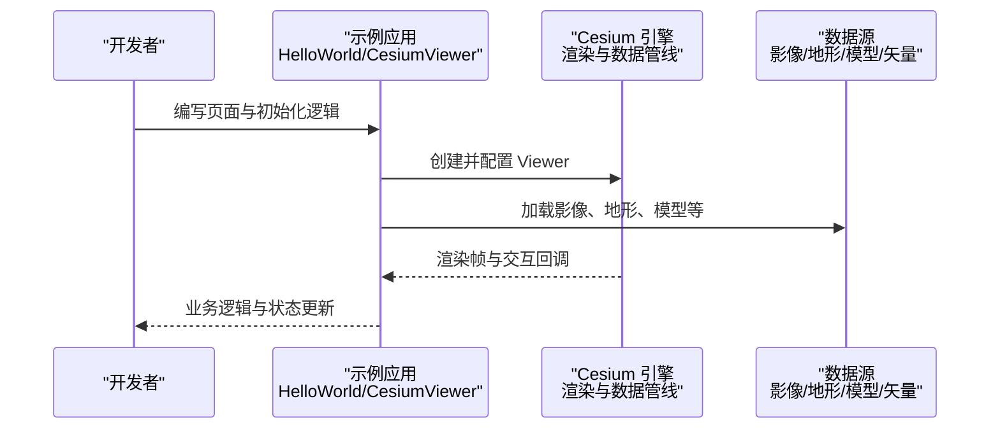
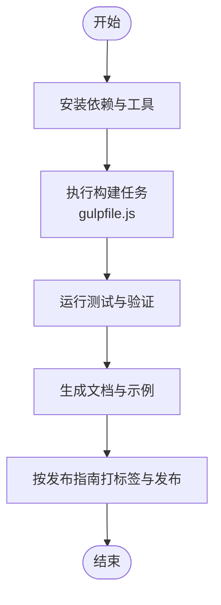
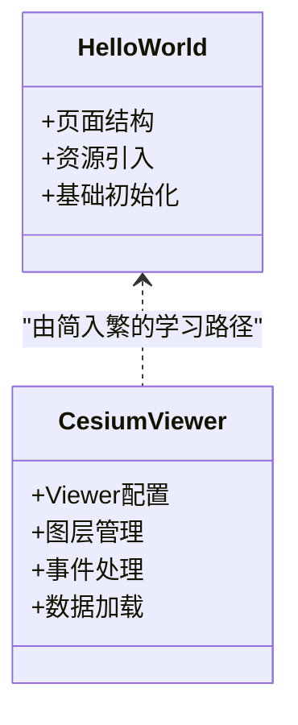
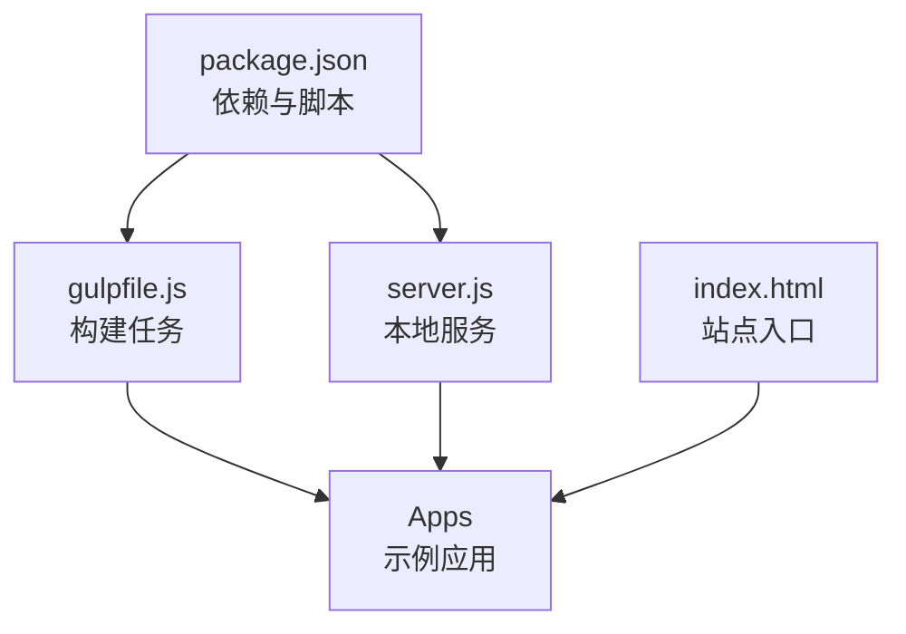

# 项目概述

<cite>
**本文引用的文件**   
- [README.md](file://README.md)
- [package.json](file://package.json)
- [index.html](file://index.html)
- [Apps/HelloWorld.html](file://Apps/HelloWorld.html)
- [Apps/CesiumViewer/index.html](file://Apps/CesiumViewer/index.html)
- [Apps/CesiumViewer/CesiumViewer.js](file://Apps/CesiumViewer/CesiumViewer.js)
- [gulpfile.js](file://gulpfile.js)
- [server.js](file://server.js)
- [Documentation/Contributors/ReleaseGuide/README.md](file://Documentation/Contributors/ReleaseGuide/README.md)
- [CONTRIBUTING.md](file://CONTRIBUTING.md)
</cite>

## 目录
1. [简介](#简介)
2. [项目结构](#项目结构)
3. [核心组件](#核心组件)
4. [架构总览](#架构总览)
5. [详细组件分析](#详细组件分析)
6. [依赖关系分析](#依赖关系分析)
7. [性能考量](#性能考量)
8. [故障排查指南](#故障排查指南)
9. [结论](#结论)
10. [附录](#附录)

## 简介
Cesium 是一个基于 WebGL 的开源 3D 地理空间可视化引擎，面向浏览器端提供高性能、跨平台的三维地球与地图渲染能力。其核心价值在于：
- 以 WebGL 为底层图形驱动，实现大规模地理数据的实时渲染与交互
- 提供从底层的渲染管线到高层的 UI 控件（如 Viewer）的完整技术栈
- 支持丰富的数据格式与标准（如 3D Tiles、glTF、KML、GeoJSON、地形瓦片等），便于集成多源异构数据
- 具备完善的构建、测试、文档与发布工具链，适合企业级应用与生态扩展

作为 Web 端的 3D 地理空间可视化框架，Cesium 在智慧城市、数字孪生、自然资源管理、应急指挥、航空航天等领域具有广泛应用。

## 项目结构
仓库采用模块化组织方式，顶层包含示例应用、源码入口、构建脚本、文档与测试资源等关键目录：
- Apps：示例与演示应用，包括最小化入门页面与功能更完整的 CesiumViewer
- Documentation：贡献者指南、离线使用指南、自定义着色器与 Fabric 材质系统说明等
- Source：版权头模板等通用资源
- Specs：测试用例与测试数据，覆盖 3D Tiles、地形、模型、矢量等多类场景
- Tools：JSDoc 模板、代码规则检查与打包插件等工程化工具
- scripts/gulpfile：构建与打包流程配置
- server.js：本地开发服务器脚本
- index.html：根站点入口（通常用于引导或跳转）
- package.json：项目元信息、依赖与脚本命令定义

**图表来源** 
- [package.json:1-200](file://package.json#L1-L200)
- [gulpfile.js:1-200](file://gulpfile.js#L1-L200)
- [server.js:1-200](file://server.js#L1-L200)
- [index.html:1-200](file://index.html#L1-L200)

**章节来源**
- [README.md:1-200](file://README.md#L1-L200)
- [package.json:1-200](file://package.json#L1-L200)
- [gulpfile.js:1-200](file://gulpfile.js#L1-L200)
- [server.js:1-200](file://server.js#L1-L200)
- [index.html:1-200](file://index.html#L1-L200)

## 核心组件
- 示例应用
  - HelloWorld：最简化的入门页面，帮助初学者快速体验 Cesium 的基本用法
  - CesiumViewer：功能更完整的示例，展示 Viewer 初始化、图层加载、交互控制等常见能力
- 构建与运行
  - gulpfile.js：定义构建、打包、压缩、生成文档等任务
  - server.js：启动本地开发服务器，便于调试示例与静态资源
- 文档与指南
  - Documentation/Contributors：贡献者指南、版本发布流程、性能测试与移动端指南等
  - Documentation/OfflineGuide：离线部署与资源托管建议
  - Documentation/CustomShaderGuide：自定义着色器开发指南
  - Documentation/FabricGuide：Fabric 材质系统的概念与用法

这些组件共同构成“示例—构建—文档”的闭环，既满足快速上手，也支撑深度定制与二次开发。

**章节来源**
- [Apps/HelloWorld.html:1-200](file://Apps/HelloWorld.html#L1-L200)
- [Apps/CesiumViewer/index.html:1-200](file://Apps/CesiumViewer/index.html#L1-L200)
- [Apps/CesiumViewer/CesiumViewer.js:1-200](file://Apps/CesiumViewer/CesiumViewer.js#L1-L200)
- [gulpfile.js:1-200](file://gulpfile.js#L1-L200)
- [server.js:1-200](file://server.js#L1-L200)
- [Documentation/Contributors/ReleaseGuide/README.md:1-200](file://Documentation/Contributors/ReleaseGuide/README.md#L1-L200)
- [Documentation/OfflineGuide/README.md:1-200](file://Documentation/OfflineGuide/README.md#L1-L200)
- [Documentation/CustomShaderGuide/README.md:1-200](file://Documentation/CustomShaderGuide/README.md#L1-L200)
- [Documentation/FabricGuide/README.md:1-200](file://Documentation/FabricGuide/README.md#L1-L200)

## 架构总览
从用户视角看，Cesium 的典型使用路径是：在 HTML 页面中引入构建产物或模块，创建并初始化 Viewer，然后添加影像、地形、模型、矢量等数据层，并通过事件与 API 进行交互。

该序列图展示了从页面初始化到数据加载与渲染的核心调用链路，体现了“应用—引擎—数据”的分层协作模式。

**图表来源** 
- [Apps/HelloWorld.html:1-200](file://Apps/HelloWorld.html#L1-L200)
- [Apps/CesiumViewer/index.html:1-200](file://Apps/CesiumViewer/index.html#L1-L200)
- [Apps/CesiumViewer/CesiumViewer.js:1-200](file://Apps/CesiumViewer/CesiumViewer.js#L1-L200)

## 详细组件分析

### 快速开始指南
- 安装与准备
  - 通过包管理器获取依赖与构建脚本（参考 package.json 中的脚本命令）
  - 使用本地服务器运行示例（参考 server.js）
- 最小化示例
  - 打开 Apps/HelloWorld.html，即可在浏览器中查看基础地球与交互
- 进阶示例
  - 打开 Apps/CesiumViewer/index.html，结合 CesiumViewer.js 了解 Viewer 的常用配置与数据加载方式

注意：为避免跨域与资源路径问题，建议使用本地服务器运行静态页面。

**章节来源**
- [package.json:1-200](file://package.json#L1-L200)
- [server.js:1-200](file://server.js#L1-L200)
- [Apps/HelloWorld.html:1-200](file://Apps/HelloWorld.html#L1-L200)
- [Apps/CesiumViewer/index.html:1-200](file://Apps/CesiumViewer/index.html#L1-L200)
- [Apps/CesiumViewer/CesiumViewer.js:1-200](file://Apps/CesiumViewer/CesiumViewer.js#L1-L200)

### 构建与发布流程
- 构建任务
  - gulpfile.js 定义了打包、压缩、文档生成等任务，统一工程化流程
- 版本发布
  - Documentation/Contributors/ReleaseGuide/README.md 描述了预发布与正式发布的步骤与注意事项
- 社区贡献
  - CONTRIBUTING.md 提供了代码规范、提交约定与审查流程

**图表来源** 
- [gulpfile.js:1-200](file://gulpfile.js#L1-L200)
- [Documentation/Contributors/ReleaseGuide/README.md:1-200](file://Documentation/Contributors/ReleaseGuide/README.md#L1-L200)
- [CONTRIBUTING.md:1-200](file://CONTRIBUTING.md#L1-L200)

**章节来源**
- [gulpfile.js:1-200](file://gulpfile.js#L1-L200)
- [Documentation/Contributors/ReleaseGuide/README.md:1-200](file://Documentation/Contributors/ReleaseGuide/README.md#L1-L200)
- [CONTRIBUTING.md:1-200](file://CONTRIBUTING.md#L1-L200)

### 示例应用解析
- HelloWorld
  - 目标：以最少的代码展示 Cesium 的基础能力
  - 关键点：页面结构、资源引入、基本初始化
- CesiumViewer
  - 目标：展示更完整的场景搭建与交互
  - 关键点：Viewer 配置、图层管理、事件处理、数据加载

**图表来源** 
- [Apps/HelloWorld.html:1-200](file://Apps/HelloWorld.html#L1-L200)
- [Apps/CesiumViewer/index.html:1-200](file://Apps/CesiumViewer/index.html#L1-L200)
- [Apps/CesiumViewer/CesiumViewer.js:1-200](file://Apps/CesiumViewer/CesiumViewer.js#L1-L200)

**章节来源**
- [Apps/HelloWorld.html:1-200](file://Apps/HelloWorld.html#L1-L200)
- [Apps/CesiumViewer/index.html:1-200](file://Apps/CesiumViewer/index.html#L1-L200)
- [Apps/CesiumViewer/CesiumViewer.js:1-200](file://Apps/CesiumViewer/CesiumViewer.js#L1-L200)

### 文档与指南
- 贡献者指南
  - 涵盖构建、测试、性能、移动端适配、发布流程等
- 离线使用
  - 提供离线部署策略与资源托管建议
- 自定义着色器与 Fabric 材质
  - 指导高级用户扩展渲染效果与材质表现

**章节来源**
- [Documentation/Contributors/ReleaseGuide/README.md:1-200](file://Documentation/Contributors/ReleaseGuide/README.md#L1-L200)
- [Documentation/OfflineGuide/README.md:1-200](file://Documentation/OfflineGuide/README.md#L1-L200)
- [Documentation/CustomShaderGuide/README.md:1-200](file://Documentation/CustomShaderGuide/README.md#L1-L200)
- [Documentation/FabricGuide/README.md:1-200](file://Documentation/FabricGuide/README.md#L1-L200)

## 依赖关系分析
- 构建与脚本
  - gulpfile.js 负责构建任务编排
  - server.js 提供本地开发服务
  - package.json 定义依赖与脚本命令
- 示例与入口
  - index.html 作为站点入口
  - Apps 下的示例页面与脚本承载具体演示逻辑

**图表来源** 
- [package.json:1-200](file://package.json#L1-L200)
- [gulpfile.js:1-200](file://gulpfile.js#L1-L200)
- [server.js:1-200](file://server.js#L1-L200)
- [index.html:1-200](file://index.html#L1-L200)

**章节来源**
- [package.json:1-200](file://package.json#L1-L200)
- [gulpfile.js:1-200](file://gulpfile.js#L1-L200)
- [server.js:1-200](file://server.js#L1-L200)
- [index.html:1-200](file://index.html#L1-L200)

## 性能考量
- 数据分层与按需加载
  - 利用瓦片化与 LOD 机制减少首屏压力与内存占用
- 资源优化
  - 启用压缩与缓存策略，合理拆分构建产物
- 渲染优化
  - 控制绘制批次、合理使用材质与着色器，避免过度复杂的效果
- 网络与并发
  - 对大体积数据进行分块与懒加载，提升交互流畅度

[本节为通用性能建议，不直接分析具体文件]

## 故障排查指南
- 本地无法访问示例
  - 确认已启动本地服务器（参考 server.js）
  - 检查浏览器控制台是否有跨域或资源路径错误
- 构建失败
  - 核对依赖是否安装成功（参考 package.json 的脚本）
  - 查看构建日志定位具体任务失败原因（参考 gulpfile.js）
- 示例运行异常
  - 优先在 HelloWorld 上复现，逐步迁移到 CesiumViewer
  - 检查数据源地址与权限，确保可正常访问

**章节来源**
- [server.js:1-200](file://server.js#L1-L200)
- [package.json:1-200](file://package.json#L1-L200)
- [gulpfile.js:1-200](file://gulpfile.js#L1-L200)
- [Apps/HelloWorld.html:1-200](file://Apps/HelloWorld.html#L1-L200)
- [Apps/CesiumViewer/index.html:1-200](file://Apps/CesiumViewer/index.html#L1-L200)
- [Apps/CesiumViewer/CesiumViewer.js:1-200](file://Apps/CesiumViewer/CesiumViewer.js#L1-L200)

## 结论
Cesium 以 WebGL 为核心，构建了从底层渲染到上层应用的完整 3D 地理空间可视化体系。通过清晰的示例、完善的构建与文档、以及活跃的社区生态，它为初学者提供了友好的学习路径，也为有经验的开发者提供了强大的扩展能力。建议在项目中结合瓦片化与按需加载策略，充分利用其丰富的数据支持与性能优化手段，打造高效、稳定的三维地球应用。

[本节为总结性内容，不直接分析具体文件]

## 附录
- 开源协议与社区
  - 请参考仓库根目录的协议与贡献说明，了解许可条款与参与方式
- 版本历史
  - 参考 Documentation/Contributors/ReleaseGuide/README.md 中的发布流程与变更记录

**章节来源**
- [CONTRIBUTING.md:1-200](file://CONTRIBUTING.md#L1-L200)
- [Documentation/Contributors/ReleaseGuide/README.md:1-200](file://Documentation/Contributors/ReleaseGuide/README.md#L1-L200)